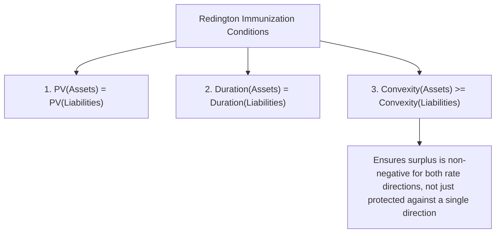
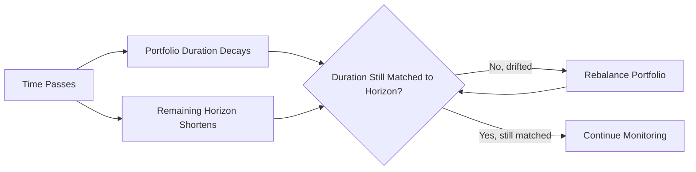

## Classical Immunization Theory

### Overview

Classical immunization theory, developed primarily from the work of Redington and later Fisher and Weil, provides a framework for constructing a bond portfolio that protects an investor's ability to meet a specific future liability (or achieve a specific target accumulated value) against the risk of interest rate changes. The central mechanism is duration matching: by setting a portfolio's Macaulay duration equal to the investment horizon (or a liability's due date), the offsetting effects of price risk and reinvestment risk are engineered to approximately cancel, protecting the portfolio's terminal value against a single, immediate, parallel shift in yields.

### The Theoretical Foundation

Classical immunization rests on the offsetting relationship between price risk and reinvestment risk described in the reinvestment-risk-versus-price-risk framework: when the investment horizon equals the portfolio's Macaulay duration, a rate change's negative effect on one dimension (price or reinvestment) is approximately offset by its positive effect on the other, to a first-order approximation.

$$D_{Mac} = \sum_{t=1}^{n} t \times \frac{PV(CF_t)}{P_0} = H$$

where $H$ is the investment horizon (or liability due date). When this condition holds, the portfolio is said to be **immunized** against a single, immediate, parallel yield curve shift.

### Redington's Immunization Conditions

Redington's formulation of immunization theory (developed originally in the context of life insurance liability matching) specifies three conditions that must jointly hold for a portfolio to be considered immunized against a parallel shift in rates:

1. **Present value matching**: The present value of the asset portfolio must equal the present value of the liability being immunized, evaluated at the current yield.

$$PV(\text{Assets}) = PV(\text{Liabilities})$$

2. **Duration matching**: The (Macaulay, or more precisely, the present-value-weighted average timing) duration of the asset portfolio must equal the duration of the liability.

$$D_{Assets} = D_{Liabilities}$$

3. **Convexity condition**: The convexity of the asset portfolio must be **greater than or equal to** the convexity of the liability.

$$C_{Assets} \geq C_{Liabilities}$$

The convexity condition is a refinement beyond the simpler two-condition (present value and duration matching) framework, and it addresses a specific vulnerability: if the asset and liability durations are matched exactly, but the assets have *lower* convexity than the liabilities, the portfolio can actually *lose* value under either a rate increase or a rate decrease (a large, symmetric, unfavorable second-order effect), even though the first-order (duration) effects are matched.

### Why the Convexity Condition Matters: Geometric Intuition

If asset and liability durations are matched but asset convexity is lower than liability convexity, the liability's present value curve will "outcurve" the asset's present value curve as rates move away from the initial level in either direction — the liability's value rises (or the gap between assets and liabilities widens unfavorably) more than the linear duration-matched estimate would predict, in both up and down rate scenarios simultaneously. Requiring asset convexity to meet or exceed liability convexity ensures the surplus (Assets − Liabilities) either stays flat or, more typically in well-constructed immunized portfolios, actually *increases* slightly for a rate move in either direction — a structural safety margin against the second-order risk that duration matching alone does not address.

### Visual: Duration-Matched Portfolio With and Without Adequate Convexity (svg_diagram)

<svg xmlns="http://www.w3.org/2000/svg" viewBox="0 0 740 440">
<text x="370" y="25" text-anchor="middle" font-size="16" font-weight="bold" fill="#1a1a2e">Convexity Condition in Immunization (svg_diagram)</text>

<line x1="90" y1="380" x2="650" y2="380" stroke="#333" stroke-width="1.5" />
<line x1="90" y1="380" x2="90" y2="60" stroke="#333" stroke-width="1.5" />
<text x="370" y="410" text-anchor="middle" font-size="13" fill="#333">Yield Change (from initial level)</text>
<text x="45" y="220" text-anchor="middle" font-size="13" fill="#333" transform="rotate(-90 45 220)">Present Value</text>

<path d="M 130 340 Q 370 200 610 130" stroke="#C00000" stroke-width="3" fill="none" />
<text x="480" y="145" font-size="12" fill="#8a1a1a" font-weight="bold">Liability PV (higher convexity)</text>

<path d="M 130 345 Q 370 220 610 175" stroke="#4472C4" stroke-width="3" fill="none" />
<text x="480" y="195" font-size="12" fill="#2a4a8a" font-weight="bold">Asset PV (lower convexity - inadequate)</text>

<circle cx="370" cy="210" r="6" fill="#1a1a2e" />
<text x="380" y="205" font-size="11" fill="#1a1a2e">Duration-matched point</text>

<path d="M 200 290 Q 280 250 340 225 L 340 245 Q 280 265 205 300 Z" fill="#C00000" opacity="0.25" />
<path d="M 400 195 Q 480 160 560 145 L 555 165 Q 480 180 405 215 Z" fill="#C00000" opacity="0.25" />
<text x="170" y="320" font-size="10" fill="#8a1a1a">Shortfall risk</text>
<text x="530" y="230" font-size="10" fill="#8a1a1a">Shortfall risk</text>
</svg>

The shaded regions show where the liability's present value (which curves more sharply due to higher convexity) exceeds the asset portfolio's present value on *both* sides of the duration-matched point — precisely the vulnerability the third Redington condition is designed to prevent.

### Simplifying Assumptions and Their Practical Limitations

Classical immunization theory rests on several simplifying assumptions, each representing a departure from real-world market behavior:

- **Single, instantaneous rate shift**: The theory protects against exactly one, immediate change in rates occurring right after the portfolio is constructed — not against multiple sequential rate changes over time, nor against a gradual drift in rates.
- **Parallel shift only**: The classical framework assumes the entire yield curve moves by the same amount; it provides no explicit protection against non-parallel movements (steepening, flattening, curvature changes), which can cause an otherwise duration-matched portfolio to become meaningfully mismatched despite satisfying the classical conditions.
- **Flat yield curve (in the original formulation)**: Redington's original theoretical derivation assumed a flat yield curve for simplicity; real-world upward- or downward-sloping (and non-parallel-shifting) curves introduce complications not fully addressed by the simplest version of the theory.
- **No default or credit risk**: The framework assumes all promised cash flows are received with certainty; credit risk (default or credit-quality deterioration) is not addressed.
- **No transaction costs**: Rebalancing to maintain duration matching over time is assumed to be costless and instantaneous.

### The Necessity of Rebalancing

Because duration is not static — it decays with the passage of time (though not at a 1:1 rate with calendar time, since duration also depends on the prevailing yield level, which itself changes) — a portfolio immunized at inception will drift out of the duration-matched condition as time passes, even absent any rate change. This requires **periodic rebalancing**: the portfolio manager must, at intervals, adjust the asset portfolio's composition (buying and selling bonds) to restore the duration match to the (now-shorter) remaining horizon.

**[Inference]** The optimal rebalancing frequency involves a trade-off between maintaining a closer duration match (reducing immunization risk) and minimizing transaction costs incurred from more frequent trading; the specific optimal frequency depends on the portfolio's size, the liquidity and transaction cost profile of its constituent instruments, and the institution's risk tolerance, and is generally determined empirically or via institution-specific policy rather than from the theory itself.

### Worked Numerical Example: Constructing an Immunized Portfolio

Suppose a pension fund has a single liability of $10 million due in exactly 7 years, and the current flat yield curve is at 5%.

**Step 1 — Determine the present value of the liability**:

$$PV(\text{Liability}) = \frac{10{,}000{,}000}{(1.05)^7} = \frac{10{,}000{,}000}{1.407100} = \$7{,}106{,}813$$

**Step 2 — Select a bond (or combination of bonds) with Macaulay duration equal to 7 years**. Suppose available bonds are:

- Bond A: 3-year maturity, Macaulay duration ≈ 2.9 years
- Bond B: 12-year maturity, Macaulay duration ≈ 9.4 years

Since no single available bond has exactly a 7-year duration, the manager can construct a **barbell** combination of Bond A and Bond B, solving for portfolio weights $w_A$ and $w_B$ (with $w_A + w_B = 1$) such that:

$$w_A \times 2.9 + w_B \times 9.4 = 7.0$$

Solving: $w_A \times 2.9 + (1-w_A) \times 9.4 = 7.0 \Rightarrow 9.4 - 6.5 w_A = 7.0 \Rightarrow w_A = \frac{2.4}{6.5} \approx 0.369$

So approximately 36.9% of the portfolio's present value is allocated to Bond A, and 63.1% to Bond B.

**Step 3 — Verify the convexity condition**: The manager should confirm that this barbell combination's convexity exceeds that of the liability (a single fixed cash flow at year 7, which itself has a specific, calculable convexity as a "zero-coupon-like" liability); barbell combinations, having more dispersed cash flow timing than a single bullet-maturity bond of the same duration, generally exhibit higher convexity than a comparable bullet — a structural feature that tends to work in favor of satisfying Redington's third condition, though it should be explicitly verified numerically rather than assumed.

### Immunization vs. Cash Flow Matching (Dedication)

Classical immunization should be distinguished from the alternative approach of **cash flow matching** (or dedication), in which a portfolio is constructed so that its scheduled cash flows precisely match the timing and amount of the liability's cash flows, eliminating reinvestment risk and interest rate risk almost entirely for the matched cash flows (subject only to reinvestment of any timing mismatches or excess cash). Cash flow matching is generally more precise but often more expensive and less flexible to implement than duration-based immunization, particularly for complex or long-dated liability streams where perfectly matching bonds may not be available in the market.

### Common Pitfalls

- **Applying only the first two Redington conditions**: Matching present value and duration alone (without verifying the convexity condition) can leave a portfolio vulnerable to symmetric losses in both rising and falling rate environments if liability convexity happens to exceed asset convexity.
- **Assuming immunization is a "set and forget" strategy**: As duration decays with time (and non-uniformly with respect to calendar time), failing to periodically rebalance will cause a previously-immunized portfolio to drift out of its protective condition.
- **Assuming protection against non-parallel shifts**: Classical immunization theory, in its basic form, addresses only parallel yield curve shifts; portfolios that are duration-matched but exposed to significant curve risk (e.g., via mismatched key rate duration profiles despite matched aggregate duration) remain vulnerable to steepening, flattening, or curvature-driven losses.
- **Ignoring transaction costs and liquidity constraints in rebalancing**: The theoretical requirement for periodic rebalancing assumes frictionless, costless trading, which is not realistic; practical implementation must balance immunization precision against the real costs of maintaining that precision.

**Related Topics:**

- Reinvestment Risk versus Price Risk
- Duration Decomposition Across the Curve
- Cash Flow Matching and Dedication Strategies
- Contingent Immunization and Active-Passive Hybrid Strategies
- Rebalancing Frequency Trade-offs in Immunized Portfolios
- Redington's Original Actuarial Framework and Its Life Insurance Origins
- Barbell versus Bullet Portfolio Construction for Convexity Targets