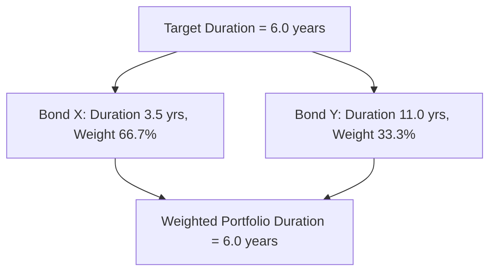
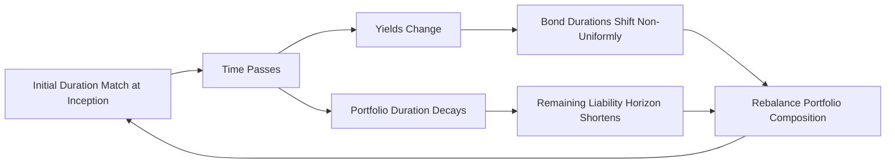

## Duration Matching Strategies

### Overview

Duration matching strategies encompass the practical techniques used to construct and maintain a fixed income portfolio whose duration is set equal to a target value — whether a single liability's due date, a series of liability due dates, or a specified investment horizon. While classical immunization theory establishes the conceptual foundation (why duration matching works), duration matching strategies address the practical implementation question: how to actually construct such a portfolio from available instruments, and how to maintain the match as conditions evolve.

### Single-Liability Duration Matching

The simplest duration matching problem involves a single target liability with a known due date. The objective is to construct an asset portfolio whose Macaulay duration equals that due date, while also satisfying the present-value-matching condition from Redington's framework.

**Bullet approach**: Select a single bond (or set of bonds with similar maturity) whose duration closely matches the target horizon directly. This has the practical advantage of simplicity and, since cash flows are concentrated near the target date, generally involves the least reinvestment risk exposure prior to the liability's due date.

**Barbell approach**: Combine two bonds — one with duration shorter than the target and one with duration longer than the target — in proportions calculated to produce a weighted-average duration equal to the target. This is often necessary in practice when no single available bond has exactly the required duration, and (as discussed under classical immunization) tends to produce higher portfolio convexity than a bullet approach of matching duration, which can be either beneficial (satisfying Redington's convexity condition more comfortably) or a source of unwanted tracking error relative to the liability's own convexity, depending on the liability's characteristics.

### Solving for Barbell Weights

Given two bonds with durations $D_1$ (shorter) and $D_2$ (longer), and a target duration $D_T$ where $D_1 < D_T < D_2$, the required portfolio weight in the shorter-duration bond is:

$$w_1 = \frac{D_2 - D_T}{D_2 - D_1}, \qquad w_2 = 1 - w_1 = \frac{D_T - D_1}{D_2 - D_1}$$

This is a straightforward linear interpolation: the weight on each bond is inversely proportional to its distance from the target duration, ensuring the two weighted contributions average to exactly $D_T$.

### Worked Example: Two-Bond Barbell Construction

Target duration: 6.0 years. Available bonds: Bond X (duration = 3.5 years), Bond Y (duration = 11.0 years).

$$w_X = \frac{11.0 - 6.0}{11.0 - 3.5} = \frac{5.0}{7.5} = 0.667$$

$$w_Y = 1 - 0.667 = 0.333$$

**Verification**: $0.667 \times 3.5 + 0.333 \times 11.0 = 2.333 + 3.667 = 6.00$ ✓

The portfolio allocates approximately two-thirds of its market value to the shorter-duration Bond X and one-third to the longer-duration Bond Y to achieve the 6.0-year target duration.

### Multi-Liability Duration Matching

When an institution faces a *series* of future liabilities (e.g., a pension fund with payment obligations spread across many future years, or an insurer with a schedule of expected claim payouts), duration matching extends to a portfolio-level requirement:

1. **Aggregate present value matching**: The total present value of assets must equal the total present value of the combined liability stream.
2. **Aggregate duration matching**: The asset portfolio's overall Macaulay duration must equal the present-value-weighted average duration of the liability stream.
3. **Convexity condition**: As in the single-liability case, asset convexity should meet or exceed liability convexity to protect against symmetric losses in both rate directions.

**Key limitation for multi-liability matching**: Matching only the *aggregate* duration of a series of liabilities does not guarantee protection against *non-parallel* yield curve movements that affect different liability due dates differently. A portfolio can have its aggregate duration correctly matched to the liability stream's aggregate duration while still being significantly mismatched at specific points along the curve — precisely the scenario duration decomposition (key rate duration) techniques are designed to reveal and address.

### Visual: Multi-Liability Duration Matching Risk (svg_diagram)

<svg xmlns="http://www.w3.org/2000/svg" viewBox="0 0 740 420">
<text x="370" y="25" text-anchor="middle" font-size="16" font-weight="bold" fill="#1a1a2e">Aggregate vs. Bucketed Duration Matching (svg_diagram)</text>

<text x="180" y="55" text-anchor="middle" font-size="13" font-weight="bold">Aggregate-Only Match</text>

<line x1="60" y1="340" x2="330" y2="340" stroke="#333" stroke-width="1.5" />

<line x1="60" y1="340" x2="60" y2="90" stroke="#333" stroke-width="1.5" />

<rect x="80" y="180" width="30" height="160" fill="#C00000" opacity="0.7" />
<rect x="130" y="260" width="30" height="80" fill="#C00000" opacity="0.7" />
<rect x="180" y="100" width="30" height="240" fill="#C00000" opacity="0.7" />

<rect x="115" y="230" width="30" height="110" fill="#4472C4" opacity="0.7" />
<rect x="165" y="150" width="30" height="190" fill="#4472C4" opacity="0.7" />
<rect x="215" y="270" width="30" height="70" fill="#4472C4" opacity="0.7" />

<text x="180" y="360" text-anchor="middle" font-size="11" fill="#555">Same aggregate duration, mismatched per-bucket exposure</text>

<text x="560" y="55" text-anchor="middle" font-size="13" font-weight="bold">Key-Rate Bucketed Match</text>

<line x1="410" y1="340" x2="680" y2="340" stroke="#333" stroke-width="1.5" />

<line x1="410" y1="340" x2="410" y2="90" stroke="#333" stroke-width="1.5" />

<rect x="430" y="180" width="30" height="160" fill="#C00000" opacity="0.7" />
<rect x="480" y="260" width="30" height="80" fill="#C00000" opacity="0.7" />
<rect x="530" y="100" width="30" height="240" fill="#C00000" opacity="0.7" />
<rect x="465" y="180" width="30" height="160" fill="#4472C4" opacity="0.7" />
<rect x="515" y="260" width="30" height="80" fill="#4472C4" opacity="0.7" />
<rect x="565" y="100" width="30" height="240" fill="#4472C4" opacity="0.7" />

<text x="545" y="360" text-anchor="middle" font-size="11" fill="#555">Each maturity bucket separately matched</text>

<rect x="280" y="380" width="15" height="15" fill="#C00000" opacity="0.7" />
<text x="300" y="392" font-size="11">Liability</text>
<rect x="380" y="380" width="15" height="15" fill="#4472C4" opacity="0.7" />
<text x="400" y="392" font-size="11">Asset</text>
</svg>

### Key Rate Duration Matching (Cash Flow / Bucket Immunization)

For institutions with material curve risk concerns, a more robust extension of duration matching involves matching **key rate durations** (or bucket durations) at each relevant vertex, rather than only the aggregate duration. This requires solving a system of equations to find asset weights across multiple bonds such that the portfolio's KRD vector matches the liability's KRD vector at every vertex simultaneously:

$$\mathbf{H} \mathbf{w} = \mathbf{KRD}_{liability}$$

where $\mathbf{H}$ is a matrix of candidate bonds' key rate durations (rows = bonds, columns = vertices) and $\mathbf{w}$ is the vector of portfolio weights to solve for. This is a direct extension of the hedging framework discussed under duration decomposition, applied here to liability matching rather than pure risk hedging.

**Trade-off**: Key rate duration matching provides materially better protection against non-parallel curve shifts than aggregate duration matching alone, but requires a larger and more diverse set of available instruments across multiple maturity vertices, and generally involves higher implementation and rebalancing complexity and cost.

### Rebalancing Duration-Matched Portfolios Over Time

As previously discussed under classical immunization theory, duration is not static — it decays with the passage of time, but not at the same rate as calendar time, since duration depends on both time-to-cash-flow and the prevailing yield level (which itself changes). Consequently, any duration-matching strategy requires periodic rebalancing:

**Rebalancing frequency considerations**: More frequent rebalancing maintains a tighter duration match (reducing immunization risk / tracking error against the liability) but incurs greater transaction costs and operational burden. [Inference] The appropriate rebalancing frequency is typically determined by weighing this trade-off against the specific portfolio's size, the liquidity of its constituent instruments, and the institution's tolerance for tracking error, rather than derived from a single universally applicable formula.

### Duration Matching with Embedded-Option Instruments

When constructing a duration-matched portfolio using bonds with embedded options (callable bonds, MBS), **effective duration** (not analytical/modified duration) must be used, since the option-adjusted cash flow behavior materially affects the instrument's true interest rate sensitivity. Additionally, because effective duration for negatively convex instruments changes more rapidly and non-linearly as yields move, duration-matched portfolios incorporating such instruments generally require **more frequent rebalancing** to maintain an accurate match than portfolios composed purely of option-free bonds, whose duration changes more gradually and predictably with the passage of time and yield changes.

### Comparing Duration Matching Approaches

| Approach | Curve Risk Protection | Complexity | Instrument Requirements |
| --- | --- | --- | --- |
| Single bullet bond | Aggregate only | Low | One bond with matching duration |
| Two-bond barbell | Aggregate only | Low-Moderate | Two bonds bracketing target duration |
| Multi-bond aggregate match | Aggregate only | Moderate | Diversified bond set |
| Key rate duration matching | Full curve protection | High | Broad, liquid instrument set across vertices |
| Cash flow matching/dedication | Full protection (matched cash flows) | Highest | Bonds whose cash flows align precisely with liabilities |

### Common Pitfalls

- **Assuming aggregate duration matching fully protects against curve risk**: As illustrated above, a portfolio can have its aggregate duration matched to a liability stream while still carrying significant unhedged curve/twist risk at the individual vertex level.
- **Neglecting the convexity condition when constructing barbell portfolios**: While barbells generally increase convexity relative to a bullet of the same duration, this should be explicitly verified against the liability's own convexity rather than assumed automatically sufficient.
- **Using analytical duration for option-embedded instruments in a duration match**: This produces an incorrect duration figure for the true interest rate sensitivity of callable bonds or MBS, undermining the accuracy of the entire matching exercise.
- **Infrequent rebalancing of portfolios containing option-embedded instruments**: Given the more rapid, non-linear duration drift characteristic of negatively convex instruments, a rebalancing schedule appropriate for an option-free bond portfolio may be insufficient to maintain an accurate match when such instruments are included.
- **Ignoring transaction costs in barbell vs. bullet selection**: A more granular or actively-rebalanced strategy (e.g., extensive key rate duration matching) may offer superior theoretical protection but at a real-world cost that should be weighed against the incremental risk reduction achieved.

**Related Topics:**

- Classical Immunization Theory
- Duration Decomposition Across the Curve
- Reinvestment Risk versus Price Risk
- Cash Flow Matching and Dedication Strategies
- Contingent Immunization and Active-Passive Hybrid Approaches
- Barbell versus Bullet Portfolio Construction for Convexity Targets
- Effective Duration for Bonds with Embedded Options