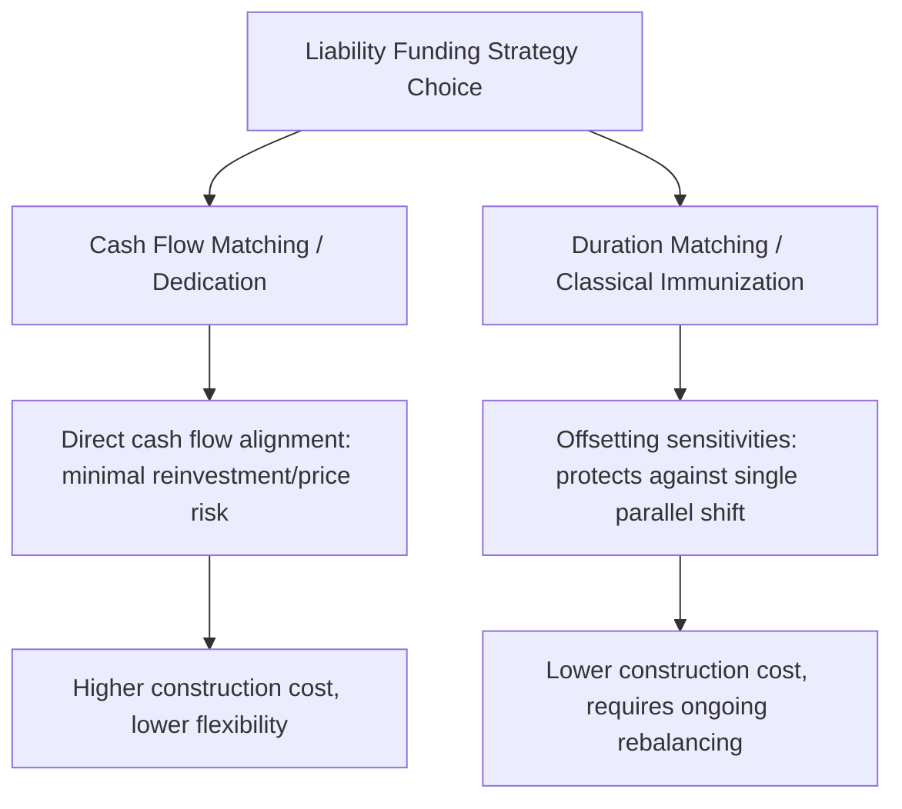
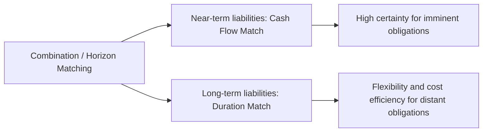

## Cash Flow Matching and Dedicated Portfolios

### Overview

Cash flow matching (also called dedication) is a fixed income portfolio construction strategy in which an asset portfolio is built so that the timing and amount of its cash flows precisely correspond to a specified liability stream. Unlike duration matching, which relies on offsetting sensitivities to protect against rate changes to a first-order approximation, cash flow matching aims to eliminate interest rate risk and reinvestment risk almost entirely for the matched portion of the liability stream, by ensuring each liability payment is funded directly by a corresponding, precisely-timed asset cash flow.

### Core Principle

In a fully cash-flow-matched (dedicated) portfolio, for every liability payment date, the portfolio holds bonds whose coupon and/or principal payments occurring on or before that date are sufficient to fund the liability due on that date — with any excess cash flow carried forward (typically reinvested at a conservative, short-term rate) to help fund subsequent liabilities.

$$\sum_{i} CF_{i,t} \geq L_t \quad \text{for each liability due date } t$$

where $CF_{i,t}$ represents the cash flow from asset $i$ at time $t$, and $L_t$ is the liability payment due at time $t$.

Because each liability is funded by cash flows arriving at or before its due date, the strategy is far less dependent on reinvesting at any assumed rate and is not vulnerable to price risk from having to sell bonds before maturity to meet a payment — the bonds are simply held to the maturity or coupon dates that naturally align with when the cash is needed.

### Cash Flow Matching vs. Duration Matching: Key Distinctions

| Dimension | Cash Flow Matching | Duration Matching (Immunization) |
| --- | --- | --- |
| Protection mechanism | Direct cash flow alignment | Offsetting price/reinvestment sensitivities |
| Interest rate risk exposure | Minimal (for matched cash flows) | Protected only against a single parallel shift |
| Reinvestment risk | Minimal (cash flows timed to need) | Present, but offset by price risk to first order |
| Rebalancing requirement | Minimal once constructed | Ongoing, as duration drifts with time |
| Flexibility to reallocate | Low (cash flows are fixed once purchased) | Higher (can adjust duration as views change) |
| Typical cost | Often higher (may require suboptimal bond selection to hit exact dates) | Often lower (more flexibility in instrument selection) |
| Precision of protection | High, for a single deterministic liability schedule | Approximate, first-order, single-scenario protection |

### The Cash Flow Matching Construction Problem

Constructing a dedicated portfolio is typically formulated as an optimization problem: minimize the total cost (market value) of the asset portfolio subject to the constraint that cumulative asset cash flows meet or exceed cumulative liability payments at every point in the liability schedule.

$$\text{Minimize} \sum_{i} P_i \times n_i$$

subject to:

$$\sum_{i} CF_{i,t} + (\text{carried-forward surplus from } t-1) \geq L_t \quad \forall t$$

where $n_i$ is the quantity purchased of bond $i$ and $P_i$ is its price. This is typically solved via linear programming, since the objective (minimize cost) and constraints (cash flow sufficiency at each date) are both linear in the decision variables $n_i$.

### Worked Simplified Example: Two-Period Dedication

Suppose an institution has liabilities of $1,000,000 due in 1 year and $1,050,000 due in 2 years. Two bonds are available:

- **Bond A**: 1-year zero-coupon bond, yield 4%, price = $\frac{1000}{1.04}$ = 961.54 per 1,000 face
- **Bond B**: 2-year zero-coupon bond, yield 4.5%, price = $\frac{1000}{1.045^2}$ = 915.73 per 1,000 face

**Step 1 — Fund the Year 2 liability directly with Bond B**:

$$\text{Face value of Bond B needed} = 1{,}050{,}000$$

$$\text{Cost} = 1{,}050{,}000 \times \frac{915.73}{1000} = \$961{,}516.50$$

**Step 2 — Fund the Year 1 liability directly with Bond A** (since the zero-coupon structure means Bond B contributes nothing at Year 1):

$$\text{Face value of Bond A needed} = 1{,}000{,}000$$

$$\text{Cost} = 1{,}000{,}000 \times \frac{961.54}{1000} = \$961{,}540.00$$

**Total portfolio cost**: $961{,}516.50 + 961{,}540.00 = \$1{,}923{,}056.50$

This portfolio, once constructed, requires no reinvestment assumption and no interim trading — each bond simply matures on the date its corresponding liability is due, with the exact face value needed.

### Visual: Dedicated Portfolio Cash Flow Alignment (svg_diagram)

<svg xmlns="http://www.w3.org/2000/svg" viewBox="0 0 700 380">
<text x="350" y="25" text-anchor="middle" font-size="16" font-weight="bold" fill="#1a1a2e">Cash Flow Matching: Asset-Liability Alignment (svg_diagram)</text>
<line x1="80" y1="320" x2="620" y2="320" stroke="#333" stroke-width="1.5" />
<text x="350" y="350" text-anchor="middle" font-size="12" fill="#333">Time (years)</text>

<line x1="240" y1="310" x2="240" y2="330" stroke="#333" stroke-width="1.5" />
<text x="240" y="345" text-anchor="middle" font-size="11">Year 1</text>
<line x1="460" y1="310" x2="460" y2="330" stroke="#333" stroke-width="1.5" />
<text x="460" y="345" text-anchor="middle" font-size="11">Year 2</text>

<rect x="220" y="220" width="40" height="100" fill="#C00000" opacity="0.75" />
<text x="240" y="210" text-anchor="middle" font-size="11" fill="#8a1a1a">Liability $1.00M</text>
<rect x="440" y="180" width="40" height="140" fill="#C00000" opacity="0.75" />
<text x="460" y="170" text-anchor="middle" font-size="11" fill="#8a1a1a">Liability $1.05M</text>

<line x1="120" y1="270" x2="230" y2="270" stroke="#4472C4" stroke-width="2.5" marker-end="url(#arrow)" />
<text x="120" y="260" font-size="11" fill="#2a4a8a">Bond A matures →</text>
<line x1="120" y1="140" x2="450" y2="140" stroke="#4472C4" stroke-width="2.5" marker-end="url(#arrow)" />
<text x="120" y="130" font-size="11" fill="#2a4a8a">Bond B matures →</text>
<text x="350" y="70" text-anchor="middle" font-size="12" fill="#555">Each bond's maturity is timed to directly fund its corresponding liability</text>

</svg>

### Variants of Cash Flow Matching

#### Pure (Exact) Cash Flow Matching

Requires asset cash flows to match liability payments exactly, or exceed them with the surplus carried forward at a specified (typically conservative) short-term reinvestment rate. This is the most precise but often the most expensive approach, since bond availability rarely aligns perfectly with an arbitrary liability schedule, sometimes forcing the purchase of bonds with maturities beyond what is strictly needed, or requiring holding some idle cash.

#### Symmetric Cash Flow Matching

A refinement that permits some limited borrowing against future asset cash flows to meet an earlier liability payment (rather than requiring assets to be timed only at or before each liability date), potentially reducing the required initial investment by allowing more efficient use of available bonds, at the cost of introducing some limited financing risk.

#### Combination (Horizon) Matching

A hybrid approach combining cash flow matching for near-term liabilities (where certainty is most valuable and reinvestment risk avoidance matters most) with duration matching for longer-dated liabilities (where the flexibility and typically lower cost of duration matching is more advantageous, and where the precision of cash flow matching is harder to achieve given the smaller universe of very long-dated bonds).

### Advantages of Cash Flow Matching

- **Minimal ongoing rebalancing**: Once constructed, a pure dedicated portfolio generally requires little to no active management, since each bond is simply held to the maturity date aligned with its corresponding liability.
- **Reduced model/assumption risk**: Unlike duration matching, which relies on the Macaulay duration approximation and assumes a single parallel shift, cash flow matching does not depend on any assumption about the direction or shape of future rate movements for the matched liabilities — the outcome is largely deterministic once the portfolio is constructed (subject to credit/default risk on the underlying bonds).
- **Regulatory and stakeholder clarity**: The direct, intuitive link between specific assets and specific liabilities can be more easily explained to and validated by regulators, auditors, or plan sponsors than the more abstract, sensitivity-based logic of duration matching.

### Limitations of Cash Flow Matching

- **Typically higher cost**: Because available bonds rarely align perfectly with an arbitrary liability schedule, achieving a precise cash flow match often requires purchasing bonds that are not individually cost-optimal, resulting in a portfolio cost that can exceed what a more flexible duration-matching approach might achieve for the same liability stream.
- **Limited flexibility**: Once a dedicated portfolio is constructed, it is largely locked into its cash flow schedule; adapting to unexpected changes in the liability stream (early payments, changed amounts) can be more operationally difficult than adjusting a duration-matched portfolio.
- **Practical difficulty for long or complex liability schedules**: For liabilities extending many decades into the future (e.g., certain pension or insurance obligations), sufficiently long-dated, liquid bonds may not be available in the market to complete an exact match, necessitating either the combination/horizon matching approach or acceptance of some residual duration/reinvestment risk at the long end.
- **Credit and default risk remain**: Cash flow matching addresses interest rate and reinvestment risk for the matched cash flows, but does not eliminate the risk that an underlying bond issuer defaults or fails to make a scheduled payment — a risk that must be managed separately (e.g., via credit quality constraints on eligible bonds for the dedicated portfolio).

### Common Pitfalls

- **Assuming cash flow matching eliminates all risk**: While interest rate and reinvestment risk are substantially minimized for the matched liability stream, credit/default risk, liquidity risk (if early liquidation becomes necessary), and the risk of unexpected changes to the liability schedule itself remain live concerns.
- **Underestimating construction cost relative to duration matching**: Institutions sometimes underestimate how much more expensive an exact cash flow match can be compared to a duration-matched alternative, particularly when the available bond universe does not align well with the liability schedule.
- **Treating a dedicated portfolio as requiring zero ongoing monitoring**: While rebalancing needs are minimal compared to duration matching, dedicated portfolios still require monitoring for credit quality changes in the underlying holdings and for any changes to the liability schedule itself that might require adjustment.
- **Conflating symmetric cash flow matching's flexibility with the elimination of all financing risk**: Permitting some borrowing against future cash flows to fund earlier liabilities introduces a modest financing/liquidity risk element not present in pure (exact) cash flow matching.

**Related Topics:**

- Classical Immunization Theory
- Duration Matching Strategies
- Reinvestment Risk versus Price Risk
- Combination (Horizon) Matching Approaches
- Linear Programming Formulations for Portfolio Dedication
- Contingent Immunization and Active-Passive Hybrid Approaches
- Credit Risk Considerations in Liability-Driven Investment Portfolios