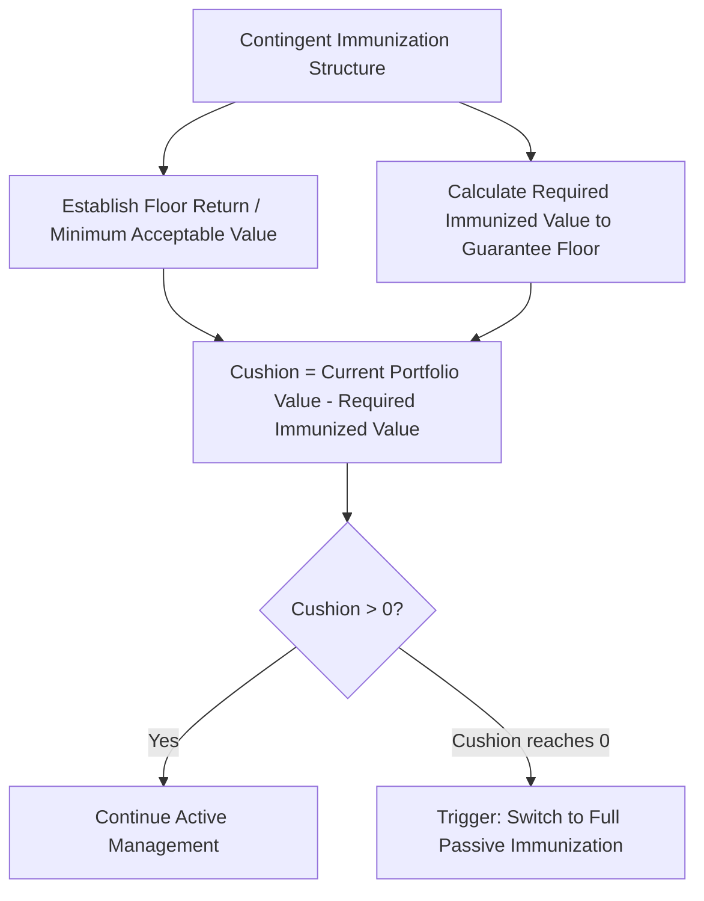

## Contingent Immunization

### Overview

Contingent immunization is a hybrid fixed income strategy that combines active portfolio management with a fallback passive immunization discipline. Under this approach, a portfolio manager is permitted to actively manage a portfolio — pursuing returns above what a purely immunized (passive) strategy would achieve — as long as the portfolio's value remains above a calculated safety margin. Should the portfolio's value fall to a predetermined trigger point, active management is abandoned and the portfolio is immediately and fully immunized (using classical duration-matching immunization techniques) to lock in the minimum acceptable return for the remaining horizon.

### Core Concept: Combining Active Management with a Safety Net

The central innovation of contingent immunization, developed originally by Leibowitz and Weinberger, is that it does not require choosing exclusively between active management (higher potential return, but full exposure to interest rate risk) and classical immunization (lower, more certain return, but no upside from active positioning). Instead, it establishes a **floor return** the investor requires, and permits active management for any "cushion" of value above what would be strictly necessary to guarantee that floor via immunization.

### Key Components and Terminology

- **Floor return (or floor rate)**: The minimum acceptable rate of return the investor requires over the investment horizon — set below the currently available immunized rate, since the entire premise of the strategy depends on there being room ("cushion") between the floor and what full immunization would currently lock in.
- **Immunized (safety net) rate**: The return currently available if the portfolio were fully immunized today via classical duration-matching techniques — this represents the "guaranteed" achievable outcome absent any active management.
- **Cushion (or cushion spread)**: The difference between the current portfolio value and the minimum value required today to ensure the floor return is achievable via immunization for the remaining horizon, given current market yields. The cushion represents the amount of "risk budget" available for active management.
- **Trigger point**: The portfolio value level at which the cushion reaches zero, at which point the strategy mandates an immediate, complete switch to passive immunization to lock in the floor return, since no further capacity remains to absorb active management losses without breaching the floor.

### The Cushion Calculation

At any point in time, the required (minimum) portfolio value to guarantee the floor return via immunization for the remaining horizon is:

$$V_{required} = \frac{V_{floor,terminal}}{(1+y_{current})^{(H-t)}}$$

where $V_{floor,terminal}$ is the terminal (horizon-date) value corresponding to the floor return, $y_{current}$ is the currently available immunization rate, and $(H-t)$ is the remaining time to the horizon.

$$\text{Cushion} = V_{portfolio,current} - V_{required}$$

As long as the cushion remains positive, the manager retains discretion to deviate from the immunized (duration-matched) position — for example, by taking an active duration bet (extending or shortening duration relative to the horizon) based on the manager's market views.

### Worked Numerical Example

Suppose an investor has a $100 million portfolio with a 5-year horizon, and establishes a floor return requirement of 4% (annually compounded) over that horizon.

**Step 1 — Calculate the required terminal value to meet the floor**:

$$V_{floor,terminal} = 100{,}000{,}000 \times (1.04)^5 = 100{,}000{,}000 \times 1.2167 = \$121{,}670{,}000$$

**Step 2 — Suppose the currently available immunized rate (e.g., a 5-year zero-coupon Treasury yield) is 5.5%**. The present value required today to guarantee this terminal value via immunization is:

$$V_{required} = \frac{121{,}670{,}000}{(1.055)^5} = \frac{121{,}670{,}000}{1.3070} = \$93{,}092{,}000$$

**Step 3 — Calculate the cushion**:

$$\text{Cushion} = 100{,}000{,}000 - 93{,}092{,}000 = \$6{,}908{,}000$$

This $6.908 million cushion represents the amount of value the portfolio can afford to lose to active management underperformance before the manager is forced to fully immunize. As long as the portfolio's value stays above the ever-recalculated $V_{required}$ threshold (which itself decreases over time as the remaining horizon shortens and increases if immunization rates fall), the manager retains active discretion.

### Visual: Contingent Immunization Corridor Over Time (svg_diagram)

<svg xmlns="http://www.w3.org/2000/svg" viewBox="0 0 720 420">
<text x="360" y="25" text-anchor="middle" font-size="16" font-weight="bold" fill="#1a1a2e">Contingent Immunization: Value Path and Trigger (svg_diagram)</text>

<line x1="80" y1="360" x2="650" y2="360" stroke="#333" stroke-width="1.5" />
<line x1="80" y1="360" x2="80" y2="60" stroke="#333" stroke-width="1.5" />
<text x="365" y="390" text-anchor="middle" font-size="13" fill="#333">Time</text>
<text x="35" y="210" text-anchor="middle" font-size="13" fill="#333" transform="rotate(-90 35 210)">Portfolio Value</text>

<path d="M 100 300 Q 300 260 620 150" stroke="#C00000" stroke-width="2.5" stroke-dasharray="6,4" fill="none" />
<text x="450" y="165" font-size="12" fill="#8a1a1a" font-weight="bold">Required Immunized Value (floor path)</text>

<path d="M 100 220 Q 180 180 260 230 Q 340 260 420 220 Q 500 180 560 210 Q 600 230 620 200" stroke="#4472C4" stroke-width="3" fill="none" />
<text x="150" y="150" font-size="12" fill="#2a4a8a" font-weight="bold">Actively Managed Portfolio Value</text>

<path d="M 100 220 Q 180 180 260 230 Q 340 260 420 220 Q 500 180 560 210 L 560 210 Q 500 180 420 220 Q 340 260 260 230 Q 180 180 100 220 Z" fill="none" />

<circle cx="600" cy="205" r="6" fill="#548235" />
<text x="450" y="270" font-size="11" fill="#375623">If portfolio value ever touches the floor path → immediate switch to full immunization</text>

<text x="150" y="325" text-anchor="middle" font-size="11" fill="#666">Cushion = gap between actual value and floor path</text>

</svg>

### The Trigger Mechanism and Its Consequences

Should the actively managed portfolio's value decline (due to adverse rate movements, poor active positioning, or a combination) to the point where it equals the required immunized value, the cushion reaches zero and the strategy mandates an **immediate and complete cessation of active management**, with the portfolio fully restructured into a classical duration-matched immunized position for the remaining horizon.

**Critical implication**: once triggered, the strategy has no further capacity for active management for the remainder of the horizon — the floor return is locked in (at whatever the currently available immunized rate happens to be at the moment of the trigger), and the manager forgoes any possibility of subsequent recovery through continued active positioning. This is a deliberate, disciplined feature of the strategy design, not an oversight: it prevents a manager from attempting to "trade their way back" after a loss, which could risk breaching the floor entirely.

### Monitoring Frequency and Practical Implementation

Contingent immunization requires **continuous or very frequent monitoring** of the cushion, since market movements can erode the cushion between formal review dates. Practical implementation considerations include:

- **Monitoring frequency**: Daily or even more frequent recalculation of the cushion is standard in practice, given that both portfolio value (from active management) and the required immunized value (which shifts with prevailing yields) can move meaningfully within short periods.
- **Trigger buffer**: Some implementations build in a small buffer above the mathematical zero-cushion point to account for execution lag (the time required to actually transact the switch to an immunized portfolio) and to avoid triggering on transient, reversible market noise.
- **Transaction costs of the switch**: The cost of unwinding active positions and reconstructing a duration-matched immunized portfolio at the trigger point should be anticipated and, ideally, incorporated into the cushion calculation with an appropriate margin.

### Comparison to Related Strategies

| Strategy | Active Management Component | Downside Protection | Complexity |
| --- | --- | --- | --- |
| Pure active management | Full, unconstrained | None | Moderate |
| Classical immunization | None | Full (against parallel shift) | Low-Moderate |
| Cash flow matching/dedication | None | Full (against matched liabilities) | Moderate-High |
| Contingent immunization | Conditional, cushion-limited | Full, once triggered | High |

Contingent immunization can be conceptually understood as analogous to a portfolio insurance strategy applied to the fixed income immunization context: it permits upside participation from active management while establishing a hard floor below which losses cannot (by design) propagate, at the cost of forgoing all further active flexibility once that floor's protective mechanism is triggered.

### Advantages and Limitations

**Advantages**:

- Provides a mechanism to pursue active outperformance without fully sacrificing the downside protection of immunization.
- The floor return is explicit and disciplined, providing clear risk parameters that can be communicated to stakeholders or plan sponsors.
- More flexible than pure classical immunization, allowing the manager to respond to market opportunities when the cushion permits.

**Limitations**:

- Requires continuous, disciplined monitoring; infrequent or delayed monitoring risks a scenario where the portfolio value falls through the trigger threshold before the switch can be executed, potentially breaching the intended floor.
- The strategy's active component is inherently constrained by the cushion — a smaller initial cushion (e.g., because the floor return is set close to the currently available immunized rate) provides less room for active management before triggering.
- Once triggered, all active management flexibility is permanently forfeited for the remainder of the horizon, which some managers or stakeholders may view as an overly rigid, one-way consequence.
- [Inference] The strategy's effectiveness in practice depends heavily on execution discipline and the accuracy of the immunization calculation used to determine the trigger threshold; any modeling error in the required-value calculation (e.g., from imprecise duration matching or unaccounted transaction costs) could result in the actual achieved floor falling short of the intended target.

### Common Pitfalls

- **Setting the floor return too close to the currently available immunized rate**: This produces only a minimal cushion, severely constraining the scope for active management and increasing the likelihood of an early trigger.
- **Infrequent cushion monitoring**: Given that both portfolio value and the required immunized value can shift meaningfully within short time frames, infrequent review risks a delayed response that allows the portfolio to breach the intended floor before the switch to immunization can be executed.
- **Underestimating transaction costs at the trigger point**: Failing to account for the cost of unwinding active positions and reconstructing an immunized portfolio can mean the actual achieved floor is somewhat below the theoretical target.
- **Treating the strategy as risk-free**: While contingent immunization is designed to protect a floor return, this protection depends entirely on correct, timely execution of the switch mechanism — a genuine implementation or operational failure at the critical moment could still result in a breach of the intended floor.

**Related Topics:**

- Classical Immunization Theory
- Duration Matching Strategies
- Cash Flow Matching and Dedicated Portfolios
- Portfolio Insurance Strategies and Their Fixed Income Analogues
- Liability-Driven Investment (LDI) Frameworks
- Rebalancing Frequency Trade-offs in Immunized Portfolios