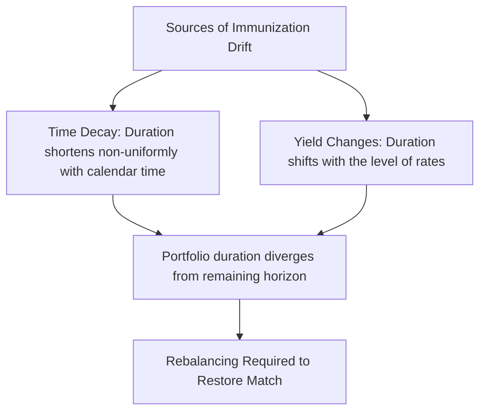
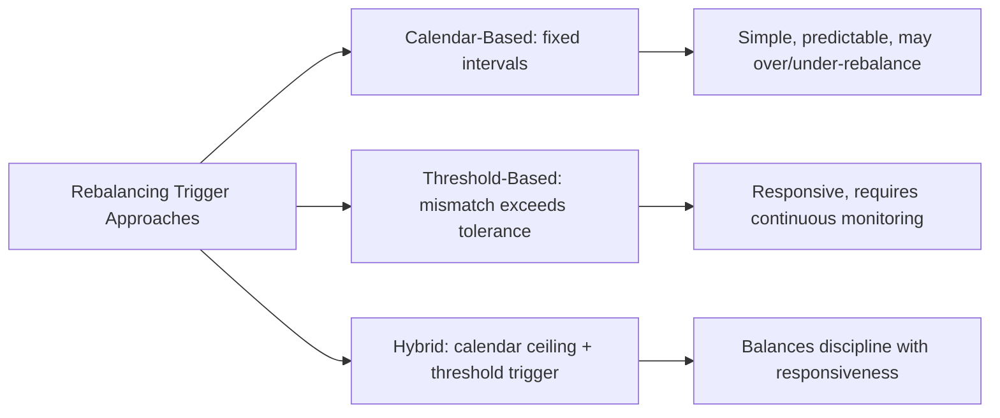

## Rebalancing Immunized Portfolios

### Overview

Rebalancing is the ongoing maintenance process required to preserve the duration-matched (or cash-flow-matched) condition of an immunized portfolio over time. Because duration and other risk measures are point-in-time quantities that drift as calendar time passes and as market yields change, an immunized portfolio that is not periodically rebalanced will gradually — and sometimes rapidly — lose the protective properties established at inception. This entry examines why rebalancing is necessary, the specific mechanisms that cause immunization drift, and the practical approaches and trade-offs involved in maintaining an immunized position.

### Why Immunized Portfolios Require Rebalancing

An immunized portfolio's protective property rests on the condition that its duration equals the remaining investment horizon (or liability due date). Two independent forces cause this condition to break down over time even absent any deliberate portfolio changes:

#### 1. Duration Decay Does Not Track Calendar Time One-for-One

As time passes, a bond's duration decreases, but generally at a rate different from the passage of calendar time itself — a coupon-paying bond's Macaulay duration typically decreases by *less than* one year for each year that passes (because as maturity approaches, the weight of the nearer-term coupon payments changes non-linearly relative to the final principal repayment). Consequently, even if the liability horizon shortens by exactly one year, the portfolio's duration will generally not have shortened by the matching one year, causing a small mismatch to open up purely from the passage of time.

#### 2. Yield Level Changes Alter Duration Independently

Because duration itself is a function of the prevailing yield level (higher yields generally produce lower Macaulay duration for a given bond, all else equal, due to more heavily discounting distant cash flows), any change in market yields — even absent any change in the portfolio's holdings — will shift the portfolio's duration away from its previously-matched value.

### Visual: Duration Drift Over Time Without Rebalancing (svg_diagram)

<svg xmlns="http://www.w3.org/2000/svg" viewBox="0 0 720 400">
<text x="360" y="25" text-anchor="middle" font-size="16" font-weight="bold" fill="#1a1a2e">Duration Drift Without Rebalancing (svg_diagram)</text>

<line x1="80" y1="340" x2="650" y2="340" stroke="#333" stroke-width="1.5" />
<line x1="80" y1="340" x2="80" y2="60" stroke="#333" stroke-width="1.5" />
<text x="365" y="370" text-anchor="middle" font-size="13" fill="#333">Time Elapsed</text>
<text x="35" y="200" text-anchor="middle" font-size="13" fill="#333" transform="rotate(-90 35 200)">Duration (years)</text>

<line x1="100" y1="90" x2="620" y2="320" stroke="#548235" stroke-width="2.5" stroke-dasharray="6,4" />
<text x="450" y="245" font-size="12" fill="#375623" font-weight="bold">Required Duration (= remaining horizon)</text>

<path d="M 100 90 Q 300 130 450 200 Q 550 250 620 270" stroke="#4472C4" stroke-width="3" fill="none" />
<text x="200" y="130" font-size="12" fill="#2a4a8a" font-weight="bold">Actual Portfolio Duration (decays non-uniformly)</text>

<line x1="450" y1="200" x2="450" y2="245" stroke="#C00000" stroke-width="2" />
<text x="460" y="225" font-size="11" fill="#8a1a1a">Growing mismatch</text>
<line x1="620" y1="270" x2="620" y2="320" stroke="#C00000" stroke-width="2" />
<text x="500" y="300" font-size="11" fill="#8a1a1a">Larger mismatch without rebalancing</text>
</svg>

The gap between the required duration path (a straight line declining exactly with the remaining horizon) and the actual, non-uniformly-decaying portfolio duration widens over time if left unaddressed, progressively eroding the immunization protection originally established.

### Rebalancing Approaches

#### Calendar-Based Rebalancing

The portfolio is rebalanced at fixed, predetermined time intervals (e.g., quarterly, semi-annually, annually), regardless of how much drift has actually occurred. This approach is operationally simple and predictable, but may rebalance unnecessarily during periods of low drift (incurring avoidable transaction costs) or insufficiently during periods of rapid yield change (leaving the portfolio mismatched for longer than ideal between scheduled rebalancing dates).

#### Threshold-Based (Trigger) Rebalancing

The portfolio is rebalanced whenever the duration mismatch (the difference between actual portfolio duration and the required, horizon-matched duration) exceeds a predetermined tolerance threshold (e.g., 0.25 years or 0.5 years), regardless of how much calendar time has elapsed since the last rebalancing. This approach responds more directly to the actual degree of drift, potentially reducing unnecessary rebalancing during stable periods while responding more promptly during periods of rapid yield movement, though it requires more continuous monitoring infrastructure than calendar-based rebalancing.

#### Hybrid Approaches

Many practical implementations combine both methods: a maximum calendar interval (ensuring the portfolio is never left unreviewed for too long) combined with a threshold trigger (ensuring a significant mismatch prompts immediate rebalancing even between scheduled review dates).

### The Rebalancing Frequency Trade-off

Selecting an appropriate rebalancing frequency (or threshold tolerance) involves balancing two opposing costs:

- **Immunization risk (tracking error) from infrequent rebalancing**: The longer a portfolio is left unrebalanced, the further its duration can drift from the target, increasing the risk that a subsequent rate change will not be adequately offset by the (now-mismatched) portfolio's price and reinvestment characteristics.
- **Transaction costs from frequent rebalancing**: Each rebalancing event involves buying and/or selling bonds, incurring bid-ask spread costs, potential market impact (particularly for large institutional portfolios), and operational overhead. Excessively frequent rebalancing can erode returns through cumulative transaction costs without a commensurate reduction in genuine immunization risk.

[Inference] The theoretically optimal rebalancing frequency depends on the specific volatility of yields, the transaction cost structure of the relevant bond market, the size of the portfolio, and the institution's tolerance for tracking error relative to the immunization target; because these factors vary substantially across institutions and market environments, the appropriate frequency is generally determined through institution-specific analysis or established policy rather than derived from a single universal formula applicable to all situations.

### Rebalancing Mechanics: How the Adjustment Is Executed

When a rebalancing event is triggered, the portfolio manager typically:

1. **Recalculates the current required duration**, based on the (now-shorter) remaining horizon and the current market yield environment.
2. **Measures the current actual portfolio duration**, incorporating any changes in individual bond durations since the last rebalancing.
3. **Determines the required trade(s)** — typically buying and/or selling specific bonds (or adjusting a barbell's relative weights) to restore the portfolio's aggregate duration to the newly-required target.
4. **Executes the trades**, ideally considering transaction costs, available liquidity, and any tax or accounting implications of realizing gains or losses on the bonds being sold.
5. **Re-verifies all relevant Redington conditions** (present value matching, duration matching, and the convexity condition) following the rebalancing, since a trade designed to fix duration alone might inadvertently affect the portfolio's convexity relative to the liability in an unintended direction.

### Rebalancing Considerations Specific to Different Portfolio Types

#### Single-Liability (Classical Immunization) Portfolios

Rebalancing focuses on restoring the aggregate portfolio duration to match the shortening remaining horizon, with periodic verification of the convexity condition.

#### Multi-Liability Duration-Matched Portfolios

Rebalancing must account for the changing present-value-weighted average duration of the *entire remaining liability stream* (which shifts not only because time has passed, but also because the relative present-value weights of different future liability payments change as yields move), adding complexity beyond the single-liability case.

#### Key Rate Duration-Matched Portfolios

Rebalancing is considerably more complex, since the portfolio manager must restore alignment across multiple vertices simultaneously (not merely a single aggregate duration figure), generally requiring a re-solved optimization across the available instrument set at each rebalancing event.

#### Portfolios Containing Embedded-Option Instruments

As discussed under duration matching strategies, portfolios incorporating callable bonds or MBS require more frequent rebalancing than pure option-free bond portfolios, since effective duration for negatively convex instruments can change more rapidly and non-linearly with yield movements — a given calendar interval or threshold tolerance appropriate for an option-free portfolio may be insufficient when such instruments are present.

### Rebalancing and Contingent Immunization

For portfolios managed under a contingent immunization framework, rebalancing takes on an additional, critical role: continuous monitoring of the cushion (the gap between actual portfolio value and the required immunized value) is itself a form of ongoing "rebalancing" surveillance, distinct from routine duration maintenance — the consequence of detecting an eroded cushion is not a partial rebalancing adjustment but a complete, one-time switch to full passive immunization, as discussed under contingent immunization.

### Common Pitfalls

- **Assuming an immunized portfolio, once constructed, requires no further attention**: This is one of the most consequential misconceptions in practical immunization — the protective condition decays continuously and must be actively maintained.
- **Rebalancing too infrequently relative to the volatility of the relevant yield environment**: In periods of unusually high yield volatility, a calendar-based rebalancing schedule calibrated for calmer conditions may leave the portfolio meaningfully mismatched for longer than appropriate.
- **Ignoring transaction costs when setting rebalancing frequency or thresholds**: An excessively tight threshold or overly frequent calendar schedule can erode portfolio returns through cumulative trading costs without a commensurate improvement in genuine risk protection.
- **Rebalancing duration alone without re-verifying the convexity condition**: A trade that restores duration matching might shift the portfolio's convexity relative to the liability in an unfavorable direction if the convexity implication is not separately checked following each rebalancing event.
- **Applying option-free-bond rebalancing schedules to portfolios containing embedded-option instruments**: Given the more rapid, non-linear duration drift characteristic of negatively convex instruments, failing to increase rebalancing frequency for such portfolios can leave them more exposed to immunization drift than the nominal schedule would suggest.

**Related Topics:**

- Classical Immunization Theory
- Duration Matching Strategies
- Cash Flow Matching and Dedicated Portfolios
- Contingent Immunization
- Duration Decomposition Across the Curve
- Effective Duration for Bonds with Embedded Options
- Transaction Cost Analysis in Fixed Income Portfolio Management