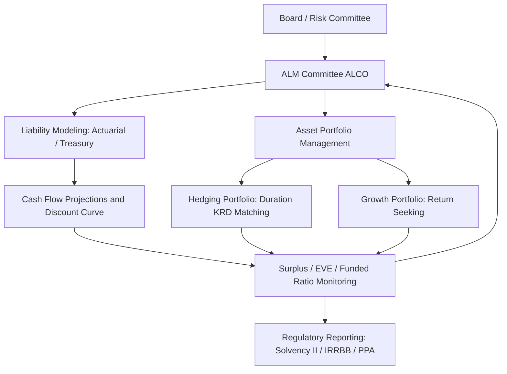

## Asset Liability Management for Pensions Insurers and Banks

### Overview

Asset Liability Management (ALM) is the discipline of coordinating the investment of assets with the structure, timing, and behavior of liabilities so that an institution can meet its obligations under a range of interest rate, market, and behavioral scenarios while optimizing return, capital efficiency, and solvency. In fixed income contexts, ALM is largely a duration and convexity management exercise, but the specific objectives, constraints, regulatory regimes, and liability characteristics differ substantially across pension funds, insurers, and banks.

### Core Economic Framework

**Key Points**

- The economic balance sheet identity underlying ALM is:

$$A(r) - L(r) = S(r)$$

where $A(r)$ is the market value of assets as a function of interest rates, $L(r)$ is the market (or economic) value of liabilities, and $S(r)$ is the surplus or net worth.

- ALM seeks to control the sensitivity of $S(r)$ to changes in $r$, not merely to maximize asset returns in isolation.
- Differentiating the surplus identity gives the surplus duration relationship:

$$D_S \cdot S = D_A \cdot A - D_L \cdot L$$

- Dividing through by $S$ gives surplus duration:

$$D_S = \frac{D_A \cdot A - D_L \cdot L}{S}$$

This shows that when $S$ is small relative to $A$ and $L$ (as is typical for banks and many pension plans), even small duration mismatches between $D_A$ and $D_L$ produce large swings in surplus duration — a structurally important and often underappreciated feature of ALM mathematics.

### Institution-Specific Liability Characteristics

**Pension Funds**

- Liabilities are long-dated, often 15–40 years in duration, driven by projected benefit obligations (PBO) discounted using assumptions about mortality, salary growth (for final-salary plans), inflation (for indexed benefits), and discount rate.
- The discount rate for liability valuation is typically a high-quality corporate bond yield curve (e.g., AA corporate curve) under accounting standards like ASC 715 (U.S. GAAP) or IAS 19 (IFRS), or a regulatory-prescribed curve for funding valuations (e.g., PPA funding rules in the U.S., or scheme-specific technical provisions under U.K. TPR guidance).
- Liability duration is typically longer than available asset duration, creating a structural duration gap that is difficult to close because long-dated government and corporate bonds beyond 30 years are scarce relative to liability demand.
- Cash flows are actuarially projected and subject to longevity risk, early retirement/withdrawal risk, and inflation risk (for CPI-linked benefits).

**Insurers**

- Liability structure depends heavily on line of business:
  - **Life insurance / annuities**: long-duration, often with embedded options (surrender options, guaranteed minimum benefits, policyholder behavior sensitivity to interest rates).
  - **Property & Casualty (P&C)**: shorter-duration liabilities (loss reserves), with less interest rate sensitivity but significant inflation and claims-development uncertainty.
- Under regulatory frameworks such as Solvency II (EU/UK) or the NAIC's Risk-Based Capital (RBC) and forthcoming principle-based reserving in the U.S., liabilities are discounted using a risk-free curve plus adjustments (e.g., the Solvency II Volatility Adjustment or Matching Adjustment for eligible annuity business).
- The Matching Adjustment regime under Solvency II is a defining ALM feature: insurers holding qualifying illiquid assets (e.g., commercial mortgages, infrastructure debt) that are cash-flow matched to annuity liabilities can discount those liabilities at an adjusted rate, directly linking asset selection to liability valuation — making close cash-flow matching a capital-efficient strategy rather than merely a risk-reduction one.

**Banks**

- Liabilities and assets are both largely contractual (deposits, loans, wholesale funding, securities), with shorter average duration than pension or life insurance liabilities, but with significant embedded optionality:
  - Deposits: contractually short-term/at-call but behaviorally "sticky" (modeled with a non-maturity deposit (NMD) decay/replicating-portfolio approach).
  - Mortgages and loans: prepayment optionality.
  - Wholesale funding: contractual maturity, but subject to rollover/refinancing risk.
- ALM in banks is governed by regulatory frameworks including Interest Rate Risk in the Banking Book (IRRBB, under Basel III/BCBS 368), Net Stable Funding Ratio (NSFR), and Liquidity Coverage Ratio (LCR), which impose structural and liquidity-based constraints in addition to pure interest rate risk metrics.
- Bank ALM typically distinguishes between **Economic Value of Equity (EVE)** sensitivity (a duration/PV-based, run-off view) and **Net Interest Income (NII)** sensitivity (an earnings-based, going-concern view over a 1–3 year horizon) — these can conflict, since a strategy that stabilizes EVE may destabilize near-term NII and vice versa.

### Duration and Convexity Matching Techniques

**Key Points**

- **Duration matching (immunization)**: setting $D_A \approx D_L$ so that parallel shifts in the yield curve have approximately offsetting effects on asset and liability present values. This is the classical Redington immunization condition, which additionally requires:

$$C_A > C_L$$

i.e., asset convexity should exceed liability convexity, so that the surplus benefits (or is protected) from large rate moves in either direction, since a portfolio with matched duration but higher convexity outperforms for both up and down shifts.

- **Cash flow matching (dedication)**: constructing a bond portfolio whose coupon and principal cash flows replicate the timing and amount of liability cash flows as closely as possible, eliminating reinvestment risk for the matched horizon. This is more capital- and asset-intensive than duration matching and is used selectively (e.g., insurer buy-in/buy-out pension risk transfer, Solvency II Matching Adjustment portfolios).
- **Key rate duration (KRD) matching**: because parallel-shift immunization is insufficient when curves twist or steepen/flatten, institutions decompose duration exposure into KRDs at multiple tenor points (e.g., 2y, 5y, 10y, 20y, 30y) and match the liability KRD profile at each point rather than only matching total duration. This addresses non-parallel curve risk, which is empirically the dominant source of ALM basis risk.
- **Contingent immunization**: a hybrid strategy that allows active management above a floor return, only reverting to a fully immunized (duration-matched) posture if performance approaches a pre-specified minimum acceptable return, giving up some flexibility for downside protection.

**Example**

A pension plan has liabilities with a present value of $1,000mm and effective duration of 14. The plan holds $800mm of assets (funded ratio 80%) with a target duration.

To fully immunize the surplus against parallel rate shifts using the surplus duration formula:

$$D_S = \frac{D_A \cdot A - D_L \cdot L}{S}$$

Setting $D_S = 0$ requires $D_A \cdot A = D_L \cdot L$:

$$D_A = \frac{D_L \cdot L}{A} = \frac{14 \times 1{,}000}{800} = 17.5$$

Because the plan is underfunded, the asset portfolio must run a *longer* duration (17.5) than the liability duration (14) to neutralize surplus duration — a counterintuitive but standard result: underfunded plans require over-hedging asset duration relative to liabilities to offset the leverage effect of the funding shortfall. [Inference: this illustrates the general leverage relationship; actual target duration in practice also reflects convexity, glide-path policy, and risk budget, not solely the point-immunization solution.]

### Liability-Driven Investing (LDI)

**Key Points**

- LDI is the pension- and insurer-oriented implementation of ALM that explicitly frames investment strategy around funded status and surplus volatility rather than asset return alone.
- Typical LDI structures separate the portfolio into:
  - A **hedging/matching portfolio** (long government and corporate bonds, interest rate swaps, inflation swaps, gilts/Treasuries) sized to hedge a target percentage (often 60–100%) of liability interest rate and inflation sensitivity.
  - A **growth/return-seeking portfolio** (equities, credit, alternatives) intended to close funding gaps or generate surplus above the liability hurdle.
- **Leveraged LDI** (common in the U.K. pension market) uses repo or swap-based leverage to achieve high hedge ratios on the liability-matching sleeve while freeing up capital for the growth portfolio. This introduces liquidity and collateral (margin call) risk, which became acute during the U.K. gilt market stress of September–October 2022, when rapid gilt yield increases triggered large collateral calls on leveraged LDI funds, forcing gilt sales that further pushed yields higher in a self-reinforcing spiral, prompting Bank of England intervention.
- Glide paths are commonly used: as funded status improves, the plan mechanically increases the hedge ratio and reduces growth-asset allocation, "de-risking" over time — an approach sometimes called a "flight path" in U.K. terminology.

### Regulatory and Solvency Frameworks Compared

| Institution | Primary Framework(s) | Liability Discount Basis | Key Risk Metric |
| --- | --- | --- | --- |
| Pension Funds | ERISA/PPA (U.S.), TPR funding code (U.K.), IAS 19/ASC 715 (accounting) | High-quality corporate curve or scheme-specific curve | Funded ratio, surplus duration |
| Insurers (Life) | Solvency II (EU/UK), NAIC RBC / PBR (U.S.) | Risk-free curve + Matching/Volatility Adjustment | SCR interest rate stress, EVE |
| Banks | Basel III IRRBB (BCBS 368), LCR, NSFR | Contractual cash flows, behavioral models | EVE sensitivity, NII sensitivity, ΔEVE/Tier 1 ratio |

[Unverified: specific numerical thresholds (e.g., Basel IRRBB's ±200bp standardized shock and the 15% Tier 1 capital "outlier" threshold) are current as of well-established BCBS guidance but should be confirmed against the latest local regulator implementation, since national supervisors can adopt variations.]

### Behavioral and Optionality Risk in ALM

**Key Points**

- Beyond pure duration matching, ALM must model embedded optionality that changes effective cash flow timing as rates move:
  - **Mortgage prepayment risk (banks/insurers holding MBS)**: falling rates accelerate prepayments, shortening asset duration exactly when reinvestment rates are lower — negative convexity.
  - **Policyholder surrender behavior (insurers)**: rising rates can increase lapses as policyholders seek higher-yielding alternatives, effectively shortening liability duration when the insurer is least prepared (assets have lengthened in relative terms).
  - **Deposit behavior (banks)**: non-maturity deposits are modeled with assumed decay rates and rate pass-through betas; mismodeling this behavioral duration was a central contributor to the 2023 U.S. regional bank failures (e.g., Silicon Valley Bank), where held-to-maturity long-duration securities were funded by deposits that proved far less "sticky" than historical models assumed once depositors faced attractive money-market alternatives and social-media-driven withdrawal dynamics.
- Effective duration (accounting for optionality via option-adjusted spread (OAS) modeling) is used instead of Macaulay/modified duration whenever cash flows are rate-dependent.

### ALM Governance Structure

### Surplus Sensitivity Diagram (svg_diagram)

<svg xmlns="http://www.w3.org/2000/svg" viewBox="0 0 700 420">
\<style\>
.lbl { font-family: Arial, sans-serif; font-size: 14px; fill: #222; }
.title { font-family: Arial, sans-serif; font-size: 16px; font-weight: bold; fill: #111; }
.axis { stroke: #444; stroke-width: 1.5; }
.assetline { stroke: #2166ac; stroke-width: 2.5; fill: none; }
.liabline { stroke: #b2182b; stroke-width: 2.5; fill: none; }
\</style\>
<text x="180" y="30" class="title">Asset vs Liability Value Sensitivity to Rates (svg_diagram)</text>
<line x1="80" y1="360" x2="640" y2="360" class="axis" />
<line x1="80" y1="360" x2="80" y2="60" class="axis" />
<text x="330" y="400" class="lbl">Interest Rate →</text>
<text x="30" y="200" class="lbl" transform="rotate(-90 30 200)">Present Value →</text>
<path d="M 100 100 Q 360 220 600 340" class="assetline" />
<path d="M 100 90 Q 360 210 600 320" class="liabline" />
<text x="500" y="300" class="lbl" fill="#2166ac">Assets (higher convexity)</text>
<text x="480" y="270" class="lbl" fill="#b2182b">Liabilities</text>
<text x="150" y="380" class="lbl">Low rates</text>
<text x="540" y="380" class="lbl">High rates</text>
</svg>

### Related Topics

- Redington Immunization Theorem and Convexity Conditions
- Key Rate Duration and Curve Risk Decomposition
- Liability-Driven Investing (LDI) and Leveraged Gilt Strategies
- IRRBB: EVE vs NII Sensitivity Frameworks
- Solvency II Matching Adjustment and Matching Portfolio Construction
- Non-Maturity Deposit Modeling and Replicating Portfolios
- Pension Risk Transfer: Buy-Ins, Buy-Outs, and Longevity Swaps
- Option-Adjusted Spread (OAS) and Effective Duration for Callable/MBS Assets
- Collateral and Liquidity Risk in Leveraged Hedging Programs