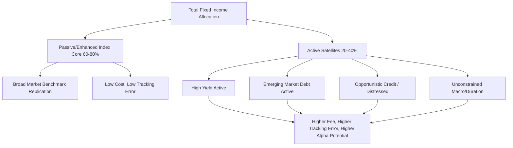

## Passive versus Active Management Approaches

### Overview

Fixed income portfolio management strategies exist on a spectrum from fully passive (index replication) to fully active (unconstrained alpha-seeking), with several intermediate approaches (enhanced indexing, core-plus, immunization-based strategies) occupying the middle ground. The choice among these approaches depends on views on market efficiency, cost sensitivity, liability structure, risk budget, and the manager's ability to generate consistent excess return net of fees and transaction costs.

### Defining the Spectrum

**Key Points**

- **Pure passive (indexing)**: replicate a chosen benchmark's risk and return characteristics as closely as possible, minimizing tracking error without attempting to outperform.
- **Enhanced indexing**: retain close benchmark tracking (low tracking error, typically 20–50bp annualized) while making small, constrained active bets (e.g., minor sector tilts, yield curve positioning, security selection within a duration-neutral framework) to generate modest excess return.
- **Active management**: deliberately deviate from the benchmark in duration, curve positioning, sector allocation, credit selection, and currency exposure to maximize risk-adjusted excess return, accepting higher tracking error (often 100bp+ annualized).
- **Core-plus**: a core investment-grade benchmark-aware allocation supplemented with an allocation to out-of-benchmark or higher-risk sectors (high yield, emerging market debt, non-U.S. bonds) to enhance return.

### Rationale for Passive Management in Fixed Income

**Key Points**

- **Cost efficiency**: passive fixed income funds typically charge expense ratios of 3–15bp versus 30–60bp+ for active fixed income funds, and lower turnover reduces transaction costs, which are structurally higher in bonds than equities due to wider bid-ask spreads and less liquid secondary markets.
- **Benchmark difficulty specific to bonds**: unlike equity indices, most fixed income benchmarks (e.g., Bloomberg U.S. Aggregate Bond Index) are market-value-weighted, meaning the largest debt issuers (not necessarily the most creditworthy) receive the largest index weight — a structural feature sometimes cited as an argument for both active management (to avoid overweighting heavily indebted issuers) and smart-beta/fundamental-weighted passive alternatives.
- **Replication challenges**: full physical replication of a broad bond index is often impractical because the underlying universe contains thousands of illiquid, infrequently traded CUSIPs. Passive bond funds typically use **stratified sampling** (also called cellular/stratified replication): the benchmark is partitioned into cells by duration, sector, credit quality, and coupon, and the portfolio holds a representative subset of bonds in each cell weighted to match the cell's aggregate risk characteristics, rather than owning every constituent.
- **Empirical performance evidence**: [Unverified: specific persistence statistics] Historical performance studies (e.g., SPIVA reports published by S&P Dow Jones Indices) have generally found that a majority of actively managed fixed income funds underperform their benchmarks over long horizons (5–15 years) net of fees, particularly in more efficient segments like investment-grade corporate and government bonds; underperformance rates are typically lower (i.e., active managers have historically fared comparatively better) in less efficient segments such as high yield, emerging market debt, and municipal bonds, where information asymmetries and liquidity premia create more exploitable mispricing. [Inference: exact percentages vary meaningfully by year and report vintage and should be checked against the current SPIVA release rather than treated as fixed figures.]

### Rationale for Active Management in Fixed Income

**Key Points**

- **Market inefficiency in credit and less-liquid sectors**: unlike equity markets, bond markets are heavily influenced by non-economic buyers (central banks conducting monetary policy operations, regulatory-driven buyers such as insurers and banks meeting capital requirements, and liability-driven investors hedging duration) whose purchase/sale decisions are not driven purely by valuation — creating persistent mispricing opportunities for active managers with credit and macro expertise.
- **Structural sources of active return in fixed income**:
  - **Duration/curve positioning**: tactically over- or under-weighting duration relative to the benchmark based on rate views, or positioning across the curve (steepeners, flatteners, barbells vs. bullets) to exploit anticipated curve shape changes.
  - **Sector rotation**: reallocating among Treasuries, agencies, corporates, securitized products (MBS/ABS/CMBS), and municipals based on relative value and macro cycle positioning.
  - **Credit selection**: fundamental credit analysis to identify mispriced issuers, avoid downgrades/defaults, and capture rating-migration or spread-compression opportunities — a skill set with a more defensible edge than aggregate rate-timing given the idiosyncratic, event-driven nature of credit risk.
  - **Security selection within sectors**: exploiting liquidity premia, new-issue concessions, and idiosyncratic mispricing (e.g., in the MBS market, prepayment modeling edge).
  - **Yield curve roll-down/carry strategies**: actively positioning to capture roll-down return, which is not a benchmark-neutral bet but a structural feature of upward-sloping curves that passive full-replication approaches also capture, but which active managers can enhance by concentrating exposure at points of maximum curve steepness.
- Downside protection during credit cycles: active managers can reduce or eliminate exposure to distressed or deteriorating credits before a downgrade or default is fully priced in or before the index methodology forces inclusion/exclusion, whereas passive index funds mechanically hold (or are forced to trade) based on index rules (e.g., "fallen angel" forced-selling dynamics when a bond is downgraded from investment grade to high yield).

### Tracking Error Decomposition

The active risk (tracking error) of a fixed income portfolio relative to its benchmark can be decomposed by systematic risk factor:

$$TE^2 = \sigma_{duration}^2 + \sigma_{curve}^2 + \sigma_{sector}^2 + \sigma_{credit}^2 + \sigma_{selection}^2 + \text{covariance terms}$$

**Key Points**

- $\sigma_{duration}^2$: variance from portfolio duration deviating from benchmark duration.
- $\sigma_{curve}^2$: variance from key-rate duration mismatches even when aggregate duration is matched (curve positioning risk).
- $\sigma_{sector}^2$: variance from sector allocation deviations (e.g., overweight corporates vs. Treasuries).
- $\sigma_{credit}^2$: variance from credit quality/spread duration mismatches.
- $\sigma_{selection}^2$: idiosyncratic, security-specific variance not explained by systematic factors.
- Enhanced index strategies deliberately constrain $\sigma_{duration}^2$ and $\sigma_{curve}^2$ near zero (tight duration/KRD bands, e.g., ±0.25 years) while allowing modest $\sigma_{selection}^2$ and $\sigma_{credit}^2$ budget.

### Information Ratio as the Decision Framework

The choice between passive and active is often formalized using the **information ratio (IR)**:

$$IR = \frac{\alpha}{TE} = \frac{R_p - R_b}{\sigma(R_p - R_b)}$$

**Key Points**

- A manager should only be allocated an active risk budget if their expected (or historically demonstrated, adjusted for skill persistence) IR justifies the fee premium and tracking error risk over a passive alternative.
- The **fundamental law of active management** (Grinold-Kahn) states:

$$IR \approx IC \times \sqrt{BR}$$

where $IC$ (information coefficient) measures the correlation between a manager's forecasts and actual outcomes, and $BR$ (breadth) is the number of independent investment decisions made per period. This framework explains why active fixed income managers with many independent, semi-uncorrelated credit-selection decisions (high breadth) can achieve a meaningful IR even with a modest per-decision skill level (IC), whereas a manager making only a handful of large macro/duration calls per year (low breadth) needs a much higher IC to achieve the same IR. [Inference: this is a stylized theoretical framework; realized IR in practice is also affected by transaction costs, capacity constraints, and non-independence between decisions, which the simple formula does not capture.]

### Practical Framework: Choosing an Approach

**Example**

A pension plan's investment committee is evaluating its $500mm core fixed income allocation, currently 100% passive (tracking the Bloomberg U.S. Aggregate Index). It considers reallocating a portion to active management.

Decision framework:

1. **Benchmark efficiency assessment**: the Agg is dominated by highly liquid Treasuries and agency MBS (efficient), suggesting limited alpha potential in that sleeve.
2. **Segment carve-out**: rather than replacing the entire passive allocation, the committee could carve out less-efficient segments (e.g., 15% to active high-yield, 10% to active emerging-market debt) where historical active manager outperformance has been more persistent, while retaining passive management for the efficient core (investment-grade Treasuries/corporates).
3. **Fee/breakeven analysis**: if active core-plus fees are 45bp versus 8bp for passive, the active manager must generate at least 37bp of gross excess return annually merely to match net passive returns — a hurdle rate that should be assessed against the manager's realized IR and TE.
4. **Risk budget allocation**: rather than an all-or-nothing decision, many institutional investors adopt a **core-satellite structure**: a passive or enhanced-index core (60–80% of the allocation) for cost-efficient beta exposure, surrounded by active satellite allocations in specialized, less efficient sectors.

### Core-Satellite Structure Diagram

### Comparative Summary

| Dimension | Passive | Enhanced Index | Active |
| --- | --- | --- | --- |
| Tracking Error | Near zero (~5–15bp) | Low (~20–50bp) | Moderate to high (100bp+) |
| Typical Fees | 3–15bp | 10–25bp | 30–60bp+ |
| Duration/Curve Deviation | None (matched) | Tightly constrained | Discretionary |
| Best Suited Sectors | Treasuries, agency MBS, broad IG | Broad market with modest tilts | High yield, EM debt, distressed, unconstrained macro |
| Key Risk | Benchmark construction flaws (concentration in indebted issuers) | Limited alpha ceiling | Manager skill/persistence risk, higher cost drag |

### Related Topics

- Stratified Sampling and Bond Index Replication Techniques
- Fundamental Law of Active Management (Grinold-Kahn Framework)
- Core-Satellite Portfolio Construction
- Fallen Angel Risk and Forced Index Rebalancing Dynamics
- Smart Beta and Fundamentally Weighted Bond Indices
- Total Return vs. Buy-and-Maintain Credit Strategies
- Manager Selection: Evaluating Realized Information Ratio and Style Consistency
- Transaction Cost Analysis (TCA) in Fixed Income Trading