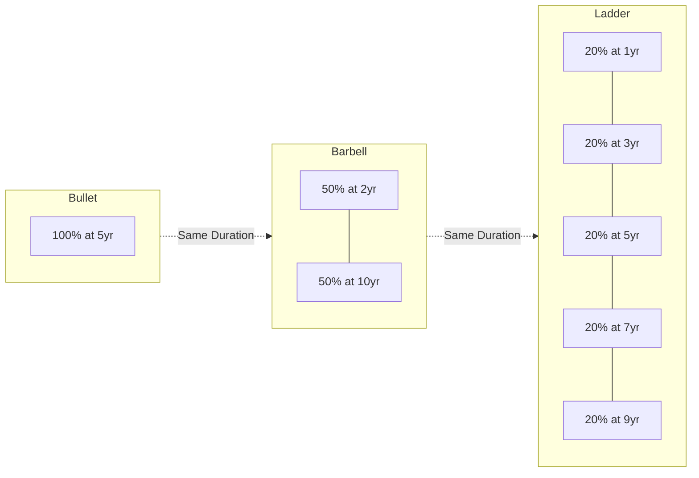

## Bullet Barbell and Ladder Structures

### Overview

Bullet, barbell, and ladder structures are the three canonical maturity-distribution frameworks for constructing a fixed income portfolio. Each achieves a given target duration through a different arrangement of cash flows along the yield curve, and each therefore exhibits distinct convexity, curve-risk, reinvestment-risk, and liquidity characteristics even when their durations are matched.

### Definitions

**Key Points**

- **Bullet structure**: portfolio cash flows/maturities are concentrated at or near a single point on the curve (e.g., all holdings maturing around 10 years). Used to target a specific liability date or match a single duration point precisely.
- **Barbell structure**: portfolio combines short-maturity and long-maturity securities at the two ends of the curve, with little or nothing in intermediate maturities, constructed so the weighted-average duration matches a bullet or target duration.
- **Ladder structure**: portfolio holds approximately equal amounts maturing at regular intervals across a range of maturities (e.g., equal amounts maturing in 1, 2, 3, 4, and 5 years), providing a staggered, diversified maturity distribution.

### Constructing a Duration-Matched Comparison

**Example**

Consider a target portfolio duration of 5 years, constructed three ways with a $300mm notional:

1. **Bullet**: $300mm entirely in a 5-year bond with duration ≈ 4.6.
2. **Barbell**: $150mm in a 2-year bond (duration ≈ 1.9) and $150mm in a 10-year bond (duration ≈ 8.3), weighted-average duration:

$$D_{barbell} = 0.5(1.9) + 0.5(8.3) = 5.1$$

3. **Ladder**: $60mm each in 1, 3, 5, 7, and 9-year bonds (durations approximately 1.0, 2.8, 4.5, 5.9, 7.1), weighted-average duration:

$$D_{ladder} = 0.2(1.0 + 2.8 + 4.5 + 5.9 + 7.1) = 4.26$$

[Inference: illustrative duration figures assume standard coupon bonds priced near par; actual duration for any specific bond depends on its coupon, yield, and day-count conventions and should be computed from the security's own cash flow schedule.]

Even after adjusting notional weights so all three structures have matched duration (~5), their **convexity** differs materially, which is the central analytical distinction among the three approaches.

### Convexity Differential: The Core Analytical Point

**Key Points**

- For a given (matched) duration, a **barbell structure has higher convexity** than a bullet structure, because convexity is a function of the *dispersion* of cash flows around the duration point, not merely their weighted average timing. Formally, convexity involves the second moment of cash flow timing:

$$C = \frac{1}{P(1+y)^2}\sum_{t} \frac{CF_t \cdot t(t+1)}{(1+y)^t}$$

Because this expression weights cash flow timing by $t(t+1)$ (a convex function of $t$), cash flows spread further from the mean duration point (as in a barbell) contribute disproportionately more convexity than cash flows concentrated near the mean (as in a bullet), even when the first moment (duration) is identical.

- **Practical implication**: a barbell will outperform a duration-matched bullet for *large* parallel yield shifts in either direction (up or down), because higher convexity means smaller price declines when rates rise and larger price gains when rates fall, all else equal. This is the standard motivation for preferring a barbell when an investor expects high interest rate volatility or wants convexity as "insurance" against large moves, often obtainable at a modest cost.
- **The barbell's convexity typically comes at a cost in yield**: because the yield curve is usually upward-sloping (in normal environments) and intermediate bonds often sit closer to the curve's steepest, highest-carry segment, a bullet concentrated at an attractive intermediate point can offer higher yield-to-maturity/carry than a barbell of equivalent duration — this yield give-up for convexity is sometimes called the **cost of convexity** and is analogous to an insurance premium.
- **Curve-shape sensitivity differs**:
  - A bullet is relatively insensitive to *twists* (non-parallel changes) near its concentration point but has outsized exposure to the specific point on the curve where it is concentrated.
  - A barbell is exposed to both the short and long end independently, so it benefits from a **curve flattening** (long rates falling relative to short rates, since the long-end holding gains more than the short-end position loses in relative terms) and is hurt by a **curve steepening**.
  - A ladder is the most diversified across curve shape changes, since exposure is spread evenly, making it comparatively neutral to curve twists relative to bullet or barbell, at the cost of less precision in targeting any single duration point.

### Ladder Structures in Practice

**Key Points**

- Laddering is widely used by individual and institutional investors as a disciplined reinvestment strategy: as each "rung" matures, proceeds are reinvested at the long end of the ladder, which:
  - Reduces reinvestment risk relative to a bullet (since not all cash flows reinvest at a single point in time/rate environment).
  - Provides regular liquidity without needing to sell bonds in the secondary market (avoiding bid-ask cost and mark-to-market realization at an inopportune time).
  - Averages reinvestment rates across a rate cycle, similar in spirit to dollar-cost averaging, smoothing out the effect of reinvesting an entire portfolio at a single unfavorable point in the cycle.
- Commonly used in municipal bond portfolios for retail/high-net-worth investors and in bank/insurer liquidity portfolios where predictable, staggered liquidity needs exist.
- A ladder's convexity sits between a bullet and a barbell of the same duration — more dispersed than a bullet (some convexity benefit) but less extreme than a full barbell.

### Application Context by Institution Type

**Key Points**

- **Liability-matched portfolios (pensions/insurers)**: often favor bullet or near-bullet structures when a specific liability cash flow date must be matched precisely (e.g., a defined payout date), since dispersion away from the target date reintroduces reinvestment/curve risk relative to that specific liability.
- **Banks managing interest rate risk**: may use barbell structures within the investment portfolio to add convexity as a partial offset to negative convexity embedded in the loan book (e.g., prepayable mortgages), since loans and MBS assets typically have negative convexity that a barbell's positive convexity can partially hedge.
- **Active total-return managers**: use bullet-vs-barbell positioning tactically as a **curve trade**: rotating into a barbell ahead of an expected flattening, or into a bullet/concentration ahead of an expected steepening, independent of any duration change (a duration-neutral curve trade).

### Trade-Off Summary Table

| Attribute | Bullet | Barbell | Ladder |
| --- | --- | --- | --- |
| Cash flow concentration | Single point | Two extremes (short + long) | Evenly spread |
| Convexity (duration-matched) | Lowest | Highest | Intermediate |
| Yield/carry (typical upward curve) | Often highest | Often lowest (convexity cost) | Intermediate |
| Reinvestment risk | Concentrated at one date | Split between two dates | Diversified across many dates |
| Best environment | Large expected move at a known target date; curve twist risk low | Expected high volatility / large parallel or flattening moves | Ongoing liquidity needs; curve-shape-agnostic positioning |
| Curve-shape exposure | Localized to concentration point | Sensitive to flattening/steepening | Relatively neutral to twists |

### Structural Comparison Diagram

### Convexity Comparison Illustration (svg_diagram)

<svg xmlns="http://www.w3.org/2000/svg" viewBox="0 0 700 400">
\<style\>
.lbl { font-family: Arial, sans-serif; font-size: 13px; fill: #222; }
.title { font-family: Arial, sans-serif; font-size: 16px; font-weight: bold; fill: #111; }
.axis { stroke: #444; stroke-width: 1.5; }
.bullet { stroke: #444444; stroke-width: 2.5; fill: none; stroke-dasharray: 5,3; }
.barbell { stroke: #2166ac; stroke-width: 2.5; fill: none; }
.tangent { stroke: #999; stroke-width: 1; stroke-dasharray: 2,2; }
\</style\>
<text x="150" y="30" class="title">Bullet vs Barbell Price-Yield Convexity (svg_diagram)</text>
<line x1="80" y1="330" x2="640" y2="330" class="axis" />
<line x1="80" y1="330" x2="80" y2="60" class="axis" />
<text x="330" y="370" class="lbl">Yield Change →</text>
<text x="30" y="200" class="lbl" transform="rotate(-90 30 200)">Price →</text>
<line x1="120" y1="300" x2="600" y2="150" class="tangent" />
<path d="M 120 300 Q 360 100 600 260" class="barbell" />
<path d="M 120 290 Q 360 150 600 250" class="bullet" />
<text x="440" y="120" class="lbl" fill="#2166ac">Barbell (higher convexity)</text>
<text x="440" y="200" class="lbl" fill="#444444">Bullet (lower convexity)</text>
<text x="200" y="315" class="lbl">Rates fall</text>
<text x="520" y="315" class="lbl">Rates rise</text>
</svg>

### Related Topics

- Convexity and the Second-Order Price-Yield Relationship
- Duration-Neutral Curve Trades (Flattener/Steepener Positioning)
- Redington Immunization and Convexity Conditions Revisited
- Reinvestment Risk Quantification Across Maturity Structures
- Negative Convexity in Mortgage-Backed Securities and Loan Portfolios
- Butterfly Trades and Key Rate Duration Positioning
- Cost of Convexity and Option-Adjusted Spread Analysis