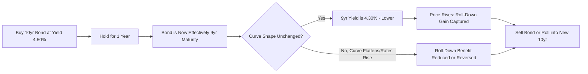

## Riding the Yield Curve Strategy

### Overview

Riding the yield curve is a fixed income strategy that seeks to capture "roll-down" return by purchasing bonds with maturities longer than the investor's actual holding period, on an upward-sloping (positively sloped) yield curve, and selling them before maturity after their yield has declined due to the passage of time moving them toward the shorter, lower-yielding end of the curve. It is a pure curve-shape and carry strategy rather than a directional bet on the overall level of rates.

### Core Mechanism

**Key Points**

- On an upward-sloping curve, a bond's yield-to-maturity decreases as its remaining time to maturity shortens, holding the curve shape constant. As time passes and the bond "rolls down" the curve toward shorter maturities, its yield falls and — because bond prices move inversely to yields — its price rises (beyond what pure time-value/pull-to-par accretion alone would produce).
- The strategy involves buying a bond with maturity $T$ longer than the desired holding period $H$ (where $T > H$), holding it for period $H$, and then selling it (or rolling into a new longer bond and repeating), rather than buying a bond that matures exactly at $H$.
- Total return from riding the yield curve decomposes into three components:

$$R_{total} = \text{Coupon Income} + \text{Roll-Down Return} + \text{Price Change from Rate Level Change}$$

Roll-down return specifically arises from the second component — the bond's yield declining purely due to the passage of time along a static (unchanged) curve shape, distinct from any actual change in interest rate levels.

### Quantifying Roll-Down Return

**Key Points**

- Roll-down return can be approximated as:

$$\text{Roll-Down Return} \approx -D_{mod} \times \Delta y_{roll}$$

where $D_{mod}$ is the bond's modified duration at the start of the holding period and $\Delta y_{roll}$ is the change in yield attributable purely to the bond aging from maturity $T$ to maturity $T-H$ along the *current, unchanged* curve — i.e., $\Delta y_{roll} = y(T-H) - y(T)$, which is negative on an upward-sloping curve (shorter maturities yield less), making the roll-down return positive.

**Example**

Suppose the current curve has a 10-year yield of 4.50% and a 9-year yield of 4.30% (the curve is upward-sloping by 20bp over that one-year segment). An investor buys the 10-year bond (duration ≈ 8.1) and plans to hold it for one year.

If the curve shape is unchanged over the year, the bond will "become" a 9-year bond yielding 4.30% by the time it is sold. The yield decline is:

$$\Delta y_{roll} = 4.30\% - 4.50\% = -0.20\%$$

Approximate roll-down price return:

$$\text{Roll-Down Return} \approx -8.1 \times (-0.20\%) = 1.62\%$$

In addition to this 1.62% roll-down return, the investor earns the bond's coupon income (e.g., ~4.50% annualized, prorated) over the holding period, for a total expected return meaningfully above the 1-year (short-maturity) risk-free rate — this excess over the short rate is the reward for taking on the interest rate/duration risk of holding a longer bond than the actual holding period, assuming the curve shape does not change adversely.

[Inference: this is a first-order (duration-based) approximation; a more precise calculation would use the bond's actual price at each yield rather than a linear duration approximation, and would also account for convexity, which becomes more material over longer holding periods or larger yield changes.]

### The Steepness Requirement and Break-Even Analysis

**Key Points**

- The strategy is only attractive when the curve is sufficiently upward-sloping (steep) over the relevant maturity segment; on a flat or inverted curve, riding the curve produces little or no roll-down benefit, or can even produce a roll-down *loss* if the curve is inverted in that segment (since $\Delta y_{roll}$ would be positive, shortening maturity would raise the yield, and duration times a positive yield change with a negative sign produces a price loss).
- **Break-even analysis**: the strategy's total return should be compared against simply buying a bond that matures exactly at the intended holding period $H$ (a "buy-and-hold-to-maturity-matched" bullet). The break-even question is: how much can rates rise before the roll-down bond's total return falls below the shorter bond's total return? This defines an implicit "cushion" — if realized rate increases exceed the curve's currently implied forward rate increase (i.e., realized rates rise by more than what is already priced into the forward curve), the longer bond underperforms; if rates rise by less than implied, or fall, or stay flat, the roll-down bond outperforms.
- This is closely related to the **forward rate / expectations hypothesis framework**: riding the yield curve is profitable precisely when realized future short rates turn out to be *lower* than what the current forward curve implies (i.e., when the market's implied forward path overstates actual future rate increases) — a pattern that has been empirically common historically in many developed-market yield curve environments, though not guaranteed. [Unverified: whether this pattern persists going forward depends on evolving market conditions and cannot be assumed to hold in any specific future period.]

### Comparison to Alternative Strategies

**Key Points**

- **Riding the curve vs. buy-and-hold-to-maturity-matched bullet**: the roll-down strategy takes on additional duration/curve risk (the bond is not held to its own maturity, so its sale price is uncertain and depends on future rate levels) in exchange for potentially higher expected return if the curve remains upward-sloping and stable.
- **Riding the curve vs. rolling short-term bills (cash strategy)**: riding the curve typically offers higher expected return (capturing term premium and roll-down) at the cost of interim mark-to-market volatility, since the bond's value fluctuates with rates before sale, whereas continuously rolling short bills has minimal price volatility but forgoes term premium and roll-down return.
- The strategy is most effective and most commonly deployed in the **short-to-intermediate segment of the curve** (e.g., 2–5 year maturities held for 3–12 months), because that segment of many developed-market curves has historically exhibited the steepest slope per unit of maturity, maximizing roll-down per unit of duration risk taken, though this varies by curve environment and shape at any given time.

### Risk Considerations

**Key Points**

- **Curve reshaping risk**: the core assumption — that the curve shape remains stable — can fail. If the curve flattens (short rates rise relative to long rates, or the segment being ridden compresses), realized roll-down will be lower than implied by the current curve snapshot, or negative.
- **Parallel rate risk**: even with an unchanged curve shape, if the overall level of rates rises, the bond's price will fall due to ordinary duration risk, which can offset or exceed the roll-down gain — the strategy does not eliminate directional rate risk, since the investor still holds interest rate duration for the holding period.
- **Liquidity/transaction cost risk**: since the position must be sold before maturity (or the roll repeated), the strategy depends on secondary market liquidity and incurs bid-ask cost at each roll, which erodes the theoretical roll-down gain, particularly in less liquid segments (e.g., off-the-run Treasuries or corporate bonds).
- **Reinvestment assumption**: strategies that continuously "roll" (repeatedly buying longer bonds, holding briefly, selling, and rebuying) implicitly assume the ability to repeat the trade at similarly favorable curve steepness in subsequent periods, which is not guaranteed.

### Illustrative Roll-Down Diagram

### Yield Curve Roll-Down Visualization (svg_diagram)

<svg xmlns="http://www.w3.org/2000/svg" viewBox="0 0 700 400">
\<style\>
.lbl { font-family: Arial, sans-serif; font-size: 13px; fill: #222; }
.title { font-family: Arial, sans-serif; font-size: 16px; font-weight: bold; fill: #111; }
.axis { stroke: #444; stroke-width: 1.5; }
.curve { stroke: #2166ac; stroke-width: 2.5; fill: none; }
.arrow { stroke: #b2182b; stroke-width: 2; marker-end: url(#arrowhead); }
.point { fill: #b2182b; }
\</style\>
<text x="150" y="30" class="title">Riding the Yield Curve: Roll-Down Effect (svg_diagram)</text>
<line x1="80" y1="330" x2="640" y2="330" class="axis" />
<line x1="80" y1="330" x2="80" y2="60" class="axis" />
<text x="330" y="370" class="lbl">Maturity (Years) →</text>
<text x="30" y="200" class="lbl" transform="rotate(-90 30 200)">Yield →</text>
<path d="M 100 300 Q 300 200 580 100" class="curve" />
<circle cx="520" cy="115" r="5" class="point" />
<circle cx="440" cy="150" r="5" class="point" />
<line x1="520" y1="115" x2="440" y2="150" class="arrow" />
<text x="530" y="110" class="lbl">10yr, yield 4.50%</text>
<text x="330" y="170" class="lbl">9yr, yield 4.30%</text>
<text x="420" y="200" class="lbl" fill="#b2182b">Bond "rolls down" the curve</text>
<text x="150" y="315" class="lbl">Short end</text>
<text x="520" y="90" class="lbl">Long end</text>
</svg>

### Related Topics

- Forward Rates and the Expectations Hypothesis
- Term Premium Estimation and Decomposition
- Duration and Convexity Approximations for Price-Yield Sensitivity
- Carry and Roll-Down Analysis in Relative Value Trading
- Butterfly and Curve-Steepness Trades
- Break-Even Rate Analysis for Duration Positioning
- Total Return Attribution: Income, Roll, and Rate Change Components