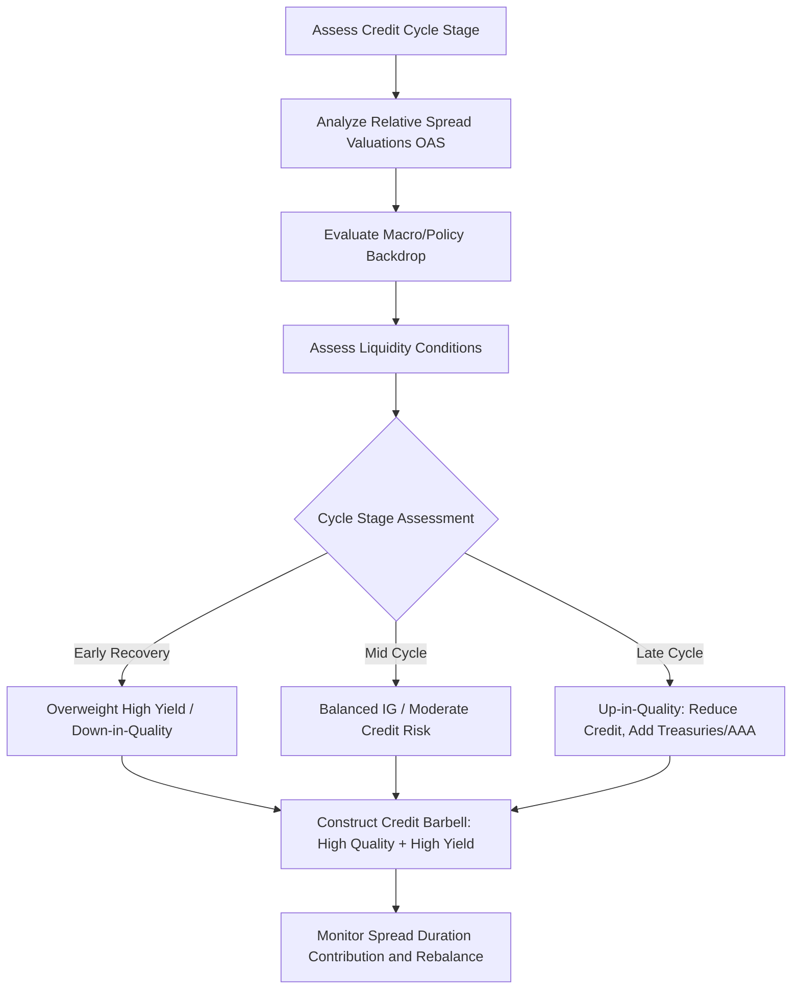

## Sector Rotation and Credit Barbell Strategies

### Overview

Sector rotation and credit barbell strategies are active fixed income approaches that reallocate portfolio exposure across bond market sectors (Treasuries, agencies, investment-grade corporates, high yield, securitized products, municipals, emerging market debt) and across the credit quality spectrum to exploit relative value opportunities driven by the credit and economic cycle, spread valuations, and changing risk appetite. While the earlier bullet/barbell/ladder discussion concerned maturity distribution along the yield curve, credit barbell strategies apply an analogous "combine two extremes" logic to credit quality rather than maturity.

### Sector Rotation: Core Framework

**Key Points**

- Sector rotation involves tactically overweighting or underweighting broad fixed income sectors relative to a benchmark based on:
  - **Credit cycle stage**: early-cycle recovery typically favors lower-quality credit (high yield, BBB corporates) as spreads compress from recessionary wides; late-cycle/pre-recession conditions favor higher-quality, more defensive sectors (Treasuries, AAA/AA corporates, agency MBS) as spreads are more likely to widen.
  - **Relative spread valuation**: comparing current option-adjusted spreads (OAS) for a sector against its own historical range and against other sectors to identify sectors that are cheap or rich relative to fundamentals.
  - **Macro/policy environment**: monetary policy stance (easing vs. tightening), fiscal issuance trends (affecting Treasury supply/demand technicals), and regulatory changes (affecting demand from banks/insurers for specific sectors like agency MBS or municipal bonds).
  - **Liquidity conditions**: during periods of market stress, rotating toward more liquid sectors (Treasuries, agency MBS) preserves flexibility; during calm periods, rotating toward less liquid sectors (corporates, securitized credit, munis) can capture illiquidity premium.
- Sector rotation decisions are typically expressed as **spread duration** overweights/underweights (duration-weighted exposure to spread risk) rather than simple notional allocation, since sectors differ in average duration as well as credit quality.

### The Credit Cycle and Sector Positioning

**Key Points**

- A stylized credit cycle framework maps sector preference to cycle stage:

| Cycle Stage | Typical Characteristics | Favored Sectors |
| --- | --- | --- |
| Early Recovery | Spreads very wide, defaults peaking/declining, growth troughing | High yield, BBB corporates, distressed/special situations |
| Mid-Cycle Expansion | Spreads normalizing, growth solid, credit fundamentals improving | IG corporates, structured credit, EM debt |
| Late Cycle | Spreads tight, leverage building, growth peaking | Reduce credit risk; rotate toward higher quality, shorter spread duration |
| Recession/Downturn | Spreads widening, defaults rising, flight to quality | Treasuries, agency MBS, highest-quality IG |

[Inference: this is a stylized, textbook framework for illustrative purposes; actual cycle timing, duration, and the "correct" sector response are highly uncertain in real time, and historical cycles have varied substantially in length and character, so mechanical application of this framework without independent fundamental and technical analysis carries meaningful risk.]

- **Spread widening/narrowing dynamics**: sector rotation performance is driven by changes in OAS. If an investor overweights high yield and spreads narrow, the sector outperforms Treasuries beyond the coupon differential; if spreads widen, the overweight underperforms. This spread-based return is analytically distinct from and additive to the duration/rate-based return studied in curve strategies.

### Credit Barbell Strategy: Definition and Mechanics

**Key Points**

- A **credit barbell** combines a high-quality, low-risk component (e.g., Treasuries or AAA-rated securities) with a high-yield/lower-quality component (e.g., BB or B-rated corporates), rather than holding a uniform allocation to intermediate credit quality (e.g., BBB) — analogous in structure to the maturity barbell but applied to the credit-quality axis instead of the duration axis.
- **Rationale for a credit barbell**:
  - **Diversification of risk factors**: the high-quality sleeve provides duration/rate exposure with minimal credit risk, while the high-yield sleeve provides credit/spread exposure with typically lower duration (high yield bonds tend to have shorter average maturity and lower price sensitivity to rates, though higher sensitivity to the economic cycle) — the two sleeves respond to different macro drivers (rates vs. credit/growth), which can reduce overall portfolio volatility relative to a blended intermediate-credit portfolio if the two risk factors are imperfectly correlated.
  - **Avoiding the "crowded middle"**: BBB-rated corporate debt is often the most crowded segment of the investment-grade market (a large proportion of the IG index by market value), with the specific risk of "fallen angel" downgrades to high yield during stress, which forces mechanical selling by IG-mandate holders — a barbell strategy can deliberately underweight this crowded, downgrade-prone middle tier in favor of the barbell's two extremes.
  - **Convexity-like asymmetry**: in favorable credit environments, the high-yield sleeve captures more upside (spread compression) than an equivalent-duration IG allocation; in stressed environments, the high-quality sleeve provides a ballast/flight-to-quality offset that a pure BBB/intermediate allocation would lack (since BBB bonds are exposed to downgrade risk precisely when credit stress rises).
- **Trade-offs**: credit barbells sacrifice the steady, predictable carry of a well-diversified intermediate-credit portfolio for a bimodal risk profile; they can underperform in environments where intermediate credit (BBB, BB) outperforms both extremes (a "belly of the curve" credit rally), analogous to how a maturity barbell underperforms a bullet when intermediate maturities outperform.

### Quantitative Framing: Spread Duration Contribution

**Key Points**

- The portfolio's total spread-risk exposure from a sector rotation or credit barbell decision can be expressed as:

$$\text{Spread Duration Contribution} = \sum_i w_i \times SD_i$$

where $w_i$ is the portfolio weight in sector/credit-quality bucket $i$ and $SD_i$ is that bucket's spread duration (sensitivity of price to a 100bp change in that sector's OAS).

**Example**

A manager constructs a credit barbell within a $400mm corporate bond sleeve:

- 60% ($240mm) in AAA/AA corporates, spread duration 5.0
- 40% ($160mm) in B-rated high yield, spread duration 3.5

$$\text{Spread Duration Contribution} = 0.60(5.0) + 0.40(3.5) = 3.0 + 1.4 = 4.4$$

Compare this to a "bullet" credit allocation of 100% BBB corporates with spread duration 4.6 — a similar aggregate spread duration but concentrated in a single, more downgrade-exposed credit tier rather than diversified across the quality spectrum. The barbell's realized volatility and drawdown profile in a credit-stress scenario would differ from the BBB bullet's because the AAA/AA sleeve would likely see spreads widen far less than BBB spreads, while the B-rated sleeve would widen more — the aggregate outcome depends on the specific magnitude of spread moves at each quality tier, which are not perfectly correlated. [Inference: whether the barbell outperforms or underperforms the BBB bullet in any specific stress scenario depends on the realized relative spread-widening across tiers, which varies by episode and cannot be predicted with certainty in advance.]

### Sector Rotation and Credit Barbell in Combination

**Key Points**

- In practice, active managers often combine both dimensions: rotating aggregate sector/credit exposure over the cycle (sector rotation) while maintaining a barbell-like structure *within* the credit sleeve at any point in time to manage idiosyncratic downgrade risk and diversify credit-quality exposure.
- **Up-in-quality trades**: a common late-cycle sector rotation move is to sell lower-rated credit and buy higher-rated credit within the same portfolio duration target, reducing the high-yield/BBB weighting and adding Treasuries or AAA/AA paper — effectively shifting the portfolio's credit barbell weighting toward the high-quality end.
- **Down-in-quality trades**: the inverse, typically executed early in a recovery when spreads are historically wide and default expectations are peaking (and, per market consensus, likely to improve), shifting weight toward the high-yield end of the barbell.

### Sector Rotation Decision Flow

### Credit Barbell vs. Intermediate Credit Bullet Illustration (svg_diagram)

<svg xmlns="http://www.w3.org/2000/svg" viewBox="0 0 700 400">
\<style\>
.lbl { font-family: Arial, sans-serif; font-size: 13px; fill: #222; }
.title { font-family: Arial, sans-serif; font-size: 16px; font-weight: bold; fill: #111; }
.axis { stroke: #444; stroke-width: 1.5; }
.bar1 { fill: #2166ac; }
.bar2 { fill: #b2182b; }
.bar3 { fill: #999999; }
\</style\>
<text x="130" y="30" class="title">Credit Barbell Allocation vs BBB Bullet (svg_diagram)</text>
<line x1="80" y1="330" x2="640" y2="330" class="axis" />
<line x1="80" y1="330" x2="80" y2="60" class="axis" />
<text x="30" y="200" class="lbl" transform="rotate(-90 30 200)">Allocation %</text>
<rect x="140" y="150" width="60" height="180" class="bar1" />
<text x="130" y="345" class="lbl">AAA/AA (60%)</text>
<rect x="220" y="230" width="60" height="100" class="bar2" />
<text x="220" y="360" class="lbl">B-rated HY (40%)</text>
<rect x="400" y="90" width="60" height="240" class="bar3" />
<text x="390" y="345" class="lbl">BBB Bullet (100%)</text>
<text x="130" y="70" class="lbl">Barbell: diversified quality tiers</text>
<text x="380" y="70" class="lbl">Bullet: concentrated in crowded BBB tier</text>
</svg>

### Related Topics

- Option-Adjusted Spread (OAS) Analysis and Relative Value
- Fallen Angel Risk and Forced Index Rebalancing Dynamics
- Credit Cycle Indicators and Default Rate Forecasting
- Bullet, Barbell, and Ladder Structures (Maturity-Based Framework)
- Up-in-Quality and Down-in-Quality Rotation Timing
- Spread Duration and Credit Risk Decomposition
- High Yield vs. Investment Grade Correlation Regimes