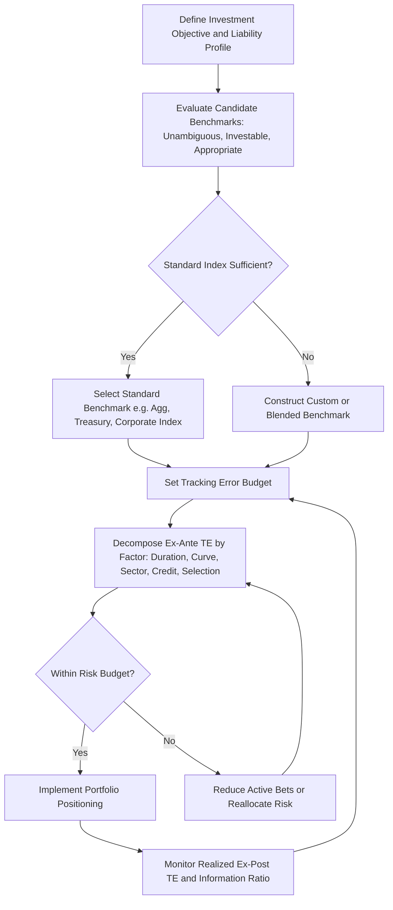

## Benchmark Selection and Tracking Error

### Overview

Benchmark selection is the process of choosing a fixed income index (or blend of indices) that appropriately represents an investor's investment universe, risk tolerance, and objectives, against which portfolio performance and risk are measured. Tracking error quantifies the dispersion of a portfolio's returns relative to that benchmark and is the central risk metric used to calibrate, monitor, and constrain active management decisions once a benchmark is chosen.

### Criteria for Benchmark Selection

**Key Points**

- A well-constructed benchmark should satisfy several properties, commonly summarized (following the framework popularized by Bailey and others) as: unambiguous, investable, measurable, appropriate, reflective of current investment opinions, specified in advance, and owned (accountable).
- **Unambiguous**: constituents and weights must be clearly identifiable and rules-based (e.g., market-value weighting, defined inclusion criteria).
- **Investable**: it should be possible, at least in principle, to replicate the benchmark by actually purchasing its constituent securities, so that passive replication and performance comparison are meaningful.
- **Measurable**: the benchmark's return must be calculable on a reasonably frequent basis (daily/monthly) using available pricing sources.
- **Appropriate**: the benchmark's risk characteristics (duration, credit quality, sector composition, currency) should be consistent with the investor's mandate, liabilities, and risk tolerance — a common failure mode is selecting a benchmark that is easy to obtain data for but economically mismatched to the actual liability or investment objective.
- **Reflective of current investment views**: the manager should have knowledge of and views on the securities in the benchmark, so that active positioning is a deliberate, informed deviation rather than an uninformed one.
- **Specified in advance**: the benchmark must be defined before the evaluation period begins, to avoid the appearance (or reality) of after-the-fact benchmark selection bias.

### Common Fixed Income Benchmark Families

**Key Points**

- **Broad market/aggregate indices**: e.g., the Bloomberg U.S. Aggregate Bond Index, covering investment-grade Treasuries, agencies, corporates, and securitized products — used as the default core fixed income benchmark for many U.S. institutional mandates.
- **Government-only indices**: e.g., Bloomberg U.S. Treasury Index, used for mandates with minimal credit risk tolerance (e.g., liquidity portfolios, certain LDI matching sleeves).
- **Credit-specific indices**: e.g., Bloomberg U.S. Corporate Index (investment grade) or Bloomberg U.S. High Yield Index, used for dedicated credit mandates.
- **Global/international indices**: e.g., Bloomberg Global Aggregate Index, for mandates with cross-border exposure, which introduces currency risk as an additional benchmark design and hedging consideration.
- **Custom/liability-based benchmarks**: constructed to match the specific cash flow profile or duration of an institution's liabilities (common for pension LDI and insurance ALM mandates) rather than tracking a generic market-cap-weighted index; these may be built as a custom blend of standard index segments or as a bespoke cash-flow-matched benchmark.
- **Blended/composite benchmarks**: a weighted combination of multiple indices (e.g., 70% Aggregate / 30% High Yield) used when a mandate spans multiple sectors not captured by a single standard index (common for core-plus mandates).

### Benchmark Construction Considerations Specific to Fixed Income

**Key Points**

- Fixed income benchmarks are dynamic in composition: as bonds mature, get called, or migrate credit ratings (e.g., downgrade from investment grade to high yield), the index composition changes mechanically each month, in contrast to equity indices that rebalance on a scheduled (typically quarterly or annual) basis. This creates ongoing turnover in the benchmark itself that passive replicators must track.
- Market-value weighting in fixed income benchmarks means the largest debt issuers (governments and corporations with the most outstanding debt) receive the largest index weight, which some critics argue tilts an index toward the most indebted (not necessarily the highest-quality) issuers — a structural feature that benchmark selection should account for when assessing "appropriateness" for a given mandate.
- Duration and average maturity of standard benchmarks change over time as the underlying market's issuance patterns shift, meaning that even a purely passive investor tracking a broad aggregate index experiences duration drift driven by market-wide, not investor-driven, factors — a consideration for institutions using such an index as an LDI proxy.

### Tracking Error: Definition and Calculation

**Key Points**

- **Tracking error (TE)**, also called active risk, measures the standard deviation of the portfolio's active return (portfolio return minus benchmark return) over a specified period:

$$TE = \sigma(R_p - R_b) = \sqrt{\frac{1}{N-1}\sum_{t=1}^{N}\left[(R_{p,t} - R_{b,t}) - \overline{(R_p - R_b)}\right]^2}$$

This is the **ex-post (realized) tracking error**, calculated from historical portfolio and benchmark returns.

- **Ex-ante (predicted) tracking error** is estimated forward-looking using a risk model, typically decomposing portfolio active exposures (duration, key rate duration, sector, credit quality, currency) against a factor covariance matrix:

$$TE_{ex\text{-}ante} = \sqrt{\mathbf{w}^T \Sigma \mathbf{w}}$$

where $\mathbf{w}$ is the vector of active factor exposures (portfolio minus benchmark weights/durations across risk factors) and $\Sigma$ is the covariance matrix of those factor returns. Ex-ante TE is the primary tool used by risk managers and portfolio construction systems to set and monitor risk budgets *before* returns are realized, since ex-post TE can only be measured after the fact.

- [Inference: ex-ante and ex-post tracking error will generally differ, sometimes substantially, because ex-ante estimates depend on the risk model's assumed factor volatilities and correlations at a point in time, which change as market conditions evolve; persistent large gaps between ex-ante and realized TE typically prompt a review of the risk model's calibration.]

### Sources of Tracking Error in Fixed Income Portfolios

**Key Points**

- **Duration mismatch**: even a small difference between portfolio and benchmark duration is often the single largest contributor to TE in fixed income, since duration mismatches translate rate-level moves directly into relative return differences.
- **Key rate duration (curve) mismatches**: a portfolio can be duration-matched in aggregate but still carry meaningful TE from differing exposure across the curve (e.g., overweight the belly, underweight the wings) if the curve twists.
- **Sector/credit allocation differences**: overweighting corporates versus the benchmark's Treasury/agency mix, or overweighting a specific credit quality tier, introduces spread-driven TE.
- **Security selection**: idiosyncratic, issuer-specific deviations (holding a different set of bonds within the same sector/quality bucket than the benchmark) contribute selection-driven TE, which tends to be diversifiable across many holdings (consistent with the breadth concept in the fundamental law of active management).
- **Sampling/replication error (for passive funds)**: since most bond index funds use stratified sampling rather than full replication, a residual, generally small tracking error arises purely from the fund's inability to hold every constituent bond, plus transaction costs and cash drag from cash flows (coupon receipts, subscriptions/redemptions) not being instantaneously reinvested.
- **Optionality and pricing/valuation differences**: for sectors with embedded options (MBS, callable corporates), differences in prepayment or option-adjusted modeling between the portfolio manager's pricing and the index provider's pricing methodology can create tracking error even absent any deliberate active position.

### Setting a Tracking Error Budget

**Example**

A plan sponsor allocates $1bn to a core fixed income mandate benchmarked to the Bloomberg U.S. Aggregate Index and sets a maximum tracking error budget of 75bp annualized. The manager's risk system decomposes a proposed portfolio's ex-ante TE as follows:

| Risk Factor | Contribution to TE (bp) |
| --- | --- |
| Duration | 15 |
| Key Rate Duration (curve) | 20 |
| Sector Allocation | 25 |
| Credit Quality | 30 |
| Security Selection | 18 |
| **Total (with diversification)** | **58** |

Note that the total (58bp) is less than the simple sum of the individual contributions (108bp) because the factors are not perfectly correlated; the risk model's covariance terms produce diversification benefit, consistent with the variance formula:

$$TE^2 = \sum_i \sigma_i^2 + 2\sum_{i<j}\rho_{ij}\sigma_i\sigma_j$$

Since realized TE of 58bp is within the 75bp budget, the manager has remaining risk capacity (headroom) to add further active positions if additional high-conviction opportunities arise, subject to the sponsor's overall constraint. [Inference: the specific factor contributions and diversification benefit shown are illustrative; actual figures depend on the specific risk model, current factor volatilities/correlations, and the portfolio's actual positioning.]

### Information Ratio Revisited in the Benchmark Context

**Key Points**

- Tracking error is only meaningful in conjunction with active return; the **information ratio** ($IR = \alpha / TE$) evaluates whether the manager is being compensated for the tracking error taken.
- A manager can have *low* tracking error and still deliver a *poor* information ratio (if the modest active bets consistently lose), while another manager can run *high* tracking error and deliver a strong information ratio (if the larger bets are, on average, well-rewarded) — TE alone says nothing about skill; it only measures the magnitude of deviation from the benchmark.
- Institutional investors typically evaluate managers using both TE (as a risk/mandate-compliance check) and realized IR over multiple market cycles (as a skill/manager-selection check), rather than either measure in isolation.

### Benchmark Selection and Tracking Error Workflow

### Related Topics

- Fundamental Law of Active Management and Information Ratio
- Factor-Based Risk Models for Fixed Income (Multi-Factor Covariance Approaches)
- Stratified Sampling and Passive Index Replication Techniques
- Custom Liability-Based Benchmark Construction for LDI Mandates
- Key Rate Duration Decomposition and Curve Risk Attribution
- Performance Attribution: Separating Income, Duration, Curve, and Selection Effects
- Manager Due Diligence: Evaluating Realized vs. Ex-Ante Risk Metrics