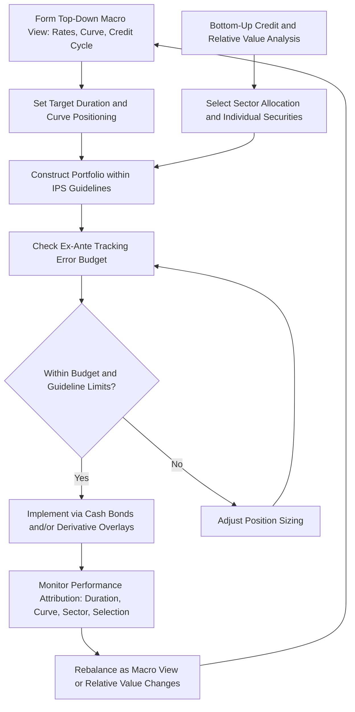

## Total Return Portfolio Management

### Overview

Total return portfolio management is an approach to fixed income investing in which the objective is to maximize risk-adjusted total return — encompassing income, price appreciation, and reinvestment return — relative to a benchmark or absolute target, rather than to match specific liability cash flows (as in immunization/LDI) or to hold securities to maturity for stable income (as in a buy-and-hold or laddered approach). It is the dominant framework used by most actively managed institutional and mutual fund bond portfolios.

### Total Return Decomposition

**Key Points**

- Total return over a holding period decomposes into distinct, separately attributable components:

$$R_{total} = \text{Income Return} + \text{Price Return} + \text{Reinvestment Return}$$

- **Income return**: coupon payments received, expressed as a percentage of the bond's price.
- **Price return**: change in the bond's market price due to (a) the passage of time and pull-to-par, (b) roll-down along the curve, (c) changes in the level and shape of the yield curve, and (d) changes in credit spread.
- **Reinvestment return**: return earned on coupons (and any principal received prior to the horizon) that are reinvested during the holding period; this component grows in importance for longer holding periods and higher-coupon bonds, and is the source of reinvestment risk under Macaulay duration/immunization theory.
- A more granular attribution further splits price return into:

$$\text{Price Return} = \text{Duration Effect} + \text{Convexity Effect} + \text{Spread Change Effect} + \text{Curve Reshaping Effect}$$

This decomposition allows a total return manager to identify precisely which decisions (duration positioning, curve positioning, credit selection) drove realized performance, which is essential both for internal risk management and for external performance attribution reporting to clients/oversight committees.

### Objective Function and Constraints

**Key Points**

- Unlike immunization (which targets a specific terminal value or liability match) or cash flow matching (which targets specific dated cash flows), total return management targets the **highest possible total return per unit of risk** over a defined horizon, typically measured against a market benchmark using tracking error as the risk constraint (see benchmark selection/tracking error framework).
- The manager operates within a set of guideline constraints commonly specified in an Investment Policy Statement (IPS) or mandate guidelines, which typically include:
  - Duration band relative to benchmark (e.g., ±1.5 years)
  - Sector/credit quality limits (e.g., maximum 20% below investment grade)
  - Issuer concentration limits (e.g., maximum 3% in any single non-government issuer)
  - Permitted use of derivatives (futures, swaps, options) for hedging or efficient exposure implementation
  - Liquidity requirements and permissible use of leverage
- Within these constraints, the manager makes active decisions across the standard fixed income levers: duration/interest rate positioning, yield curve positioning, sector allocation, credit selection, and (for global mandates) currency positioning.

### The Total Return Management Process

**Key Points**

- **Top-down macro view formation**: developing a house view on the direction and pace of policy rates, inflation, growth, and the shape of the yield curve, which informs the target portfolio duration and curve positioning (bullet/barbell/ladder, steepener/flattener).
- **Sector and credit cycle analysis**: determining relative allocation across sectors based on the credit cycle stage and relative spread valuation (see sector rotation and credit barbell framework), which drives spread duration positioning.
- **Bottom-up security selection**: within each sector/quality bucket, identifying specific issuers and securities offering the best risk-adjusted value based on fundamental credit analysis, relative value versus comparable securities, and technical factors (new issue concessions, index inclusion/exclusion flows).
- **Portfolio construction and risk budgeting**: combining the top-down and bottom-up views into a portfolio that respects the mandate's tracking error budget, allocating risk (via ex-ante TE decomposition) to the highest-conviction, highest information-ratio opportunities.
- **Ongoing risk monitoring and rebalancing**: continuously monitoring realized versus expected performance, tracking error drift, and guideline compliance, and rebalancing as market conditions, relative value, and the macro view evolve.

### Total Return vs. Buy-and-Maintain and Immunization Approaches

**Key Points**

- **Total return vs. buy-and-maintain**: buy-and-maintain strategies (common among some insurers and long-horizon credit investors) purchase bonds with the intent to hold to maturity, engaging in relatively little active trading and focusing primarily on avoiding credit losses (downgrades/defaults) rather than actively trading for price appreciation; total return management, by contrast, actively trades positions in response to changing relative value, even absent any credit deterioration, in pursuit of superior total return.
- **Total return vs. immunization/LDI**: immunization strategies subordinate return maximization to the objective of matching or protecting a specific liability profile (see the earlier ALM/immunization discussion); total return strategies are benchmark- or absolute-return-oriented and are not constructed with reference to any specific liability cash flow schedule, making them suitable for pools of capital without a fixed, dated obligation (e.g., a mutual fund, an endowment's fixed income sleeve, or an insurer's surplus/free-capital portfolio as distinct from its liability-backing portfolio).
- Total return management can incorporate elements of the strategies discussed elsewhere in this chapter (riding the yield curve, bullet/barbell/ladder curve positioning, sector rotation, credit barbells) as *tools* within an overarching total-return objective, rather than as standalone strategies pursued in isolation.

### Use of Derivatives in Total Return Management

**Key Points**

- **Interest rate futures and swaps**: used to adjust portfolio duration quickly and cost-effectively without transacting in the cash bond market, which is particularly valuable given the wider bid-ask spreads and lower liquidity of cash bonds relative to futures/swaps.
- **Credit default swaps (CDS)**: used to take synthetic long or short credit exposure to a single issuer or index (e.g., CDX, iTraxx) without needing to source or short the underlying cash bond, and to hedge existing cash bond credit exposure.
- **Options on rates/bonds**: used to express asymmetric views (e.g., buying a payer swaption to hedge against a large rate increase while retaining upside if rates fall) or to enhance income (e.g., selling covered options against a portion of the portfolio, accepting capped upside for premium income).
- Derivative overlays allow the total return manager to separate *beta* (broad market exposure, often held via cash bonds or index replication) from *alpha* (tactical duration, curve, and credit views, expressed efficiently via derivatives), improving capital efficiency and reducing transaction costs relative to expressing every view through cash bond trading.

### Performance Attribution Example

**Example**

A total return manager's portfolio returned 1.85% over a quarter versus a benchmark return of 1.40%, for 45bp of active (excess) return. Attribution decomposes the excess return as follows:

| Attribution Component | Contribution (bp) |
| --- | --- |
| Duration positioning (portfolio duration slightly longer than benchmark during a rally) | +20 |
| Curve positioning (barbell tilt benefited from flattening) | +8 |
| Sector allocation (overweight corporates as spreads tightened) | +12 |
| Security selection (individual credit picks) | +7 |
| Fees and trading costs | -2 |
| **Total Active Return** | **+45** |

This attribution allows the investment committee to assess *which* decisions drove outperformance (here, primarily a correct duration call) versus which added smaller, more consistent contributions (sector allocation and selection) — informing both manager evaluation and future risk budget allocation across the manager's active decision levers. [Inference: illustrative attribution figures; actual attribution methodologies (e.g., Campisi model, Brinson-Fachler adapted for fixed income) vary by provider and can produce somewhat different component splits for the same underlying returns depending on methodology and sequencing assumptions.]

### Total Return Management Process Flow

### Related Topics

- Performance Attribution Models for Fixed Income (Campisi, Brinson-Fachler Adaptations)
- Derivatives Overlay Strategies: Futures, Swaps, and CDS in Portfolio Management
- Buy-and-Maintain Credit Strategies for Insurers
- Investment Policy Statement (IPS) Design and Guideline Compliance
- Alpha-Beta Separation in Fixed Income Portfolio Construction
- Combining Curve, Sector, and Credit Views into a Unified Risk Budget
- Absolute Return and Unconstrained Fixed Income Mandates