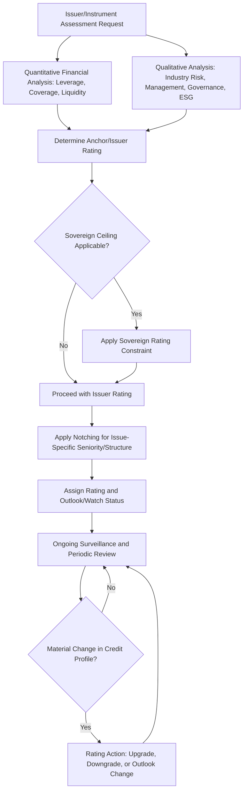

## Credit Ratings and Rating Agency Methodology

### Overview

Credit ratings are independent assessments of an issuer's or a specific debt instrument's relative creditworthiness — its capacity and willingness to meet financial obligations in full and on time — expressed as a standardized alphanumeric scale. Rating agency methodology encompasses the quantitative and qualitative frameworks that agencies use to assign, monitor, and adjust these ratings, and understanding this methodology is central to interpreting spread levels, structuring covenants, and assessing migration/default risk in fixed income analysis.

### Major Rating Agencies and Scales

**Key Points**

- The three dominant global rating agencies are **Standard & Poor's (S&P)**, **Moody's Investors Service**, and **Fitch Ratings**, collectively referred to as Nationally Recognized Statistical Rating Organizations (NRSROs) in U.S. regulatory parlance, alongside several smaller NRSROs (e.g., DBRS Morningstar, Kroll Bond Rating Agency (KBRA), A.M. Best for insurance-specific ratings).
- Rating scales differ in notation but map to a common conceptual structure:

| Category | S&P / Fitch | Moody's | Description |
| --- | --- | --- | --- |
| Investment Grade | AAA | Aaa | Highest quality, minimal credit risk |
|  | AA+/AA/AA- | Aa1/Aa2/Aa3 | High quality, very low credit risk |
|  | A+/A/A- | A1/A2/A3 | Upper-medium grade |
|  | BBB+/BBB/BBB- | Baa1/Baa2/Baa3 | Lower-medium grade, lowest investment-grade tier |
| Speculative Grade (High Yield) | BB+/BB/BB- | Ba1/Ba2/Ba3 | Speculative, moderate credit risk |
|  | B+/B/B- | B1/B2/B3 | Highly speculative |
|  | CCC+/CCC/CCC- | Caa1/Caa2/Caa3 | Substantial credit risk, near default |
|  | CC, C | Ca | Extremely speculative, default likely/imminent |
|  | D / RD | C | In default or default imminent |

- The BBB-/Baa3 to BB+/Ba1 boundary is the critical **investment-grade/high-yield threshold**, since many institutional mandates (insurance regulatory capital rules, pension guidelines, money market fund rules) reference this boundary directly, making a downgrade across it (a "fallen angel" event) a major market event that can trigger forced selling by IG-constrained holders.

### Rating Methodology Components

**Key Points**

- **Issuer (corporate family) ratings vs. issue-specific ratings**: an issuer rating reflects overall creditworthiness, while issue-specific ratings for individual bonds can differ from the issuer rating based on structural features such as seniority (senior secured vs. senior unsecured vs. subordinated), collateral, and guarantees — reflected through **notching** (e.g., subordinated debt typically rated one or more notches below the issuer's senior unsecured rating to reflect lower expected recovery in default).
- **Quantitative analysis**: financial ratio analysis covering leverage (debt/EBITDA), coverage (EBITDA/interest expense, funds from operations/debt), profitability margins, liquidity (cash and available facilities relative to near-term obligations), and cash flow generation and stability, typically benchmarked against industry-specific medians for each rating category.
- **Qualitative/business risk analysis**: assessment of industry risk and cyclicality, competitive position and market share, management quality and track record, corporate governance, and (increasingly) environmental, social, and governance (ESG) factors to the extent they present material credit risk (e.g., regulatory/transition risk for carbon-intensive industries, litigation risk).
- **Country/sovereign ceiling considerations**: for corporate issuers, ratings can be constrained by the sovereign rating of the issuer's home country (a "sovereign ceiling"), reflecting transfer and convertibility risk and the broader operating environment, though agencies have methodologies allowing certain issuers to be rated above the sovereign under specific conditions (e.g., strong hard-currency export revenues).
- **Structured finance methodology** (distinct from corporate/sovereign methodology): ratings for ABS, MBS, and CLOs rely heavily on quantitative cash flow modeling of the underlying collateral pool under stress scenarios, assessment of credit enhancement (subordination, overcollateralization, reserve funds), and legal/structural analysis of the securitization's waterfall and bankruptcy-remoteness — a methodology that diverges significantly from corporate ratings and was a central focus of post-2008 financial crisis criticism and subsequent regulatory reform (e.g., Dodd-Frank Act provisions addressing rating agency conflicts of interest and disclosure in the U.S., and equivalent EU regulation under ESMA oversight).

### Rating Outlooks and Watch Lists

**Key Points**

- **Rating outlook** (Positive, Negative, Stable, Developing) indicates the likely direction of a rating change over a medium-term horizon (typically 6 months to 2 years), providing forward guidance without an immediate rating action.
- **CreditWatch (S&P) / Rating Watch (Fitch) / Review for Upgrade-Downgrade (Moody's)**: a more urgent signal than an outlook, indicating a rating action is under active consideration, typically in response to a specific event (announced M&A, regulatory action, unexpected earnings deterioration) and usually resolved within a shorter window (often 90 days, though this can extend for complex situations).
- Spreads often begin adjusting immediately upon an outlook or watch placement, before the actual rating action occurs, since market participants price in the probability-weighted expected outcome — meaning a rating action, when it finally occurs, may already be substantially "priced in" to the bond's spread, with less residual market reaction than the magnitude of the rating change alone might suggest. [Inference: the degree of prior pricing-in varies by issuer liquidity, market attention, and the predictability of the specific rating action, and is not uniform across all rating events.]

### Ratings Migration and Transition Matrices

**Key Points**

- Rating agencies and third-party researchers publish historical **transition matrices** showing the empirical probability of an issuer migrating from one rating category to another (including default) over a given horizon (typically one year), based on large historical datasets.
- A simplified illustrative one-year transition matrix (rows = starting rating, columns = ending rating, probabilities as %):

| From \ To | AAA | AA | A | BBB | BB | B | CCC/Below | Default |
| --- | --- | --- | --- | --- | --- | --- | --- | --- |
| AAA | 90.0 | 9.0 | 0.6 | 0.3 | 0.1 | 0.0 | 0.0 | 0.0 |
| AA | 0.5 | 90.0 | 8.5 | 0.7 | 0.2 | 0.1 | 0.0 | 0.0 |
| A | 0.0 | 2.0 | 91.0 | 6.0 | 0.7 | 0.2 | 0.1 | 0.0 |
| BBB | 0.0 | 0.2 | 4.0 | 89.0 | 5.0 | 1.0 | 0.5 | 0.3 |
| BB | 0.0 | 0.0 | 0.3 | 6.0 | 82.0 | 8.0 | 2.0 | 1.0 |
| B | 0.0 | 0.0 | 0.1 | 0.5 | 6.0 | 80.0 | 8.0 | 4.5 |

[Unverified: these figures are illustrative and representative of the general shape of published historical transition matrices; actual published transition probabilities vary by agency, methodology, sample period, and economic environment, and should be sourced directly from current agency or index-provider publications (e.g., annual S&P Global or Moody's default studies) for any analytical or valuation use.]

- Transition matrices exhibit two well-documented, general empirical patterns: **diagonal dominance** (issuers are far more likely to remain at or near their current rating than to migrate significantly within a single year) and **rating momentum/autocorrelation** (an issuer that has recently been downgraded is statistically more likely to be downgraded again than an otherwise-similar issuer with a stable rating history) — both patterns are used in credit portfolio risk modeling (e.g., CreditMetrics-style frameworks) to simulate future rating paths and estimate portfolio credit value-at-risk.

### Criticisms and Limitations of Rating Methodology

**Key Points**

- **Issuer-pays conflict of interest**: the dominant "issuer-pays" business model (the rated entity pays the agency for the rating) creates a structural potential conflict of interest, since agencies compete for issuer business — a criticism intensified following the 2008 financial crisis, when structured finance securities rated AAA experienced unprecedented downgrades and defaults.
- **Ratings are lagging, not leading, in many cases**: because agencies emphasize rating stability (avoiding excessive rating volatility that would reduce the rating's usefulness as a "through-the-cycle" signal), ratings can lag rapidly deteriorating credit fundamentals, meaning market-based indicators (bond spreads, CDS spreads, equity volatility-based structural models like Merton/KMV) often move in advance of formal rating actions.
- **Regulatory reliance risk**: because ratings are directly embedded in numerous regulatory capital and investment eligibility rules, this creates "cliff effects" where a single-notch downgrade across a critical threshold (e.g., IG to HY) can trigger large, correlated forced-selling behavior across many institutional holders simultaneously, potentially amplifying market stress beyond what the underlying credit deterioration alone would justify — a dynamic regulators have sought to address by encouraging reduced mechanistic reliance on ratings in some jurisdictions' capital frameworks.

### Rating Methodology Workflow

### Related Topics

- Credit Spread Determinants and Spread Decomposition (Default Risk, Liquidity, Tax)
- Fallen Angel Risk and Forced Index Rebalancing Dynamics
- Structural Credit Models: Merton and KMV Frameworks
- CreditMetrics and Portfolio Credit Value-at-Risk
- Recovery Rates and Seniority/Notching Analysis
- Structured Finance Ratings: CLO, ABS, and MBS Methodology
- Regulatory Reliance on Ratings and Basel/Solvency II Capital Treatment
- Sovereign Credit Ratings and the Sovereign Ceiling