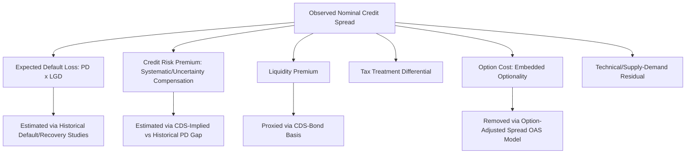

## Components of Credit Spread

### Overview

Credit spread is the yield differential between a credit-risky bond and a comparable-maturity risk-free benchmark (typically a government bond or swap rate). While often treated as a single number, the spread compensates investors for several distinct, separable risk premia, and decomposing it into its constituent components is essential for relative value analysis, understanding what drives spread changes, and correctly attributing portfolio performance.

### The Basic Spread Identity

**Key Points**

- The nominal (yield) spread of a corporate bond over a comparable Treasury is:

$$\text{Spread} = y_{corporate} - y_{Treasury}$$

- This nominal spread is a composite figure and does not by itself distinguish between compensation for expected credit losses, compensation for the uncertainty around those losses, compensation for illiquidity, and technical/structural factors unrelated to credit risk per se. Decomposing the spread into these components is necessary to assess whether a bond is fairly priced for the credit risk it carries or whether other factors (liquidity, taxation, embedded options) are driving the observed yield differential.

### Component 1: Expected Default Loss (Credit Risk Premium — Expected Component)

**Key Points**

- The portion of the spread that compensates for the statistically expected loss from default is a function of the **probability of default (PD)** and the **loss given default (LGD)**, where $LGD = 1 - \text{Recovery Rate}$:

$$\text{Expected Loss Spread} \approx PD \times LGD$$

- This component can, in principle, be estimated from historical default and recovery statistics for a given rating category (see rating agency transition/default studies) or from market-implied default probabilities backed out of CDS spreads.
- Under a risk-neutral pricing framework, the CDS spread (or bond spread, approximately) relates to the risk-neutral default intensity $\lambda$ and recovery rate $R$ via:

$$s \approx \lambda(1-R)$$

which allows practitioners to back out an implied risk-neutral default probability from an observed market spread, given an assumed recovery rate — though this **risk-neutral** probability is generally higher than the **real-world (physical)** probability of default estimated from historical rating agency statistics, precisely because market spreads also embed the risk premium components discussed below, not expected loss alone.

### Component 2: Credit Risk Premium (Unexpected/Uncertainty Component)

**Key Points**

- Beyond the statistically expected loss, investors demand additional compensation for **bearing the uncertainty** around that expected loss — the risk that realized defaults and losses could be worse than the historical average, particularly during systemic credit cycle downturns when defaults cluster and are correlated across issuers (a risk that is not diversifiable away, unlike idiosyncratic single-issuer default risk).
- This premium is analogous to the equity risk premium concept: just as equity investors demand compensation beyond the expected dividend/earnings stream for bearing systematic risk, credit investors demand a premium beyond expected loss for bearing the *systematic* component of credit risk (correlated with the broader business cycle and financial market conditions).
- Empirically, observed credit spreads have historically exceeded what would be implied by expected default losses alone by a substantial margin across most rating categories and time periods — a well-documented phenomenon in the credit literature sometimes referred to as the **credit spread puzzle**, with proposed explanations including compensation for jump-to-default risk (the risk of a sudden, discrete loss event rather than smooth diffusion), tax effects, liquidity premia, and risk-averse investor behavior around rare but severe credit events. [Inference: the precise magnitude of the "unexplained" premium varies across studies, time periods, and rating categories, and remains an active area of academic and practitioner research rather than a settled, universally agreed figure.]

### Component 3: Liquidity Premium

**Key Points**

- Corporate bonds are generally far less liquid than on-the-run government securities: wider bid-ask spreads, lower trading volumes, and greater price impact from large trades, all compensated via an additional yield premium.
- Liquidity premia are not static — they widen substantially during periods of market stress (a "flight to liquidity," distinct from but often coincident with "flight to quality"), when dealer balance sheet capacity contracts and investors demand a larger discount to hold less liquid instruments regardless of the issuer's actual credit quality.
- Liquidity premium can be roughly proxied empirically by comparing the spread of a corporate bond to the spread of a CDS contract referencing the same issuer (the **CDS-bond basis**): since CDS contracts are generally more liquid and standardized than the underlying cash bond, a persistent positive cash-bond-spread-minus-CDS-spread differential (positive basis) is often attributed partly to the cash bond's relative illiquidity, though the CDS-bond basis also reflects other technical factors (funding costs, counterparty risk in the CDS itself, restrictions on shorting the cash bond, and specific delivery/settlement conventions), so it should not be treated as a pure, clean liquidity measure in isolation. [Inference: basis interpretation requires care, as multiple technical factors beyond liquidity alone contribute to it.]

### Component 4: Tax Treatment Differences

**Key Points**

- In some jurisdictions and market segments, differing tax treatment between the credit-risky bond and the risk-free benchmark contributes to the observed spread independent of credit risk. The clearest example is **municipal bonds** in the U.S., where interest income is often exempt from federal (and sometimes state/local) income tax, causing municipal yields to trade at a lower level relative to their true credit risk than a taxable comparison would suggest — the reverse of a typical credit spread relationship, since the after-tax yield, not the stated coupon yield, is what should be compared to a taxable benchmark for relative value purposes.
- For most taxable corporate bonds, U.S. Treasury securities carry a specific tax advantage (exemption from state and local, though not federal, income tax) that a corporate bond does not share — meaning part of the observed Treasury-corporate spread can reflect this differential tax treatment rather than credit risk alone, though this effect is generally considered a smaller component than the default-risk and liquidity components for investment-grade corporates. [Inference: the precise magnitude of the tax component varies by investor tax bracket and jurisdiction and is difficult to estimate precisely for a heterogeneous investor base.]

### Component 5: Optionality and Structural Features

**Key Points**

- Bonds with embedded options (callable bonds, putable bonds, convertible bonds, or securitized products with prepayment optionality like MBS) trade at a **nominal spread** that reflects both credit risk and the value of the embedded option, which must be stripped out using **option-adjusted spread (OAS)** analysis to isolate the pure credit/liquidity component:

$$\text{Nominal Spread} = OAS + \text{Option Cost}$$

- For a callable bond, the option cost (the value of the issuer's right to call) is subtracted from the nominal spread to arrive at OAS, since the issuer's option is a cost to the bondholder; the OAS represents the spread the investor earns after removing this optionality effect, and is the appropriate basis for comparing bonds with different option structures on a like-for-like credit basis.
- Seniority, security (collateral), and covenant structure also affect the spread independent of the issuer's overall creditworthiness: subordinated debt of a given issuer will trade at a wider spread than senior secured debt of the same issuer, reflecting differing expected recovery rates in default rather than differing probability of default (since PD is generally an issuer-level, not instrument-level, characteristic, while LGD/recovery is instrument-specific based on seniority and collateral).

### Component 6: Supply/Demand and Market Technical Factors

**Key Points**

- Spreads are also influenced by technical factors unrelated to fundamental credit risk: index inclusion/exclusion flows (forced buying/selling by passive funds), new issue supply/concession dynamics (new bonds often price with a concession versus outstanding bonds to induce buyers to absorb new supply), and regulatory-driven demand (e.g., insurer or bank demand for specific sectors driven by capital treatment rather than pure valuation).
- These technical factors can cause spreads to deviate from "fair value" as implied by fundamental credit and liquidity analysis alone, creating relative value opportunities that active credit and sector rotation strategies (see earlier discussion) seek to exploit when technical distortions are expected to normalize.

### Illustrative Spread Decomposition

**Example**

A BBB-rated corporate bond trades at a nominal spread of 180bp over the comparable Treasury. A relative value analyst decomposes this spread using historical default/recovery data, a CDS-bond basis comparison, and an option-adjusted spread model (the bond has a make-whole call, a minimal option cost in this case):

| Component | Estimated Contribution (bp) |
| --- | --- |
| Expected default loss ($PD \times LGD$) | 35 |
| Credit risk premium (uncertainty/systematic risk) | 70 |
| Liquidity premium | 45 |
| Option cost (make-whole call, negligible) | 5 |
| Technical/supply-demand residual | 25 |
| **Total Nominal Spread** | **180** |

This decomposition suggests that less than 20% of the observed spread (35bp of 180bp) compensates for statistically expected credit losses, with the majority reflecting risk premium, illiquidity, and technical factors — a pattern broadly consistent with the empirical "credit spread puzzle" literature, though the specific proportions are illustrative and would need to be estimated using the analyst's own default/recovery assumptions and market data for any actual bond. [Inference: this decomposition is illustrative; in practice, precisely separating these components requires overlapping models (structural, reduced-form, and empirical) whose estimates typically differ, so any specific numerical decomposition carries meaningful model uncertainty.]

### Credit Spread Decomposition Diagram

### Related Topics

- Option-Adjusted Spread (OAS) Methodology for Callable and Putable Bonds
- CDS-Bond Basis Analysis and Arbitrage Considerations
- Structural Credit Models: Merton and Reduced-Form Frameworks
- Risk-Neutral vs Real-World Default Probability Estimation
- Recovery Rate Analysis by Seniority and Industry
- Credit Spread Puzzle: Academic Explanations and Evidence
- Municipal Bond Tax-Equivalent Yield Analysis