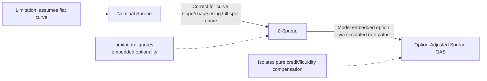

## Nominal Spread Z Spread and Option Adjusted Spread

### Overview

Nominal spread, zero-volatility spread (Z-spread), and option-adjusted spread (OAS) are three progressively more refined measures of the yield compensation a bond offers over a risk-free benchmark, each correcting a specific limitation of the prior measure. Understanding the distinctions is essential for accurate relative value comparison across bonds with different curve exposure and embedded optionality.

### Nominal Spread

**Key Points**

- The **nominal spread** is the simplest measure: the difference between a bond's yield-to-maturity (YTM) and the yield of a comparable-maturity benchmark (typically an on-the-run Treasury or interpolated point on the Treasury curve):

$$\text{Nominal Spread} = YTM_{bond} - YTM_{benchmark}$$

- **Key limitation**: nominal spread compares a single YTM figure (itself a single discount rate that equates all of the bond's cash flows to its price) against a single benchmark yield at one maturity point, ignoring the fact that the benchmark yield curve is not flat. This means nominal spread implicitly assumes the entire term structure is flat at the benchmark yield, which misstates the true spread whenever the yield curve has meaningful slope or curvature, since each of the bond's individual cash flows should properly be discounted at the risk-free rate corresponding to *its own* maturity, not a single blended rate.
- Nominal spread also fails to account for a bond's specific cash flow schedule (e.g., a bond with a sinking fund, an amortizing structure, or embedded optionality that could alter the timing of cash flows), since it collapses everything into a single YTM figure calculated on the bond's *stated* (contractual, non-optioned) cash flows.

### Z-Spread (Zero-Volatility Spread)

**Key Points**

- The **Z-spread** addresses the flat-curve limitation of nominal spread by using the entire spot (zero-coupon) Treasury curve, adding a single constant spread to every point on that curve such that the present value of the bond's cash flows, discounted at (spot rate + Z-spread) at each respective maturity, equals the bond's observed market price:

$$P = \sum_{t=1}^{n} \frac{CF_t}{(1 + z_t + Z)^t}$$

where $P$ is the bond's market price, $CF_t$ is the cash flow at time $t$, $z_t$ is the Treasury spot rate for maturity $t$, and $Z$ is the Z-spread (the single constant added uniformly across the curve, solved for iteratively/numerically so that the equation holds).

- Because it uses the full spot curve rather than a single point, the Z-spread is a more accurate measure of the "true" spread over the risk-free curve than the nominal spread, particularly for bonds with longer maturities or in curve environments with significant slope, where the nominal spread's flat-curve assumption introduces the most distortion.
- **Key limitation**: like nominal spread, the Z-spread is calculated using the bond's *stated* (contractual) cash flow schedule and therefore does not account for cash flows that are contingent on future interest rate paths — i.e., it ignores embedded optionality. For a bond with an embedded call, put, or prepayment option, the Z-spread calculated on the assumption that cash flows follow the stated schedule to stated maturity will misstate the spread an investor actually expects to earn, because the option holder's exercise decision will, in expectation, alter the realized cash flow timing.

### Option-Adjusted Spread (OAS)

**Key Points**

- **OAS** addresses the Z-spread's remaining limitation by explicitly modeling the embedded option's effect on cash flows across a large number of simulated future interest rate paths (typically via a binomial/lattice interest rate tree or Monte Carlo simulation calibrated to the current term structure and an assumed interest rate volatility), and then finding the constant spread that, when added to each simulated path's discount rates, makes the *average* present value across all paths equal to the bond's market price:

$$P = \frac{1}{N}\sum_{i=1}^{N} \sum_{t=1}^{n} \frac{CF_{t,i}(\text{path-dependent, incorporates option exercise})}{(1 + z_{t,i} + OAS)^t}$$

where the cash flows $CF_{t,i}$ on each simulated path $i$ reflect the option holder's expected exercise behavior along that specific path (e.g., an issuer calling a bond when rates have fallen enough to make refinancing economical, or a homeowner prepaying a mortgage), rather than assuming the bond's stated, non-optioned cash flow schedule.

- The relationship among the three measures for an option-embedded bond is:

$$\text{Nominal Spread} \geq \text{Z-Spread} \geq OAS \quad \text{(for a callable bond, typically)}$$

$$\text{Option Cost} = Z\text{-Spread} - OAS$$

- For a **callable bond** (issuer holds the option), the option has value to the issuer and is a cost to the bondholder, so OAS < Z-spread; the difference (the "option cost") represents the spread the investor is effectively giving up by holding a security in which the issuer can call the bond away when rates fall (precisely when the investor would otherwise most want to keep the higher-coupon bond).
- For a **putable bond** (investor holds the option), the option has value to the investor, so OAS > Z-spread; the investor is compensated with a *lower* nominal/Z-spread in exchange for the valuable right to put the bond back to the issuer if rates rise.
- For an **option-free bond** (no embedded optionality — e.g., a bullet Treasury or plain-vanilla bullet corporate bond), Z-spread and OAS are identical, since there is no option-driven cash flow uncertainty to model: $Z\text{-Spread} = OAS$.
- OAS is the appropriate spread measure for **relative value comparison across bonds with different or no optionality**, since it isolates the spread attributable to credit and liquidity risk alone, stripped of the confounding effect of option value — making it the standard metric used in professional fixed income relative value and portfolio management for any universe that includes callable corporates, MBS, or other option-embedded securities.

### Worked Numerical Illustration

**Example**

A 10-year callable corporate bond has a nominal YTM of 5.80%. The comparable on-the-run 10-year Treasury yields 4.50%, giving:

$$\text{Nominal Spread} = 5.80\% - 4.50\% = 130\text{bp}$$

Using the full Treasury spot curve (which is upward-sloping, so spot rates beyond 10 years and the curve's curvature affect the calculation), the analyst solves for the constant spread added to every point on the spot curve that reprices the bond's *stated* cash flows to its market price, obtaining:

$$Z\text{-Spread} = 122\text{bp}$$

(lower than the nominal spread here because the upward-sloping curve means later cash flows, when discounted at their own higher spot rates plus a smaller constant spread, still reproduce the same price — a typical, though not universal, directional relationship between nominal spread and Z-spread on an upward-sloping curve).

The analyst then runs an interest rate lattice model with an assumed volatility assumption, simulating the issuer's expected call behavior across many interest rate paths, and solves for the constant spread that reprices the bond given path-dependent (optioned) cash flows:

$$OAS = 95\text{bp}$$

$$\text{Option Cost} = Z\text{-Spread} - OAS = 122 - 95 = 27\text{bp}$$

This means 27bp of the bond's Z-spread compensates the investor purely for having granted the issuer a call option, and the "clean" credit/liquidity compensation the investor is actually earning is 95bp, not the headline 130bp nominal spread — a materially different conclusion for relative value purposes, since comparing this bond's 130bp nominal spread against a *non-callable* bond's spread would overstate this bond's relative attractiveness by conflating option cost with credit/liquidity compensation. [Inference: the specific numerical relationship between nominal spread, Z-spread, and OAS shown is illustrative; actual values depend on the specific curve shape, bond cash flow schedule, call schedule, and volatility assumption used in the model, and OAS in particular is sensitive to the assumed interest rate volatility input, so two analysts using different volatility assumptions can derive different OAS values for the identical bond.]

### Sensitivity of OAS to Volatility Assumptions

**Key Points**

- Because OAS models explicitly incorporate an assumed interest rate volatility parameter to generate the simulated rate paths, the resulting OAS is sensitive to that assumption: a **higher assumed volatility increases the modeled value of the embedded option** (both call and put options increase in value with higher volatility, consistent with general option theory), which for a callable bond means a higher assumed volatility produces a *lower* OAS (since a more valuable option implies a larger option cost being subtracted from the Z-spread), all else equal.
- This volatility sensitivity means OAS-based relative value comparisons should ideally use a **consistent volatility assumption across all bonds being compared**, since using different volatility inputs for different bonds can create the *appearance* of relative value differences that are actually artifacts of inconsistent modeling assumptions rather than genuine differences in credit/liquidity compensation.
- **Effective duration and effective convexity** — the appropriate duration/convexity measures for option-embedded bonds — are calculated as a byproduct of the same OAS lattice model, by shocking rates up and down and observing the resulting price change *while holding OAS constant* (i.e., allowing the option-exercise behavior to change appropriately along each shocked path), in contrast to modified duration, which assumes fixed, non-optioned cash flows and is therefore an inappropriate and potentially misleading measure for bonds with significant embedded optionality.

### Comparative Summary

| Measure | Curve Used | Accounts for Optionality? | Best Use Case |
| --- | --- | --- | --- |
| Nominal Spread | Single point (flat assumption) | No | Quick, approximate comparison; least accurate |
| Z-Spread | Full spot curve | No | Option-free bonds; more accurate than nominal spread across curve shapes |
| OAS | Full spot curve + simulated rate paths | Yes | Bonds with embedded options (callable, putable, MBS); standard for cross-security relative value |

### Spread Measure Progression Diagram

### Related Topics

- Effective Duration and Effective Convexity for Option-Embedded Bonds
- Binomial Interest Rate Trees and Lattice-Based Bond Valuation
- Components of Credit Spread: Default Risk, Liquidity, and Technical Factors
- Mortgage-Backed Securities: Prepayment Modeling and OAS Application
- Callable and Putable Bond Structures and Issuer/Investor Option Value
- Interest Rate Volatility Assumptions in Fixed Income Valuation Models
- Relative Value Analysis Across Bonds with Differing Optionality