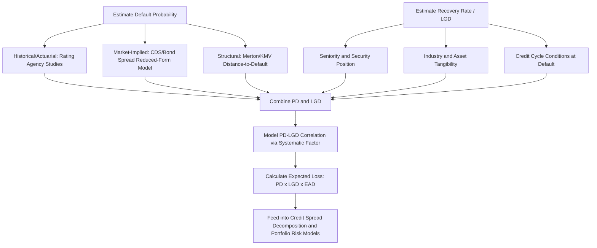

## Default Probability and Recovery Rate Analysis

### Overview

Default probability and recovery rate are the two fundamental inputs to quantifying credit risk and expected loss. Default probability measures the likelihood that an issuer fails to meet its debt obligations, while recovery rate measures the fraction of exposure a creditor recoups after default. Together they determine expected loss and underpin credit spread analysis, portfolio credit risk modeling, and regulatory capital calculations.

### Expected Loss Framework

**Key Points**

- The foundational relationship linking default probability, recovery, and expected credit loss is:

$$EL = PD \times LGD \times EAD$$

where $EL$ is expected loss, $PD$ is the probability of default over a given horizon, $LGD$ (loss given default) is $1 - \text{Recovery Rate}$, and $EAD$ is exposure at default (the outstanding amount at risk at the time of default, relevant for revolving facilities or amortizing instruments where exposure changes over time).

- For a standard fixed-rate bond, $EAD$ is generally the bond's face value (par) plus accrued interest, since bond exposure does not fluctuate the way a revolving credit facility's drawn balance might.
- This framework underlies both the "expected loss" component of credit spread decomposition (see earlier discussion) and regulatory credit risk capital frameworks (e.g., Basel's Internal Ratings-Based approach for banks), which use PD, LGD, and EAD as the three core risk parameters.

### Measuring Default Probability

**Key Points**

- **Historical/actuarial (real-world) default probability**: estimated from large historical datasets of rated issuers, typically published by rating agencies as **cumulative default rate studies** segmented by initial rating category and time horizon (e.g., the historical probability that a BB-rated issuer defaults within 5 years). These are **through-the-cycle** estimates that smooth over multiple credit cycles and represent the physical/actuarial (not risk-neutral) probability.
- **Market-implied (risk-neutral) default probability**: derived from observable market prices — either CDS spreads or bond spreads — using a reduced-form pricing model. From the approximate CDS spread relationship discussed earlier:

$$s \approx \lambda(1-R)$$

solving for the implied default intensity $\lambda$ (and converting to a cumulative default probability over the relevant horizon) gives the market's implied risk-neutral default probability, given an assumed recovery rate $R$.

- **Structural models (Merton/KMV framework)**: model default as occurring when a firm's asset value falls below its debt obligations at a future date, treating the firm's equity as analogous to a call option on its assets (with the strike price equal to the face value of debt). Using observed equity price, equity volatility, and the firm's capital structure, the model backs out an implied **distance-to-default** and corresponding default probability. This approach is forward-looking and market-based (like the CDS-implied approach) but derives its signal from the equity market rather than the credit market directly, allowing cross-validation between the two.
- **Critical distinction**: risk-neutral (market-implied) PDs are almost always higher than real-world (historical/actuarial) PDs for the same issuer and horizon, because market-implied measures embed the credit risk premium (compensation for bearing systematic, undiversifiable credit risk) in addition to expected loss — this is the same conceptual point underlying the credit spread puzzle discussed in the spread components topic, viewed from the PD side rather than the spread side.

### Cumulative vs. Marginal Default Probability

**Key Points**

- **Marginal (conditional) default probability**: the probability of default in a specific period, *conditional on having survived* to the start of that period (e.g., the probability of default in year 3, given the issuer has not defaulted in years 1 or 2).
- **Cumulative default probability**: the probability of default by a given horizon, accounting for the possibility of default in any prior period. The relationship between cumulative default probability $Q(t)$ and the survival probability $S(t) = 1 - Q(t)$ over successive periods with marginal default probabilities $q_1, q_2, ..., q_n$ is:

$$S(n) = \prod_{i=1}^{n}(1 - q_i)$$

$$Q(n) = 1 - S(n)$$

**Example**

An issuer has estimated annual marginal default probabilities of 1.5% in year 1, 2.0% in year 2, and 2.5% in year 3 (marginal probabilities typically rise for lower-quality issuers as historical uncertainty compounds, though the specific pattern varies by rating and issuer).

Survival probability through 3 years:

$$S(3) = (1 - 0.015)(1 - 0.020)(1 - 0.025) = 0.985 \times 0.980 \times 0.975 = 0.9414$$

Cumulative 3-year default probability:

$$Q(3) = 1 - 0.9414 = 5.86\%$$

Note that simply summing the marginal probabilities (1.5% + 2.0% + 2.5% = 6.0%) overstates the true cumulative probability (5.86%), because it double-counts the possibility of default in a later year for an issuer that has already defaulted earlier — the correct calculation must use the survival-probability compounding approach, not simple addition. [Inference: illustrative marginal probabilities; actual figures for a specific issuer/rating should be sourced from current rating agency or market-implied data.]

### Recovery Rate Analysis

**Key Points**

- Recovery rate is the percentage of a bond's face value (or, in market-based recovery conventions, its pre-default trading price) that a creditor receives following default, either through the reorganization/settlement process or via the price at which distressed debt trades shortly after a default event (the latter, "trading price" convention, is standard for CDS settlement).
- **Key determinants of recovery rate**:
  - **Seniority and security**: senior secured debt has historically recovered more, on average, than senior unsecured, which in turn recovers more than subordinated debt, reflecting priority of claims in bankruptcy (the "absolute priority rule," though actual outcomes in practice can deviate from strict absolute priority due to negotiated settlements).
  - **Industry**: recovery rates vary meaningfully by industry, generally correlating with the extent to which the industry has tangible, readily saleable assets (e.g., asset-heavy industries like utilities or real estate have historically shown different recovery patterns than asset-light industries like technology or services) — [Unverified: specific comparative industry recovery figures vary across studies and time periods and should be checked against current rating agency recovery studies rather than assumed as fixed].
  - **Economic/credit cycle conditions at time of default**: recovery rates tend to be lower during systemic, economy-wide default waves (when many issuers across an industry default simultaneously and the market for distressed assets/collateral is oversupplied) than during idiosyncratic, issuer-specific defaults — this creates a **negative correlation between default rates and recovery rates**, an important and empirically well-documented feature that amplifies portfolio credit losses precisely when default rates are already elevated.
  - **Debt cushion**: the amount of subordinated debt and equity "beneath" a given tranche in the capital structure provides a buffer; more subordination beneath senior debt generally supports higher expected recovery for that senior tranche.

### PD-LGD Correlation and Its Portfolio Implications

**Key Points**

- Because recovery rates tend to fall precisely when default rates rise (both driven by the same underlying systemic credit cycle deterioration), a simple expected loss calculation using long-run average PD and long-run average LGD independently can **understate** the loss experienced during actual stress periods, since it does not capture this negative correlation.
- More sophisticated portfolio credit risk models (e.g., stress-testing frameworks, CreditMetrics-style simulation approaches) explicitly model this PD-LGD correlation, often by conditioning both parameters on a common systematic factor representing the state of the credit cycle, so that simulated stress scenarios simultaneously produce elevated default rates and depressed recovery rates, better capturing tail risk than treating the two parameters as independent.

### Illustrative Recovery Rate Comparison by Seniority

**Example**

Following a hypothetical issuer default, the estimated ultimate recovery rates by seniority tranche might be:

| Seniority | Illustrative Recovery Rate |
| --- | --- |
| Senior Secured | 65% |
| Senior Unsecured | 40% |
| Senior Subordinated | 25% |
| Subordinated | 15% |

For a portfolio holding $10mm face value of the senior unsecured tranche:

$$EL = PD \times LGD \times EAD = 0.04 \times (1 - 0.40) \times \$10\text{mm} = 0.04 \times 0.60 \times \$10\text{mm} = \$240{,}000$$

versus, for the same $10mm exposure held in the subordinated tranche of the same issuer (same PD, since default probability is generally issuer-level, but materially different LGD):

$$EL = 0.04 \times (1 - 0.15) \times \$10\text{mm} = 0.04 \times 0.85 \times \$10\text{mm} = \$340{,}000$$

This illustrates why instrument-level spread differences across an issuer's capital structure primarily reflect differing LGD/recovery expectations rather than differing default probability — a point directly relevant to the earlier discussion of issue-specific rating notching. [Inference: illustrative recovery figures and PD; actual figures depend on issuer, industry, jurisdiction, and prevailing credit cycle conditions at the time of any actual default.]

### Default and Recovery Analysis Framework

### Related Topics

- Structural Credit Models: Merton and KMV Distance-to-Default
- Credit Spread Decomposition: Expected Loss vs Risk Premium Components
- Rating Agency Transition Matrices and Cumulative Default Studies
- CreditMetrics and Portfolio Credit Value-at-Risk Modeling
- Basel Internal Ratings-Based (IRB) Approach: PD, LGD, and EAD Parameters
- Absolute Priority Rule and Capital Structure Seniority Analysis
- CDS Pricing and Implied Default Intensity Models