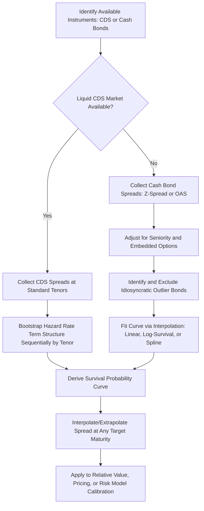

## Credit Curve Construction

### Overview

A credit curve maps credit spreads (or, equivalently, implied default probabilities) across maturities for a given issuer or homogeneous credit segment, analogous to how a yield curve maps interest rates across maturities. Credit curve construction is the process of building this term structure from observable market instruments — CDS contracts or cash bonds — and is foundational to relative value analysis, pricing illiquid or off-the-run instruments, and calibrating credit risk models.

### Why Credit Curves Are Needed

**Key Points**

- A single issuer typically has bonds or CDS contracts outstanding at only a handful of discrete maturity points (e.g., 5-year and 10-year CDS, or bonds maturing in 3, 7, and 15 years), but analysts frequently need a spread or default probability estimate at maturities where no directly observable instrument exists (e.g., pricing a new 8-year bond issue, or valuing a position at an odd maturity date) — credit curve construction provides the interpolation/extrapolation framework to do this consistently.
- Credit curves also reveal the market's expectations about how default risk evolves over time for a given issuer: an **upward-sloping credit curve** (spreads widen with maturity) is typical for stable, higher-quality issuers, reflecting the natural accumulation of cumulative default risk over a longer horizon; an **inverted (downward-sloping) credit curve** (short-maturity spreads higher than long-maturity spreads) signals elevated near-term distress risk relative to longer-term risk — a pattern commonly observed for issuers under acute financial stress, where the market prices a high probability of default or restructuring within a short window, with the surviving/restructured entity considered less risky further out.

### Building a Credit Curve from CDS Spreads

**Key Points**

- CDS contracts are the preferred instrument for credit curve construction where liquid CDS markets exist (primarily large corporate and sovereign issuers), because CDS spreads are cleaner, more standardized (fixed coupon/quoted spread conventions, standardized maturity dates), and generally more liquid than the issuer's cash bonds, avoiding the cash-bond complications of differing coupons, embedded options, and idiosyncratic liquidity across specific bond issues.
- The standard approach uses a **reduced-form (intensity-based) model**: the CDS market quotes spreads at standard tenors (commonly 1, 3, 5, 7, and 10 years), and a **bootstrapping procedure** is used to extract a term structure of default intensities (hazard rates) consistent with all observed CDS spreads simultaneously.
- The bootstrapping proceeds sequentially from the shortest maturity outward: the 1-year CDS spread is used to solve for the default intensity over year 1 (assuming a recovery rate assumption, often a standard convention like 40% for senior unsecured corporate CDS); then, holding that year-1 intensity fixed, the 3-year CDS spread is used to solve for the intensity applicable to years 2–3; this process repeats sequentially outward, so that each successive CDS tenor's spread is used only to solve for the *incremental* (forward) hazard rate for the new maturity segment, given the previously bootstrapped shorter-tenor intensities.
- This bootstrapped hazard rate term structure can then be converted into a full survival probability curve $S(t) = \exp(-\int_0^t \lambda(s)ds)$ (or the discrete-time equivalent using the compounding relationship discussed in the default probability topic) at any maturity, from which a fitted CDS or bond spread at any interpolated maturity can be derived.

### Building a Credit Curve from Cash Bond Spreads

**Key Points**

- When liquid CDS is unavailable (common for smaller or less-followed issuers), the credit curve must be constructed directly from the issuer's outstanding cash bonds, using each bond's Z-spread (or OAS, for bonds with embedded options) plotted against maturity.
- **Key challenges specific to cash-bond-based curve construction**:
  - **Sparse and uneven maturity points**: an issuer may have only 2–4 bonds outstanding, at irregular maturity intervals, requiring interpolation methods (linear interpolation on spread, or more sophisticated spline-based methods) to fill gaps, with wider gaps between observed points producing greater interpolation uncertainty.
  - **Heterogeneous seniority/structure**: if the issuer's outstanding bonds span different seniority levels (senior secured vs. senior unsecured) or have different embedded features (callable vs. bullet), the raw spreads are not directly comparable and must be adjusted (e.g., via OAS to remove option effects, and via seniority-based notching adjustments) before being used to construct a single consistent curve.
  - **Idiosyncratic liquidity/technical effects**: a specific bond may trade cheap or rich to the issuer's broader curve due to bond-specific technical factors (e.g., a benchmark-sized issue favored by index funds, or a small, illiquid issue that trades at a persistent premium/discount) unrelated to the issuer's underlying credit risk — analysts typically identify and exclude or down-weight such outlier bonds when fitting the curve, since including them would distort the fitted curve's shape.
- Given these challenges, cash-bond-based curves are generally considered noisier and less reliable than CDS-based curves where both are available, and practitioners often use the CDS curve as the primary reference, checking cash bonds against it to identify specific bonds that appear rich or cheap relative to the issuer's overall CDS-implied credit curve (a common cash-versus-CDS relative value trade).

### Interpolation and Extrapolation Methods

**Key Points**

- **Linear interpolation on spread**: the simplest method, drawing a straight line between two observed spread points and reading off the spread at any intermediate maturity — computationally simple but can produce an unrealistic, kinked curve shape at the observed data points (a discontinuity in the curve's slope, i.e., its second derivative).
- **Linear interpolation on the log of survival probability** (equivalent to assuming a piecewise-constant hazard rate between observed tenors): a common alternative that ensures the resulting survival probability curve is smooth and monotonically decreasing (a mathematically necessary property, since cumulative default probability cannot decrease with time), which flat/simple linear interpolation on spread does not automatically guarantee, particularly with sparse or unevenly spaced data points.
- **Spline-based methods** (cubic splines, monotone-preserving splines): fit a smooth curve through observed points with continuous first and second derivatives, producing a more visually and analytically smooth curve shape than simple linear interpolation, at the cost of greater computational complexity and the risk of introducing spurious oscillation between sparse data points if not carefully constrained (e.g., using a monotone spline variant to avoid the curve dipping below zero or oscillating unrealistically between two widely spaced input points).
- **Extrapolation beyond the longest observed maturity** (e.g., estimating a 20-year credit spread for an issuer whose longest outstanding bond/CDS matures in 10 years) is inherently less reliable than interpolation between observed points, and practitioners typically apply either a flat extension of the longest observed forward hazard rate or a curve-shape assumption borrowed from a comparable, more liquid issuer's curve (a peer/comparable-based extrapolation approach), flagging any such extrapolated values as carrying materially greater uncertainty than interpolated values.

### Illustrative Bootstrapped Credit Curve

**Example**

An issuer's CDS market quotes the following spreads (assuming a standard 40% recovery rate convention):

| Tenor | Quoted CDS Spread |
| --- | --- |
| 1yr | 45bp |
| 3yr | 65bp |
| 5yr | 85bp |
| 7yr | 100bp |
| 10yr | 120bp |

The upward-sloping pattern here (spreads rising with maturity) is consistent with a stable, non-distressed issuer, where the bootstrapping procedure would extract successively higher *forward* hazard rates for the years-8-through-10 segment than for the years-1-through-3 segment, reflecting the market pricing greater cumulative uncertainty further into the future.

[Inference: illustrative spread levels; a fully worked bootstrap would require specifying the CDS premium payment conventions, day-count basis, and running the iterative solving procedure explicitly, which depends on the specific CDS contract standard (e.g., ISDA Standard North American/European CDS conventions) in effect.]

By contrast, a distressed issuer's curve might show:

| Tenor | Quoted CDS Spread |
| --- | --- |
| 1yr | 1200bp |
| 3yr | 950bp |
| 5yr | 800bp |

This inverted shape signals the market pricing a high near-term probability of a default or restructuring event, with spreads for the (relatively few) scenarios in which the issuer survives past that near-term window pricing a lower ongoing risk thereafter — the classic signature of acute, near-term distress rather than a gradually deteriorating but currently stable credit.

### Credit Curve Construction Process

### Credit Curve Shapes Illustration (svg_diagram)

<svg xmlns="http://www.w3.org/2000/svg" viewBox="0 0 700 400">
\<style\>
.lbl { font-family: Arial, sans-serif; font-size: 13px; fill: #222; }
.title { font-family: Arial, sans-serif; font-size: 16px; font-weight: bold; fill: #111; }
.axis { stroke: #444; stroke-width: 1.5; }
.normal { stroke: #2166ac; stroke-width: 2.5; fill: none; }
.inverted { stroke: #b2182b; stroke-width: 2.5; fill: none; }
\</style\>
<text x="150" y="30" class="title">Normal vs Inverted Credit Curves (svg_diagram)</text>
<line x1="80" y1="330" x2="640" y2="330" class="axis" />
<line x1="80" y1="330" x2="80" y2="60" class="axis" />
<text x="330" y="370" class="lbl">Maturity →</text>
<text x="30" y="200" class="lbl" transform="rotate(-90 30 200)">Spread →</text>
<path d="M 100 300 Q 300 260 580 150" class="normal" />
<path d="M 100 100 Q 300 180 580 250" class="inverted" />
<text x="420" y="140" class="lbl" fill="#2166ac">Normal: Stable Issuer</text>
<text x="420" y="270" class="lbl" fill="#b2182b">Inverted: Distressed Issuer</text>
</svg>

### Related Topics

- CDS Pricing and the Bootstrapping Methodology in Detail
- Cash-CDS Basis Trading and Relative Value Analysis
- Nominal Spread, Z-Spread, and OAS Distinctions Revisited
- Survival Probability Curves and Hazard Rate Modeling
- Distressed Debt Analysis and Inverted Curve Interpretation
- Sovereign Credit Curves and CDS Conventions
- Spline Interpolation Methods for Term Structure Modeling