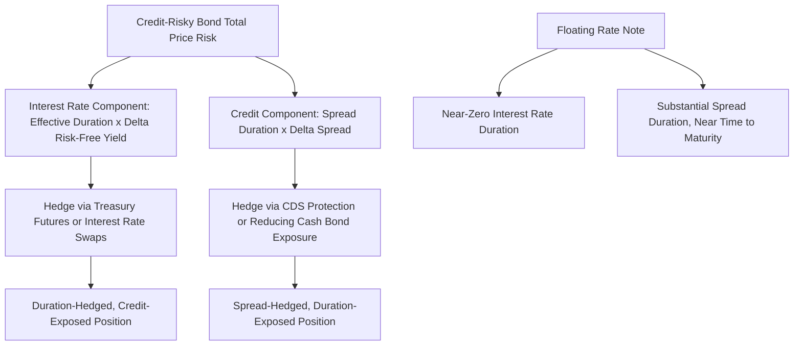

## Spread Duration and Credit Sensitivity

### Overview

Spread duration measures a bond's price sensitivity to changes in its credit spread, holding the underlying risk-free rate constant — distinct from interest rate duration, which measures sensitivity to changes in the risk-free rate itself. This distinction is essential for accurately decomposing and managing the two separate risk factors (rate risk and credit risk) that jointly determine a credit-risky bond's total price behavior.

### Defining Spread Duration

**Key Points**

- Spread duration ($SD$) is defined analogously to interest rate duration, but with respect to a shift in spread ($\Delta s$) rather than a shift in the risk-free yield level ($\Delta y$):

$$SD = -\frac{1}{P}\frac{\partial P}{\partial s}$$

Approximated numerically (analogous to effective duration) as:

$$SD \approx \frac{P_{-} - P_{+}}{2 \times P_0 \times \Delta s}$$

where $P_-$ and $P_+$ are the bond's prices after a downward and upward shock to the spread (holding the risk-free curve fixed), respectively, and $\Delta s$ is the size of the spread shock used.

- **For a fixed-rate, option-free bond**, spread duration is numerically equal to the bond's ordinary (interest rate) effective duration, since both a parallel shift in the risk-free curve and a shift in the credit spread affect the bond's discount rate identically — a 10bp increase in the risk-free rate and a 10bp increase in credit spread produce the same price impact on an option-free fixed-rate bond, because both raise the total discount rate applied to the same fixed cash flows by the same amount.
- **For bonds with embedded options** (callable/putable corporates, MBS), spread duration and interest rate (effective) duration **diverge**, because a change in the risk-free rate level affects the value of the embedded option (altering the probability and timing of exercise) in addition to affecting the discount rate, whereas a pure change in credit spread does not typically affect the risk-free-rate-driven option exercise decision in the same way — this is a critical distinction for portfolios holding option-embedded credit securities.
- **For floating-rate notes (FRNs)**, interest rate duration is very low (close to zero, since the coupon resets periodically to track the reference rate, largely insulating the bond's price from risk-free rate changes between reset dates), but **spread duration for an FRN can be substantial** — often close to the bond's time to maturity — because the credit spread over the reference rate is typically fixed for the life of the bond (or reset infrequently), so a change in the market's required credit spread for that issuer affects the FRN's price much like it would a fixed-rate bond's price, even though rate risk is minimal. This makes FRNs a useful instrument for isolating credit exposure while minimizing interest rate exposure.

### Why the Distinction Matters: Decomposing Total Price Risk

**Key Points**

- A credit-risky bond's total price sensitivity can be decomposed into two additive components corresponding to the two separate risk factors:

$$\Delta P \approx -D_{eff} \times P \times \Delta y_{risk\text{-}free} - SD \times P \times \Delta s$$

where $D_{eff}$ is effective (interest rate) duration and $\Delta y_{risk\text{-}free}$ is the change in the risk-free benchmark yield, while $SD$ and $\Delta s$ capture the separate credit spread channel.

- This decomposition allows a portfolio manager to independently manage rate risk and credit/spread risk — for example, hedging out interest rate duration using Treasury futures or swaps (which have no credit spread exposure) while retaining the desired spread duration exposure to express a specific credit view, or vice versa (hedging spread risk via CDS while retaining a desired duration/rate view).
- **Example distinction in practice**: two bonds can have identical effective duration (say, 5.0) but very different spread durations if one is a fixed-rate bullet corporate (spread duration also ≈ 5.0) and the other is a callable bond whose effective duration has been shortened by option-related negative convexity to 3.0 while its spread duration (calculated via the OAS lattice model, holding OAS constant while shocking the risk-free curve for effective duration, versus shocking spread directly for spread duration) might differ from 3.0 — the two measures are calculated via distinct shock mechanisms within the same option-adjusted framework and need not move in lockstep.

### Portfolio Spread Duration and Aggregation

**Key Points**

- At the portfolio level, spread duration contribution is calculated per-security and aggregated using market-value weights, analogous to how portfolio effective duration is calculated:

$$SD_{portfolio} = \sum_i w_i \times SD_i$$

- This aggregate figure is the key risk metric used in the sector rotation and credit barbell framework discussed earlier: when a manager decides to overweight high yield or underweight BBB corporates, the *sizing* of that decision in risk terms (not just notional terms) is properly expressed via spread duration contribution, since two sectors with different average spread durations require different notional overweights to achieve the same *risk* overweight.
- Spread duration can also be decomposed by **credit quality bucket** or **sector** (analogous to key rate duration decomposition for interest rate risk), producing a portfolio's spread duration profile across, e.g., AAA, AA, A, BBB, and high yield tiers — this decomposition is the basis for the ex-ante tracking error models discussed in the benchmark selection topic, where "credit quality" risk factor contributions are essentially spread-duration-weighted exposure differences between the portfolio and benchmark at each quality tier.

### Worked Example: Spread Duration Impact Calculation

**Example**

A portfolio holds $50mm of a BBB corporate bond with spread duration of 6.2 and $30mm of a high-yield (B-rated) bond with spread duration of 3.8. The credit cycle deteriorates: BBB spreads widen by 25bp and B-rated spreads widen by 80bp (consistent with the empirical pattern that lower-quality spreads move by a larger magnitude in absolute terms during stress, since they start from a higher base and carry more systematic/cyclical sensitivity).

Price impact on the BBB position:

$$\Delta P_{BBB} \approx -SD \times P \times \Delta s = -6.2 \times \$50\text{mm} \times 0.0025 = -\$775{,}000$$

Price impact on the B-rated position:

$$\Delta P_{B} \approx -3.8 \times \$30\text{mm} \times 0.0080 = -\$912{,}000$$

Total mark-to-market credit loss from spread widening alone (holding the risk-free curve fixed): $\$775{,}000 + \$912{,}000 = \$1{,}687{,}000$, or roughly 2.1% of the combined $80mm position — despite the high-yield position being less than half the notional size of the BBB position, it contributes a larger dollar loss because its much larger spread move (80bp vs. 25bp) more than offsets its lower spread duration (3.8 vs. 6.2). [Inference: illustrative spread duration and spread-widening figures; actual sensitivities and realized spread moves during any specific credit event depend on the issuer, sector, and severity of the specific stress episode.]

### Spread Duration vs. Interest Rate Duration: Hedging Implications

**Key Points**

- A manager wishing to reduce **interest rate risk** while retaining **credit exposure** (a common posture for a manager with a positive credit view but a defensive rate view, e.g., expecting central bank tightening) would sell Treasury futures or pay fixed on an interest rate swap to reduce $D_{eff}$ toward zero, while leaving the underlying corporate bond positions (and their spread duration) intact — this is a duration-hedged credit position.
- Conversely, a manager wishing to reduce **credit risk** while retaining **interest rate exposure** (e.g., a manager who wants rate exposure but is concerned about credit spread widening in a specific sector) would buy CDS protection (or reduce cash bond holdings) to reduce spread duration, while maintaining the position's interest rate duration via Treasuries or swaps — this is a spread-hedged (or "duration-neutral, credit-hedged") position.
- These two hedging approaches are only cleanly separable because spread duration and interest rate duration are conceptually and empirically distinct risk factors (as established above); if a manager mistakenly treated a bond's total effective duration as fully representative of its credit risk, or attempted to hedge credit risk using only interest rate instruments, the hedge would fail to offset the actual spread-driven component of the position's risk.

### Spread Duration Concept Diagram

### Related Topics

- Effective Duration and Effective Convexity for Option-Embedded Bonds
- Credit Default Swap Hedging and Basis Trading
- Sector Rotation and Credit Barbell Strategies Revisited
- Tracking Error Decomposition: Credit Quality Factor Contributions
- Floating Rate Notes and Spread Duration Isolation Strategies
- Total Return Attribution: Separating Rate and Spread Effects
- Portfolio Credit Risk Aggregation Across Quality Tiers