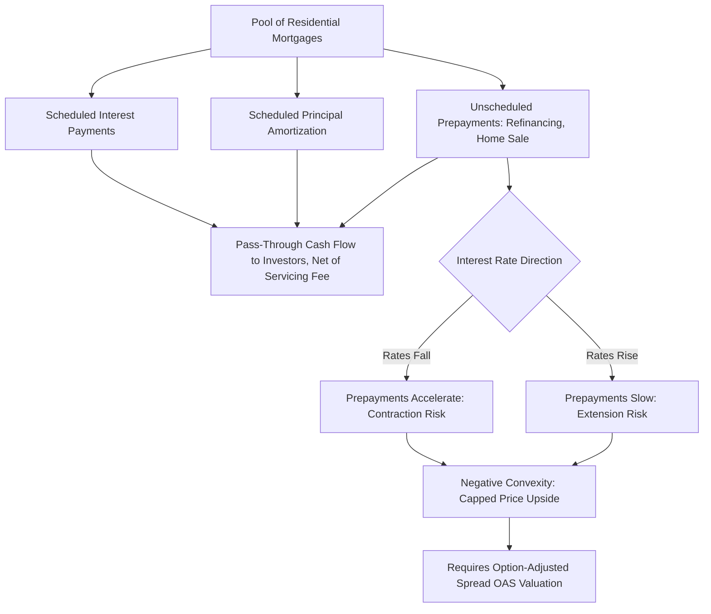

## Mortgage Backed Securities Fundamentals

### Overview

Mortgage-backed securities (MBS) are fixed income instruments backed by a pool of residential or commercial mortgage loans, whose cash flows (principal and interest) pass through to investors, subject to the credit and prepayment behavior of the underlying borrowers. MBS represent one of the largest and most liquid sectors of the global fixed income market and introduce prepayment risk as a distinct analytical dimension not present in standard corporate or government bonds.

### Basic MBS Structure

**Key Points**

- The fundamental MBS structure is the **pass-through security**: a pool of mortgages is assembled by an originator or government-sponsored entity, and the pooled principal and interest cash flows (net of a servicing fee) are passed through pro rata to investors holding certificates representing an undivided interest in the pool.
- **Agency MBS**: issued or guaranteed by U.S. government-sponsored entities (GSEs) — Fannie Mae and Freddie Mac — or the wholly government-owned Ginnie Mae, which guarantees MBS backed by FHA/VA loans. Agency MBS carry a guarantee against credit/default loss (explicit U.S. government guarantee for Ginnie Mae; implicit government backing, historically treated by the market as near-riskless from a credit perspective, for Fannie Mae and Freddie Mac since being placed into conservatorship in 2008), meaning agency MBS investors are exposed primarily to **prepayment risk**, not credit/default risk.
- **Non-agency (private-label) MBS**: issued by private financial institutions without a GSE or government guarantee, exposing investors to both prepayment risk and genuine credit/default risk from the underlying mortgage pool, and typically structured with credit enhancement (subordination, overcollateralization) to protect senior tranches — a structure explored further under CMOs/structured tranching.

### The Mortgage Cash Flow Mechanics

**Key Points**

- A standard fixed-rate, fully amortizing mortgage generates a level (constant) total monthly payment over its term, but the composition of that payment shifts over time: early payments are weighted heavily toward interest (since the outstanding principal balance is largest early in the loan's life), while later payments are weighted increasingly toward principal — this standard amortization schedule underlies the "scheduled" principal component of MBS cash flows, distinct from unscheduled (prepayment-driven) principal.
- Beyond scheduled amortization, MBS cash flows include **prepayments**: unscheduled principal repayments occurring when borrowers pay off their mortgages faster than the contractual schedule requires, whether through refinancing, home sale, or (in a small proportion of cases) outright payoff from other sources.
- Total monthly cash flow to MBS holders = scheduled interest + scheduled principal (amortization) + unscheduled principal (prepayments) − servicing/guarantee fees.

### Prepayment Risk: The Defining Feature of MBS

**Key Points**

- **Prepayment risk** is the risk that the actual timing of principal repayment differs from the contractual schedule, driven primarily by the borrower's economic incentive to refinance when prevailing mortgage rates fall meaningfully below their existing loan's rate, but also by non-rate-driven factors: home sales (relocation, upsizing/downsizing), and (in a minority of cases) default/foreclosure resulting in principal recovery.
- **Negative convexity**: because falling interest rates trigger *higher* prepayments (accelerating return of principal precisely when reinvestment rates have fallen), and rising rates trigger *lower* prepayments (extending the security's effective duration precisely when rates — and thus the opportunity cost of being in a lower-yielding, longer instrument — have risen), MBS price appreciation is capped on the upside (as rates fall) relative to an equivalent-duration option-free bond, while price depreciation is *not* similarly limited on the downside (as rates rise) — this asymmetric behavior is the defining risk characteristic of pass-through MBS and is why MBS require option-adjusted spread (OAS) analysis (see earlier discussion) rather than simple nominal yield or duration measures.
- **Extension risk** and **contraction risk** are the two directional manifestations of this negative convexity: extension risk is the risk that rising rates slow prepayments, extending the security's average life beyond what was expected at purchase (locking the investor into a below-market coupon for longer than anticipated); contraction risk is the risk that falling rates accelerate prepayments, shortening average life and forcing reinvestment of returned principal at the new, lower prevailing rates.

### Prepayment Modeling Conventions

**Key Points**

- **Conditional Prepayment Rate (CPR)**: an annualized rate expressing the percentage of the outstanding mortgage pool balance expected to prepay over the next year, given current conditions — a CPR of 6% means approximately 6% of the remaining pool balance is expected to prepay (beyond scheduled amortization) over the coming year.
- **Single Monthly Mortality (SMM)**: the monthly equivalent of CPR, related by:

$$SMM = 1 - (1 - CPR)^{1/12}$$

- **PSA (Public Securities Association) Standard Prepayment Model**: a widely used market convention benchmark curve, expressed as a percentage of "100% PSA," which assumes CPR starts at 0.2% in month 1 and increases linearly by 0.2% each month until reaching 6% CPR in month 30, then remains flat at 6% CPR for the remaining life of the pool. A pool assumed to prepay at "150% PSA" scales this entire curve by 1.5x (i.e., ramping to 9% CPR by month 30, then flat at 9%), providing a standardized shorthand for expressing prepayment speed assumptions relative to this benchmark curve rather than specifying a full custom prepayment vector.
- Modern prepayment models used by dealers and analytics vendors are considerably more sophisticated than the stylized PSA benchmark, incorporating loan-level characteristics (borrower credit score, loan-to-value ratio, loan size, geographic location), the specific coupon's "moneyness" relative to prevailing refinance rates (the primary driver of refinancing incentive), seasoning (loan age) effects, seasonality (home sales patterns), and burnout (the empirically observed phenomenon that a pool's prepayment speed slows over time even at a constant rate incentive, as the borrowers most inclined and able to refinance have already done so, leaving a residual population that is systematically less responsive) — [Inference: the PSA benchmark remains a standard quoting/communication convention across the industry, but actual valuation and risk management rely on these more granular proprietary or vendor prepayment models rather than the stylized PSA curve alone].

### Average Life and Its Sensitivity to Prepayment Speed

**Key Points**

- **Weighted average life (WAL)** measures the average time until principal is returned to the investor, weighted by the amount of principal returned at each point in time:

$$WAL = \sum_{t} \frac{t \times \text{Principal}_t}{\text{Total Principal}}$$

- WAL (and effective duration) for a pass-through MBS is highly sensitive to the assumed prepayment speed: a pool assumed to prepay at a faster CPR will have a shorter WAL (principal returned sooner) than the same pool assumed to prepay at a slower CPR, all else equal — this sensitivity of WAL/duration to the prepayment assumption is itself the practical manifestation of the negative convexity discussed above.

**Example**

A 30-year, $500mm agency MBS pool with a 5.5% coupon is analyzed under two prepayment speed scenarios:

| Scenario | Assumed Speed | Approximate WAL | Approximate Effective Duration |
| --- | --- | --- | --- |
| Slow prepayment (rates rise, extension) | 100% PSA | ~9.5 years | ~6.8 |
| Fast prepayment (rates fall, contraction) | 300% PSA | ~3.2 years | ~2.4 |

[Inference: illustrative WAL and duration figures for a stylized 30-year, 5.5% coupon pool; actual figures depend on the specific pool's loan-level composition, current coupon relative to prevailing mortgage rates, seasoning, and the specific prepayment model used, and can vary meaningfully across otherwise similar-looking pools.]

This roughly 3x swing in effective duration between the two scenarios (6.8 versus 2.4) illustrates why MBS require dynamic, option-adjusted duration measures rather than a single static duration figure, and why MBS portfolio managers must continuously monitor and re-hedge duration exposure as rates move and prepayment expectations shift, in contrast to the comparatively stable duration profile of an option-free bullet bond.

### The TBA (To-Be-Announced) Market

**Key Points**

- The vast majority of agency MBS trading occurs in the **TBA (to-be-announced) market**, a forward-settling market convention in which buyers and sellers agree on general pool parameters (issuer/agency, coupon, maturity, approximate face amount) without specifying the exact pools to be delivered until shortly before settlement — a structure that concentrates liquidity into a small number of standardized, actively traded coupon "buckets" rather than fragmenting trading across millions of individual, heterogeneous pools.
- TBA trading enables efficient hedging and forward-settlement conventions for mortgage originators (who use TBA sales to hedge their loan pipeline between rate-locking a borrower's loan and eventually securitizing and delivering it) and provides deep secondary market liquidity that individual specified pools generally lack, though **specified pools** (with known, more homogeneous loan characteristics such as narrow loan-size bands or geographic concentration, which affect prepayment behavior) trade at a "pay-up" premium over TBA when their characteristics are expected to produce more favorable (typically slower) prepayment behavior for the investor.

### MBS Cash Flow and Risk Structure Diagram

### Related Topics

- Collateralized Mortgage Obligations (CMOs) and Tranching Structures
- Option-Adjusted Spread Application to Mortgage-Backed Securities
- Effective Duration and Convexity for Negatively Convex Instruments
- TBA Market Mechanics and Dollar Roll Trading
- Prepayment Model Calibration: Loan-Level Characteristics and Burnout
- Non-Agency MBS Credit Enhancement and Subordination Structures
- Interest-Only (IO) and Principal-Only (PO) Strip Securities