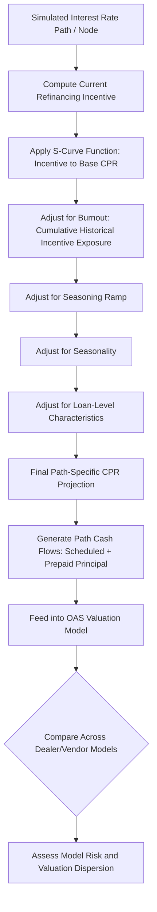

## Prepayment Risk and Prepayment Modeling

### Overview

Prepayment risk is the uncertainty surrounding the timing of unscheduled principal repayment on mortgage and other amortizing loan pools, arising from borrowers' economically and behaviorally driven decisions to pay off debt ahead of schedule. Prepayment modeling is the quantitative discipline of forecasting these unscheduled cash flows, and it underpins the accurate valuation, risk management, and hedging of all mortgage-related securities.

### Sources of Prepayment

**Key Points**

- **Refinancing**: the dominant driver of prepayment volatility, occurring when a borrower replaces their existing mortgage with a new loan, typically to capture a lower interest rate. Refinancing activity is highly sensitive to the spread between the borrower's existing note rate and prevailing market mortgage rates (the "refinancing incentive"), and exhibits strongly nonlinear response: minimal refinancing activity when the incentive is small or negative, accelerating sharply once the incentive exceeds the threshold at which the present value of interest savings exceeds the transaction costs (closing costs, time, and effort) of refinancing.
- **Housing turnover (home sale/relocation)**: prepayment resulting from a home sale, which triggers full payoff of the existing mortgage regardless of the rate environment; turnover-driven prepayment is comparatively more stable and less rate-sensitive than refinancing-driven prepayment, though it does exhibit some sensitivity to the broader housing market and macroeconomic cycle (e.g., turnover slows during housing market downturns due to reduced transaction volume and, historically, "lock-in" effects where existing homeowners with below-market mortgage rates are reluctant to sell and give up that favorable financing).
- **Curtailment**: partial, voluntary extra principal payments made by borrowers who continue to hold the mortgage but pay down the balance faster than scheduled — generally a smaller, more stable component of total prepayment than refinancing or turnover.
- **Default and involuntary prepayment**: principal returned to investors following borrower default and subsequent foreclosure/liquidation (relevant primarily for non-agency/private-label MBS credit analysis, since agency MBS investors are insulated from credit loss by the GSE/government guarantee, though defaults still affect the *timing* of principal return even where credit loss itself is guaranteed).

### The S-Curve: Refinancing Incentive and Prepayment Response

**Key Points**

- The relationship between refinancing incentive (current note rate minus prevailing market rate) and resulting CPR is empirically nonlinear and characteristically **S-shaped**:
  - At a negative or minimal incentive (borrower's rate is at or below market), prepayment speeds are low and driven mostly by turnover, since there is no refinancing incentive.
  - As the incentive grows positive and crosses a threshold, refinancing-driven prepayment accelerates sharply, and the CPR-versus-incentive curve steepens markedly.
  - At very large incentives, the curve **flattens again** at a high but bounded CPR level, because even with a very strong economic incentive, a residual population of borrowers will not or cannot refinance (due to credit impairment, insufficient home equity, inertia, or simply being unaware of/unresponsive to the opportunity) — this upper plateau is often referred to informally as the pool's maximum refinanceable speed.
- This S-curve relationship is the central empirical object that modern prepayment models attempt to estimate and calibrate, replacing the simplistic, incentive-insensitive PSA benchmark curve (discussed in the MBS fundamentals topic) with an incentive-conditional function.

### Burnout: A Path-Dependent Phenomenon

**Key Points**

- **Burnout** is the empirically observed tendency for a pool's prepayment speed to be slower than the S-curve alone would predict, for a given level of refinancing incentive, if that pool has already experienced a prior period of high refinancing incentive and elevated prepayment activity.
- The economic intuition: within any mortgage pool, borrowers are heterogeneous in their propensity and ability to refinance (credit quality, financial sophistication, transaction cost sensitivity, loan size relative to fixed refinancing costs). When a pool experiences a sustained period of strong refinancing incentive, the most "efficient" refinancers — those most likely and able to act — do so first, progressively depleting the pool of borrowers responsive to that incentive level. The remaining borrowers are a self-selected, less-responsive residual population, so if the incentive later returns to a similar level, the pool prepays more slowly than an otherwise-identical pool that has not previously been "burned out."
- Burnout means prepayment behavior is **path-dependent**: the CPR at any point in time depends not only on the *current* refinancing incentive but on the *history* of incentive levels the pool has experienced, requiring prepayment models to track cumulative refinancing exposure (sometimes modeled via a pool-level "burnout factor" or index that decays the modeled response to incentive as cumulative historical incentive exposure increases) rather than treating each period's CPR as a function of current conditions alone.

### Structure of a Modern Prepayment Model

**Key Points**

- Institutional prepayment models (used by dealers, agencies, and analytics vendors) typically combine several conditioning variables into a multiplicative or additive framework:

$$CPR_t = \text{Base Speed} \times f(\text{Incentive}_t) \times f(\text{Burnout}) \times f(\text{Seasoning}) \times f(\text{Seasonality}) \times f(\text{Loan Characteristics})$$

- **Refinancing incentive function** $f(\text{Incentive}_t)$: the S-curve response to the current note-rate-minus-market-rate spread, as described above.
- **Burnout function** $f(\text{Burnout})$: a dampening factor reflecting the pool's cumulative historical exposure to refinancing incentive, as described above.
- **Seasoning ramp**: newly originated loans exhibit low prepayment speeds initially (borrowers who just closed a loan are unlikely to immediately refinance or sell), with speeds ramping up over the first 1–3 years of the loan's life before leveling off — analogous in spirit to (but more granular than) the stylized 30-month PSA ramp.
- **Seasonality**: home sale activity (and thus turnover-driven prepayment) exhibits a predictable annual pattern, typically peaking in spring/summer months (coinciding with the traditional home-buying season in many markets) and troughing in winter months.
- **Loan-level and pool-level characteristics**: loan size (larger loans have a larger absolute dollar refinancing benefit for a given rate incentive, making them more refinancing-sensitive), loan-to-value ratio and borrower credit score (affecting the borrower's ability to qualify for and access refinancing, particularly relevant when credit conditions tighten), geographic location (affecting both housing turnover rates and refinancing channel access), and origination channel/servicer (empirically, different loan origination and servicing channels exhibit measurably different prepayment behavior, reportedly due to differences in borrower outreach and refinancing solicitation practices).

### Prepayment Model Application in Valuation

**Key Points**

- Prepayment models feed directly into the OAS lattice/Monte Carlo valuation framework discussed earlier: at each node of the simulated interest rate tree (or each simulated interest rate path), the model computes the prevailing refinancing incentive for the pool (given that path's simulated mortgage rate level) and applies the prepayment model to determine that period's expected CPR, which in turn determines the cash flows used in the discounted valuation.
- Because prepayment models are calibrated to historical data and rely on projected borrower behavior, **model risk** is a first-order consideration in MBS valuation: different dealers' and vendors' prepayment models, calibrated on different historical samples or using different functional forms, can produce meaningfully different OAS and duration estimates for the *identical* security — a well-documented source of valuation dispersion across market participants that is distinct from, and additive to, the interest rate volatility assumption sensitivity discussed in the OAS topic.
- Model risk is particularly elevated following periods of unusual origination or refinancing activity that fall outside the historical calibration sample (e.g., unprecedented low-rate environments, large-scale government refinancing programs, or major shifts in underwriting standards), since the model's extrapolation beyond its calibration data becomes less reliable in such regimes. [Inference: the magnitude of cross-model dispersion varies by market environment and security type and is not a fixed, quantifiable constant.]

### Illustrative S-Curve Behavior

**Example**

A prepayment model estimates the following CPR response to refinancing incentive for a hypothetical, non-burned-out pool:

| Refinancing Incentive (Note Rate − Market Rate) | Estimated CPR |
| --- | --- |
| −0.50% (borrower's rate below market) | 5% (turnover only) |
| 0.00% | 6% |
| +0.50% | 9% |
| +1.00% | 18% |
| +1.50% | 35% |
| +2.00% | 45% |
| +3.00% | 48% (plateau — near-maximum refinanceable speed) |

The steep rise between +0.50% and +2.00% incentive illustrates the S-curve's central, nonlinear segment, while the flattening between +2.00% and +3.00% illustrates the upper plateau where further incentive produces diminishing additional response, since most economically rational, capable refinancers have already been captured at lower incentive levels. [Inference: illustrative CPR figures for a stylized S-curve; actual model outputs depend on the specific pool's loan-level composition, burnout history, and the particular vendor/dealer model used, and will differ from these stylized figures.]

### Prepayment Modeling Framework Diagram

### Prepayment S-Curve Illustration (svg_diagram)

<svg xmlns="http://www.w3.org/2000/svg" viewBox="0 0 700 400">
\<style\>
.lbl { font-family: Arial, sans-serif; font-size: 13px; fill: #222; }
.title { font-family: Arial, sans-serif; font-size: 16px; font-weight: bold; fill: #111; }
.axis { stroke: #444; stroke-width: 1.5; }
.scurve { stroke: #2166ac; stroke-width: 2.5; fill: none; }
.burnout { stroke: #b2182b; stroke-width: 2.5; fill: none; stroke-dasharray: 6,3; }
\</style\>
<text x="150" y="30" class="title">Prepayment S-Curve: With and Without Burnout (svg_diagram)</text>
<line x1="80" y1="330" x2="640" y2="330" class="axis" />
<line x1="80" y1="330" x2="80" y2="60" class="axis" />
<text x="280" y="370" class="lbl">Refinancing Incentive →</text>
<text x="30" y="200" class="lbl" transform="rotate(-90 30 200)">CPR →</text>
<path d="M 100 310 C 250 305, 320 100, 580 90" class="scurve" />
<path d="M 100 315 C 280 312, 380 200, 580 170" class="burnout" />
<text x="400" y="80" class="lbl" fill="#2166ac">No Burnout: Full S-Curve Response</text>
<text x="400" y="200" class="lbl" fill="#b2182b">Burned-Out Pool: Dampened Response</text>
</svg>

### Related Topics

- Mortgage-Backed Securities Fundamentals and Pass-Through Structure
- Option-Adjusted Spread Application to Mortgage-Backed Securities
- Effective Duration and Convexity for Negatively Convex Instruments
- Collateralized Mortgage Obligations (CMOs) and Prepayment Tranching
- TBA Market Mechanics and Specified Pool Pay-Ups
- Model Risk in Fixed Income Valuation
- Interest-Only (IO) and Principal-Only (PO) Strip Sensitivity to Prepayment