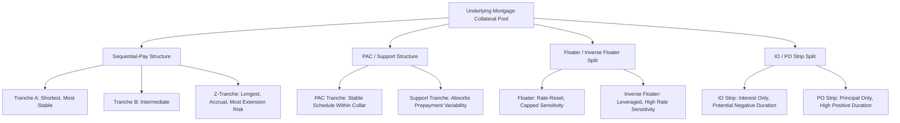

## Collateralized Mortgage Obligation Structures

### Overview

A Collateralized Mortgage Obligation (CMO) is a structured security backed by a pool of mortgage collateral (typically agency pass-through MBS) that is re-packaged into multiple classes of bonds, or **tranches**, each with distinct principal repayment priority, cash flow timing, and risk characteristics, allowing the redistribution of prepayment risk, interest rate risk, and (for non-agency CMOs) credit risk across investors with differing risk appetites and investment horizons.

### Motivation for Tranching

**Key Points**

- A pass-through MBS delivers a single, undifferentiated cash flow stream to all investors, meaning every investor in the pool bears the same prepayment uncertainty and the same resulting average-life variability.
- CMO structuring redirects the pool's aggregate cash flows into differentiated tranches, allowing the creation of securities with **more predictable** average life and duration (attractive to investors such as pension funds and insurers with specific liability-matching needs) alongside other tranches that **absorb the redistributed prepayment volatility** (attractive to investors, such as hedge funds or specialized MBS desks, willing to accept greater uncertainty in exchange for higher expected yield or specific risk exposure).
- This process does not eliminate the underlying pool's aggregate prepayment risk — it redistributes and concentrates that risk unevenly across tranches, meaning the sum of all tranches' risk still equals the risk of the underlying collateral, but individual tranches can be significantly more or less risky than the pool average.

### Sequential-Pay (Plain Vanilla) CMO Structure

**Key Points**

- The simplest and original CMO structure is the **sequential-pay** structure: multiple tranches (commonly labeled A, B, C, Z, etc.) are created, and all principal payments (scheduled and prepaid) from the underlying collateral are directed first entirely to the shortest tranche (Tranche A) until it is fully retired, then entirely to the next tranche (Tranche B), and so on sequentially.
- All tranches typically receive interest on their outstanding balance throughout, but principal is paid strictly in sequence, meaning:
  - The first tranche has the shortest expected average life and the most stable, predictable cash flow timing (since it's retired quickly regardless of moderate prepayment variation).
  - The last tranche has the longest expected average life and bears the most extension risk, since it does not begin receiving principal until all senior tranches have been fully retired, and any slowdown in aggregate pool prepayments disproportionately extends the final tranche's timeline.
- A **Z-tranche** (accrual bond) is a common final tranche structure: it accrues (rather than pays out) interest during the period before it begins receiving principal, with that accrued interest being added to the Z-tranche's principal balance; this accrued interest is redirected to accelerate principal paydown of the earlier, senior tranches, further shortening and stabilizing their average lives at the cost of extending the Z-tranche's effective duration even further.

### Planned Amortization Class (PAC) and Support Tranche Structures

**Key Points**

- **Planned Amortization Class (PAC) tranches** represent the most significant structural innovation in CMO design: a PAC tranche is engineered to receive a predetermined, scheduled principal paydown as long as the underlying collateral's prepayment speed remains within a specified band (defined by a lower and upper PSA speed, e.g., 100% PSA to 300% PSA, called the **PAC collar** or **structuring range**).
- To achieve this stability, a **support tranche** (also called a **companion tranche**) is created alongside the PAC tranche(s), and absorbs the prepayment variability that the PAC tranche is structured to avoid: if the collateral prepays faster than the top of the PAC band, the excess principal is diverted to the support tranche (protecting the PAC's schedule from contraction); if the collateral prepays slower than the bottom of the PAC band, the support tranche absorbs the shortfall by receiving less principal than it otherwise would (protecting the PAC's schedule from extension), up to the point where the support tranche is exhausted or the deviation from the band is severe enough to break through the PAC schedule (an "effective collar" that can narrow over the life of the deal as the support tranche paydown reduces the buffer available to protect the PAC).
- This structure creates an explicit risk transfer: the PAC tranche exhibits substantially more stable average life and duration across a range of prepayment scenarios than the underlying collateral itself, while the support tranche exhibits substantially *more* volatile average life and duration than the collateral, absorbing the redistributed uncertainty — a direct illustration of the tranching principle that risk is redistributed, not eliminated, across the structure.
- **PAC tiers**: multiple PAC tranches can be created with sequential priority among themselves (PAC I, PAC II, sometimes PAC III), where PAC I tranches have the most protection (first call on the support tranche's buffer) and PAC II/III tranches have progressively less protection, sitting structurally between the most-protected PAC I tranches and the least-protected support tranche.

### Floater and Inverse Floater Structures

**Key Points**

- A CMO tranche can be further split into a **floating-rate tranche** (coupon resets periodically based on a reference index, e.g., SOFR, plus a spread) and a corresponding **inverse floater tranche** (coupon moves inversely to the reference index), both carved from the same underlying fixed-rate collateral cash flow, structured so that the combined interest paid to both tranches equals the fixed-rate collateral's interest cash flow at every reset date.
- The floater typically appeals to investors seeking rate-reset protection (limited price sensitivity to rate changes, similar in spirit to the FRN discussion in the spread duration topic, though the floater's coupon formula and caps are specific to the CMO deal's structuring), while the inverse floater is a leveraged, highly rate-sensitive instrument (since its coupon falls when rates rise and rises when rates fall, and its formula is typically leveraged relative to a 1:1 inverse relationship) appealing to investors with a strong view on falling rates or a need for a security with very high negative duration exposure per dollar invested.

### Interest-Only (IO) and Principal-Only (PO) Strips

**Key Points**

- Rather than splitting cash flows by *timing* (as sequential/PAC tranches do) or by *coupon formula* (as floater/inverse floater tranches do), a CMO can split cash flows by *type*: an **IO (interest-only) strip** receives 100% of the collateral's interest cash flow and none of the principal, while a **PO (principal-only) strip** receives 100% of the principal cash flow (scheduled and prepaid) and none of the interest, with each carved from the same underlying pool of collateral notional.
- **PO strips exhibit extreme positive price sensitivity to falling rates**: since a PO is purchased at a discount to its ultimate principal value, faster prepayment (triggered by falling rates) accelerates the return of that principal, increasing the PO's value (a shorter time to receive a fixed future principal payment, discounted at a given rate, is worth more today) — the PO behaves like a bond with very high effective duration in the traditional sense, and additionally gains from prepayment acceleration itself, compounding the rate-driven price gain.
- **IO strips exhibit unusual, often negative effective duration**: since an IO's value derives entirely from the *stream* of interest payments on the *outstanding* principal balance, faster prepayment (which shrinks the outstanding balance) reduces the future interest cash flows an IO holder will receive — meaning that when rates fall (triggering faster prepayment), an IO's price can actually *decline*, the opposite of the typical bond price-rate relationship, making IOs a security with genuinely negative effective duration over some range of the prepayment/rate relationship. This makes IOs a specialized hedging instrument, sometimes used to offset the negative convexity of other MBS holdings or of a mortgage servicing rights (MSR) portfolio, whose value behaves similarly to an IO strip.
- [Inference: the specific magnitude and even the sign of an IO's effective duration can vary depending on the pool's current coupon relative to prevailing rates and the specific point on the prepayment S-curve, since at very high rate levels where prepayment is already minimal, further rate increases have little incremental effect on cash flows and the IO can behave more like a conventional positive-duration instrument.]

### Illustrative Sequential-Pay CMO Cash Flow Waterfall

**Example**

A $500mm CMO deal backed by 30-year agency collateral is structured into three sequential tranches:

| Tranche | Original Balance | Approximate Average Life (base case) | Priority |
| --- | --- | --- | --- |
| A | $200mm | 3 years | Receives all principal first |
| B | $150mm | 7 years | Receives principal after A retires |
| Z (accrual) | $150mm | 15+ years | Accrues interest until A and B retire, then receives principal |

All scheduled and prepaid principal from the underlying collateral flows first to Tranche A until its $200mm balance is fully retired; Tranche A investors therefore experience a much more compressed, front-loaded cash flow profile than the underlying 30-year collateral itself. Once Tranche A is retired, principal flows to Tranche B, and the Z-tranche's accruing interest during this period is redirected to accelerate Tranche A and B paydowns even further. [Inference: illustrative average life figures assuming a base-case prepayment speed; actual average lives shift meaningfully if actual prepayment experience deviates from the base-case assumption used at structuring, particularly for the later tranches.]

### CMO Tranching Structure Diagram

### PAC/Support Risk Redistribution Illustration (svg_diagram)

<svg xmlns="http://www.w3.org/2000/svg" viewBox="0 0 700 400">
\<style\>
.lbl { font-family: Arial, sans-serif; font-size: 13px; fill: #222; }
.title { font-family: Arial, sans-serif; font-size: 16px; font-weight: bold; fill: #111; }
.axis { stroke: #444; stroke-width: 1.5; }
.pac { stroke: #2166ac; stroke-width: 2.5; fill: none; }
.support { stroke: #b2182b; stroke-width: 2.5; fill: none; }
.collateral { stroke: #999999; stroke-width: 1.5; fill: none; stroke-dasharray: 4,3; }
\</style\>
<text x="120" y="30" class="title">PAC vs Support Average Life Stability (svg_diagram)</text>
<line x1="80" y1="330" x2="640" y2="330" class="axis" />
<line x1="80" y1="330" x2="80" y2="60" class="axis" />
<text x="270" y="370" class="lbl">Prepayment Speed (PSA) →</text>
<text x="30" y="200" class="lbl" transform="rotate(-90 30 200)">Average Life →</text>
<line x1="100" y1="200" x2="580" y2="200" class="pac" />
<path d="M 100 100 Q 340 200 580 300" class="support" />
<path d="M 100 130 Q 340 200 580 260" class="collateral" />
<text x="420" y="190" class="lbl" fill="#2166ac">PAC: Stable within collar</text>
<text x="420" y="290" class="lbl" fill="#b2182b">Support: Absorbs variability</text>
<text x="420" y="250" class="lbl" fill="#999999">Underlying Collateral</text>
</svg>

### Related Topics

- Mortgage-Backed Securities Fundamentals and Pass-Through Structure
- Prepayment Risk and Prepayment Modeling Revisited
- Effective Duration and Convexity for Negatively Convex Instruments
- Non-Agency CMO Credit Enhancement and Subordination Structures
- Mortgage Servicing Rights (MSR) Valuation and IO-Like Behavior
- Collateralized Loan Obligations (CLOs) and Structural Parallels
- Option-Adjusted Spread Application Across CMO Tranche Types