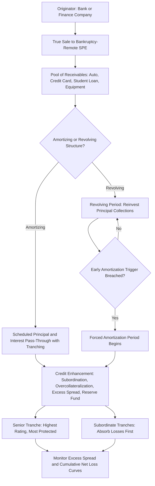

## Asset Backed Securities Overview

### Overview

Asset-backed securities (ABS) are fixed income instruments backed by pools of financial assets other than residential mortgages — most commonly auto loans/leases, credit card receivables, student loans, and equipment leases — whose cash flows are structured and distributed to investors through tranches, similar in spirit to the CMO framework but adapted to the distinct cash flow and risk characteristics of each underlying asset class.

### Core Structural Framework

**Key Points**

- The foundational ABS structure involves an originator (a bank, finance company, or specialty lender) selling a pool of receivables to a **bankruptcy-remote special purpose entity (SPE)**, which then issues securities backed by those receivables. This "true sale" and bankruptcy-remoteness structure is a critical legal feature: it isolates the securitized assets from the originator's own credit risk and potential bankruptcy, meaning ABS investors' exposure is to the performance of the underlying asset pool itself, not to the originating company's general creditworthiness — a structural point that is central to ABS rating methodology (see the earlier discussion of structured finance rating approaches).
- **Credit enhancement** is used to protect senior ABS tranches from losses in the underlying pool, via mechanisms including:
  - **Subordination/tranching**: junior tranches absorb losses first, protecting senior tranches, analogous to the seniority-based recovery discussed in the default/recovery topic, but structured explicitly at issuance via a defined "waterfall" rather than emerging only through the recovery process.
  - **Overcollateralization**: the pool's aggregate collateral balance exceeds the aggregate balance of securities issued against it, providing a first-loss buffer.
  - **Excess spread**: the difference between the interest rate earned on the underlying receivables and the (lower) interest rate paid to securityholders plus servicing costs, which can be used to absorb losses before they reach any tranche's principal.
  - **Reserve funds**: cash reserves funded at closing (or built up over time from excess spread) held specifically to cover shortfalls in interest or principal payments.
  - **Third-party enhancement**: (less common in modern structures following the 2008 crisis, but historically used) financial guarantee insurance ("monoline" wraps) or letters of credit from a third-party institution.

### Major ABS Asset Classes

**Key Points**

- **Auto loan/lease ABS**: backed by pools of retail installment auto loans or lease receivables. These pools amortize on a relatively predictable, scheduled basis (similar to standard loan amortization), with prepayment risk present but generally less pronounced and less rate-sensitive than mortgage prepayment risk, since auto loan terms are shorter (typically 3–7 years) and refinancing incentives are smaller in absolute dollar terms; the primary risk driver is instead borrower **default/credit loss**, closely tied to used-vehicle recovery values (since the vehicle serves as collateral) and broader consumer credit conditions.
- **Credit card ABS**: backed by revolving credit card receivables, structured differently from amortizing asset classes due to the revolving nature of the underlying collateral. Credit card ABS typically use a **master trust** structure with a **revolving period** (during which principal collections are reinvested to purchase new receivables, keeping the trust's collateral balance and the security's principal outstanding relatively constant) followed by an **amortization period** (during which principal collections are paid out to investors) — this structure accommodates the fact that individual credit card balances are paid down and redrawn continuously, unlike a fixed-term installment loan.
- **Student loan ABS**: backed by pools of federally guaranteed (FFELP, in the U.S. context, though FFELP origination ended in 2010, so outstanding FFELP ABS reflects a legacy, closed pool of loans) or private student loans; FFELP-backed ABS carry a federal guarantee reducing credit risk substantially (though not eliminating certain risks such as servicer-related guarantee reductions), while private student loan ABS carry direct credit risk tied to borrower repayment capacity and, often, income-driven repayment or deferment features that can extend the pool's effective maturity in ways distinct from mortgage prepayment dynamics.
- **Equipment lease ABS**: backed by lease receivables on commercial equipment (e.g., transportation equipment, industrial machinery), with cash flows and risk profiles resembling auto ABS in their scheduled amortization structure but with residual value risk on the leased equipment as an additional consideration distinct from a pure loan structure.

### Cash Flow Structuring: Amortizing vs. Revolving Pools

**Key Points**

- **Amortizing asset classes** (auto loans, most equipment leases, closed-end student loans): cash flows to the trust consist of scheduled principal and interest, plus prepayments, which are passed through to securityholders according to the deal's tranching structure — structurally similar in concept to the mortgage pass-through/CMO framework, though prepayment sensitivity to interest rates is generally much lower than for mortgages.
- **Revolving asset classes** (credit card receivables, and some auto floorplan/dealer financing structures): during the revolving period, principal collected from the underlying receivables is used to purchase new receivables rather than being paid to investors, allowing the trust to fund new balances as old ones are paid down and maintaining a relatively stable security balance outstanding; this structure introduces distinct risks not present in amortizing ABS, including the risk that the underlying account pool's characteristics (credit quality, payment rate, yield) deteriorate during the revolving period in ways that were not anticipated at issuance, and the presence of **early amortization triggers** — contractual events (e.g., excess spread falling below a specified floor, or the sponsor's own financial distress) that terminate the revolving period early and force immediate amortization, protecting investors from further deterioration but potentially disrupting the security's expected cash flow timing.

### Key Risk Metrics Specific to ABS

**Key Points**

- **Weighted average coupon (WAC) and weighted average maturity (WAM)**: pool-level summary statistics analogous to those used in MBS analysis, describing the average interest rate and remaining term across the underlying receivables.
- **Excess spread**: as described above, both a credit enhancement mechanism and a key ongoing performance metric — a declining excess spread trend across reporting periods is a leading indicator of pool credit deterioration, since it reflects the pool's net yield (collections minus losses, servicing, and coupon paid to investors) shrinking, often before that deterioration is fully reflected in cumulative net loss figures.
- **Cumulative net loss (CNL) curves**: track the cumulative losses experienced by a specific pool (or vintage/origination cohort) as a percentage of original pool balance over the pool's seasoning, used to compare actual performance against the loss expectations assumed at deal structuring and against other comparable vintages, helping identify whether a pool is performing better or worse than similar historical cohorts at the same point in their life cycle.
- **Payment rate / monthly payment rate (MPR)**: specific to revolving credit card ABS, this measures the rate at which the underlying cardholder accounts pay down their balances each month, a key input to assessing how quickly the trust could amortize if an early amortization event were triggered, and thus how much cushion investors have before principal repayment risk becomes a practical concern.

### Illustrative ABS Waterfall and Credit Enhancement

**Example**

A $300mm auto loan ABS deal is structured with the following credit enhancement stack:

| Tranche/Enhancement | Size | Credit Enhancement (Subordination Beneath) |
| --- | --- | --- |
| Class A (Senior) | $255mm (85%) | 15% |
| Class B (Subordinate) | $30mm (10%) | 5% |
| Class C (Subordinate) | $10mm (3.33%) | 1.67% |
| Reserve Fund | $5mm (1.67%) | — |

In this structure, cumulative pool losses must exceed approximately 1.67% (exhausting the reserve fund) before Class C absorbs any loss, must exceed roughly 5% before Class B absorbs any loss, and must exceed 15% before Class A (the senior, typically highest-rated tranche) experiences any principal loss — providing Class A investors with a substantial buffer against pool underperformance relative to the deal's base-case loss expectations. [Inference: illustrative structure; actual credit enhancement levels at issuance are calibrated by the arranger and rating agencies based on the specific pool's expected loss distribution, stress scenarios, and target rating for each tranche, and vary by asset class, originator track record, and prevailing market conditions.]

### ABS Structural and Risk Framework Diagram

### Related Topics

- Structured Finance Rating Methodology and Cash Flow Stress Modeling
- Credit Card Master Trust Structures and Early Amortization Triggers
- Collateralized Mortgage Obligation Structures: Structural Parallels
- Collateralized Loan Obligations (CLOs) and Corporate Loan Securitization
- Cumulative Net Loss Curve Analysis and Vintage Performance Comparison
- Bankruptcy Remoteness and True Sale Legal Opinions in Securitization
- Excess Spread as a Leading Indicator of Pool Credit Deterioration