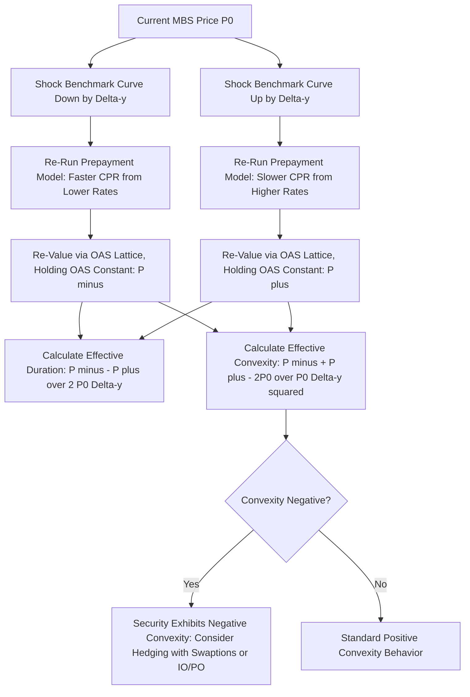

## Effective Duration and Negative Convexity in Mortgage Backed Securities

### Overview

Effective duration and effective convexity are the appropriate risk measures for mortgage-backed securities because MBS cash flows are contingent on interest-rate-driven prepayment behavior, unlike option-free bonds whose cash flows are fixed regardless of rate movements. This topic examines why standard (modified/Macaulay) duration measures fail for MBS, how effective duration and convexity are properly calculated, and the specific mechanics and consequences of MBS negative convexity.

### Why Modified Duration Fails for MBS

**Key Points**

- **Modified duration** is calculated assuming a bond's cash flows remain fixed regardless of yield changes — a valid assumption for an option-free bullet bond, but invalid for MBS, whose actual cash flow timing depends on prepayment behavior, which itself depends on the level of interest rates (via the refinancing incentive mechanism discussed in the prepayment modeling topic).
- Applying modified duration to an MBS would implicitly assume the pool's prepayment speed remains constant regardless of how far rates move, which materially misstates the security's true price sensitivity: modified duration systematically **overstates** MBS price appreciation when rates fall (because it ignores the cash-flow-shortening, offsetting effect of accelerating prepayments) and can meaningfully misstate price sensitivity when rates rise (extension effects), making it an unreliable and potentially misleading risk measure for any security with significant embedded optionality.

### Effective Duration: Definition and Calculation

**Key Points**

- **Effective duration** ($D_{eff}$) measures price sensitivity to a change in the benchmark yield curve while explicitly allowing the security's cash flows to change in response to that rate move (i.e., re-running the prepayment model and full valuation under both an upward and downward rate shock):

$$D_{eff} = \frac{P_{-\Delta y} - P_{+\Delta y}}{2 \times P_0 \times \Delta y}$$

where $P_{-\Delta y}$ and $P_{+\Delta y}$ are the security's model-derived prices (via full OAS/lattice valuation, incorporating the path- and level-dependent prepayment model) following a downward and upward shift in the benchmark curve, respectively, $P_0$ is the current price, and $\Delta y$ is the size of the yield shock (a small shock, e.g., 25 or 50bp, is typically used to approximate the local derivative accurately).

- This is calculated **holding OAS constant** across the up and down scenarios — meaning the model re-prices the security using the same OAS (the credit/liquidity spread component) but allows the risk-free curve shift to flow through to both the discounting *and* the prepayment model's refinancing incentive calculation, correctly capturing the combined discounting and cash-flow-timing effects of the rate move.
- Because effective duration is calculated via full re-valuation (re-running the entire OAS model under each scenario) rather than a closed-form analytical formula, it is inherently model-dependent: the effective duration reported for a given MBS depends on the specific prepayment model, volatility assumption, and OAS methodology used, consistent with the model risk considerations discussed in the prepayment modeling topic.

### Effective Convexity and the Mechanics of Negative Convexity

**Key Points**

- **Effective convexity** ($C_{eff}$) measures the curvature (second derivative) of the price-yield relationship, again using the full re-valuation approach:

$$C_{eff} = \frac{P_{-\Delta y} + P_{+\Delta y} - 2P_0}{P_0 \times (\Delta y)^2}$$

- For an option-free bond, $C_{eff}$ is positive: the price gain from a given downward yield move exceeds the price loss from an equivalent upward yield move, the standard, favorable convexity property discussed in the earlier bullet/barbell/ladder topic.
- For a pass-through MBS (or the support tranche of a CMO, or other securities with significant negative-convexity exposure), $C_{eff}$ is frequently **negative**, particularly when the security is trading at or near its **refinancing threshold** (i.e., the current coupon is close to prevailing mortgage rates, the region of the S-curve where prepayment response to further rate changes is most sensitive) — meaning $P_{-\Delta y} + P_{+\Delta y} < 2P_0$: the combined effect of an up-and-down rate shock produces a lower average price than the current price, the mathematical signature of negative convexity.
- **Mechanically**, this arises because: (a) as rates fall, accelerating prepayment truncates the security's remaining cash flows just as the investor would most want to retain the now-attractively-priced, higher-coupon cash flow stream, capping the price appreciation that would otherwise occur from discounting fixed cash flows at a lower rate; and (b) as rates rise, slowing prepayment extends the security's remaining cash flows just as the investor is holding an increasingly below-market coupon for longer than anticipated, compounding the price decline from higher discount rates with the effect of that below-market coupon persisting longer.

### The Refinancing Threshold and Duration Drift

**Key Points**

- **Duration drift** describes how an MBS's effective duration changes as rates move — the practical, dynamic consequence of negative convexity: as rates fall and the security moves deeper into "in the money" refinancing territory, effective duration shortens (since faster prepayment brings cash flows forward in time); as rates rise and the security moves further "out of the money" for refinancing, effective duration lengthens (extension).
- This means an MBS's duration is **not a stable, static number** the way an option-free bond's duration approximately is — it changes continuously as rates move, requiring active, ongoing re-hedging by portfolio managers who wish to maintain a target portfolio duration, a dynamic hedging burden not present with option-free instruments (an operational and risk-management point directly connected to the spread-duration-versus-effective-duration distinction discussed earlier, since spread duration for MBS is comparatively more stable than effective duration, given the option-related instability is primarily rate-driven rather than spread-driven).
- The region of maximum negative convexity (and maximum duration drift sensitivity) is typically when the pool's coupon is at or slightly above prevailing mortgage rates (the steepest part of the prepayment S-curve), whereas pools trading well "out of the money" (rates far above the pool's coupon, minimal refinancing incentive) or well "in the money" (already prepaying near the maximum plateau speed) exhibit more stable, less negatively convex behavior, since further rate moves have comparatively less incremental effect on prepayment behavior at those extremes.

### Illustrative Effective Duration and Convexity Calculation

**Example**

An agency MBS pool is currently priced at par ($100.00). The analyst shocks the benchmark curve up and down by 50bp and re-runs the full OAS/prepayment model (holding OAS constant) to obtain:

- $P_0 = 100.00$
- $P_{-50bp} = 101.80$ (price after rates fall 50bp; prepayment acceleration limits the gain)
- $P_{+50bp} = 97.50$ (price after rates rise 50bp; extension amplifies the loss)

Effective duration:

$$D_{eff} = \frac{101.80 - 97.50}{2 \times 100.00 \times 0.0050} = \frac{4.30}{1.00} = 4.30$$

Effective convexity:

$$C_{eff} = \frac{101.80 + 97.50 - 2(100.00)}{100.00 \times (0.0050)^2} = \frac{-0.70}{0.0025} = -280$$

The negative effective convexity value (−280) confirms the asymmetric price response: the price gain from rates falling (+1.80) is smaller than the price loss from rates rising (−2.50) for an equivalent-sized shock, the defining quantitative signature of negative convexity. By contrast, an option-free bond with the same effective duration might show $P_{-50bp} = 102.15$ and $P_{+50bp} = 97.95$ (a more symmetric response), producing a small *positive* convexity figure instead. [Inference: illustrative price and duration figures for a stylized par-priced pool; actual values depend on the specific pool's coupon relative to prevailing rates, the prepayment model used, and the assumed interest rate volatility, and pools trading away from the refinancing threshold would show less pronounced negative convexity than this illustration.]

### Portfolio and Hedging Implications

**Key Points**

- Because negative convexity means MBS underperform option-free bonds of equivalent duration in *both* large rate-up and large rate-down scenarios (relative to what a symmetric, positively convex instrument would deliver), MBS investors are compensated for bearing this risk via a **higher OAS** relative to comparable option-free credit, consistent with the "cost of convexity" concept introduced in the bullet/barbell/ladder discussion — here the cost is embedded directly in the security via negative convexity rather than chosen via portfolio structure.
- Portfolio managers commonly **hedge MBS negative convexity** using instruments with offsetting positive convexity, such as interest rate swaptions (owning volatility, since negative convexity is economically equivalent to being short an option, i.e., short volatility) or by combining MBS holdings with IO/PO strips or other structured MBS derivatives whose convexity profile offsets the pass-through's negative convexity (as introduced in the CMO structures discussion) — some non-agency and depository institution investors specifically construct barbell-style combinations of negatively convex MBS and positively convex Treasury/swaption positions to manage the aggregate portfolio's convexity profile.
- Duration drift also has direct implications for the **surplus duration mismatch** risk discussed in the ALM topic: an insurer or bank holding MBS as duration-matching assets against liabilities faces the risk that a large rate move causes MBS effective duration to drift away from the liability duration precisely when hedging is most needed, a scenario that materialized acutely during the 2023 U.S. regional bank stress episode referenced earlier, where extension risk on held MBS/agency securities as rates rose sharply outpaced banks' interest rate risk management assumptions.

### Effective Duration/Convexity Calculation Process

### Price-Yield Asymmetry Illustration (svg_diagram)

<svg xmlns="http://www.w3.org/2000/svg" viewBox="0 0 700 400">
\<style\>
.lbl { font-family: Arial, sans-serif; font-size: 13px; fill: #222; }
.title { font-family: Arial, sans-serif; font-size: 16px; font-weight: bold; fill: #111; }
.axis { stroke: #444; stroke-width: 1.5; }
.mbs { stroke: #b2182b; stroke-width: 2.5; fill: none; }
.optionfree { stroke: #2166ac; stroke-width: 2.5; fill: none; stroke-dasharray: 5,3; }
\</style\>
<text x="140" y="30" class="title">MBS Negative Convexity vs Option-Free Bond (svg_diagram)</text>
<line x1="80" y1="330" x2="640" y2="330" class="axis" />
<line x1="80" y1="330" x2="80" y2="60" class="axis" />
<text x="330" y="370" class="lbl">Yield Change →</text>
<text x="30" y="200" class="lbl" transform="rotate(-90 30 200)">Price →</text>
<path d="M 120 300 Q 360 150 600 260" class="optionfree" />
<path d="M 120 290 Q 360 200 600 290" class="mbs" />
<text x="420" y="140" class="lbl" fill="#2166ac">Option-Free: Symmetric Positive Convexity</text>
<text x="420" y="310" class="lbl" fill="#b2182b">MBS: Capped Upside, Negative Convexity</text>
<text x="200" y="315" class="lbl">Rates fall</text>
<text x="520" y="315" class="lbl">Rates rise</text>
</svg>

### Related Topics

- Mortgage-Backed Securities Fundamentals and Pass-Through Structure
- Prepayment Risk and Prepayment Modeling Revisited
- Nominal Spread, Z-Spread, and Option-Adjusted Spread Distinctions
- Interest Rate Swaptions and Volatility-Based MBS Hedging
- Interest-Only and Principal-Only Strip Duration Behavior
- Collateralized Mortgage Obligation Structures and Convexity Redistribution
- Asset Liability Management: Surplus Duration Risk from Convexity Drift