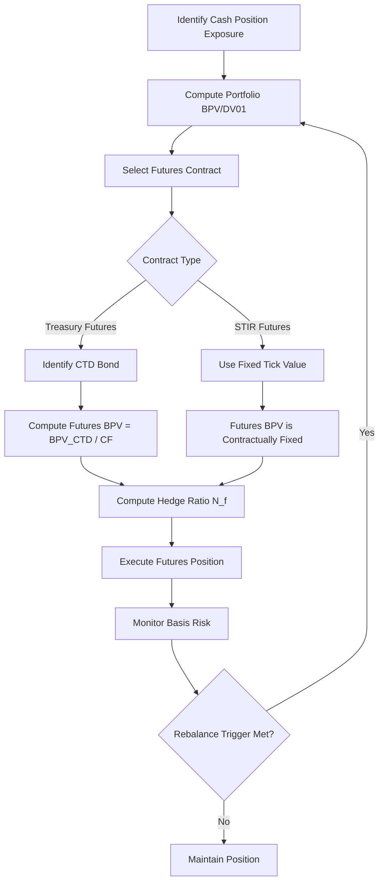

## Interest Rate Futures and Futures Based Hedging

### Definition and Purpose

An interest rate futures contract is a standardized, exchange-traded agreement to buy or sell an underlying interest-rate-sensitive instrument (a bond, a deposit rate, or an index) at a predetermined price on a specified future date. Unlike forward-rate agreements (FRAs) or over-the-counter (OTC) swaps, futures are marked-to-market daily, cleared through a central counterparty (CCP), and standardized in contract size, deliverable grade, and expiration cycle.

Interest rate futures serve three primary functions:

- **Hedging** — offsetting exposure to adverse rate movements on an existing or anticipated position
- **Speculation** — taking a directional or curve view on rates with leverage
- **Arbitrage** — exploiting mispricing between the futures price and the theoretical (cost-of-carry) price of the underlying

### Major Contract Types

**Short-Term Interest Rate (STIR) Futures**

- Eurodollar futures (legacy, now largely supplanted by SOFR futures following USD LIBOR cessation)
- SOFR futures (3-Month SOFR and 1-Month SOFR, traded on CME)
- SONIA futures (ICE, sterling market)
- Euribor futures (ICE/Eurex, euro market)
- Priced on an index basis: $Price = 100 - Rate$, so a rate of 4.50% corresponds to a price of 95.50

**Treasury (Bond) Futures**

- U.S. Treasury futures on CME: 2-Year, 5-Year, 10-Year Note, Ultra 10-Year, T-Bond, Ultra T-Bond
- Gilt futures (ICE), Bund/Bobl/Schatz futures (Eurex) for UK and German exposure respectively
- Each contract permits delivery of a basket of eligible bonds within a specified maturity range, converted to a common basis via a **conversion factor**

### Treasury Futures Mechanics

**Conversion Factor (CF)**

Since multiple bonds with different coupons and maturities are deliverable, a conversion factor normalizes each bond's price as if it yielded 6% (the notional coupon):

$$CF = \frac{PV \text{ of bond's cash flows discounted at } 6\%}{100}$$

The invoice price paid by the long to the short at delivery is:

$$\text{Invoice Price} = (\text{Futures Settlement Price} \times CF) + \text{Accrued Interest}$$

**Cheapest-to-Deliver (CTD)**

The short holds the delivery option and will deliver whichever eligible bond is cheapest to deliver, determined by minimizing:

$$\text{Net Cost of Delivery} = (\text{Bond Purchase Price} + \text{Accrued Interest}) - (\text{Futures Price} \times CF + \text{Accrued Interest})$$

Equivalently, the CTD is the bond with the smallest **basis** (Bond Price − Futures Price × CF) net of carry. Key drivers of CTD status:

- When yields exceed the 6% notional coupon, longer-duration, lower-coupon bonds tend to be CTD
- When yields are below 6%, shorter-duration, higher-coupon bonds tend to be CTD
- The CTD determines the effective duration and convexity of the futures contract itself, since the futures price moves in near lock-step with the CTD bond's price divided by its conversion factor

**Implied Repo Rate**

The annualized return from buying the CTD bond, delivering it into the futures contract, and financing the position:

$$IRR = \left(\frac{\text{Invoice Price}}{\text{Purchase Price} + \text{Accrued Interest}} - 1\right) \times \frac{360}{\text{Days to Delivery}}$$

A cash-and-carry arbitrage exists when the IRR exceeds the actual repo (financing) rate.

### STIR Futures Pricing and DV01

STIR futures (SOFR, Euribor) have a linear, contractually fixed tick value because they settle on an index basis rather than a bond price:

$$\text{Tick Value} = \text{Notional} \times 0.0001 \times \frac{\text{Contract Period (days)}}{360}$$

For a standard 3-Month SOFR future with a $1,000,000 notional, each basis point (0.01 in price) is worth approximately $25, since:

$$\$1{,}000{,}000 \times 0.0001 \times \frac{90}{360} = \$25$$

This fixed DV01 per contract simplifies hedge ratio calculations relative to bond futures, whose DV01 varies with the CTD bond's duration and the prevailing yield level.

### Hedging with Interest Rate Futures

**Objective**

Futures-based hedging aims to offset the dollar change in value of a cash position for a given change in interest rates, using the DV01 (dollar value of a basis point) or BPV (basis point value) framework.

**Basic Hedge Ratio (BPV/DV01 Method)**

$$N_f = -\frac{BPV_{\text{portfolio}}}{BPV_{\text{futures}}}$$

where:

- $N_f$ = number of futures contracts (negative implies a short position for a hedge against rising rates)
- $BPV_{\text{portfolio}}$ = dollar change in portfolio value per 1bp yield change
- $BPV_{\text{futures}}$ = dollar change in futures value per 1bp yield change, computed as $BPV_{\text{CTD}} / CF_{\text{CTD}}$ for bond futures

**Conversion-Factor-Adjusted Hedge Ratio**

For Treasury futures, the BPV of the futures contract is derived from the CTD bond:

$$BPV_{\text{futures}} = \frac{BPV_{\text{CTD}}}{CF_{\text{CTD}}}$$

Full hedge ratio:

$$N_f = -\frac{BPV_{\text{portfolio}}}{BPV_{\text{CTD}} / CF_{\text{CTD}}} = -\frac{BPV_{\text{portfolio}} \times CF_{\text{CTD}}}{BPV_{\text{CTD}}}$$

**Example**

A portfolio manager holds a $50 million bond portfolio with a BPV of $42,000 (i.e., the portfolio loses $42,000 in value for each 1bp rise in yield). The 10-Year Treasury futures contract's CTD bond has a BPV of $74 per $100,000 face, and a conversion factor of 0.91.

Step 1 — Compute futures BPV:

$$BPV_{\text{futures}} = \frac{74}{0.91} \approx 81.3$$

Step 2 — Compute number of contracts:

$$N_f = -\frac{42{,}000}{81.3} \approx -517 \text{ contracts (short)}$$

The manager sells approximately 517 ten-year Treasury futures contracts to neutralize the portfolio's rate exposure.

### Types of Hedges

**Micro Hedge vs. Macro Hedge**

- Micro hedge — hedges a single security or cash flow (e.g., an upcoming bond issuance)
- Macro hedge — hedges an entire portfolio's aggregate duration exposure

**Anticipatory Hedge**

Used to lock in a yield or price before a transaction occurs, such as hedging an anticipated bond issuance against rising rates between announcement and pricing date.

**Cross Hedge**

Occurs when the hedging instrument (futures CTD) differs from the underlying exposure (e.g., hedging a corporate bond portfolio with Treasury futures). This introduces **basis risk** — the risk that the spread between the cash instrument and the futures/CTD does not move in parallel.

### Basis Risk in Futures Hedging

The **basis** is defined as:

$$\text{Basis} = \text{Cash Price} - (\text{Futures Price} \times CF)$$

Basis risk arises from:

- **Yield curve risk** — non-parallel shifts causing the hedge instrument's rate to diverge from the hedged exposure's rate
- **Credit spread risk** — in cross hedges, corporate/mortgage spreads to Treasuries can widen or narrow independently of the level of rates
- **CTD switch risk** — a change in the cheapest-to-deliver bond alters the effective duration and BPV of the futures contract mid-hedge, requiring rebalancing
- **Convexity mismatch** — futures (via the CTD's embedded delivery option) exhibit negative convexity from the short's perspective at the margin, while the hedged bond portfolio may have different convexity characteristics

### Hedge Rebalancing (Dynamic Hedging)

Because $BPV_{\text{portfolio}}$ and $BPV_{\text{CTD}}$ change as yields move and time passes, hedge ratios are not static:

- **Duration drift** — as the hedged bonds age or yields shift, portfolio BPV changes, requiring contract quantity adjustment
- **CTD migration** — a new CTD bond may emerge if yields cross the threshold associated with the currently deliverable basket, changing $BPV_{\text{futures}}$ discontinuously
- Practitioners typically rebalance on a periodic basis (e.g., weekly) or when BPV drift exceeds a tolerance threshold (e.g., 5%)

### Stack Hedging vs. Strip Hedging

When hedging exposure across multiple future periods (e.g., a series of floating-rate liabilities), two approaches exist for STIR futures:

**Stack Hedge**

- All hedging contracts are concentrated in the nearest expiring (front) contract
- Simpler to execute and more liquid, but introduces basis risk as the hedge must be rolled forward repeatedly, and each roll is exposed to changes in the shape of the futures curve

**Strip Hedge**

- Hedging contracts are spread across the sequential expiration months matching each period of exposure
- More precisely matches the timing of the underlying cash flows, reducing roll risk, but may face liquidity constraints in far-dated contract months

### Illustrative Diagram: Hedge Construction Workflow (svg_diagram)

### Margin Mechanics

**Initial Margin**

- Performance bond posted at trade inception, set by the CCP based on historical volatility (e.g., SPAN or similar risk-based margining methodology)

**Variation Margin**

- Daily mark-to-market settlement of gains and losses, credited or debited in cash
- Unlike OTC forwards, this daily cash flow means futures hedges carry **interim cash flow risk**: gains/losses are realized daily rather than at a single terminal date, which can create funding mismatches relative to the hedged cash position

### Convexity Bias

Because futures are margined daily while forwards (and the underlying cash bonds) are not, futures rates trade slightly below the theoretically equivalent forward rate for the same period. This is because:

- A long futures position that gains value receives cash (variation margin) which can be reinvested at then-prevailing (higher) rates
- A long futures position that loses value must fund the margin call, typically at the same higher rates
- This asymmetry benefits long futures positions when rates rise, so competitive pricing pushes the futures rate below the forward rate to offset this benefit

$$\text{Futures Rate} \approx \text{Forward Rate} - \text{Convexity Adjustment}$$

The convexity adjustment grows with the square of time to maturity and with rate volatility, and becomes material for contracts with maturities beyond approximately two years [Inference — magnitude is model- and volatility-dependent, commonly estimated via Ho-Lee or Hull-White short-rate models].

### Practical Considerations and Limitations

- **Rounding to whole contracts** — since $N_f$ is rarely an integer, rounding introduces residual (unhedged) BPV exposure
- **Liquidity concentration** — deliverable baskets and volume concentrate in the front two or three contract months; far-dated strips may have wide bid-ask spreads
- **Regulatory treatment** — futures positions used for hedging may qualify for hedge accounting treatment (e.g., under ASC 815 or IFRS 9) if properly documented, affecting whether mark-to-market gains/losses flow through earnings or other comprehensive income [Unverified — accounting treatment depends on jurisdiction-specific rules and documentation requirements at time of trade]
- **Behavior may vary** across market regimes; hedge effectiveness assumptions (e.g., stable CTD, stable basis) can break down during periods of stress or sharp yield curve inversion

### Worked Example: STIR Futures Hedge

A corporate treasurer has $100 million of floating-rate debt resetting quarterly against 3-Month SOFR and wants to hedge the next reset against rising rates.

- Exposure: $100,000,000 × 0.01 × (90/360) = $2,500 per basis point
- 3-Month SOFR futures tick value: $25 per contract per basis point
- Hedge ratio: $N_f = -\frac{2{,}500}{25} = -100$ contracts (short)

The treasurer sells 100 SOFR futures contracts. If SOFR rises by 25bp before the reset, the futures position gains approximately $100 \times 25 \times \$25 = \$62{,}500$, offsetting the increased interest expense on the floating-rate debt.

**Related Topics**

- Forward Rate Agreements (FRAs) and Futures-FRA Basis
- Interest Rate Swaps and Swap Curve Construction
- Eurodollar/SOFR Futures Strip and the Term Structure of Short Rates
- Duration, Convexity, and Key Rate Duration
- Treasury Futures Delivery Options (Wildcard, Quality, Timing, End-of-Month)
- Cross-Currency Basis and International Rate Futures (Gilt, Bund, Euribor)
- Value-at-Risk (VaR) for Futures-Hedged Fixed Income Portfolios
- Repo Markets and the Cash-and-Carry Trade