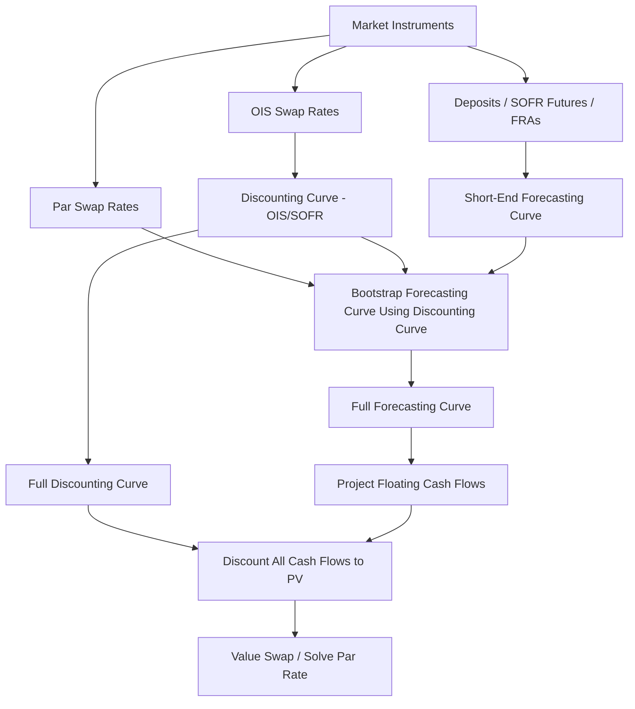

## Interest Rate Swaps and the Swap Curve

### Definition and Economic Function

An interest rate swap (IRS) is a bilateral OTC contract in which two counterparties exchange cash flows based on a notional principal amount, typically one leg paying a fixed rate and the other paying a floating rate tied to a reference index. The notional itself is never exchanged; only net interest payments change hands. Swaps allow institutions to transform the interest rate character of an asset or liability without altering the underlying instrument itself.

**Core Economic Uses**

- Converting floating-rate debt to fixed-rate exposure (or vice versa)
- Hedging duration/rate exposure on bond portfolios or loan books
- Speculating on the direction or shape of the yield curve
- Asset-liability management (matching the rate sensitivity of assets and liabilities)
- Locking in forward borrowing costs ahead of anticipated issuance

### Anatomy of a Plain Vanilla Swap

- **Fixed leg** — pays a fixed coupon rate, set at trade inception, on the notional, typically on a semiannual or annual schedule with a 30/360 or Actual/365 day count
- **Floating leg** — pays a reference rate (historically LIBOR, now predominantly SOFR, SONIA, €STR, or TONA) reset periodically, typically quarterly or monthly, with an Actual/360 day count
- **Notional principal** — the reference amount used to calculate interest, not exchanged
- **Tenor** — the overall life of the swap (e.g., 5Y, 10Y, 30Y)
- **Trade date, effective date, maturity date** — effective date is often T+2 spot-starting, though forward-starting swaps are common

**Cash Flow at Each Reset**

$$\text{Net Payment} = \text{Notional} \times (\text{Fixed Rate} - \text{Floating Rate}) \times \frac{\text{Days in Period}}{360 \text{ or } 365}$$

### Post-LIBOR Transition: SOFR and RFR Conventions

Following the phase-out of USD LIBOR, most new swaps reference **Secured Overnight Financing Rate (SOFR)** and other risk-free rates (RFRs) such as SONIA (GBP), €STR (EUR), and TONA (JPY). Key conventional differences from legacy LIBOR swaps:

- RFRs are overnight rates rather than term rates, so floating legs use **compounding-in-arrears** conventions (daily compounding of the overnight rate over the accrual period) rather than a rate set once at the start of the period
- A **lookback**, **lockout**, or **payment delay** period is applied near the end of each accrual period to allow time to calculate the final compounded rate before payment
- Term SOFR (a forward-looking term rate derived from SOFR futures) exists for limited use cases, primarily certain cash products, but ISDA fallback and standard swap conventions favor compounded-in-arrears SOFR [Inference — market convention continues to evolve as RFR liquidity deepens]

### The Swap Curve

The swap curve plots fixed swap rates against tenor, representing the market's aggregate view of the fixed rate that equates the present value of the fixed leg to the present value of the floating leg at each maturity — i.e., the rate at which the swap has zero net present value at inception.

**Par Swap Rate Formula**

The fixed rate $S_n$ for an $n$-period swap is set so that:

$$\sum_{i=1}^{n} S_n \times \Delta_i \times DF_i = 1 - DF_n$$

Solving for the par swap rate:

$$S_n = \frac{1 - DF_n}{\sum_{i=1}^{n} \Delta_i \times DF_i}$$

where:

- $DF_i$ = discount factor to period $i$
- $\Delta_i$ = accrual fraction (year fraction) for period $i$
- The right-hand side $1 - DF_n$ arises from the floating leg's valuation, which (under the relevant discounting curve) collapses to the difference between the initial and final discount factors

### Curve Construction: Bootstrapping

Swap curves are built via **bootstrapping** — sequentially solving for discount factors at each maturity using observed market swap rates, working from the shortest tenor outward.

**Bootstrapping Procedure**

1. Use short-end instruments (deposit rates, SOFR futures/FRAs) to derive discount factors for tenors under approximately 1–2 years
2. Use par swap rates at standard tenors (2Y, 3Y, 5Y, 7Y, 10Y, 15Y, 20Y, 30Y) to solve iteratively for successive discount factors, using previously bootstrapped points to discount known cash flows
3. Interpolate between observed tenors (commonly using log-linear interpolation on discount factors, or cubic spline methods, to preserve smooth forward rates)

**Iterative Solution for the Next Discount Factor**

Given all discount factors up to period $n-1$ are known, and the market quotes $S_n$:

$$DF_n = \frac{1 - S_n \sum_{i=1}^{n-1} \Delta_i \times DF_i}{1 + S_n \times \Delta_n}$$

### Dual-Curve Framework (Post-2008 Standard)

Since the 2008 financial crisis exposed credit and liquidity risk embedded in interbank rates, standard practice separates:

- **Discounting curve** — typically built from overnight index swap (OIS) rates (or SOFR-based OIS post-transition), reflecting the nearly risk-free rate appropriate for discounting collateralized cash flows
- **Forecasting curve** — used to project the floating index's future fixing values (e.g., a SOFR-forecasting curve), which may differ from the discounting curve

This **OIS discounting** approach is now the market standard for collateralized (cleared) swaps, since variation margin posted under a Credit Support Annex (CSA) is typically remunerated at the overnight rate, making OIS the economically correct discount rate for valuing those cash flows.

### Illustrative Diagram: Dual-Curve Bootstrapping Flow (svg_diagram)

### Valuing an Existing Swap

Once a swap is on the books, its mark-to-market value is the difference between the present values of the two legs:

$$V_{\text{swap}} = PV_{\text{fixed leg}} - PV_{\text{floating leg}}$$

For the payer of fixed (receiver of floating):

$$V_{\text{payer}} = PV_{\text{floating}} - PV_{\text{fixed}} = \sum_{i} F_i \times \Delta_i \times DF_i - \sum_{i} S_{\text{original}} \times \Delta_i \times DF_i$$

where $F_i$ are the forward rates projected from the current forecasting curve. Equivalently, the value can be expressed as the difference between the current par rate for the remaining tenor and the original trade rate, multiplied by the annuity (present value of a basis point) of the remaining fixed leg:

$$V_{\text{payer}} \approx (S_{\text{current}} - S_{\text{original}}) \times \text{Annuity}$$

### PV01 / DV01 of a Swap

The swap's DV01 (PV01) measures the change in value for a 1bp parallel shift in the swap curve:

$$PV01_{\text{swap}} = \frac{\partial V}{\partial y} \times 0.0001$$

Approximated using the annuity factor (sum of discounted year fractions):

$$PV01_{\text{swap}} \approx \text{Notional} \times \sum_{i=1}^{n} \Delta_i \times DF_i \times 0.0001$$

Fixed-rate receivers have positive DV01 (benefit from falling rates); fixed-rate payers have negative DV01 (benefit from rising rates), mirroring long and short bond duration exposure respectively.

### Swap Spreads

The **swap spread** is the difference between the swap rate and the yield on a government bond of matching maturity:

$$\text{Swap Spread} = S_n - Y_{\text{Treasury}, n}$$

Swap spreads reflect:

- Relative credit/liquidity premium between interbank-referenced (or now RFR-referenced) funding and government funding
- Supply/demand imbalances in the swap market versus the Treasury market (e.g., hedging flows from mortgage originators, corporate issuers)
- Balance sheet costs and regulatory capital charges affecting dealer willingness to warehouse swap risk
- Swap spreads can turn negative (swap rate below Treasury yield) at longer tenors, a phenomenon observed periodically in USD markets, generally attributed to regulatory balance-sheet constraints on dealers and strong demand for duration hedging via receiving fixed [Inference — the precise drivers of persistently negative swap spreads remain debated among market practitioners]

### Uses of the Swap Curve Beyond Swap Pricing

- **Benchmark for corporate bond pricing** — credit spreads are frequently quoted versus the swap curve (I-spread, Z-spread relative to swaps) rather than solely versus Treasuries
- **Discounting derivatives** — the OIS/SOFR curve derived from swaps underpins discounting for the broader derivatives market
- **Forward rate extraction** — implied forward rates from the swap curve inform expectations of future short-term rates and central bank policy paths
- **Relative value trading** — asset swap spreads, swap spread curves, and butterflies are traded as standalone relative-value instruments

### Common Swap Variants

**Basis Swaps**

- Exchange one floating index for another (e.g., 3-Month SOFR vs. 1-Month SOFR, or SOFR vs. Fed Funds), used to hedge or arbitrage index basis risk

**Overnight Index Swaps (OIS)**

- Both legs reference overnight rates; the floating leg is the geometric compounding of the daily overnight rate over the period; used heavily for discounting curve construction and short-term rate expectation trades

**Forward-Starting Swaps**

- Effective date is set beyond spot, allowing a counterparty to lock in a future fixed rate today

**Amortizing / Accreting Swaps**

- Notional declines (amortizing) or increases (accreting) over the life of the swap, often used to match a mortgage or project-finance amortization schedule

**Constant Maturity Swaps (CMS)**

- Floating leg resets to a point on the swap curve itself (e.g., 10-year swap rate) rather than a money-market index, introducing convexity risk since the floating leg's value is nonlinear in rates

### Curve Risk: Key Rate Duration and Curve Trades

Because a swap portfolio's aggregate DV01 may mask exposure concentrated at specific tenors, practitioners decompose risk using **key rate durations (KRDs)** — sensitivity to a shift in a single curve node while holding others fixed. This enables:

- **Curve steepener/flattener trades** — receiving fixed at one tenor and paying fixed at another to express a view on the curve's shape independent of its level
- **Butterfly trades** — combining three tenors to isolate curvature risk while remaining level- and slope-neutral

### Counterparty Risk and Clearing

- Since the 2008 crisis and subsequent Dodd-Frank/EMIR reforms, standardized IRS are predominantly required to be centrally cleared through a CCP (e.g., LCH SwapClear, CME), which imposes initial and variation margin analogous to futures
- Uncleared (bilateral) swaps remain subject to Credit Support Annex (CSA) terms, ISDA Master Agreement documentation, and, since the Uncleared Margin Rules (UMR) phase-in, initial margin requirements for large counterparties
- CCP clearing standardizes discounting conventions (OIS/SOFR) across the cleared market, since all cleared swaps are collateralized under the CCP's own margining rules

### Worked Example: Hedging Floating-Rate Debt with a Swap

A corporation has $200 million of 5-year floating-rate debt paying 3-Month SOFR + 150bp and wants to fix its borrowing cost. It enters a 5-year receive-floating, pay-fixed swap on $200 million notional at a swap rate of 4.20%.

**Resulting Net Cost**

$$\text{Net Rate} = (\text{SOFR} + 150\text{bp}) - \text{SOFR} + 4.20\% = 4.20\% + 1.50\% = 5.70\%$$

The floating SOFR components offset (assuming matched reset dates and index), leaving the corporation with an effectively fixed all-in cost of 5.70%, insulated from future SOFR movements, at the cost of forgoing any benefit if SOFR were to fall.

### Practical Considerations and Limitations

- **Basis mismatch** — if the reset dates, day count conventions, or compounding methodology of the swap's floating leg do not precisely match the underlying exposure (e.g., loan resets monthly, swap resets quarterly), residual basis risk remains
- **Curve interpolation choice** — different interpolation methodologies (linear on rates, log-linear on discount factors, monotone cubic splines) can produce materially different forward rates in illiquid segments of the curve, affecting valuation of instruments with cash flows between quoted tenors [Unverified — magnitude of divergence is curve- and market-condition-specific]
- **Multi-curve consistency** — forecasting and discounting curves must be constructed consistently to avoid arbitrage in the bootstrapped forward rates
- Behavior of swap spreads and curve shape may vary significantly across monetary policy regimes and periods of market stress

**Related Topics**

- Overnight Index Swaps (OIS) and SOFR Compounding Conventions
- Forward Rate Agreements (FRAs) and Eurodollar/SOFR Futures
- Credit Support Annexes (CSA) and Collateral Discounting
- Cross-Currency Basis Swaps
- Constant Maturity Swaps (CMS) and CMS Convexity Adjustment
- Curve Steepener/Flattener and Butterfly Trade Construction
- Asset Swap Spreads and Z-Spread Analysis
- Central Clearing (CCP) Margin Methodologies (SPAN, VaR-based)