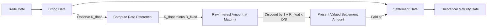

## Forward Rate Agreements

### Definition and Purpose

A Forward Rate Agreement (FRA) is an OTC contract in which two counterparties agree to exchange the difference between a fixed interest rate agreed today and a floating reference rate observed at a future date, applied to a notional principal over a specified period. The notional is never exchanged; only the interest differential settles in cash. FRAs are the simplest building block of the interest rate derivatives market and are typically used to hedge or speculate on a single future interest rate reset, as opposed to swaps, which chain together a series of such resets.

**Primary Uses**

- Locking in a future borrowing or lending rate for a single period
- Hedging the interest rate risk on a known future loan draw-down or rollover
- Speculating on the direction of short-term rates
- Serving as the theoretical building block from which swap and futures pricing is derived

### Contract Notation and Terminology

FRAs are quoted using an "$m \times n$" notation, where $m$ is the number of months until the contract period begins and $n$ is the number of months until the contract period ends. The contract period length is therefore $n - m$ months.

- **3×6 FRA** — begins in 3 months, ends in 6 months (a 3-month rate, 3 months forward)
- **1×4 FRA** — begins in 1 month, ends in 4 months (a 3-month rate, 1 month forward)
- **6×12 FRA** — begins in 6 months, ends in 12 months (a 6-month rate, 6 months forward)

**Key Dates**

- **Trade date** — when the contract terms are agreed
- **Fixing date** — typically two business days before the settlement date, when the reference rate is observed
- **Settlement date** — the start of the notional contract period, when the cash settlement occurs
- **Maturity date** — the theoretical end of the contract period, used only to define the length of the accrual for calculation purposes

### Roles and Payoff Direction

- The **FRA buyer** (also called the payer of fixed, or long the FRA) profits if the floating reference rate at fixing exceeds the contracted fixed rate — economically equivalent to being short a deposit or having locked in a borrowing rate
- The **FRA seller** (receiver of fixed, or short the FRA) profits if the floating rate at fixing is below the contracted rate — economically equivalent to a lender locking in a future investment rate

### Settlement Mechanics

Because the interest differential technically relates to a payment that would occur at the end of the contract period, but settlement happens at the start of that period (the settlement date), the payment must be discounted back from the notional end-of-period value to a present value at settlement.

**Settlement Amount (paid to the buyer if positive)**

$$\text{Settlement} = \frac{(R_{\text{float}} - R_{\text{fixed}}) \times \frac{D}{B}}{1 + R_{\text{float}} \times \frac{D}{B}} \times \text{Notional}$$

where:

- $R_{\text{float}}$ = the observed reference rate (e.g., Term SOFR, or historically LIBOR) at the fixing date
- $R_{\text{fixed}}$ = the FRA contract rate agreed at trade date
- $D$ = number of days in the contract period
- $B$ = day count basis (360 or 365, depending on currency convention)

The denominator $\left(1 + R_{\text{float}} \times \frac{D}{B}\right)$ discounts the raw interest differential from the maturity date back to the settlement date, since the floating rate itself is the appropriate discount rate for a money-market-referenced cash flow over that period.

### Pricing FRAs from the Spot Curve (No-Arbitrage Forward Rate)

The fair FRA rate is the implied forward rate embedded in the spot (zero-coupon) yield curve, derived from the no-arbitrage condition that investing to the far date directly must equal investing to the near date and rolling into a forward-starting deposit.

**Forward Rate Formula**

For a forward period starting at time $t_1$ and ending at time $t_2$, given zero rates $z_1$ (to $t_1$) and $z_2$ (to $t_2$):

$$(1 + z_2 \times \frac{t_2}{B}) = (1 + z_1 \times \frac{t_1}{B}) \times (1 + f_{1,2} \times \frac{t_2 - t_1}{B})$$

Solving for the forward rate:

$$f_{1,2} = \left[\frac{1 + z_2 \times \frac{t_2}{B}}{1 + z_1 \times \frac{t_1}{B}} - 1\right] \times \frac{B}{t_2 - t_1}$$

This $f_{1,2}$ is the theoretically fair fixed rate for an FRA covering the period from $t_1$ to $t_2$. If the market-quoted FRA rate diverges materially from this no-arbitrage forward rate, a cash-and-carry arbitrage (borrowing/lending at spot rates combined with an offsetting FRA position) becomes available, which market forces act to eliminate.

### Worked Example: Pricing a 3×6 FRA

Given a flat money-market curve with a 3-month zero rate of 4.00% and a 6-month zero rate of 4.30% (both Actual/360, simple interest):

- $t_1 = 90/360 = 0.25$, $z_1 = 4.00\%$
- $t_2 = 180/360 = 0.50$, $z_2 = 4.30\%$

Step 1 — Compute the two accumulation factors:

$$1 + z_1 \times t_1 = 1 + 0.04 \times 0.25 = 1.0100$$

$$1 + z_2 \times t_2 = 1 + 0.043 \times 0.50 = 1.0215$$

Step 2 — Solve for the forward rate over the 3-month forward period:

$$f_{1,2} = \left[\frac{1.0215}{1.0100} - 1\right] \times \frac{360}{90} = 0.011386 \times 4 \approx 4.55\%$$

The fair 3×6 FRA rate is approximately 4.55%, notably higher than either the 3-month or 6-month spot rate, reflecting an upward-sloping curve.

### Worked Example: Settlement Calculation

A corporate treasurer buys a 3×6 FRA on $10,000,000 notional at a fixed rate of 4.55% to hedge an anticipated 3-month borrowing in 3 months' time. At the fixing date, 3-month Term SOFR sets at 5.00%.

Step 1 — Raw interest differential (undiscounted):

$$(0.05 - 0.0455) \times \frac{90}{360} \times \$10{,}000{,}000 = 0.0045 \times 0.25 \times \$10{,}000{,}000 = \$11{,}250$$

Step 2 — Discount to settlement date using the floating rate:

$$\text{Settlement} = \frac{\$11{,}250}{1 + 0.05 \times \frac{90}{360}} = \frac{\$11{,}250}{1.0125} \approx \$11{,}110.80$$

The FRA seller pays the buyer approximately $11,110.80 at the settlement date. This gain approximately offsets the higher-than-hedged borrowing cost the treasurer will face when actually rolling the $10 million loan at the now-higher 5.00% market rate.

### Illustrative Diagram: FRA Timeline and Cash Flow Logic (svg_diagram)

### Relationship to FRA-Referencing Futures and Swaps

- **STIR futures (SOFR/Euribor futures)** are the standardized, exchange-traded, margined analogue of FRAs; the **futures-FRA basis** (or futures-forward convexity adjustment) reflects the difference between the futures-implied rate and the theoretical FRA/forward rate, arising from the same daily-margining convexity effect discussed under futures convexity bias
- **Interest rate swaps** can be conceptually decomposed into a strip of sequential FRAs, each covering one reset period of the floating leg; the swap's fixed rate is effectively a notional-weighted average of the FRA rates for each period, discounted appropriately
- A **FRA strip** — a series of consecutive FRAs (e.g., 0×3, 3×6, 6×9, 9×12) — can synthetically replicate a one-year floating-rate exposure or be used to hedge a rolling series of short-term borrowings

### Credit and Documentation

- FRAs are typically documented under an ISDA Master Agreement with a Schedule and Confirmation specifying the notional, dates, reference rate, and day count
- Since only the discounted interest differential is exchanged (not principal), counterparty credit exposure on an FRA is limited to the replacement cost of the differential payment, which is generally small relative to the notional — unlike a loan, where the full principal is at risk
- Bilateral FRAs may be subject to a CSA requiring collateral posting based on mark-to-market exposure; some FRAs are eligible for central clearing at major CCPs, though clearing volumes are considerably smaller than for standardized swaps

### Practical Considerations and Limitations

- **Basis risk versus the actual funding index** — if the FRA references a benchmark (e.g., Term SOFR) that differs from the borrower's actual funding basis (e.g., a loan priced off compounded-in-arrears SOFR, or off an internal cost-of-funds rate), residual basis risk remains even after hedging
- **Fixing date risk** — a mismatch between the FRA's fixing date and the borrower's actual rate-setting date on the underlying loan can introduce timing basis
- **Discounting sensitivity** — for larger notionals or longer contract periods, the choice of discount rate in the settlement formula (contractually the floating rate itself, per market convention) has a measurable effect on the realized settlement value, though this effect is generally modest for short-dated FRAs [Inference — magnitude scales with the FRA's rate level and period length]
- Behavior of forward rates and the futures-FRA basis may vary materially during periods of central bank policy uncertainty or year-end funding stress, when short-term rate volatility and convexity effects are elevated

**Related Topics**

- Interest Rate Futures and Futures-FRA Convexity Adjustment
- Interest Rate Swaps and the Swap Curve
- Term SOFR vs. Compounded-in-Arrears SOFR Conventions
- Bootstrapping the Money-Market and Swap Curve
- ISDA Documentation and the ISDA Definitions for Rate Fixings
- Basis Risk in Short-Term Rate Hedging
- Central Clearing of OTC Interest Rate Derivatives