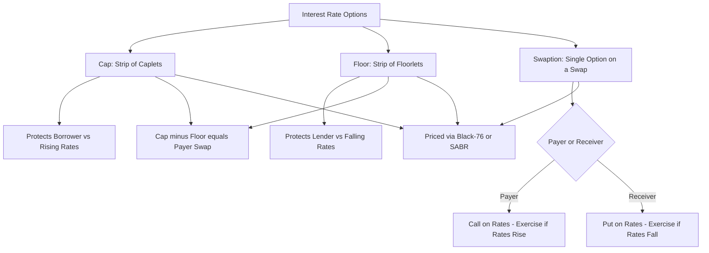

## Caps Floors and Swaptions

### Definition and Role Among Interest Rate Options

Caps, floors, and swaptions are the principal option-based instruments in the interest rate derivatives market. Unlike swaps and FRAs, which are obligations, these instruments grant the holder the *right but not the obligation* to benefit from favorable rate movements while capping downside to the premium paid. They are used to hedge asymmetric rate risk, monetize rate volatility views, and construct more complex structured products.

- **Interest rate cap** — a series of call options on a floating rate, protecting a borrower against rising rates
- **Interest rate floor** — a series of put options on a floating rate, protecting a lender/investor against falling rates
- **Swaption** — an option to enter into an interest rate swap at a predetermined fixed rate on a future date

### Interest Rate Caps

**Structure**

A cap is a strip of individual call options called **caplets**, each corresponding to one reset period of an underlying floating rate index (e.g., 3-Month SOFR), with a common strike rate (the **cap rate**) across all caplets.

**Caplet Payoff**

For a single caplet covering a period with reference rate $R$, strike $K$, notional $N$, and accrual fraction $\Delta$:

$$\text{Caplet Payoff} = N \times \Delta \times \max(R - K, 0)$$

Paid (typically) at the end of the accrual period, or discounted back to the fixing date depending on convention, analogous to FRA settlement mechanics.

**Total Cap Value**

$$\text{Cap} = \sum_{i=1}^{n} \text{Caplet}_i$$

**Use Case**

A borrower with floating-rate debt buys a cap to place a ceiling on their effective borrowing cost while retaining the benefit of lower rates if the index falls below the strike, unlike a swap which would fix the rate entirely in both directions.

### Interest Rate Floors

**Structure**

A floor is a strip of put options called **floorlets**, each protecting against the reference rate falling below a strike (the **floor rate**).

**Floorlet Payoff**

$$\text{Floorlet Payoff} = N \times \Delta \times \max(K - R, 0)$$

**Use Case**

An investor holding floating-rate assets (e.g., a floating-rate note or a loan portfolio) buys a floor to guarantee a minimum yield, while retaining upside if rates rise above the strike.

### Put-Call Parity for Caps and Floors

Caps and floors relate to the underlying swap through a parity relationship analogous to equity option put-call parity:

$$\text{Cap} - \text{Floor} = \text{Value of Payer Swap (at the same strike/fixed rate)}$$

This holds because being long a cap and short a floor at the same strike replicates being long a payer swap: above the strike, the cap pays out the differential; below the strike, the short floor obligates the same payment; the net cash flow always equals $R - K$, identical to a swap's floating-minus-fixed cash flow.

### Swaptions

**Structure**

A swaption grants the holder the right to enter into an underlying interest rate swap of specified tenor and fixed rate at a future exercise date.

- **Payer swaption** — the right to enter a swap paying fixed (receiving floating); economically a call option on rates, exercised if rates rise above the strike
- **Receiver swaption** — the right to enter a swap receiving fixed (paying floating); economically a put option on rates, exercised if rates fall below the strike

**Notation**

Swaptions are quoted as "expiry into tenor" — e.g., a **3-into-7 swaption** (or "3y7y") is an option expiring in 3 years to enter a 7-year swap.

**Payoff at Exercise**

At exercise, if the prevailing par swap rate $S$ for the underlying tenor differs favorably from the strike $K$, the holder exercises and receives the present value of the resulting off-market swap. For a payer swaption:

$$\text{Payoff} = \text{Notional} \times \text{Annuity} \times \max(S - K, 0)$$

For a receiver swaption:

$$\text{Payoff} = \text{Notional} \times \text{Annuity} \times \max(K - S, 0)$$

where the **Annuity** (PV01 of the underlying swap) is the present value of a stream of $1 payments over the swap's fixed-leg schedule, discounted on the relevant curve.

**Cash Settlement vs. Physical Settlement**

- **Physical settlement** — upon exercise, the holder enters into an actual swap with the counterparty at the strike rate
- **Cash settlement** — the holder receives a single cash payment equal to the discounted value of the payoff, using either the annuity from the actual swap curve or (in some markets) a standardized "cash-settled" annuity formula agreed by convention

### Pricing Framework: Black's Model

The standard market approach for pricing caps, floors, and swaptions is **Black's model** (Black-76), which treats the forward rate (forward LIBOR/SOFR rate for a caplet/floorlet, or the forward swap rate for a swaption) as lognormally distributed under the appropriate forward measure.

**Black's Formula for a Caplet (Call on the Forward Rate)**

$$\text{Caplet} = N \times \Delta \times DF(T) \times \left[F \times \Phi(d_1) - K \times \Phi(d_2)\right]$$

where:

$$d_1 = \frac{\ln(F/K) + \frac{1}{2}\sigma^2 T}{\sigma \sqrt{T}}, \quad d_2 = d_1 - \sigma\sqrt{T}$$

- $F$ = forward rate for the caplet's period, derived from the forecasting curve
- $K$ = strike (cap rate)
- $\sigma$ = implied volatility of the forward rate
- $T$ = time to the caplet's fixing date
- $DF(T)$ = discount factor to the payment date
- $\Phi(\cdot)$ = cumulative standard normal distribution function

**Black's Formula for a Payer Swaption**

$$\text{Payer Swaption} = N \times \text{Annuity} \times \left[F_{\text{swap}} \times \Phi(d_1) - K \times \Phi(d_2)\right]$$

with $F_{\text{swap}}$ being the forward swap rate for the underlying tenor observed as of the expiry date, and $d_1, d_2$ computed analogously using the forward swap rate and its implied volatility.

### Volatility Surfaces and Smile Effects

**Cap/Floor Volatility Surface**

Quoted implied volatilities vary by strike (**volatility smile/skew**) and by option maturity (**term structure of volatility**), since realized rate volatility is not constant across strikes or horizons. Market practice extends Black's lognormal assumption using:

- **SABR model** — a stochastic volatility model widely used to interpolate and extrapolate the smile consistently across strikes, parameterized by initial volatility $\alpha$, correlation $\rho$, vol-of-vol $\nu$, and the CEV exponent $\beta$
- **Normal (Bachelier) model** — an alternative to lognormal Black pricing that assumes the forward rate follows arithmetic (normal) rather than geometric Brownian motion, which handles negative or near-zero rate environments more naturally, since a lognormal model breaks down as $F \to 0$ or below

**Swaption Volatility Cube**

Swaption implied volatilities are quoted across three dimensions — option expiry, underlying swap tenor, and strike (moneyness) — forming a **volatility cube**, used as the primary input for calibrating interest rate models (e.g., Hull-White, LMM) to market-observed option prices.

### The Greeks for Rate Options

- **Delta** — sensitivity to the underlying forward rate (or forward swap rate); a payer swaption has positive delta, a receiver swaption has negative delta
- **Vega** — sensitivity to implied volatility; all long option positions (caps, floors, swaptions) have positive vega
- **Gamma** — sensitivity of delta to the underlying rate; long option positions have positive gamma, meaning the hedge ratio must be actively rebalanced as rates move
- **Theta** — time decay; long option positions lose value as time passes, all else equal, since less time remains for the option to move into the money

### Illustrative Diagram: Cap/Floor/Swaption Relationship (svg_diagram)

### Worked Example: Pricing a Caplet

A borrower wants to cap 3-month SOFR at 5.00% on a $50,000,000 notional for a caplet fixing in 1 year, with the forward rate for that period currently at 4.80%, implied volatility of 25%, and a discount factor of 0.94 to the payment date. Accrual fraction $\Delta = 0.25$.

Step 1 — Compute $d_1$ and $d_2$:

$$d_1 = \frac{\ln(4.80/5.00) + 0.5 \times 0.25^2 \times 1}{0.25 \times \sqrt{1}} = \frac{-0.0408 + 0.03125}{0.25} \approx -0.0382$$

$$d_2 = -0.0382 - 0.25 = -0.2882$$

Step 2 — Look up (or compute) standard normal CDF values:

$$\Phi(-0.0382) \approx 0.4848, \quad \Phi(-0.2882) \approx 0.3866$$

Step 3 — Apply Black's formula:

$$\text{Caplet} = 50{,}000{,}000 \times 0.25 \times 0.94 \times \left[0.048 \times 0.4848 - 0.05 \times 0.3866\right]$$

$$= 11{,}750{,}000 \times \left[0.02327 - 0.01933\right] = 11{,}750{,}000 \times 0.00394 \approx \$46{,}295$$

The caplet is worth approximately $46,295, representing the premium the borrower pays for one period of protection against SOFR exceeding 5.00%.

### Applications and Structured Combinations

- **Collar** — simultaneously buying a cap and selling a floor (or vice versa), reducing net premium cost by giving up some benefit from favorable rate moves; a **zero-cost collar** sets the strikes such that the premiums offset exactly
- **Corridor** — buying a cap at one strike and selling a cap at a higher strike, reducing premium while capping protection at the upper strike
- **Callable/putable bonds** — economically embed a swaption-like optionality for the issuer or holder, and are often hedged or valued using swaption pricing frameworks
- **Mortgage servicing rights and prepayment risk** — swaptions are widely used to hedge the negative convexity embedded in mortgage-backed securities, since prepayment behavior resembles an embedded receiver swaption held by the borrower
- **Bermudan swaptions** — allow exercise on any of several specified dates rather than a single expiry, requiring lattice or Monte Carlo methods (e.g., calibrated Hull-White or LMM models) rather than closed-form Black pricing, since the optimal exercise decision depends on the evolving rate path

### Risk Management Considerations

- **Volatility risk (vega)** is a distinct risk factor from directional rate risk (delta) and must be hedged separately, typically using a portfolio of other options rather than the underlying swap/futures alone
- **Model risk** — the choice of volatility model (Black lognormal, Bachelier normal, SABR, or a full term-structure model like Hull-White or LMM) can produce materially different valuations and hedge ratios, particularly for out-of-the-money strikes or long-dated Bermudan-style options [Unverified — magnitude of model divergence depends on market conditions and calibration inputs at the time]
- **Negative rate environments** — lognormal (Black) models require adjustment (e.g., a shifted-lognormal or normal model) when rates approach or go below zero, since a standard lognormal model is undefined for non-positive forward rates
- Behavior of implied volatility surfaces and skew dynamics may vary significantly across monetary policy regimes, particularly around central bank meeting dates and periods of heightened rate uncertainty

**Related Topics**

- Black-76 Model Derivation and Assumptions
- SABR Model Calibration and Volatility Smile Dynamics
- Bermudan Swaptions and Lattice/Monte Carlo Valuation Methods
- Hull-White and Libor Market Model (LMM) Term Structure Models
- Mortgage-Backed Securities and Prepayment Option Valuation
- Collar and Corridor Structuring for Corporate Rate Hedging
- Volatility Cube Construction and Interpolation Techniques
- Forward Rate Agreements and the Underlying Forward Curve