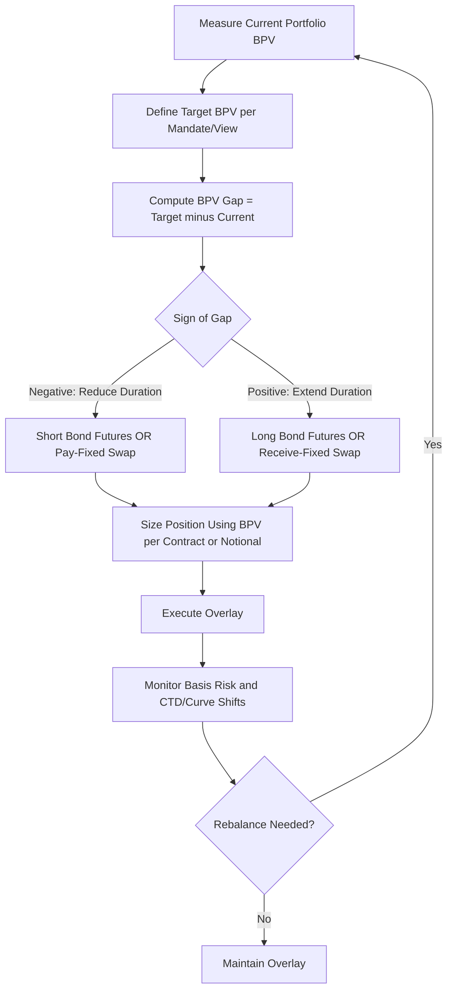

## Hedging Portfolio Duration with Derivatives

### Objective and Conceptual Framework

Hedging portfolio duration with derivatives means using futures, swaps, or options to adjust a fixed income portfolio's overall interest rate sensitivity without transacting in the underlying cash bonds. This allows a manager to neutralize unwanted rate risk (a full hedge), tactically shift duration exposure (a partial hedge or duration overlay), or isolate exposure to a specific segment of the curve — all while avoiding the transaction costs, market impact, and settlement lags associated with buying or selling large blocks of physical bonds.

**Core Principle**

The manager equates the dollar duration (or BPV/DV01) contributed by the derivative overlay to the dollar duration gap between the current portfolio and the target duration:

$$\text{Target Portfolio } BPV = \text{Current Portfolio } BPV + \text{Overlay } BPV$$

### Duration and Dollar Duration Recap

**Modified Duration**

$$D_{\text{mod}} = -\frac{1}{P} \times \frac{\partial P}{\partial y}$$

**Dollar Duration (BPV/DV01)**

$$BPV = D_{\text{mod}} \times P \times 0.0001$$

A portfolio's aggregate BPV is the sum of the BPVs of its constituent holdings, and it is this dollar-denominated, additive quantity — rather than duration expressed as a percentage — that is used directly in hedge ratio calculations, since durations of different instruments cannot be summed on a weighted-price basis without first converting to BPV.

### Determining the Duration Gap

Before sizing any hedge, the manager computes the gap between current and target duration exposure:

$$BPV_{\text{gap}} = BPV_{\text{target}} - BPV_{\text{current}}$$

- If $BPV_{\text{gap}} < 0$ (current duration exceeds target), the manager needs a position that **reduces** duration — shorting bond futures, or entering a **pay-fixed swap** (which has negative BPV from the payer's perspective)
- If $BPV_{\text{gap}} > 0$ (current duration is below target), the manager needs to **add** duration — going long bond futures, or entering a **receive-fixed swap**

### Hedging with Treasury Futures (Full Duration-Neutral Hedge)

To fully neutralize portfolio duration (i.e., target BPV = 0), the number of futures contracts required is:

$$N_f = -\frac{BPV_{\text{portfolio}}}{BPV_{\text{futures}}} = -\frac{BPV_{\text{portfolio}} \times CF_{\text{CTD}}}{BPV_{\text{CTD}}}$$

This is the same construction used in futures-based hedging generally, applied here at the whole-portfolio level rather than to a single security. For a **partial hedge** targeting a specific residual duration rather than zero:

$$N_f = -\frac{BPV_{\text{gap}}}{BPV_{\text{futures}}}$$

### Hedging with Interest Rate Swaps (Duration Overlay)

Swaps are frequently preferred to futures for portfolio-level duration management because they offer:

- Precise tenor selection (any maturity, not limited to a fixed delivery basket)
- No physical delivery mechanism or CTD-switch risk
- The ability to target a specific point on the curve exactly, rather than being tied to the CTD's duration

**Notional Sizing for a Swap Overlay**

$$\text{Swap Notional} = \frac{BPV_{\text{gap}}}{PV01_{\text{swap, per unit notional}}}$$

where $PV01_{\text{swap, per unit notional}}$ is the swap's dollar value change per basis point per unit of notional (i.e., the annuity factor times 0.0001), as derived under swap valuation mechanics.

A manager wishing to **shorten** duration (reduce BPV) enters a **pay-fixed swap** (negative BPV, since the payer benefits from rising rates, symmetric to a short bond position); a manager wishing to **extend** duration enters a **receive-fixed swap** (positive BPV, benefiting from falling rates, symmetric to a long bond position).

### Worked Example: Duration Overlay with Swaps

A pension fund holds a $300 million bond portfolio with a modified duration of 7.2 years and wants to reduce effective duration to 5.5 years ahead of an anticipated rate-hiking cycle, without selling any bonds (to avoid realizing capital gains and transaction costs).

Step 1 — Compute current and target BPV:

$$BPV_{\text{current}} = 7.2 \times \$300{,}000{,}000 \times 0.0001 = \$216{,}000$$

$$BPV_{\text{target}} = 5.5 \times \$300{,}000{,}000 \times 0.0001 = \$165{,}000$$

Step 2 — Compute the required BPV reduction:

$$BPV_{\text{gap}} = \$165{,}000 - \$216{,}000 = -\$51{,}000$$

Step 3 — Assume a 10-year pay-fixed swap has a $PV01_{\text{swap, per unit notional}}$ of approximately $0.00082 per $1 notional (i.e., an annuity factor of roughly 8.2 years' worth of discounted cash flows times 0.0001). Solve for notional:

$$\text{Swap Notional} = \frac{-\$51{,}000}{-0.00082} \approx \$62{,}195{,}000$$

The fund enters a pay-fixed 10-year swap with approximately $62.2 million notional, reducing the portfolio's effective duration to the 5.5-year target while retaining the underlying bond holdings.

### Illustrative Diagram: Duration Overlay Decision Process (svg_diagram)

### Using Options for Asymmetric Duration Hedging

Where a manager wants downside protection against rising rates while retaining upside if rates fall, options provide asymmetric payoff profiles unavailable through linear instruments (futures/swaps):

- **Buying payer swaptions** protects against rising rates while preserving the benefit of falling rates, at the cost of an upfront premium
- **Buying a cap** on a related floating exposure achieves a similar asymmetric protection for floating-rate liabilities embedded in the portfolio
- **Selling receiver swaptions** can generate premium income in range-bound rate environments but introduces open-ended downside if rates fall sharply, and is typically used only as part of a broader income-overlay strategy rather than a pure hedge
- The **delta** of the swaption (from the Black/SABR framework) determines its effective BPV contribution to the portfolio at any point in time, meaning option-based overlays require ongoing delta-hedging recalculation, unlike a static futures or swap notional

### Key Rate Duration (KRD) Hedging for Non-Parallel Risk

A single aggregate BPV hedge only protects against a parallel shift in the curve. To hedge against changes in curve **shape** (steepening, flattening, curvature), managers decompose portfolio risk into **key rate durations** at multiple curve nodes (e.g., 2Y, 5Y, 10Y, 30Y) and construct a multi-instrument overlay:

$$BPV_{\text{gap}, i} = BPV_{\text{target}, i} - BPV_{\text{current}, i} \quad \text{for each key tenor } i$$

Each tenor's gap is hedged using a futures contract or swap with a maturity matching that node, requiring solving a system of equations when overlapping instruments affect multiple key rate buckets simultaneously (e.g., a 10-year swap has some sensitivity to both the 5-year and 10-year key rate buckets depending on the interpolation method used to construct the curve).

### Basis Risk Sources Specific to Portfolio-Level Overlays

- **Instrument-to-portfolio basis** — the hedging instrument (Treasury futures CTD, generic swap curve) may not move in exact parallel with the actual credit-spread-embedded bonds in the portfolio (corporates, mortgages, munis), introducing **spread duration** risk that a rates-only hedge does not address
- **Convexity mismatch** — bond portfolios (particularly those containing callable or mortgage-backed securities) may have different convexity profiles than the linear futures/swap overlay, meaning the hedge is only locally accurate and drifts as rates move materially
- **Roll and rebalancing costs** — futures-based overlays require periodic rolling to the next contract month, and duration-neutral targets require rebalancing as both the portfolio's bonds age and market yields move, generating transaction costs that a manager must weigh against the cost of using cash bonds directly

### Overlay Program Governance

Institutional duration overlay programs are typically governed by:

- An investment policy statement (IPS) specifying permitted instruments, notional limits, and counterparty exposure limits
- Collateral/margin management processes for cleared futures (variation margin) and swaps (CSA-based variation and, where applicable, initial margin under UMR)
- Regular reporting reconciling overlay BPV contribution against the stated duration target and any tracking error versus a benchmark index
- Value-at-Risk (VaR) or stress-testing frameworks incorporating the combined cash-plus-derivative portfolio, since derivatives overlays can materially alter tail risk characteristics even when they reduce first-order (BPV) risk

### Practical Considerations and Limitations

- **Static hedge ratios decay over time** — as yields move and time passes, both $BPV_{\text{portfolio}}$ and the hedging instrument's BPV change, so overlays sized at inception require periodic rebalancing to remain duration-neutral (or on-target)
- **Liquidity constraints** — very large notional overlays in less liquid swap tenors or far-dated futures contracts may face execution costs or market impact that partially offset the intended cost savings versus cash-bond transactions [Inference — magnitude depends on prevailing market liquidity conditions and overlay size relative to typical daily volume]
- **Accounting and hedge effectiveness documentation** — where hedge accounting treatment is sought, the overlay must typically meet effectiveness testing thresholds (e.g., regression-based or dollar-offset methods) under the applicable accounting standard, and failure to maintain documented effectiveness can result in mark-to-market volatility flowing through earnings [Unverified — specific effectiveness thresholds and testing methodology vary by standard and jurisdiction]
- Behavior of basis relationships (futures-CTD, swap-Treasury spread, key rate correlations) may vary significantly during periods of market stress, when historically stable relationships can break down precisely when the hedge is most needed

**Related Topics**

- Interest Rate Futures and Futures Based Hedging
- Interest Rate Swaps and the Swap Curve
- Caps Floors and Swaptions
- Key Rate Duration and Curve Risk Decomposition
- Spread Duration and Credit-Adjusted Hedging
- Hedge Accounting and Effectiveness Testing (ASC 815 / IFRS 9)
- Value-at-Risk for Derivative-Overlaid Fixed Income Portfolios
- Convexity Hedging for Mortgage-Backed Securities Portfolios