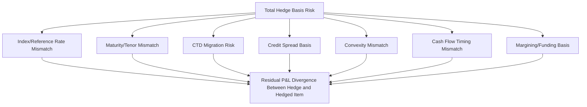

## Basis Risk in Interest Rate Hedges

### Definition and Conceptual Origin

Basis risk in interest rate hedging is the risk that the hedging instrument's price or rate does not move in perfect lockstep with the exposure being hedged, even when the hedge is correctly sized on a duration or BPV basis at inception. It arises whenever the hedge is a **cross hedge** — using an instrument that is related to, but not identical with, the hedged position — which describes the overwhelming majority of real-world interest rate hedges, since exact matching instruments rarely exist or are insufficiently liquid to trade efficiently.

**General Definition**

$$\text{Basis} = \text{Price (or Rate) of Hedged Item} - \text{Price (or Rate) of Hedging Instrument}$$

A hedge eliminates risk only if the basis is constant; basis risk is the risk that this basis itself changes unpredictably over the life of the hedge.

### Sources of Basis Risk

**1. Index/Reference Rate Mismatch**

The hedging instrument may reference a different underlying rate than the hedged exposure — for example, hedging a loan portfolio priced off an internal cost-of-funds benchmark using SOFR futures, or hedging Euribor-linked exposure with a €STR-based instrument. Even closely related benchmarks (e.g., 1-Month SOFR vs. 3-Month SOFR, or Term SOFR vs. compounded-in-arrears SOFR) can diverge, particularly around quarter-end funding stress or shifts in the credit and liquidity premia embedded in term lending markets.

**2. Maturity/Tenor Mismatch**

The hedge's maturity may not exactly match the hedged item's remaining life or reset schedule, requiring interpolation across the curve and introducing exposure to non-parallel curve shifts between the two tenors.

**3. Cheapest-to-Deliver (CTD) Migration**

For Treasury futures hedges specifically, a shift in yields can cause the deliverable basket's CTD bond to switch, discontinuously changing the futures contract's effective duration and BPV mid-hedge, as covered under futures-based hedging mechanics.

**4. Credit Spread Basis**

Hedging a credit-risky instrument (corporate bond, mortgage-backed security, municipal bond) with a government-rates-only instrument (Treasury futures, OIS/SOFR swap) leaves the credit spread component of the position unhedged. This **spread duration** risk can move independently of, and sometimes in the opposite direction from, the level of risk-free rates — notably during flight-to-quality episodes, when credit spreads widen even as government yields fall.

**5. Convexity Mismatch**

Bonds with embedded options (callable bonds, mortgage-backed securities) exhibit **negative convexity**, meaning their effective duration shortens as rates fall and lengthens as rates rise. A linear hedge (futures or swap) sized to match duration at a single point in time will under- or over-hedge as rates move away from that point, since the hedging instrument's BPV does not curve in the same way as the hedged asset's BPV.

**6. Cash Flow Timing Mismatch**

Even with identical reference rates, if reset or payment dates differ (e.g., a loan resets on the 15th of the month while the hedge fixes on the 1st), the realized rate at each date can differ due to intra-month rate movement, creating a residual timing basis.

**7. Margining and Funding Basis**

Futures are subject to daily variation margin, creating interim cash flows that must be funded, while the hedged cash position may not generate offsetting cash flows on the same schedule. This **funding/liquidity basis** does not affect the final hedge effectiveness at maturity under most conditions, but can create short-term liquidity strain during periods of sharp rate moves.

### Illustrative Diagram: Basis Risk Decomposition (svg_diagram)

### Quantifying Basis Risk: Regression-Based Hedge Ratios

Rather than relying purely on a theoretical BPV-matched hedge ratio, practitioners often estimate the **minimum-variance hedge ratio** empirically using historical regression of changes in the hedged item's value against changes in the hedging instrument's value:

$$\Delta P_{\text{hedged item}} = \alpha + \beta \times \Delta P_{\text{hedging instrument}} + \varepsilon$$

The **minimum-variance hedge ratio** is the regression slope $\beta$:

$$h^* = \beta = \frac{\text{Cov}(\Delta P_{\text{hedged}}, \Delta P_{\text{hedge}})}{\text{Var}(\Delta P_{\text{hedge}})}$$

**Hedge Effectiveness**

The $R^2$ of this regression measures hedge effectiveness — the proportion of the hedged item's price variance explained by (and therefore offset by) movements in the hedging instrument. A low $R^2$ signals substantial basis risk, indicating that a large portion of the hedged item's price variability is unrelated to the chosen hedge instrument and will remain unhedged regardless of position sizing.

$$R^2 = 1 - \frac{\text{Var}(\varepsilon)}{\text{Var}(\Delta P_{\text{hedged item}})}$$

### Worked Example: Quantifying Basis Risk in a Cross Hedge

An asset manager hedges a portfolio of BBB-rated corporate bonds using 10-year Treasury futures. Over a historical sample period, monthly changes in the corporate bond portfolio's value ($\Delta P_{\text{corp}}$) are regressed against monthly changes in the futures contract's value ($\Delta P_{\text{fut}}$), yielding:

- Regression slope $\beta = 0.85$
- $R^2 = 0.72$

**Interpretation**

- The minimum-variance hedge ratio suggests using only 85% of the BPV-matched notional implied by a pure duration-matching calculation, since empirically the corporate bonds have moved somewhat less than one-for-one with Treasury futures (reflecting the credit spread component's partial offsetting behavior)
- An $R^2$ of 0.72 indicates that approximately 28% of the corporate bond portfolio's price variance is *not* explained by Treasury futures movements — this unexplained variance corresponds primarily to credit spread risk, which the Treasury futures hedge does nothing to address
- The manager might supplement the rates hedge with a credit default swap (CDS) index position (e.g., CDX or iTraxx) to address the spread component separately, since Treasury futures alone leave substantial basis risk unhedged in a credit-risky portfolio

### Basis Risk Across Hedge Instrument Types

**Futures-Specific Basis Risk**

- CTD switch risk and the delivery option's effect on futures price behavior relative to any specific cash bond
- The **implied repo rate** and cash-and-carry relationship can shift with financing conditions, altering the futures-cash basis independent of rate direction

**Swap-Specific Basis Risk**

- Swap spread volatility — the swap-Treasury spread can widen or narrow due to dealer balance sheet constraints and relative supply/demand, independent of the level of rates, affecting hedges that combine Treasury exposure with swap overlays
- Floating index basis (e.g., 1M SOFR vs. 3M SOFR swaps) when the hedge's floating leg does not exactly match the hedged item's reset frequency

**Option-Specific Basis Risk**

- Volatility basis — implied volatility used to price the option hedge may not move consistently with the realized volatility or the specific volatility exposure embedded in the hedged item (e.g., a Bermudan-style prepayment option embedded in an MBS versus a European swaption hedge)
- Skew/smile basis — hedging with an at-the-money option when the actual exposure is more sensitive to a different strike introduces basis risk specific to the shape of the volatility surface

### Managing and Mitigating Basis Risk

- **Instrument selection** — choosing the most closely correlated available hedge instrument (e.g., using an asset swap or CDS overlay alongside a rates hedge for credit-risky bonds, rather than relying on Treasury futures alone)
- **Dynamic rebalancing** — periodically re-estimating the hedge ratio (via updated regression or updated BPV/CTD calculations) as market conditions, the CTD basket, or the credit spread environment evolve
- **Diversified hedge instruments** — combining multiple instruments (e.g., Treasury futures for rate risk plus a CDS index for credit spread risk) to address distinct basis components separately rather than relying on a single imperfect proxy
- **Stress testing the basis** — explicitly modeling scenarios where the historical correlation between hedge and hedged item breaks down (e.g., a flight-to-quality episode where credit spreads widen while Treasury yields fall), since basis relationships are frequently least stable exactly when a hedge is most needed
- **Accepting residual basis risk as a deliberate trade-off** — in many cases, eliminating all basis risk is either impossible or prohibitively costly (due to illiquidity in a perfectly matched instrument), so risk management frameworks explicitly quantify and set limits on acceptable residual basis exposure rather than assuming it away

### Basis Risk and Hedge Accounting

Under hedge accounting frameworks (e.g., ASC 815, IFRS 9), a hedge must demonstrate sufficient effectiveness — commonly assessed via the dollar-offset method or regression-based effectiveness testing — to qualify for favorable accounting treatment that allows gains/losses on the hedge and hedged item to be recognized in the same period. Excessive basis risk can cause a hedge to fail effectiveness thresholds, resulting in the hedge being accounted for at fair value through earnings independent of the hedged item, which can introduce earnings volatility that the hedge was intended to reduce [Unverified — specific effectiveness thresholds, testing frequency, and consequences of failed effectiveness tests vary by accounting standard, jurisdiction, and the reporting entity's elected hedge accounting policies].

### Practical Considerations and Limitations

- **Historical correlation is not guaranteed going forward** — regression-based minimum-variance hedge ratios are estimated from historical data and may not hold during regime changes, structural market shifts (e.g., the LIBOR-to-SOFR transition itself), or periods of unprecedented market stress
- **Basis risk versus outright unhedged risk is a spectrum, not a binary** — even an imperfect cross hedge with substantial basis risk typically reduces total risk relative to no hedge at all, though the residual risk should be explicitly sized and monitored rather than assumed to be negligible
- **Liquidity trade-offs** — the most basis-risk-minimizing instrument (e.g., a bespoke OTC swap matched exactly to the hedged item's cash flows) may be far less liquid and more expensive to transact and unwind than a more liquid but basis-risk-prone alternative (e.g., standardized futures)
- Behavior of basis relationships may vary substantially across interest rate regimes, credit cycles, and periods of market dislocation, and historical basis stability should not be treated as a permanent structural feature of the relationship between hedge and hedged item

**Related Topics**

- Interest Rate Futures and Futures Based Hedging
- Interest Rate Swaps and the Swap Curve
- Hedging Portfolio Duration with Derivatives
- Credit Default Swaps and Spread Duration Hedging
- Minimum-Variance Hedge Ratio Estimation and Regression Diagnostics
- Hedge Accounting and Effectiveness Testing (ASC 815 / IFRS 9)
- Cheapest-to-Deliver Dynamics and the Delivery Option
- Convexity Risk in Mortgage-Backed Securities Hedging