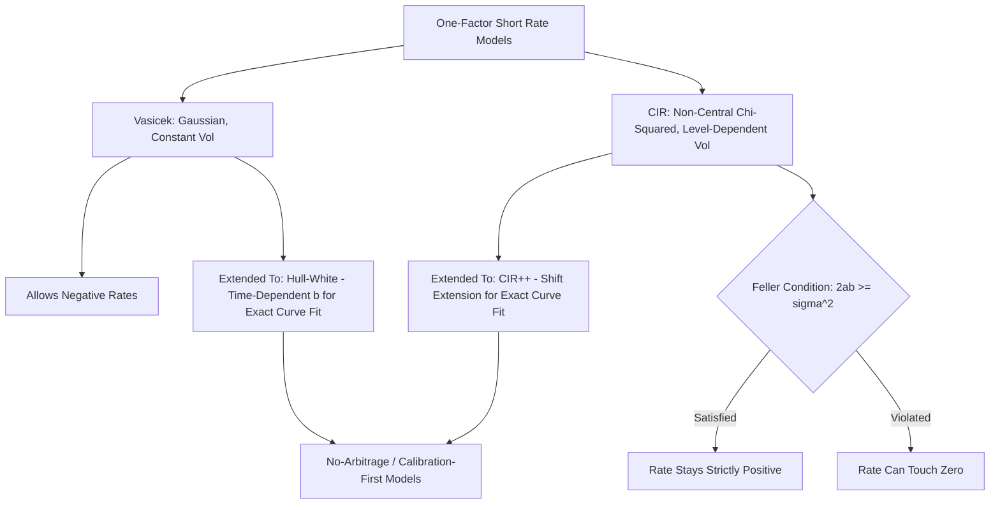

## Short Rate Models Vasicek and Cox Ingersoll Ross

### Role of Short Rate Models in Term Structure Modeling

Short rate models describe the evolution of the instantaneous risk-free rate $r(t)$ as a stochastic process, from which the entire term structure of interest rates (zero-coupon bond prices at every maturity) can be derived via no-arbitrage arguments. These models form the foundation of the equilibrium (as opposed to no-arbitrage/calibration-first) approach to term structure modeling, and remain widely taught and used for their analytical tractability, pedagogical clarity, and role as building blocks for more sophisticated multi-factor and no-arbitrage models.

**General Framework**

Under the risk-neutral measure $Q$, the price of a zero-coupon bond paying $1 at maturity $T$ is:

$$P(t,T) = E^Q\left[\exp\left(-\int_t^T r(s)\, ds\right) \Big| \mathcal{F}_t\right]$$

The specific dynamics assumed for $r(t)$ determine whether this expectation has a closed-form solution and what shapes of the yield curve and volatility structure the model can produce.

### The Vasicek Model

**Stochastic Differential Equation**

$$dr(t) = a(b - r(t))\, dt + \sigma\, dW(t)$$

where:

- $a$ = speed of mean reversion (how quickly $r$ is pulled back toward $b$)
- $b$ = long-run mean level of the short rate
- $\sigma$ = instantaneous volatility of the short rate
- $W(t)$ = a standard Brownian motion under the risk-neutral measure

**Key Properties**

- **Mean reversion** — the drift term $a(b - r(t))$ pulls the rate toward $b$: when $r(t) > b$, the drift is negative; when $r(t) < b$, the drift is positive
- **Ornstein-Uhlenbeck process** — the Vasicek short rate follows a Gaussian (normally distributed) mean-reverting process, meaning $r(t)$ is analytically tractable and normally distributed at any future time conditional on the current rate
- **Constant volatility** — $\sigma$ does not depend on the level of $r(t)$, which is the model's principal drawback

**Distribution of the Short Rate**

Conditional on $r(t)$, the rate at a future time $T$ is normally distributed:

$$r(T) \mid r(t) \sim \mathcal{N}\left(r(t)e^{-a(T-t)} + b\left(1 - e^{-a(T-t)}\right),\ \frac{\sigma^2}{2a}\left(1 - e^{-2a(T-t)}\right)\right)$$

**Closed-Form Zero-Coupon Bond Price**

$$P(t,T) = A(t,T)\, e^{-B(t,T) r(t)}$$

where:

$$B(t,T) = \frac{1 - e^{-a(T-t)}}{a}$$

$$A(t,T) = \exp\left[\left(b - \frac{\sigma^2}{2a^2}\right)\left(B(t,T) - (T-t)\right) - \frac{\sigma^2}{4a} B(t,T)^2\right]$$

**Critical Limitation: Negative Rates**

Because $r(t)$ is normally distributed, the Vasicek model assigns strictly positive probability to negative interest rates at any finite horizon. Historically treated as a theoretical flaw, this feature became less of a practical objection following the negative-rate environments observed in the Eurozone and Japan in the 2010s, though it remains a modeling consideration when negative rates are considered economically implausible for a given currency or period [Inference — the practical materiality of this limitation depends on the currency, time period, and horizon being modeled].

### The Cox-Ingersoll-Ross (CIR) Model

**Stochastic Differential Equation**

$$dr(t) = a(b - r(t))\, dt + \sigma \sqrt{r(t)}\, dW(t)$$

The CIR model shares the identical linear mean-reversion drift term with Vasicek, but modifies the diffusion (volatility) term to scale with $\sqrt{r(t)}$, making volatility proportional to the square root of the rate level.

**Key Properties**

- **Level-dependent volatility** — as $r(t) \to 0$, the diffusion term $\sigma\sqrt{r(t)} \to 0$, damping volatility near zero and making the rate less likely to cross into negative territory
- **Non-negativity (under a parameter condition)** — provided the **Feller condition** is satisfied:

  $$2ab \geq \sigma^2$$

  the process remains strictly positive for all time; if the Feller condition is violated, the process can reach zero (but is typically instantaneously reflected back to positive values, depending on boundary specification)
- **Non-central chi-squared distribution** — unlike Vasicek's Gaussian distribution, the CIR short rate follows a scaled non-central chi-squared distribution, which is more complex analytically but still permits closed-form bond pricing

**Closed-Form Zero-Coupon Bond Price**

$$P(t,T) = A(t,T)\, e^{-B(t,T) r(t)}$$

where, letting $\gamma = \sqrt{a^2 + 2\sigma^2}$:

$$B(t,T) = \frac{2\left(e^{\gamma(T-t)} - 1\right)}{(\gamma + a)\left(e^{\gamma(T-t)} - 1\right) + 2\gamma}$$

$$A(t,T) = \left[\frac{2\gamma\, e^{(a+\gamma)(T-t)/2}}{(\gamma + a)\left(e^{\gamma(T-t)} - 1\right) + 2\gamma}\right]^{2ab/\sigma^2}$$

### Comparison: Vasicek vs. CIR

| Feature | Vasicek | CIR |
| --- | --- | --- |
| Drift | $a(b - r)$ | $a(b - r)$ (identical) |
| Diffusion | $\sigma$ (constant) | $\sigma\sqrt{r}$ (level-dependent) |
| Distribution of $r(t)$ | Normal (Gaussian) | Non-central chi-squared |
| Can rates go negative? | Yes, always | No, if Feller condition holds |
| Volatility at low rates | Unchanged | Damped toward zero |
| Analytical tractability | High (affine, Gaussian) | High (affine, non-Gaussian) |
| Bond price form | Exponential-affine | Exponential-affine |

Both models belong to the broader class of **affine term structure models**, meaning bond yields are affine (linear plus constant) functions of the underlying state variable $r(t)$, which is precisely what permits their closed-form solutions.

### Illustrative Diagram: Short Rate Model Family Tree (svg_diagram)

### Calibration Approaches

**Parameter Estimation Methods**

- **Maximum likelihood estimation (MLE)** — using the known closed-form transition densities (Gaussian for Vasicek, non-central chi-squared for CIR) to fit $a$, $b$, $\sigma$ to historical short rate time series
- **Generalized method of moments (GMM)** — matching theoretical moments (mean, variance, autocorrelation) of the process to their sample equivalents, useful when full likelihood estimation is computationally burdensome
- **Cross-sectional calibration to the observed yield curve** — rather than fitting to historical rate time series, parameters (or a modified model with time-dependent parameters) are chosen to exactly reproduce the currently observed market yield curve, which is essential for pricing derivatives consistently with market prices

**The Curve-Fitting Limitation**

A fundamental practical drawback of both the pure Vasicek and CIR models is that, with only three constant parameters ($a$, $b$, $\sigma$), they generally **cannot exactly reproduce an arbitrarily shaped observed market yield curve** — the model-implied curve is constrained to a limited family of shapes. This motivated the development of extended models.

### Extensions to Exactly Fit the Initial Term Structure

**Hull-White Model (Extended Vasicek)**

$$dr(t) = \left[\theta(t) - a\, r(t)\right] dt + \sigma\, dW(t)$$

Replaces the constant long-run mean $ab$ with a time-dependent function $\theta(t)$, chosen specifically so that the model exactly reproduces the currently observed market discount curve. This transforms Vasicek from an equilibrium model into a no-arbitrage model consistent with today's observed rates, while retaining the same Gaussian analytical tractability and closed-form bond and option pricing formulas.

**CIR++ (Shifted CIR)**

$$r(t) = x(t) + \varphi(t)$$

where $x(t)$ follows the standard CIR process and $\varphi(t)$ is a deterministic shift function calibrated to force exact consistency with the initial observed term structure, analogous in spirit to the Hull-White extension of Vasicek.

### Applications

- **Bond and derivative pricing** — closed-form zero-coupon bond prices under both models permit analytical pricing of bond options, caps, floors, and swaptions under the model's assumed dynamics
- **Interest rate risk simulation** — Monte Carlo simulation of the short rate path under either model is used for scenario analysis, VaR calculation for interest-rate-sensitive portfolios, and stress testing
- **Credit risk modeling** — the CIR process (or its extensions) is also widely used to model stochastic default intensity in reduced-form credit risk models, given its non-negativity property, which is essential since a default intensity cannot be negative
- **Pension and insurance liability valuation** — mean-reverting short rate models inform long-horizon discount rate scenario generation for actuarial liability projections

### Worked Example: Vasicek Bond Pricing

Given Vasicek parameters $a = 0.15$, $b = 0.045$, $\sigma = 0.015$, and current short rate $r(t) = 0.04$, price a 5-year zero-coupon bond.

Step 1 — Compute $B(t,T)$ with $T - t = 5$:

$$B = \frac{1 - e^{-0.15 \times 5}}{0.15} = \frac{1 - e^{-0.75}}{0.15} = \frac{1 - 0.4724}{0.15} \approx 3.517$$

Step 2 — Compute $A(t,T)$:

$$b - \frac{\sigma^2}{2a^2} = 0.045 - \frac{0.015^2}{2 \times 0.15^2} = 0.045 - 0.005 = 0.040$$

$$A = \exp\left[0.040 \times (3.517 - 5) - \frac{0.015^2}{4 \times 0.15} \times 3.517^2\right]$$

$$= \exp\left[0.040 \times (-1.483) - 0.000375 \times 12.37\right] = \exp\left[-0.0593 - 0.00464\right] = \exp(-0.0640) \approx 0.9380$$

Step 3 — Compute the bond price:

$$P(t,T) = 0.9380 \times e^{-3.517 \times 0.04} = 0.9380 \times e^{-0.1407} = 0.9380 \times 0.8688 \approx 0.8150$$

The 5-year zero-coupon bond price is approximately 0.8150 (per $1 face value), implying a continuously compounded yield of approximately $-\ln(0.8150)/5 \approx 4.09\%$.

### Practical Considerations and Limitations

- **Single-factor limitation** — both models are driven by a single source of randomness, implying perfect correlation between rate changes at all maturities (a parallel-shift-only assumption), which does not match empirically observed imperfect correlation and independent curve-shape movements across maturities; multi-factor extensions (e.g., two-factor Vasicek, or the Longstaff-Schwartz two-factor CIR model) address this at the cost of additional complexity
- **Constant parameters vs. regime change** — $a$, $b$, and $\sigma$ are typically assumed constant over the modeling horizon, which may not hold across monetary policy regime shifts or structural breaks in rate dynamics [Inference — the appropriateness of constant-parameter assumptions depends on the length of the modeling horizon and the stability of the underlying monetary regime]
- **Feller condition in practice** — many empirically calibrated CIR parameter sets from historical data violate the Feller condition, meaning the theoretical non-negativity guarantee may not hold under real-world parameter estimates, requiring numerical schemes with careful boundary handling for simulation
- Behavior and calibration stability of these models may vary considerably depending on the historical estimation window used and prevailing market volatility conditions

**Related Topics**

- Hull-White Model and Trinomial Tree Implementation
- Multi-Factor Short Rate Models (Two-Factor Vasicek, Longstaff-Schwartz)
- Heath-Jarrow-Morton (HJM) Framework and Forward Rate Modeling
- LIBOR Market Model (LMM) / SOFR Market Model
- Affine Term Structure Models: General Theory
- Reduced-Form Credit Risk Models and Stochastic Default Intensity
- Monte Carlo Simulation for Interest Rate Risk
- Bond Option and Swaption Pricing Under Short Rate Models