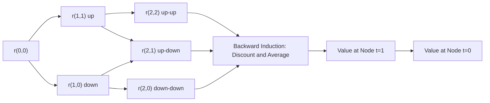
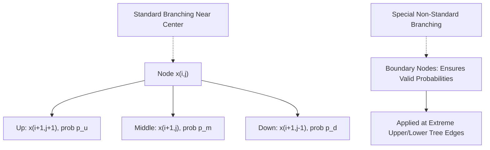

## Binomial and Trinomial Interest Rate Trees

### Role of Lattice Methods in Interest Rate Modeling

Binomial and trinomial trees are discrete-time, discrete-state lattice representations of a continuous-time short rate process, used to price interest rate derivatives — particularly those with American-style or Bermudan-style early exercise features, or path-dependent payoffs — where closed-form analytical solutions are unavailable or intractable. Trees discretize both time and the range of possible short rate values into a finite grid of nodes, at each of which the model-implied short rate and corresponding discount factor are computed, then use backward induction to value derivatives by working from maturity back to the valuation date.

### Binomial Interest Rate Trees

**Structure**

A binomial tree represents the short rate (or, in some formulations, one-period forward rates) at discrete time steps $\Delta t$, where from each node the rate can move to one of two possible states in the next period — an "up" state and a "down" state — each with an associated risk-neutral probability.

**Basic Recombining Binomial Lattice**

At each node $(i,j)$, representing time step $i$ and state $j$ (number of up-moves), the short rate is typically parameterized as:

$$r_{i,j} = r_{i,0} \times u^j$$

or, in an additive (Ho-Lee-style) formulation:

$$r_{i,j} = r_{i,0} + j \times \sigma\sqrt{\Delta t}$$

where $u$ is an up-move multiplicative factor and $r_{i,0}$ is the base rate at time step $i$, calibrated so the tree reproduces the initial market discount curve exactly (the same no-arbitrage calibration principle used in the continuous-time Ho-Lee and Hull-White models).

**Risk-Neutral Probabilities**

For a standard recombining binomial tree, the risk-neutral probability of an up-move $p$ is typically set to 0.5 in the simplest calibrated implementations (with the calibration burden placed instead on the level and spacing of the rates at each node), though more general implementations solve for $p$ jointly with the rate levels to match both the mean and variance of the underlying continuous-time process over each time step.

**Backward Induction Valuation**

Given a derivative's payoff at maturity, the value at each earlier node is computed as the discounted expected value of the two successor nodes:

$$V_{i,j} = \frac{1}{1 + r_{i,j} \Delta t}\left[p \times V_{i+1,j+1} + (1-p) \times V_{i+1,j}\right]$$

For American-style or Bermudan-style instruments, at each node the model additionally compares this "continuation value" against the immediate exercise value and takes the maximum (for a holder's option) or minimum (for a written/callable feature from the issuer's perspective):

$$V_{i,j} = \max\left(\text{Exercise Value}_{i,j},\ \text{Continuation Value}_{i,j}\right)$$

### Illustrative Diagram: Binomial Tree Structure (svg_diagram)

### The Black-Derman-Toy (BDT) Model

A widely used calibrated binomial short rate tree is the **Black-Derman-Toy model**, which assumes the short rate is lognormally distributed at each node and calibrates the tree in two dimensions simultaneously:

- The level of rates at each time step, to match the initial observed spot/discount curve exactly
- The spacing between "up" and "down" rates at each time step, to match the initial observed term structure of volatility (e.g., derived from cap or swaption implied volatilities)

**BDT Short Rate Parameterization**

$$r_{i,j} = r_{i,0} \times e^{2 j \sigma_i \sqrt{\Delta t}}$$

where $\sigma_i$ is the (potentially time-varying) short rate volatility at step $i$, allowing the model to fit a full term structure of volatility rather than a single constant $\sigma$, which is a key advantage of BDT relative to a simple Ho-Lee-style additive binomial tree.

### Trinomial Interest Rate Trees

**Structure and Motivation**

A trinomial tree extends each node to three possible successor states — "up," "middle," and "down" — rather than two. This added degree of freedom allows the tree to more accurately match both the mean and variance of a mean-reverting continuous-time process (such as Hull-White) over each discrete time step, while keeping the tree recombining (i.e., without an exponentially growing number of nodes) even as the branching structure shifts to accommodate mean reversion pulling nodes back toward the center.

**Hull-White Trinomial Tree (Standard Implementation)**

The Hull-White trinomial tree, the standard industry and textbook approach for implementing the Hull-White model on a lattice, is constructed in two stages:

**Stage 1 — Build an auxiliary tree for $x(t)$**

Construct a trinomial tree for a simplified process $x(t)$ (with $x(0) = 0$) representing deviations from the deterministic drift, using constant time steps $\Delta t$ and node spacing $\Delta x = \sigma\sqrt{3\Delta t}$, which is chosen specifically to ensure numerical stability and correct variance matching.

**Branching probabilities** at a standard (non-boundary) node are set to match the local mean and variance of the mean-reverting process:

$$p_u = \frac{1}{6} + \frac{a^2 j^2 (\Delta t)^2 - a j \Delta t}{2}, \quad p_m = \frac{2}{3} - a^2 j^2 (\Delta t)^2, \quad p_d = \frac{1}{6} + \frac{a^2 j^2 (\Delta t)^2 + a j \Delta t}{2}$$

where $j$ is the node's position (number of spacings from the center) at that time step.

**Stage 2 — Shift the tree to fit the initial term structure**

Add a deterministic, time-dependent shift $\alpha_i$ to every node at time step $i$ (analogous to integrating $\theta(t)/a$ over each step in continuous time), chosen so that discounting through the shifted tree exactly reproduces the initially observed market discount factors $P(0, t_i)$ at every time step. The actual short rate at each node is then:

$$r_{i,j} = x_{i,j} + \alpha_i$$

**Handling Mean Reversion at the Boundaries**

As nodes move further from the center, standard branching probabilities can become negative, violating the requirement that probabilities lie in $[0,1]$. The Hull-White tree addresses this with special **non-standard branching** at the upper and lower boundaries of the tree, using asymmetric branching patterns (e.g., branching down-down-down from an extreme upper node) that still preserve the correct local mean and variance while keeping all probabilities valid.

### Illustrative Diagram: Trinomial Tree Branching (svg_diagram)

### Backward Induction in a Trinomial Tree

Given a derivative payoff specified at each terminal node, the value at node $(i,j)$ is:

$$V_{i,j} = e^{-r_{i,j} \Delta t}\left[p_u V_{i+1,j+1} + p_m V_{i+1,j} + p_d V_{i+1,j-1}\right]$$

with early-exercise comparison applied at each node for American/Bermudan-style instruments, identical in principle to the binomial case but now averaging over three successor nodes rather than two.

### Comparison: Binomial vs. Trinomial Trees

| Feature | Binomial | Trinomial |
| --- | --- | --- |
| Successor states per node | 2 | 3 |
| Degrees of freedom per step | Limited (level + spacing) | Greater (level, spacing, and branching shape) |
| Best suited for | Simple models (Ho-Lee-style), BDT | Mean-reverting models (Hull-White) |
| Handling mean reversion | Requires care to avoid excessive tree width | Naturally accommodated via shifting branching |
| Convergence speed | Slower per number of time steps, generally | Faster convergence per time step for equivalent accuracy |
| Industry standard for | Simpler lognormal short rate models | Hull-White and related Gaussian mean-reverting models |

### Worked Example: One Step of Hull-White Trinomial Branching

Given $a = 0.10$, $\Delta t = 0.5$, and node position $j = 2$ (two spacings above center):

Step 1 — Compute $a j \Delta t$ and $(a j \Delta t)^2$:

$$a j \Delta t = 0.10 \times 2 \times 0.5 = 0.10$$

$$a^2 j^2 (\Delta t)^2 = (0.10)^2 = 0.01$$

Step 2 — Compute the three branching probabilities:

$$p_u = \frac{1}{6} + \frac{0.01 - 0.10}{2} = 0.1667 - 0.045 = 0.1217$$

$$p_m = \frac{2}{3} - 0.01 = 0.6567$$

$$p_d = \frac{1}{6} + \frac{0.01 + 0.10}{2} = 0.1667 + 0.055 = 0.2217$$

Step 3 — Verify the probabilities sum to 1:

$$0.1217 + 0.6567 + 0.2217 = 1.0001 \approx 1$$

(Minor rounding.) Note that at this positive $j$ (a node above the tree's center), the upward probability $p_u$ is reduced and the downward probability $p_d$ is increased relative to the central-node values of $1/6$ and $1/6$, reflecting the mean-reversion force pulling the rate back down toward the center — the mechanism by which the tree encodes mean reversion into its branching structure rather than its rate spacing.

### Applications

- **Callable and putable bond valuation** — the issuer's or holder's embedded option is naturally handled via the exercise-comparison step at each tree node during backward induction
- **Bermudan swaption pricing** — trees allow exercise to be evaluated at each of the swaption's specified exercise dates, which correspond to specific time steps in the tree
- **Mortgage-backed security analysis** — trees combined with a prepayment model overlay allow valuation of the negative convexity arising from borrower prepayment optionality
- **Convertible bond valuation** — trees can combine interest rate risk with an equity conversion feature in a hybrid lattice framework, though this typically requires a two-factor (equity and rate) tree or a coupled PDE approach
- **Structured note and embedded derivative valuation** — many structured products with path-independent, early-exercisable features are valued using calibrated trinomial trees for computational efficiency relative to full Monte Carlo simulation

### Practical Considerations and Limitations

- **Number of time steps and convergence** — tree-based prices converge to the true continuous-time model price as the number of time steps increases and $\Delta t \to 0$, but computational cost grows with the number of steps and (for non-recombining structures) the number of nodes, requiring a practical trade-off between accuracy and computation time [Inference — the specific number of steps needed for acceptable convergence depends on the instrument's sensitivity to the underlying rate distribution and the required pricing precision]
- **Single-factor limitation inherited from the underlying model** — trees built on single-factor models (Ho-Lee, Hull-White, BDT) inherit the same perfectly-correlated-curve-movement limitation as their continuous-time counterparts; multi-factor tree or lattice extensions exist but substantially increase implementation complexity
- **Boundary condition sensitivity** — the special non-standard branching required at tree boundaries in the trinomial case must be implemented carefully, since errors here can introduce arbitrage inconsistencies or valuation biases, particularly for deep out-of-the-money options whose value is sensitive to extreme tail nodes
- **Calibration instrument choice** — the specific set of cap, floor, or swaption instruments used to calibrate volatility parameters embedded in the tree construction affects the resulting exercise boundaries and prices for Bermudan/American instruments, meaning results can differ depending on which calibration instruments were prioritized [Unverified — the practical magnitude of calibration-instrument-choice sensitivity depends on the specific instrument being priced and the shape of the market volatility surface at calibration time]

**Related Topics**

- No Arbitrage Models Ho Lee and Hull White
- Short Rate Models Vasicek and Cox Ingersoll Ross
- Black-Derman-Toy Model and Volatility Term Structure Calibration
- Bermudan Swaption Valuation Methods
- Callable Bond and Mortgage-Backed Security Optionality Valuation
- Monte Carlo Simulation for Path-Dependent Interest Rate Derivatives
- Finite Difference Methods for PDE-Based Derivative Pricing
- Convertible Bond Valuation and Hybrid Lattice Models