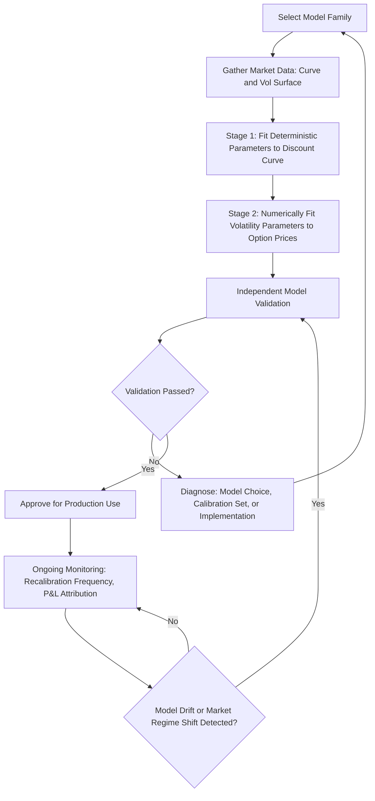

## Model Calibration and Validation

### Purpose and Scope

Model calibration and validation encompass the processes by which a chosen term structure or derivative pricing model's parameters are fit to observed market data, and by which the resulting model is subsequently tested, documented, and governed to ensure it produces reliable, consistent, and appropriately bounded outputs before and during production use. These two activities are distinct but tightly linked: calibration determines *what* parameter values a model uses, while validation determines *whether* the calibrated model, and the calibration process itself, can be trusted for its intended pricing and risk management purposes.

### Calibration: Core Concepts

**Calibration Objective**

Calibration selects model parameters $\Theta$ (e.g., $a$, $\sigma$ for Hull-White; $a$, $b$, $\sigma$ for Vasicek/CIR; correlation and volatility structures for LMM) to minimize the discrepancy between model-implied prices and observed market prices across a chosen set of liquid calibration instruments:

$$\min_{\Theta} \sum_{i=1}^{n} w_i \left(\text{Model Price}_i(\Theta) - \text{Market Price}_i\right)^2$$

where $w_i$ are weights reflecting the relative importance, liquidity, or reliability of each calibration instrument.

**Two-Stage Calibration Pattern**

Most term structure models separate calibration into two conceptually distinct stages:

1. **Exact curve fitting** — deterministic time-dependent parameters (e.g., $\theta(t)$ in Hull-White, or the base rate level at each tree node in BDT) are solved analytically or via straightforward bootstrapping to exactly reproduce the initial observed discount curve, since failing to match the underlying discount curve exactly would introduce arbitrage relative to the very bonds used to construct that curve
2. **Volatility parameter fitting** — remaining constant or slowly time-varying parameters (mean reversion speed, volatility level, correlation structure) are fit via numerical optimization to match observed option prices (caps, floors, swaptions), since these parameters cannot generally be solved for in closed form and require an iterative search procedure

### Calibration Instrument Selection

**Choosing the Calibration Universe**

The choice of which market instruments to include in the calibration set materially affects the resulting parameters and the model's subsequent pricing behavior for instruments outside that set:

- **At-the-money (ATM) instruments only** — calibrating solely to ATM caps/swaptions produces a model well-suited to pricing similarly-moneyness instruments, but may perform poorly for deep in- or out-of-the-money exotic payoffs whose value depends heavily on the volatility smile
- **Full smile/cube calibration** — including a range of strikes across the volatility surface (requiring a model rich enough to capture smile effects, such as SABR-extended frameworks) produces a more broadly applicable calibration at the cost of greater implementation complexity
- **Instrument relevance to the target exotic** — calibration instruments should ideally be chosen to closely match the risk profile (tenor, strike, underlying index) of the exotic instrument ultimately being priced, since a globally well-fitting calibration is not the same as a calibration well-suited to a specific pricing task

### Illustrative Diagram: Calibration and Validation Lifecycle (svg_diagram)

### Numerical Optimization Methods for Calibration

**Local Optimization**

- **Levenberg-Marquardt algorithm** — a standard nonlinear least-squares optimizer widely used for calibration problems with a moderate number of parameters and a reasonably well-behaved (locally convex) objective function, combining gradient-descent and Gauss-Newton approaches for robust convergence
- **Gradient-based methods (BFGS, conjugate gradient)** — efficient when analytical or accurate numerical gradients of the model price with respect to parameters are available

**Global Optimization**

- **Differential evolution, simulated annealing, genetic algorithms** — used when the calibration objective function has multiple local minima (common in richer models with many parameters, such as full LMM correlation and volatility structures), since local optimizers can converge to a poor local minimum depending on the starting point
- **Multi-start local optimization** — a practical compromise, running a local optimizer from multiple randomized starting points and selecting the best resulting fit, balancing computational cost against the risk of local-minimum convergence

**Regularization**

To avoid overfitting (where the model achieves a very close fit to the specific calibration instruments but produces implausible or unstable parameter values), a regularization term is often added to the objective function, penalizing large deviations from a prior parameter estimate (e.g., the previous day's calibrated parameters) or excessive parameter magnitude:

$$\min_{\Theta} \sum_{i} w_i \left(\text{Model Price}_i(\Theta) - \text{Market Price}_i\right)^2 + \lambda \|\Theta - \Theta_{\text{prior}}\|^2$$

where $\lambda$ controls the strength of the regularization penalty relative to the fit quality objective.

### Validation: Core Concepts

**Purpose of Independent Model Validation**

Model validation is typically performed by a function independent of the model's developers (in regulated financial institutions, often a dedicated Model Risk Management function), and assesses whether the model is conceptually sound, correctly implemented, and appropriately used for its intended purpose, rather than simply confirming the model fits calibration instruments well.

**Key Validation Dimensions**

- **Conceptual soundness** — reviewing whether the model's underlying assumptions (e.g., single-factor vs. multi-factor, lognormal vs. Gaussian rate distribution, choice of volatility structure) are appropriate for the instruments and risk factors it will be used to price
- **Implementation testing** — verifying the code correctly implements the intended mathematical model, typically via independent re-implementation of key formulas, unit testing against known closed-form benchmark cases, and comparison against alternative numerical methods (e.g., comparing a trinomial tree price against a Monte Carlo price for the same instrument)
- **Calibration process review** — assessing whether the calibration instrument selection, optimization method, and regularization approach are appropriate and stable, including sensitivity testing of the resulting parameters to small perturbations in the calibration inputs
- **Benchmarking against alternative models** — comparing the model's prices and risk sensitivities against one or more alternative, independently developed models for a representative sample of instruments, to identify material discrepancies warranting further investigation
- **Backtesting** — comparing historical model-implied prices, hedge ratios, or risk measures against subsequently realized market outcomes, though backtesting term structure model calibration quality is inherently limited by the relatively short history of clean market data for many instruments and by the fact that models are recalibrated frequently, making a clean "prediction vs. outcome" backtest more complex than in some other quantitative domains [Inference — the specific backtesting methodology and its statistical power vary substantially by institution and instrument class]

### Goodness-of-Fit Diagnostics

**Calibration Error Metrics**

$$\text{RMSE} = \sqrt{\frac{1}{n}\sum_{i=1}^{n}\left(\text{Model Price}_i - \text{Market Price}_i\right)^2}$$

$$\text{Mean Absolute Percentage Error (MAPE)} = \frac{1}{n}\sum_{i=1}^{n}\left|\frac{\text{Model Price}_i - \text{Market Price}_i}{\text{Market Price}_i}\right|$$

**Residual Pattern Analysis**

Beyond a single aggregate error metric, validators typically examine whether calibration residuals (model minus market price, or model minus market implied volatility) exhibit systematic patterns across strike, tenor, or maturity — for example, a model that fits short-dated instruments well but shows persistently large residuals at long tenors indicates the model or calibration set may be inadequate for long-dated exotic pricing, even if the aggregate RMSE across all instruments appears acceptable.

### Parameter Stability Analysis

**Time-Series Stability**

Calibrated parameters (e.g., mean reversion speed $a$, volatility $\sigma$) are tracked over successive calibration dates (daily, weekly) to assess whether they exhibit reasonable stability or excessive, economically implausible jumpiness, since highly unstable calibrated parameters can produce correspondingly unstable computed hedge ratios (Greeks), creating operational and hedging cost issues even if each individual day's calibration achieves a good fit.

**Sensitivity to Calibration Instrument Set**

Validators commonly test how sensitive the resulting calibrated parameters and downstream exotic prices are to reasonable variations in the calibration instrument set (e.g., excluding the least liquid tenors, or reweighting ATM versus skew instruments), since a calibration that produces dramatically different results under small, defensible changes to instrument selection suggests the calibration problem may be under-determined or the objective function poorly conditioned for the available data.

### Model Risk Governance Framework

**Model Risk Management (MRM) Lifecycle**

In regulated financial institutions, model calibration and validation typically operate within a broader model risk governance framework, commonly informed by supervisory guidance such as the U.S. Federal Reserve/OCC's SR 11-7 or equivalent regional regulatory expectations, encompassing:

- **Model inventory and tiering** — cataloging all models in use and classifying them by materiality/risk tier, with more intensive validation requirements for higher-tier models used for significant valuation or risk decisions
- **Independent validation prior to deployment** — requiring sign-off from a function independent of model development before a new model or material model change is used in production
- **Ongoing monitoring and periodic revalidation** — establishing a schedule for re-assessing previously validated models, particularly following material market regime changes, extended periods without recalibration review, or observed performance issues
- **Model limitations documentation** — explicitly documenting known model weaknesses, the range of instruments/market conditions for which the model is considered appropriate, and any compensating controls (e.g., valuation adjustments, additional reserves) applied to address known limitations

**Valuation Adjustments for Model Risk**

Institutions frequently hold explicit reserves or valuation adjustments against model risk uncertainty, particularly for exotic instruments priced using models with acknowledged limitations (e.g., single-factor model risk for genuinely multi-factor-sensitive payoffs, or smile/skew model risk for instruments highly sensitive to strikes far from calibration instruments), reducing the reported fair value to reflect the additional uncertainty beyond the point estimate the model produces.

### Worked Example: Diagnosing a Calibration Problem

A Hull-White model calibrated to a set of 1-year and 5-year expiry ATM swaptions produces excellent fit (RMSE under 0.5 vega points) for those two expiries, but when used to price a 10-year expiry Bermudan swaption, produces a price that diverges by over 15% from an independent LMM-based benchmark valuation for the same instrument.

**Diagnostic Steps**

1. Check whether 10-year expiry swaptions were included in the original calibration set — if not, the model was never validated to fit that segment of the volatility surface, and the divergence may simply reflect poor extrapolation beyond the calibrated region rather than a model implementation error
2. Recalibrate including 10-year expiry instruments explicitly and re-examine the resulting parameter stability and fit quality across all tenors simultaneously, checking whether a single set of Hull-White parameters can reasonably fit the full term structure of volatility or whether the single-factor, single-$a$ structure is fundamentally too restrictive for this instrument's risk profile
3. If a single-factor Hull-White model cannot adequately span the full volatility term structure required, this is evidence supporting the conceptual soundness concern that a richer model (e.g., LMM, or a two-factor Hull-White extension) may be required for reliable pricing of long-dated Bermudan-style exotics, rather than treating the discrepancy as solely a calibration-instrument-selection issue

This illustrates how calibration diagnostics and model validation are iterative and interconnected — a large pricing discrepancy can originate from an inadequate calibration instrument set, an implementation defect, or a genuine conceptual limitation of the chosen model family, and distinguishing between these root causes is a central task of the validation process.

### Practical Considerations and Limitations

- **Calibration is a point-in-time snapshot** — a model calibrated to today's market prices provides no guarantee about tomorrow's calibration quality or parameter stability, particularly across periods of significant market stress or regime change, meaning ongoing monitoring (not just point-in-time validation at model launch) is essential
- **Overfitting vs. underfitting trade-off** — a model with many free parameters can achieve an arbitrarily close fit to calibration instruments while producing poorly-behaved, unstable, or economically implausible extrapolated prices for instruments outside the calibration set; regularization and out-of-sample testing help manage this trade-off but do not eliminate it entirely
- **Validation resource constraints** — the depth of independent validation achievable in practice depends on the validating function's resources, expertise, and independence from model developers, and validation rigor can vary substantially across institutions and model tiers [Unverified — the specific depth and frequency of validation activity is institution- and jurisdiction-specific, governed by internal policy and applicable regulatory expectations]
- Behavior of calibration stability, goodness-of-fit, and appropriate model choice may vary considerably across asset classes, currencies, and market volatility regimes, and a model validated as appropriate in one regime should not be assumed to remain appropriate without re-examination following a material regime shift

**Related Topics**

- No Arbitrage Models Ho Lee and Hull White
- Monte Carlo Simulation for Fixed Income
- SABR Model Calibration and Volatility Smile Dynamics
- LIBOR Market Model (LMM) / SOFR Market Model
- Model Risk Management Frameworks and Regulatory Guidance (SR 11-7)
- Hedge Accounting and Effectiveness Testing (ASC 815 / IFRS 9)
- Backtesting Methodologies for Quantitative Risk Models
- Valuation Adjustments (XVA) and Model Risk Reserves