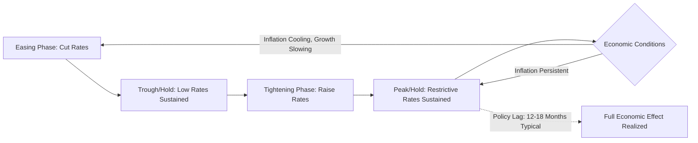

## Central Bank Policy and the Interest Rate Cycle

### Role of Central Banks in Determining Interest Rates

Central banks influence the level and trajectory of interest rates primarily through the setting of a short-term policy rate and, increasingly since the 2008 financial crisis, through balance sheet operations (quantitative easing/tightening) and forward guidance about future policy intentions. Understanding the policy framework and cycle dynamics is essential context for fixed income and duration analysis, since virtually every rate discussed elsewhere in this domain — futures, swaps, FRAs, the short rate models used to describe their evolution — is anchored, directly or indirectly, to expectations about the path of central bank policy.

### Key Policy Rates by Major Central Bank

- **U.S. Federal Reserve** — the **Federal Funds Rate** target range, implemented via open market operations and, since 2008, interest on reserve balances (IORB) and the overnight reverse repo (ON RRP) facility as the effective floor and ceiling of the target range
- **European Central Bank (ECB)** — the **Deposit Facility Rate**, **Main Refinancing Operations (MRO) Rate**, and **Marginal Lending Facility Rate**, forming a three-rate corridor system
- **Bank of England** — the **Bank Rate**, set by the Monetary Policy Committee (MPC)
- **Bank of Japan** — historically near-zero or negative policy rates for an extended period, moving to a policy of yield curve control (YCC) targeting the 10-year Japanese Government Bond yield alongside the short-term policy rate, before beginning a gradual policy normalization process [Unverified — the precise current BoJ policy stance and YCC framework status should be verified against current sources given the pace of change in this area]

### The Standard Interest Rate Cycle

**Phases of a Typical Cycle**

1. **Easing phase** — the central bank lowers its policy rate in response to below-target inflation, rising unemployment, or a negative growth/demand shock, aiming to stimulate borrowing, investment, and consumption
2. **Trough/hold phase** — the policy rate is held at a low level for a period, often accompanied by explicit forward guidance about the conditions required before tightening will begin
3. **Tightening phase** — the central bank raises its policy rate in response to above-target inflation, an overheating economy, or asset price/financial stability concerns, aiming to cool demand and rein in inflationary pressure
4. **Peak/hold phase** — the policy rate is held at a restrictive level to allow the cumulative effect of prior tightening to work through the economy (given well-documented "long and variable lags" between policy changes and their full economic effect)
5. **Pivot to easing** — the cycle begins anew as the central bank responds to slowing growth, an emerging economic downturn, or achieved progress toward its inflation objective

### Illustrative Diagram: Standard Central Bank Policy Cycle (svg_diagram)

### Monetary Policy Transmission Mechanism

The policy rate affects the broader economy, and consequently the shape of the yield curve and fixed income markets, through several interconnected channels:

- **Interest rate channel** — changes in the policy rate flow through to short-term money market rates, then to longer-term borrowing costs via the expectations component of the term structure, affecting consumer and business borrowing decisions
- **Credit channel** — tighter policy can constrain bank lending capacity and willingness, affecting credit availability independent of the pure rate-level effect
- **Asset price channel** — policy changes affect equity valuations, bond prices, and other asset prices through discount rate effects, influencing wealth and, in turn, consumption
- **Exchange rate channel** — relative policy stances across countries affect currency values, which affect net exports and imported inflation
- **Expectations/signaling channel** — forward guidance about the future policy path affects longer-term rates immediately, even before actual policy changes occur, since longer-dated rates embed market expectations of the average future short rate path plus a term premium

### Forward Guidance and Its Effect on the Term Structure

**Types of Forward Guidance**

- **Odyssean (commitment-based) guidance** — an explicit commitment to a future policy path or conditions, intended to shape market expectations more powerfully than a simple forecast
- **Delphic (forecast-based) guidance** — a statement of the central bank's own expectations for the economy and likely policy response, without a binding commitment

**Effect on Rates**

Because the swap curve and Treasury curve are forward-looking, effective forward guidance can shift the entire curve immediately upon announcement, even absent any actual change in the current policy rate, since market participants revise their expectations of the future policy path and reprice accordingly. This is why the **expectations hypothesis** component of term structure theory places heavy weight on central bank communication as a driver of medium- and long-term rate levels, alongside the term premium component.

### Quantitative Easing (QE) and Quantitative Tightening (QT)

**Quantitative Easing**

Large-scale asset purchases (typically government bonds and, in some programs, mortgage-backed securities or corporate bonds) by which a central bank expands its balance sheet, intended to lower longer-term yields directly (through duration extraction from the market, reducing the aggregate supply of duration risk investors must hold) when the policy rate is already at or near its effective lower bound and further conventional rate cuts are constrained.

**Quantitative Tightening**

The reverse process — allowing purchased assets to mature without reinvestment (passive runoff) or actively selling holdings — intended to normalize the balance sheet and remove some of the earlier downward pressure on longer-term yields, generally conducted more gradually than QE implementation to avoid excessive market disruption.

**Effect on the Yield Curve**

QE and QT are frequently described as operating primarily on the **term premium** component of longer-term yields (the compensation investors require for bearing duration risk) rather than the **expectations** component (the average expected future short rate), since QE changes the net supply of duration that the private market must absorb without directly changing the expected future path of the policy rate itself [Inference — the precise decomposition between term premium and expectations effects of QE/QT is subject to ongoing empirical debate and varies across studies and estimation methodologies].

### The Yield Curve as a Cycle Indicator

**Yield Curve Inversion**

An inverted yield curve (short-term rates exceeding long-term rates, commonly measured via the 2-year/10-year or 3-month/10-year Treasury spread) has historically preceded U.S. recessions, generally interpreted as reflecting market expectations that the central bank will need to cut rates in the future in response to an anticipated economic slowdown, pulling down longer-term rates (which embed expected future short rates) even as the current short-term policy rate remains elevated.

**Limitations of the Indicator**

- Lead times between inversion and subsequent recession have varied considerably across historical episodes
- Structural factors unrelated to growth expectations (e.g., persistent demand for long-duration safe assets from pension funds and insurers, or QE-related term premium compression) can independently flatten or invert the curve, complicating the indicator's interpretation in any given episode [Inference — the relative contribution of cyclical growth expectations versus structural/technical factors to any specific inversion episode is difficult to disentangle in real time]

### Central Bank Independence and Policy Frameworks

**Inflation Targeting**

Most major central banks operate under an explicit or implicit inflation target (commonly 2% for many advanced-economy central banks), using the policy rate as the primary tool to steer realized and expected inflation toward that target over a specified horizon, while typically also considering broader macroeconomic stability (the Federal Reserve's dual mandate additionally includes maximum employment).

**Reaction Function Concepts**

- **Taylor Rule** — a stylized formula relating the appropriate policy rate to the deviation of inflation from target and the output gap (deviation of actual from potential GDP), widely used as a benchmark for assessing whether observed policy is relatively accommodative or restrictive relative to a rules-based reference point:

$$i_t = r^* + \pi_t + 0.5(\pi_t - \pi^*) + 0.5(y_t - y_t^*)$$

where $i_t$ is the nominal policy rate, $r^*$ is the assumed neutral real rate, $\pi_t$ is current inflation, $\pi^*$ is the inflation target, and $(y_t - y_t^*)$ is the output gap. Actual central bank decision-making incorporates considerably more judgment and additional data than this stylized rule captures, but the Taylor Rule remains a widely referenced benchmark in market commentary and academic analysis.

### Practical Implications for Fixed Income Positioning

- **Duration positioning across the cycle** — extending duration ahead of an anticipated easing cycle (to capture price appreciation as yields fall) versus shortening duration ahead of an anticipated tightening cycle are classic tactical positioning decisions directly informed by central bank cycle analysis
- **Curve positioning** — steepener trades are frequently associated with anticipated easing cycles (short rates falling faster than long rates), while flattener trades are associated with anticipated tightening cycles, though the specific curve response depends heavily on the market's assessment of the terminal policy rate and the credibility of the central bank's inflation-fighting commitment
- **Cross-market policy divergence** — differing policy cycle positions across major central banks (e.g., one central bank easing while another holds or tightens) drive relative value opportunities across currency-hedged fixed income positioning and inform cross-currency basis dynamics
- **Volatility around policy meetings** — implied volatility in caps, floors, and swaptions frequently rises ahead of scheduled central bank policy meetings and major economic data releases that could shift the anticipated policy path, reflecting genuine uncertainty about the near-term rate path rather than a change in the underlying term structure model's assumptions

### Practical Considerations and Limitations

- **Policy lags are variable and uncertain** — the commonly cited "12 to 18 month" transmission lag for monetary policy to fully affect the real economy is an approximation based on historical experience and can vary considerably depending on prevailing credit conditions, household and corporate balance sheet health, and the specific transmission channels most active in a given cycle [Inference — the specific lag length for any given tightening or easing episode cannot be known with precision in real time and is typically only assessed with confidence in retrospect]
- **Forward guidance credibility** — the market impact of forward guidance depends heavily on the central bank's perceived credibility and consistency; guidance that is subsequently reversed or not followed through can reduce its effectiveness in shaping expectations during future episodes
- **Cycle timing predictions are inherently uncertain** — while the phases described above represent a stylized, commonly observed pattern, the actual timing, magnitude, and duration of each phase in any specific cycle depends on evolving economic data and cannot be predicted with precision, and historical cycle patterns should not be assumed to repeat identically in future cycles
- Current policy rates, stances, and central bank communication should be verified against up-to-date sources given the pace at which monetary policy conditions can change

**Related Topics**

- Interest Rate Swaps and the Swap Curve
- Short Rate Models Vasicek and Cox Ingersoll Ross
- Term Premium and the Expectations Hypothesis of the Term Structure
- Yield Curve Inversion as a Recession Indicator
- Quantitative Easing and Balance Sheet Policy Transmission
- Taylor Rule and Monetary Policy Reaction Functions
- Cross-Currency Basis and International Policy Divergence
- Inflation Expectations and Breakeven Inflation Rates