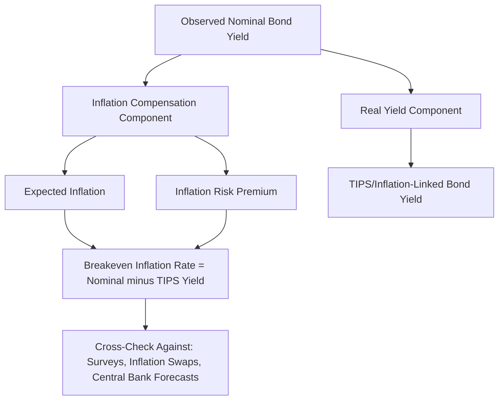

## Inflation Expectations and Real versus Nominal Rates

### The Fisher Equation: Decomposing Nominal Rates

The foundational relationship linking nominal interest rates, real interest rates, and inflation expectations is the **Fisher equation**, which states that the nominal interest rate compensates a lender for both the pure time value of money (the real rate) and the expected erosion of purchasing power over the loan's life (expected inflation).

**Exact Fisher Equation**

$$(1 + i) = (1 + r) \times (1 + \pi^e)$$

**Approximate (Linearized) Fisher Equation**

For moderate rate and inflation levels, the cross-term $r \times \pi^e$ is small and the relationship is commonly approximated as additive:

$$i \approx r + \pi^e$$

where:

- $i$ = nominal interest rate
- $r$ = real interest rate (the return in terms of actual purchasing power)
- $\pi^e$ = expected inflation over the relevant horizon

This decomposition underlies nearly all fixed income analysis that distinguishes between the compensation investors demand for expected inflation versus the compensation for genuine time preference and risk, and is essential for understanding why nominal yields alone can be a misleading measure of the true cost of borrowing or the true return to lending during periods of volatile or shifting inflation expectations.

### Real Rates: Definition and Drivers

**Ex Ante vs. Ex Post Real Rates**

- **Ex ante real rate** — calculated using *expected* future inflation, representing the real rate anticipated by market participants at the time a bond is purchased or a loan is made
- **Ex post real rate** — calculated using *realized* (actual) inflation after the fact, representing the real return actually earned; this diverges from the ex ante real rate whenever realized inflation differs from what was expected

**Fundamental Drivers of the Real Rate**

The real interest rate is theoretically determined by the balance of desired savings and desired investment in the economy, and is influenced by:

- **Productivity growth expectations** — higher expected future productivity growth tends to raise the equilibrium real rate, as it increases the expected return on capital investment
- **Demographic factors** — an aging population with a higher savings propensity (a larger cohort saving for retirement) tends to depress the equilibrium real rate by increasing the supply of loanable funds relative to investment demand
- **Global savings and investment imbalances** — persistent current account surpluses in some regions (representing excess savings relative to domestic investment) can exert downward pressure on real rates globally through cross-border capital flows
- **Fiscal policy stance** — large sustained government borrowing can, all else equal, place upward pressure on real rates by increasing the aggregate demand for loanable funds, though this effect can be offset or amplified by central bank balance sheet policy and other factors

### Measuring Inflation Expectations

**Market-Based Measures: Breakeven Inflation Rates**

The most direct market-based measure of inflation expectations is the **breakeven inflation rate**, derived from the yield spread between a nominal bond and an inflation-protected bond (e.g., U.S. Treasury Inflation-Protected Securities, TIPS) of the same maturity:

$$\text{Breakeven Inflation} = Y_{\text{nominal}} - Y_{\text{TIPS (real)}}$$

This spread represents the average inflation rate over the bond's life that would make an investor indifferent between holding the nominal bond and the inflation-protected bond, combining both the market's inflation expectation and an **inflation risk premium** (additional compensation nominal bondholders require for bearing the risk that realized inflation exceeds expectations).

**Survey-Based Measures**

- **University of Michigan Survey of Consumers** — a widely cited measure of household inflation expectations over 1-year and 5-to-10-year horizons
- **Survey of Professional Forecasters (SPF)** — professional economist forecasts of inflation over various horizons, published by regional Federal Reserve banks
- **Central bank surveys** — many central banks conduct their own surveys of business and household inflation expectations as an input to policy deliberation

**Inflation Swaps**

Zero-coupon inflation swaps, in which one party pays a fixed rate and the other pays the realized inflation rate (typically referencing a CPI-linked index) over the swap's life, provide another direct market-based measure of inflation expectations, and are commonly used alongside breakeven rates for cross-validation, since the two markets (TIPS/breakeven and inflation swaps) can occasionally diverge due to differing liquidity conditions and investor bases.

### Illustrative Diagram: Nominal Rate Decomposition (svg_diagram)

### Inflation-Protected Bonds: Structure and Mechanics

**TIPS (U.S. Treasury Inflation-Protected Securities)**

TIPS principal is adjusted periodically based on changes in the non-seasonally-adjusted Consumer Price Index (CPI-U), with semiannual coupon payments calculated as a fixed real coupon rate applied to the inflation-adjusted principal:

$$\text{Adjusted Principal}_t = \text{Original Principal} \times \frac{\text{CPI}_t}{\text{CPI}_0}$$

$$\text{Coupon Payment}_t = \text{Adjusted Principal}_t \times \frac{\text{Real Coupon Rate}}{2}$$

At maturity, holders receive the greater of the inflation-adjusted principal or the original par value (a deflation floor protecting against the scenario where cumulative price levels fall below the issuance level over the bond's life).

**International Equivalents**

- **UK Index-Linked Gilts** — linked to the UK Retail Price Index (RPI) for older issuances and the Consumer Price Index including owner-occupiers' housing costs (CPIH) for more recent issuances
- **French/Eurozone OATi and OAT€i** — linked to French CPI or Eurozone HICP (Harmonized Index of Consumer Prices) respectively
- **German Bundesobligationen inflation-linked issuances (Bund index-linked)** — linked to Eurozone HICP excluding tobacco

### The Term Structure of Real Rates and Inflation Expectations

Just as nominal yields form a term structure across maturities, real yields (from TIPS or equivalent inflation-linked bonds) and breakeven inflation rates also form term structures, allowing analysis of:

- **Short-term vs. long-term inflation expectations** — a steeply upward-sloping breakeven curve suggests markets expect inflation to be higher in the medium-to-long term than currently, while an inverted breakeven curve suggests expectations of near-term inflationary pressure receding over time
- **Real rate term structure** — the shape of the real yield curve reflects expectations about the future path of real short rates plus a real term premium, analogous in structure to the decomposition of the nominal yield curve

### Inflation Risk Premium

The inflation risk premium compensates nominal bondholders for bearing the risk that realized inflation deviates from (typically, exceeds) expectations, since unexpectedly high inflation erodes the real value of fixed nominal cash flows. This premium is generally believed to:

- Increase during periods of heightened inflation uncertainty or when inflation is perceived as more likely to be volatile or persistently above target
- Vary over time and cannot be directly observed, requiring model-based decomposition of the breakeven inflation rate into a pure expectations component and a risk premium component, since breakeven rates alone conflate the two [Inference — decomposing breakeven rates into expectations versus risk premium components requires an assumed term structure model and produces estimates that vary meaningfully depending on the specific model used]
- Be distinct from, and should not be confused with, a **liquidity premium**, since TIPS markets have historically exhibited lower liquidity than nominal Treasury markets, meaning observed breakeven rates can also reflect a liquidity risk premium unrelated to inflation expectations per se, particularly during periods of market stress (notably observed during the 2008 financial crisis, when TIPS liquidity deteriorated sharply)

### Practical Applications in Fixed Income Analysis

- **Real yield as a discount rate benchmark** — real yields are often used as a more fundamentally meaningful discount rate for long-horizon liability valuation (e.g., pension and insurance liabilities with inflation-linked payout structures) than nominal yields, since they strip out the inflation compensation component that is largely irrelevant for liabilities that themselves scale with inflation
- **Relative value trades: nominal vs. inflation-linked bonds** — investors with a view that market-implied breakeven inflation is too high or too low relative to their own inflation forecast can express this view directly through relative positioning between nominal and inflation-linked bonds of matching maturity, a trade that isolates the inflation view while remaining largely neutral to the real rate/duration component if properly hedged
- **Portfolio inflation hedging** — inflation-linked bonds, inflation swaps, and certain real assets are used by pension funds, insurers, and other long-horizon investors specifically to hedge liabilities whose value grows with inflation, reducing the mismatch risk between inflation-linked liabilities and nominal-only asset holdings
- **Central bank policy assessment** — market-implied inflation expectations (breakevens, inflation swaps) serve as a key input to central bank policy deliberation, since well-anchored inflation expectations are generally viewed as supportive of the central bank's ability to achieve its inflation target without requiring more aggressive policy action

### Worked Example: Decomposing a Nominal Yield

Given a 10-year nominal Treasury yield of 4.50% and a 10-year TIPS real yield of 2.00%, the market-implied 10-year breakeven inflation rate is:

$$\text{Breakeven} = 4.50\% - 2.00\% = 2.50\%$$

If independent survey-based measures of long-term inflation expectations suggest market participants expect average CPI inflation of approximately 2.30% over the next decade, the residual difference of approximately 0.20 percentage points can be interpreted as an approximate combined inflation risk premium and TIPS liquidity premium, though disentangling the relative contribution of each requires a more formal term structure decomposition model rather than this simple residual calculation.

### Practical Considerations and Limitations

- **CPI index lag and seasonal adjustment nuances** — TIPS principal adjustments reference CPI with a lag (commonly around 2-3 months) and use the non-seasonally-adjusted index, introducing technical nuances (e.g., seasonal patterns in the reference index) that can create minor short-term valuation quirks unrelated to genuine changes in inflation expectations [Inference — the precise magnitude of these technical/seasonal effects on short-horizon TIPS pricing depends on the specific reference period and prevailing seasonal CPI patterns]
- **Breakeven rates are not a pure inflation expectations measure** — as discussed, breakevens conflate inflation expectations, an inflation risk premium, and a liquidity/technical premium, meaning caution is warranted before treating a breakeven rate change as a pure, one-to-one signal of shifting inflation expectations
- **Deflation floor optionality value** — the deflation floor embedded in TIPS (guaranteeing return of at least original par value at maturity) has positive option value that becomes more significant during periods when cumulative deflation risk over the bond's remaining life is perceived as material, meaning very low or negative observed real yields on some TIPS can partly reflect this embedded optionality rather than pure real rate compensation
- Behavior of inflation expectations, real rates, and their relationship to nominal yields may vary considerably across different monetary policy regimes, and historical relationships (e.g., typical breakeven levels or real rate ranges) should not be assumed to persist unchanged into future periods

**Related Topics**

- Central Bank Policy and the Interest Rate Cycle
- Interest Rate Swaps and the Swap Curve
- Term Premium and the Expectations Hypothesis of the Term Structure
- Inflation Swaps and Inflation Derivatives Markets
- TIPS Relative Value and Breakeven Trading Strategies
- Pension and Insurance Liability-Driven Investment (LDI) Strategies
- Short Rate Models Vasicek and Cox Ingersoll Ross
- Global Savings Glut and Secular Trends in Real Interest Rates