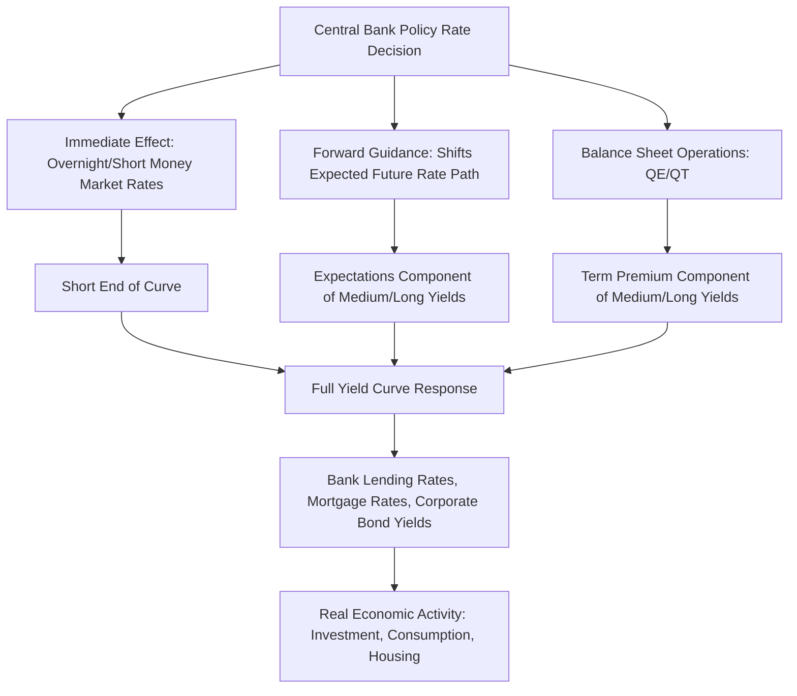

## Monetary Policy Transmission to the Yield Curve

### Overview: The Yield Curve as a Transmission Channel

Monetary policy transmission to the yield curve describes the mechanisms by which a central bank's control over short-term interest rates and balance sheet size propagates through the term structure to influence medium- and long-term yields, and ultimately the broader economy. Since the vast majority of real-world borrowing and lending — mortgages, corporate bonds, project finance — is priced off longer-tenor rates rather than the overnight policy rate itself, understanding this transmission is essential to connecting central bank actions to the fixed income instruments and hedging strategies covered elsewhere in this domain.

### Decomposing the Yield Curve: Expectations and Term Premium

**The Expectations Hypothesis Component**

Under the pure expectations hypothesis, a long-term interest rate equals the average of expected future short-term rates over the bond's life:

$$y_n = \frac{1}{n}\left(r_0 + E[r_1] + E[r_2] + \cdots + E[r_{n-1}]\right)$$

where $y_n$ is the yield on an $n$-period bond and $E[r_i]$ is the expected short rate $i$ periods from now. Under this framework, monetary policy affects long-term yields entirely through its effect on the expected future path of short rates.

**The Term Premium Component**

In practice, observed long-term yields also embed a **term premium** — additional compensation investors require for bearing the risk of holding longer-duration instruments (interest rate risk, inflation risk, liquidity risk) beyond what pure rate expectations would imply:

$$y_n = \frac{1}{n}\left(r_0 + E[r_1] + \cdots + E[r_{n-1}]\right) + TP_n$$

Monetary policy, particularly balance sheet operations, is understood to affect long-term yields through both channels simultaneously but via distinct mechanisms, discussed below.

### Illustrative Diagram: Monetary Policy Transmission Pathways (svg_diagram)

### Transmission via the Short End: Direct Policy Rate Pass-Through

The most immediate and mechanical transmission channel operates through very short-term money market rates, which move essentially one-for-one with changes in the policy rate:

- **Overnight rates (Fed Funds, SOFR, SONIA, €STR)** — track the policy rate closely by construction, given the central bank's direct control over the rate corridor via standing facilities (e.g., interest on reserve balances and the overnight reverse repo facility in the U.S. framework)
- **Term money market rates (Term SOFR, short-dated T-bills)** — incorporate near-term policy rate expectations, moving in advance of actual policy changes as market participants price in anticipated moves at upcoming meetings

### Transmission via the Expectations Channel

**Repricing of Future Expected Rates**

When a central bank changes its policy rate, or communicates a shift in its intended future path (forward guidance), market participants immediately revise their expectations for the entire future path of short rates, which mechanically shifts medium- and long-term yields through the expectations component of the term structure — even before any actual sequence of future rate changes occurs.

**Empirical Evidence of Expectations-Channel Transmission**

Event studies around central bank policy announcements commonly find that the response of longer-dated yields to a given policy surprise is generally smaller in percentage terms than the response of short-dated yields, but remains economically meaningful, consistent with markets pricing policy surprises as informative about the future rate path rather than treating each move as isolated and non-repeated [Inference — the precise magnitude of pass-through to any specific tenor varies across studies, sample periods, and the specific characterization of what constitutes a policy "surprise" versus an anticipated move].

### Transmission via Balance Sheet Operations (QE/QT)

**Portfolio Balance Channel**

Large-scale asset purchases are understood to work partly through the **portfolio balance channel** — by removing a substantial quantity of long-duration government (and, in some programs, other) securities from the market, the central bank reduces the aggregate amount of interest rate risk that private investors must hold, theoretically compressing the term premium investors demand for bearing that risk, independent of any change in the expected future short rate path.

**Signaling Channel of Balance Sheet Policy**

QE and QT programs can also operate through a signaling channel, since the scale and duration of a balance sheet program can itself convey information about the central bank's expected future policy stance (e.g., a large QE program may signal an extended period of low policy rates is intended), blurring the distinction between pure term-premium and pure expectations-channel effects in practice.

**Empirical Findings on QE Term Premium Effects**

A substantial body of empirical research has estimated the yield impact of major QE programs (particularly the several rounds of U.S. Federal Reserve asset purchases following 2008 and 2020), generally finding statistically significant reductions in longer-term yields, though estimates of the precise magnitude vary considerably across studies, methodologies, and the specific program and time period examined [Unverified — specific magnitude estimates should be verified against current academic literature given the range of methodologies and ongoing research in this area].

### Curve Shape Response to Different Policy Actions

**Response to a Rate Cut/Hike (Level Effect)**

An unanticipated policy rate change primarily affects the short end of the curve, with the effect diminishing at longer tenors as market participants weigh the change against their independent view of the likely future policy path — a pattern that generally produces a **flattening** response to an unanticipated hike (short rates rise more than long rates) and a **steepening** response to an unanticipated cut (short rates fall more than long rates), all else equal.

**Response to Forward Guidance Changes**

A shift in forward guidance without an accompanying change in the current policy rate primarily affects medium-tenor yields (the segment of the curve most directly informed by near-to-medium-term policy path expectations), with a more muted effect at both the very short end (anchored to the current, unchanged policy rate) and the very long end (where term premium and longer-horizon structural factors dominate over near-term policy path expectations).

**Response to QE/QT Announcements**

Balance sheet operation announcements, particularly QE programs targeting specific segments of the curve (e.g., purchases concentrated in longer-dated securities), tend to have their most direct effect at the targeted maturities, though effects can spill over to adjacent maturities through arbitrage and portfolio rebalancing by investors across the curve.

### Bank Lending Rate Pass-Through

**Prime Rate and Reference Rate Linkages**

Many bank lending products (commercial loans, credit lines, some consumer lending) are directly indexed to a reference rate that moves mechanically with the policy rate (e.g., the U.S. Prime Rate, conventionally set at a fixed spread above the Federal Funds target), providing a rapid and largely mechanical transmission channel for these specific loan categories.

**Mortgage Rate Transmission**

Fixed-rate mortgage rates in most markets are priced off longer-tenor yields (e.g., in the U.S., primarily the 10-year Treasury yield plus a spread reflecting prepayment risk, credit risk, and origination costs) rather than the short-term policy rate directly, meaning mortgage rate transmission depends heavily on how the policy action affects the relevant longer-tenor benchmark yield, and can therefore be considerably more muted or delayed than short-term reference rate pass-through, particularly when a policy move is already substantially anticipated and priced into longer yields in advance.

**Pass-Through Incompleteness and Lags**

Bank lending rate pass-through is frequently found to be incomplete (a given change in the relevant benchmark rate is not always passed through one-for-one to loan rates offered to customers) and to exhibit asymmetries (e.g., faster pass-through of rate increases than decreases in some markets and periods), reflecting bank funding cost considerations, competitive dynamics, and margin management practices that vary across banking systems and time periods [Unverified — the specific degree of pass-through completeness and any asymmetry is market-, product-, and period-specific and is an active area of empirical banking research].

### Worked Example: Decomposing a Curve Response to a Policy Surprise

A central bank unexpectedly raises its policy rate by 25 basis points at a scheduled meeting (a "hawkish surprise" relative to prior market pricing). Following the announcement:

- The 2-year yield rises by 18 basis points
- The 10-year yield rises by 6 basis points
- The 30-year yield rises by 2 basis points

**Interpretation**

The pattern of a large short-tenor response, a moderate medium-tenor response, and a minimal long-tenor response is consistent with markets interpreting the surprise primarily as new information about the near-to-medium-term policy path (an expectations-channel effect concentrated in the front and belly of the curve) rather than as new information materially altering the long-run equilibrium real rate or long-run term premium, which are the dominant drivers of very long-tenor yields. This curve-flattening response (short rates rising more than long rates) is a commonly observed pattern following a hawkish policy surprise, though the specific magnitude distribution across tenors varies with the surprise's context and the market's prior expectations.

### Cross-Border Transmission and Spillovers

**Global Yield Curve Co-Movement**

Major central bank policy actions, particularly by the U.S. Federal Reserve given the dollar's role in global funding markets, frequently generate spillover effects on yield curves in other currencies, operating through channels including cross-border capital flows, exchange rate effects on imported inflation, and the correlated macroeconomic outlooks that often (though not always) drive multiple central banks' policy decisions in a similar direction during globally synchronized economic cycles.

**Policy Divergence Effects**

When major central banks' policy paths diverge (one tightening while another holds or eases), the resulting effects on relative yield curve levels and shapes across currencies feed into cross-currency basis dynamics and currency-hedged fixed income relative value considerations.

### Practical Considerations and Limitations

- **Anticipated vs. unanticipated policy actions** — a policy action that is fully anticipated by markets in advance produces little to no yield curve reaction upon the actual announcement, since the expected information was already incorporated into prices beforehand; meaningful yield curve reactions are primarily driven by the surprise component of an announcement relative to prior market pricing, not the announcement's headline magnitude in isolation
- **Term premium is not directly observable** — since the term premium cannot be observed directly and must be estimated using a term structure model (with model choice affecting the resulting estimate), attributing a specific yield curve movement precisely between expectations-channel and term-premium-channel effects necessarily involves model-dependent judgment rather than a purely mechanical decomposition [Inference — different term premium estimation models can produce meaningfully different attributions for the same observed yield curve movement]
- **Transmission strength varies across market conditions** — pass-through effectiveness through each channel (short rate, expectations, balance sheet, bank lending) can vary considerably depending on prevailing financial conditions, market liquidity, and the credibility of central bank communication at the time, meaning historical average pass-through relationships should not be assumed to hold precisely in every future episode
- Current policy stances, QE/QT program details, and specific reference rate conventions should be verified against up-to-date sources given the pace at which monetary policy frameworks and instruments continue to evolve

**Related Topics**

- Central Bank Policy and the Interest Rate Cycle
- Inflation Expectations and Real versus Nominal Rates
- Term Premium and the Expectations Hypothesis of the Term Structure
- Interest Rate Swaps and the Swap Curve
- Quantitative Easing and Quantitative Tightening Mechanics
- Cross-Currency Basis and International Policy Divergence
- Short Rate Models Vasicek and Cox Ingersoll Ross
- Mortgage Rate Determination and Prepayment Risk