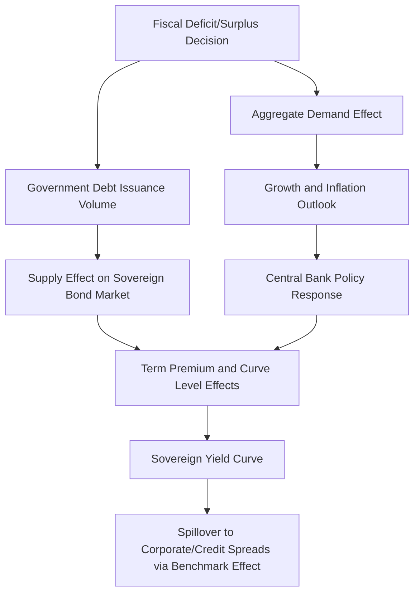

## Fiscal Policy and Sovereign Issuance Trends

### Fiscal Policy's Channel of Influence on Fixed Income Markets

Fiscal policy — government spending and taxation decisions, and the resulting deficit or surplus that must be financed — affects fixed income markets primarily through the supply of sovereign debt that must be absorbed by the market, the resulting effect on yield levels and curve shape, and the broader macroeconomic effects (on growth, inflation, and the real interest rate) that fiscal stance can generate. Unlike monetary policy, which is set at the discretion of an independent central bank operating over a relatively rapid decision cycle, fiscal policy is set through the political process and typically operates over longer, less predictable timelines, introducing a distinct set of considerations for fixed income analysis.

### The Government Budget Constraint and Debt Issuance

**Basic Financing Identity**

A government's fiscal deficit in any period must be financed through some combination of new debt issuance and, in some cases, monetization (central bank financing, generally constrained or prohibited by law in most advanced economies with independent central banks):

$$\text{Deficit}_t = \text{Spending}_t - \text{Revenue}_t = \Delta \text{Debt}_t$$

**Debt Dynamics: The Debt-to-GDP Ratio**

The evolution of the debt-to-GDP ratio, a commonly referenced measure of fiscal sustainability, depends on the interaction between the primary deficit (deficit excluding interest payments), the interest rate on outstanding debt, and the nominal GDP growth rate:

$$\Delta\left(\frac{D}{Y}\right) \approx \text{Primary Deficit Ratio} + \left(\frac{i - g}{1+g}\right) \times \frac{D}{Y}$$

where $i$ is the effective nominal interest rate on outstanding debt and $g$ is the nominal GDP growth rate. This relationship highlights the significance of the **$r - g$ differential** (or, in nominal terms, $i - g$): when the growth rate exceeds the interest rate on debt, the debt-to-GDP ratio can decline even without a primary surplus, whereas when the interest rate exceeds growth, the ratio tends to rise absent an offsetting primary surplus.

### Illustrative Diagram: Fiscal Policy Transmission to Fixed Income Markets (svg_diagram)

### Supply Effects on the Yield Curve

**Increased Issuance and Term Premium**

An increase in the volume of sovereign debt that must be absorbed by the market, all else equal, is generally understood to place some upward pressure on the term premium component of yields, since investors must be compensated for holding a larger aggregate quantity of duration and interest rate risk — a mechanism analogous in direction, though opposite in sign, to the portfolio balance channel through which QE is understood to compress term premia.

**Issuance Tenor Composition**

Beyond the aggregate volume of issuance, the specific maturity composition a sovereign debt manager chooses (weighting issuance toward short-, medium-, or long-tenor securities) affects the relative supply pressure across different points of the curve, meaning a government's debt management strategy can influence curve shape independent of the aggregate deficit size. Debt management offices in most advanced economies publish issuance calendars and maturity profile targets, providing forward-looking information relevant to anticipating supply-related curve pressure.

**Empirical Evidence and Debate**

The magnitude of yield impact from a given change in sovereign issuance volume or maturity composition is an active area of empirical research, with estimates varying considerably across studies, countries, and time periods, and the relationship can be difficult to isolate empirically since issuance decisions are often correlated with the same macroeconomic conditions (e.g., a recession triggering both higher deficit spending and independently lower yields via safe-haven demand and monetary easing) that also directly affect yields through other channels [Inference — disentangling the pure supply effect from correlated macroeconomic and monetary policy effects requires careful empirical identification strategies and remains subject to ongoing academic debate].

### Fiscal Policy's Effect on the Real Interest Rate

**Crowding Out**

Standard macroeconomic theory suggests that increased government borrowing, by competing with private investment for a given pool of available savings, can place upward pressure on the equilibrium real interest rate (a **crowding out** effect), all else equal, though the empirical magnitude of this effect is debated and can be offset or masked by other simultaneous factors affecting the real rate (productivity growth expectations, demographic trends, global capital flows, and central bank balance sheet policy, as discussed under inflation expectations and real rate drivers).

**Ricardian Equivalence (Theoretical Counterargument)**

The Ricardian equivalence proposition suggests that, under certain restrictive assumptions (rational, forward-looking households; no binding liquidity constraints; deficit-financed spending expected to require future tax increases to service the resulting debt), households may increase private saving in anticipation of future taxation, offsetting the government's dissaving and leaving aggregate national saving, and therefore the real interest rate, largely unaffected by the financing mix (debt vs. current taxation) chosen for a given level of spending. The empirical validity of Ricardian equivalence — and therefore the practical significance of the crowding-out channel — remains a genuinely contested question in macroeconomics, with the balance of empirical evidence generally suggesting only partial, rather than complete, Ricardian offsetting behavior in practice [Inference — the degree of empirically observed Ricardian offsetting varies across studies, countries, and the specific nature of the fiscal action examined].

### Sovereign Credit Risk and Fiscal Sustainability

**Sovereign Credit Spreads**

For sovereigns without the ability to issue debt in a currency they fully control (e.g., individual Eurozone member states issuing in euros, or emerging market sovereigns issuing in foreign currency), persistent fiscal deficits and rising debt-to-GDP ratios can lead to widening sovereign credit spreads relative to a benchmark (e.g., German Bunds within the Eurozone, or U.S. Treasuries for emerging market foreign-currency debt), reflecting increased perceived default or restructuring risk.

**Debt Sustainability Analysis**

Sovereign debt sustainability is commonly assessed using frameworks that project the future debt-to-GDP path under various assumptions about growth, interest rates, and primary balance trajectories, often incorporating stochastic simulation or explicit stress scenarios (e.g., IMF/World Bank debt sustainability analysis frameworks used in the context of sovereign lending programs), given the inherent uncertainty in long-horizon fiscal projections.

**Currency-Issuing Sovereigns**

Sovereigns that issue debt in a currency they fully control and float (e.g., the U.S., UK, Japan) generally face materially different sustainability dynamics than currency-constrained sovereigns, since default on domestic-currency debt is a policy choice rather than a mechanical inevitability of insufficient foreign currency reserves — though this distinction does not eliminate the economic costs (inflation, currency depreciation, and their effects on real rates and living standards) that can accompany unsustainable fiscal trajectories even for a currency-issuing sovereign [Inference — the precise economic consequences and political feasibility of any specific fiscal adjustment path for a currency-issuing sovereign are subject to substantial debate among economists].

### Fiscal-Monetary Policy Interaction

**Fiscal Dominance**

A scenario in which fiscal considerations (the need to keep sovereign borrowing costs manageable, or the political difficulty of fiscal consolidation) constrain or override the central bank's ability to pursue its inflation or employment mandate independently is referred to as **fiscal dominance**, a concern that has been raised periodically in academic and policy discussions regarding the interaction of elevated public debt levels with central bank policy independence, though the extent to which fiscal dominance concerns are currently material in any specific major economy is a matter of ongoing analysis and debate [Unverified — assessments of fiscal dominance risk in any specific jurisdiction should be evaluated against current fiscal and monetary policy data and analysis].

**Coordinated vs. Independent Policy Regimes**

The interaction between fiscal expansion and central bank policy response (e.g., whether a central bank accommodates fiscal expansion by holding rates lower than it otherwise would, versus offsetting fiscal stimulus with tighter monetary policy to control resulting inflationary pressure) is a key determinant of how a given fiscal policy stance translates into yield curve and broader financial market effects.

### Worked Example: Debt Dynamics Under Different Growth-Rate Scenarios

A sovereign has a debt-to-GDP ratio of 100%, a primary deficit of 1% of GDP, and faces an effective average interest rate on its debt of 4%.

**Scenario A: Nominal GDP growth of 5%**

$$\Delta\left(\frac{D}{Y}\right) \approx 1\% + \left(\frac{4\% - 5\%}{1.05}\right) \times 100\% = 1\% - 0.95\% \approx 0.05\%$$

The debt-to-GDP ratio remains approximately stable, since favorable growth relative to the interest rate on debt roughly offsets the primary deficit.

**Scenario B: Nominal GDP growth of 2%**

$$\Delta\left(\frac{D}{Y}\right) \approx 1\% + \left(\frac{4\% - 2\%}{1.02}\right) \times 100\% = 1\% + 1.96\% \approx 2.96\%$$

The debt-to-GDP ratio rises meaningfully, since the unfavorable interest-rate-to-growth differential now compounds the primary deficit's upward pressure on the debt ratio, illustrating why the level of interest rates relative to nominal growth is a central variable in fiscal sustainability analysis, independent of the primary balance itself.

### Practical Implications for Fixed Income Analysis

- **Sovereign issuance calendar monitoring** — fixed income market participants routinely monitor debt management office issuance announcements and auction calendars (e.g., the U.S. Treasury's quarterly refunding announcements) for signals about upcoming supply pressure and maturity composition shifts that could affect relative value across the curve
- **Auction outcome analysis** — metrics such as the bid-to-cover ratio, the tail (difference between the auction's stop-out yield and the pre-auction "when-issued" market yield), and the composition of winning bidders (primary dealers vs. direct/indirect bidders) at sovereign debt auctions are commonly analyzed as indicators of demand strength for a given issuance, informing near-term views on that maturity segment
- **Fiscal-driven curve steepening/flattening views** — anticipated shifts in issuance volume or composition, or anticipated changes in fiscal stance following elections or major legislative developments, are commonly incorporated into curve positioning views alongside the monetary-policy-driven considerations discussed under central bank policy and cycle analysis
- **Sovereign credit spread trading** — for currency-constrained sovereigns, fiscal trajectory analysis directly informs sovereign credit spread views and relative value positioning across different sovereign issuers within a currency bloc or asset class

### Practical Considerations and Limitations

- **Empirical supply-effect estimates are model- and period-dependent** — as discussed, isolating the pure effect of issuance supply on yields from correlated macroeconomic and monetary policy factors is empirically challenging, and published estimates of the yield impact per unit of additional issuance vary considerably across studies [Unverified — specific quantitative supply-effect estimates should be evaluated against current academic and market research given the wide range of methodologies employed]
- **Political and legislative uncertainty** — unlike monetary policy decisions made by an independent central bank on a scheduled cycle, fiscal policy changes depend on the legislative and political process, introducing timing and magnitude uncertainty that is generally harder to model systematically than monetary policy expectations
- **Debt sustainability thresholds are not fixed or universally agreed** — there is no single, universally accepted debt-to-GDP threshold beyond which a sovereign is considered unsustainable; market perceptions of sustainability depend on a range of factors including growth prospects, institutional credibility, currency status, and the composition of the investor base holding the debt, meaning sustainability assessments require holistic, country-specific analysis rather than mechanical application of a single ratio threshold
- Current fiscal deficit levels, debt-to-GDP trajectories, and sovereign issuance plans for any specific country should be verified against up-to-date official sources given how materially these figures can change with each budget cycle and economic development

**Related Topics**

- Central Bank Policy and the Interest Rate Cycle
- Monetary Policy Transmission to the Yield Curve
- Inflation Expectations and Real versus Nominal Rates
- Sovereign Credit Risk and Debt Sustainability Analysis
- Term Premium and the Expectations Hypothesis of the Term Structure
- Treasury Auction Mechanics and Primary Dealer System
- Emerging Market Sovereign Debt and Currency Risk
- Eurozone Sovereign Spread Dynamics and the OMT/PEPP Frameworks