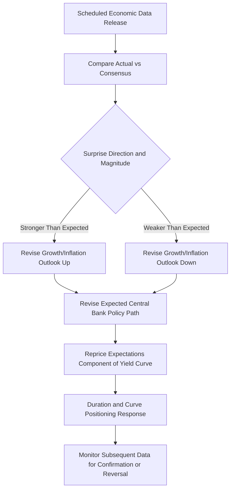

## Reading Economic Indicators for Fixed Income Positioning

### Role of Economic Data in Fixed Income Markets

Economic indicators are the primary real-time inputs market participants use to update expectations about future central bank policy, inflation trajectory, and growth outlook — the fundamental drivers of yield levels and curve shape discussed elsewhere in this domain. Since fixed income prices are forward-looking and embed expectations about future conditions, a data release's market impact depends not on its absolute level but on its deviation from what was already priced in, making the interpretation framework around each indicator as important as the indicator itself.

### The Consensus-Surprise Framework

**Core Principle**

Markets price in a consensus expectation for each scheduled data release (typically an average or median of professional forecaster surveys, such as Bloomberg or Reuters consensus polls) ahead of the actual release. The market-moving quantity is the **surprise** — the deviation of the actual print from this consensus — not the print's absolute level:

$$\text{Surprise} = \text{Actual} - \text{Consensus}$$

**Standardized Surprise Measures**

Because different indicators have different typical volatility, surprises are often standardized (e.g., in units of historical standard deviation of the surprise) to compare the relative market-moving potential of a surprise in one indicator against a surprise of a different magnitude in another indicator, an approach embedded in composite "economic surprise indices" (such as the Citi Economic Surprise Index) that aggregate standardized surprises across many indicators into a single gauge of whether recent data has been running above or below consensus expectations.

### Illustrative Diagram: Economic Data to Fixed Income Positioning Pipeline (svg_diagram)

### Key Growth Indicators

**Gross Domestic Product (GDP)**

- Released quarterly, often in advance, preliminary, and final/revised estimates; the advance estimate typically carries the greatest surprise potential given the longer lag before more complete revised data
- GDP is a lagging and infrequently released indicator relative to the pace of fixed income market repricing, meaning higher-frequency indicators often carry more immediate market-moving weight despite GDP's conceptual centrality as the broadest growth measure

**Employment Reports**

- **U.S. Nonfarm Payrolls (NFP)** — released monthly, widely regarded as one of the most closely watched and market-moving scheduled releases, given employment's direct relevance to both the Federal Reserve's dual mandate and its role as a real-time growth proxy
- **Unemployment rate** — released alongside payrolls, though changes can reflect both employment level changes and labor force participation changes, requiring joint interpretation with the participation rate to assess underlying labor market strength
- **Initial and continuing jobless claims** — released weekly, providing a higher-frequency, if noisier, real-time signal of labor market conditions between monthly employment reports

**Purchasing Managers' Indices (PMI) and Business Surveys**

- **ISM Manufacturing and Services PMI (U.S.)**, **S&P Global/Markit PMI (global)** — survey-based diffusion indices (readings above 50 generally indicating expansion, below 50 indicating contraction) released monthly, valued for their timeliness relative to hard GDP data and their historical correlation with subsequent GDP growth
- Regional Federal Reserve manufacturing surveys (e.g., Philadelphia Fed, Empire State) provide additional, more geographically limited but timely, high-frequency signals

**Retail Sales and Consumption Indicators**

- Retail sales reports provide a timely proxy for consumer spending, a major component of GDP in most advanced economies, though subject to notable seasonal adjustment and revision considerations

### Key Inflation Indicators

**Consumer Price Index (CPI)**

- The headline CPI print and the "core" CPI measure (excluding volatile food and energy components) are both closely monitored, with core CPI often weighted more heavily by markets and central banks as a better gauge of underlying inflation trend, since headline CPI can be temporarily distorted by volatile commodity price swings

**Personal Consumption Expenditures (PCE) Price Index**

- The Federal Reserve's explicitly preferred inflation gauge for its 2% target (rather than CPI), reflecting a broader consumption basket and different weighting methodology than CPI; the PCE report is released with a slight lag relative to CPI, meaning CPI often serves as an early read that markets use to partially anticipate the subsequent PCE print

**Producer Price Index (PPI)**

- Measures price changes at the wholesale/producer level, sometimes viewed as a leading indicator for consumer price inflation to the extent producer cost changes are eventually passed through to consumer prices, though the strength and timing of this pass-through relationship varies

**Wage Growth Indicators**

- Average hourly earnings (released with the U.S. employment report) and the Employment Cost Index (a broader, less frequently released measure including benefits) are monitored for signs of wage-price spiral risk, particularly relevant to central bank policy assessment in a labor-market-driven inflation episode

### Interpreting Data Within the Policy Reaction Function Framework

**Connecting Data to the Taylor Rule Framework**

Since central bank policy is commonly analyzed (though not mechanically determined) relative to a Taylor-Rule-style reaction function incorporating inflation and the output gap, market participants interpret incoming growth and inflation data specifically in terms of how it shifts the implied appropriate policy rate under such a framework, rather than evaluating each data point purely in isolation.

**Data Dependency and Central Bank Communication**

Central banks frequently describe their policy approach during periods of uncertainty as "data dependent," meaning market participants place particularly heavy weight on scheduled data releases (and any explicit thresholds or data series a central bank has specifically flagged as decision-relevant) as inputs to near-term policy expectations during such periods, relative to periods when a central bank has provided more confident, less data-contingent forward guidance about its intended path.

### The Economic Calendar and Event Risk

**Tiered Release Importance**

Market participants and financial data providers commonly rank scheduled releases by typical market-moving potential (e.g., high/medium/low importance tiers on an economic calendar), reflecting historical volatility around each release type, though the realized importance of any specific release can deviate from its typical tier depending on the prevailing macroeconomic narrative and policy uncertainty at that time.

**Pre-Release Positioning Considerations**

Ahead of high-importance releases, options-implied volatility in rates markets (caps, floors, swaptions) commonly rises to reflect the genuine uncertainty about the release outcome and its potential policy implications, and some market participants explicitly reduce position sizing or hedge more heavily ahead of major scheduled releases to manage event risk, a practice distinct from taking an explicit directional view on the release outcome itself.

### Revisions and Data Reliability

**Data Revision Risk**

Most economic indicators are subject to subsequent revision as more complete underlying data becomes available (notably GDP, employment reports via subsequent benchmark revisions, and PCE), meaning an initial market reaction to a released figure can later be partially offset or reinforced by subsequent revisions, and sophisticated market analysis often tracks not just headline print levels but also the pattern and direction of recent revisions as an additional signal.

**Seasonal Adjustment Considerations**

Most headline economic indicators are seasonally adjusted to remove predictable within-year patterns, but seasonal adjustment methodologies can themselves introduce distortions or be subject to periodic recalibration (benchmark revisions to seasonal factors), which can occasionally produce data patterns that require careful interpretation relative to the underlying, non-seasonal economic reality [Inference — the specific magnitude and frequency of seasonal adjustment distortion varies by indicator and time period and is generally only fully assessed in retrospect].

### Worked Example: Interpreting a Combined Data Scenario

Suppose, over a single week, the following releases occur relative to consensus:

- Nonfarm payrolls: +250,000 vs. consensus +180,000 (a stronger-than-expected print)
- Average hourly earnings: +0.2% month-over-month vs. consensus +0.3% (a weaker-than-expected wage print)
- Core CPI: +0.2% month-over-month vs. consensus +0.3% (a weaker-than-expected inflation print)

**Interpretation**

Taken together, this combination — strong employment growth alongside softer-than-expected wage growth and inflation — could plausibly be read by markets as consistent with continued economic resilience without a corresponding acceleration in inflationary pressure, a combination sometimes referred to informally as a "Goldilocks" scenario supportive of the central bank maintaining or easing its policy stance without the strong employment print alone triggering hawkish repricing. This illustrates why market participants generally interpret same-week or same-day releases in combination rather than any single indicator in isolation, since indicators can send apparently conflicting directional signals about the underlying economic and policy outlook that must be weighed together.

### Practical Application to Curve and Duration Positioning

- **Duration positioning ahead of major releases** — traders with strong conviction about a release's likely surprise direction may adjust duration exposure ahead of the release, while others explicitly reduce position sizing to manage the two-sided event risk of an uncertain outcome
- **Curve positioning based on the growth-inflation mix** — a data pattern suggesting strong growth with contained inflation supports different curve positioning (potentially favoring a steepener, if markets interpret this as reducing near-term recession/easing risk while not requiring aggressive tightening) than a pattern suggesting weak growth with persistent inflation (a more challenging "stagflationary" mix with more ambiguous policy and curve implications)
- **Options market response** — realized surprises that are large relative to pre-release implied volatility pricing can produce meaningful subsequent adjustments to implied volatility levels in caps, floors, and swaptions, feeding into the volatility surface dynamics discussed under option-based interest rate hedging instruments
- **Cross-market confirmation** — fixed income market participants commonly cross-reference data-driven positioning views against signals from other markets (equity market reaction, currency market reaction, commodity price moves) to assess whether the interpretation of a given data release is broadly shared across asset classes or represents a more fixed-income-specific repricing

### Practical Considerations and Limitations

- **No indicator is a perfect or complete signal in isolation** — each individual economic indicator captures only a partial view of the broader economy, is subject to measurement error, sampling variation, and revision, and is best interpreted as one input among several rather than a definitive standalone signal of the appropriate fixed income positioning response
- **Historical release-response relationships can shift** — the market's typical sensitivity to a given indicator (e.g., how strongly yields historically move per unit of payrolls surprise) can shift over time depending on the prevailing macroeconomic narrative, the central bank's stated reaction function, and which specific data series a central bank has most recently emphasized as decision-relevant, meaning historical sensitivity estimates require periodic reassessment rather than being treated as structurally fixed [Unverified — the specific degree to which historical indicator-yield sensitivity relationships remain stable over time is subject to ongoing empirical study and can vary by period]
- **Consensus estimates themselves can be poorly calibrated** — during periods of unusual economic volatility or structural change, professional forecaster consensus estimates can exhibit larger and more persistent forecast errors than in more stable periods, meaning the surprise-based framework's reliability itself can vary across different macroeconomic regimes
- Specific indicator release schedules, current consensus expectations, and recent data trends should be verified against up-to-date economic calendars and data sources given the frequency and pace of scheduled economic releases

**Related Topics**

- Central Bank Policy and the Interest Rate Cycle
- Monetary Policy Transmission to the Yield Curve
- Inflation Expectations and Real versus Nominal Rates
- Fiscal Policy and Sovereign Issuance Trends
- Caps Floors and Swaptions
- Term Premium and the Expectations Hypothesis of the Term Structure
- Economic Surprise Indices and Data-Driven Trading Strategies
- Cross-Asset Confirmation and Macro Positioning Frameworks