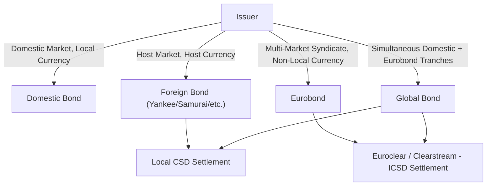

## International Fixed Income Market Structures

### Overview

International fixed income market structures encompass the institutional frameworks, issuance mechanisms, trading conventions, and settlement systems governing debt instruments issued and traded outside a single domestic jurisdiction. Unlike a purely domestic bond market, international fixed income spans multiple regulatory regimes, currencies, and clearing systems, requiring investors to account for cross-border legal, tax, and operational frictions that do not exist in single-market analysis. Understanding these structures is foundational before layering on currency hedging, sovereign risk, and inflation-linked overlays.

### Taxonomy of International Bond Markets

International bonds are typically classified along two dimensions: the currency of denomination relative to the issuer's domicile, and the market in which the bond is distributed.

**Key Points**

- **Domestic bonds**: Issued by a resident entity, denominated in local currency, sold in the home market (e.g., a JGB issued by the Japanese government, sold in Japan, in yen).
- **Foreign bonds**: Issued by a non-resident entity in a host country's domestic market, denominated in the host currency, and subject to host-market regulation and naming conventions (e.g., Yankee bonds in the US, Samurai bonds in Japan, Bulldog bonds in the UK, Kangaroo bonds in Australia, Matador bonds in Spain, Panda bonds in China).
- **Eurobonds**: Issued outside the jurisdiction of the currency in which they are denominated, underwritten by an international syndicate, and sold simultaneously in multiple countries (e.g., a US dollar-denominated bond issued in London by a German corporate). The term "Euro" here is historical/structural, not geographic — it predates the euro currency and has no necessary connection to Europe.
- **Global bonds**: Structured to be issued and cleared simultaneously in both a domestic market and the Eurobond market, combining SEC-registered (or equivalent) domestic tranches with internationally syndicated tranches under a single fungible structure, improving liquidity depth.

### The Eurobond Market Structure

The Eurobond market is the largest and most liquid segment of international fixed income and operates under a distinct set of conventions relative to domestic bond markets.

**Key Points**

- **Regulatory status**: Eurobonds are typically exempt from the securities registration requirements of the country whose currency they are denominated in, since they are not offered to residents of that country at issuance. This exemption (e.g., Regulation S / Category 1 or 2 under US securities law for USD Eurobonds sold outside the US) is what permits rapid, low-disclosure issuance relative to SEC-registered domestic bonds.
- **Issuance mechanism**: Distributed via an underwriting syndicate structured in tiers — lead manager(s)/bookrunner(s), co-managers, and a selling group — who purchase the bonds from the issuer (often on a bought-deal or best-efforts basis) and place them with institutional investors globally.
- **Bearer form historically, dematerialized now**: Eurobonds were traditionally issued in bearer form (ownership evidenced by possession, not a register) to preserve investor anonymity; the vast majority are now held in dematerialized book-entry form through international central securities depositories (ICSDs).
- **Coupon and day-count convention**: Eurobonds conventionally pay annual coupons (as opposed to the semi-annual convention typical of US domestic bonds) and use an ACT/ACT or 30/360 day-count basis depending on the specific bond terms, which affects direct yield comparability with domestic bonds of the same currency without accrued-interest normalization.
- **Governing law**: Predominantly English law or New York law, chosen for creditor-protective and well-tested contractual precedent, largely independent of the issuer's or currency's home jurisdiction.

### Clearing and Settlement Infrastructure

International bonds settle through specialized infrastructure distinct from domestic government bond settlement systems (e.g., Fedwire for US Treasuries).

**Key Points**

- **Euroclear** (Brussels) and **Clearstream** (Luxembourg) are the two dominant ICSDs. They hold securities in dematerialized form, net trades, and interface via a "bridge" connection allowing cross-platform settlement between the two systems.
- Settlement is typically **T+2** for Eurobonds, though this varies by instrument and market convention.
- ICSDs also handle coupon payment processing, corporate actions, and tax documentation/withholding administration across jurisdictions, functions that would otherwise require bilateral custodial relationships in each local market.
- Domestic-market bonds (foreign bonds like Yankee or Samurai issues) instead settle through the local central securities depository (CSD) of the host market — e.g., DTC in the US, JASDEC in Japan — subjecting foreign investors to that CSD's operational hours, holiday calendar, and settlement cycle.

### Local-Currency Emerging Market Debt Structures

A distinct structural layer within international fixed income is emerging market (EM) debt, which itself bifurcates by currency of issuance.

**Key Points**

- **Hard-currency EM debt**: Sovereign or corporate debt issued by EM entities denominated in USD, EUR, or another reserve currency, typically under New York or English law, eliminating currency risk for the foreign investor but concentrating credit/sovereign risk.
- **Local-currency EM debt**: Issued and settled in the domestic currency of the EM issuer, governed by local law, and typically accessed by foreign investors either directly (where capital account openness permits) or via structures like Euroclearable local bonds, where a subset of local-currency government bonds are made eligible for international settlement through Euroclear/Clearstream links with the local CSD.
- Local-currency EM debt exposes the investor to both interest rate risk and currency risk simultaneously, and often to capital controls, withholding tax regimes, and repatriation restrictions that vary significantly by jurisdiction. [Inference: the magnitude and even direction of net impact from capital controls on realized returns is jurisdiction- and period-specific, and generalized statements about EM local debt risk premia should be treated as indicative rather than precise.]

### Index and Benchmark Structures

International fixed income allocation is heavily benchmark-driven, and the construction methodology of major indices materially shapes market structure and flows.

**Key Points**

- **Bloomberg Global Aggregate Bond Index**: Multi-currency, investment-grade benchmark spanning government, government-related, corporate, and securitized debt across developed and some emerging markets, hedged or unhedged variants available.
- **JP Morgan GBI-EM (Government Bond Index-Emerging Markets)**: Tracks local-currency EM sovereign debt; the "Global Diversified" variant caps individual country weights to prevent concentration in the largest issuers, directly shaping passive-fund flows into constituent markets upon index rebalancing.
- **JP Morgan EMBI Global (Emerging Markets Bond Index)**: Tracks hard-currency EM sovereign and quasi-sovereign debt.
- Index inclusion/exclusion events (e.g., a country's local bonds becoming Euroclearable and thus index-eligible) are themselves structural catalysts that can generate substantial passive capital flows independent of underlying fundamentals.

### Cross-Border Settlement and Custody Chain

$$\text{Investor} \rightarrow \text{Global Custodian} \rightarrow \text{Local Sub-Custodian / ICSD} \rightarrow \text{Local CSD} \rightarrow \text{Issuer's Registrar}$$

**Key Points**

- A foreign investor's ownership claim typically passes through several intermediary layers, each introducing settlement, legal (nominee title vs. beneficial title), and operational risk.
- For Eurobonds, the chain is shortened since Euroclear/Clearstream perform depository functions directly.
- For local-currency emerging market bonds not Euroclearable, the chain lengthens to include a local sub-custodian bank appointed in the issuer's jurisdiction, increasing operational cost and settlement-fail risk. [Inference: precise settlement-fail rates are market- and period-specific and not a fixed structural constant.]

### Structural Diagram

### Comparative Structure Summary (svg_diagram)

<svg xmlns="http://www.w3.org/2000/svg" viewBox="0 0 760 300">
<text x="380" y="24" text-anchor="middle" font-size="16" font-weight="bold" fill="#1a1a1a">International Bond Market Taxonomy (svg_diagram)</text>
<rect x="20" y="50" width="170" height="210" fill="#eef3fb" stroke="#3a5a9c" stroke-width="1.5" />
<text x="105" y="75" text-anchor="middle" font-size="13" font-weight="bold" fill="#1a1a1a">Domestic Bond</text>
<text x="30" y="100" font-size="11" fill="#333">Issuer: resident</text>
<text x="30" y="118" font-size="11" fill="#333">Currency: local</text>
<text x="30" y="136" font-size="11" fill="#333">Market: home</text>
<text x="30" y="154" font-size="11" fill="#333">Reg: home rules</text>
<text x="30" y="172" font-size="11" fill="#333">Settle: local CSD</text>
<rect x="210" y="50" width="170" height="210" fill="#fbf3ee" stroke="#9c5a3a" stroke-width="1.5" />
<text x="295" y="75" text-anchor="middle" font-size="13" font-weight="bold" fill="#1a1a1a">Foreign Bond</text>
<text x="220" y="100" font-size="11" fill="#333">Issuer: non-resident</text>
<text x="220" y="118" font-size="11" fill="#333">Currency: host</text>
<text x="220" y="136" font-size="11" fill="#333">Market: host</text>
<text x="220" y="154" font-size="11" fill="#333">Reg: host rules</text>
<text x="220" y="172" font-size="11" fill="#333">Settle: host CSD</text>
<text x="220" y="196" font-size="10" fill="#555">e.g. Yankee, Samurai,</text>
<text x="220" y="210" font-size="10" fill="#555">Bulldog, Kangaroo</text>
<rect x="400" y="50" width="170" height="210" fill="#eefbf0" stroke="#3a9c5a" stroke-width="1.5" />
<text x="485" y="75" text-anchor="middle" font-size="13" font-weight="bold" fill="#1a1a1a">Eurobond</text>
<text x="410" y="100" font-size="11" fill="#333">Issuer: any</text>
<text x="410" y="118" font-size="11" fill="#333">Currency: non-local</text>
<text x="410" y="136" font-size="11" fill="#333">Market: multi-national</text>
<text x="410" y="154" font-size="11" fill="#333">Reg: light/exempt</text>
<text x="410" y="172" font-size="11" fill="#333">Settle: Euroclear/</text>
<text x="410" y="188" font-size="11" fill="#333">Clearstream</text>
<text x="410" y="210" font-size="10" fill="#555">Law: English/NY</text>
<rect x="590" y="50" width="150" height="210" fill="#f9f3fb" stroke="#7a3a9c" stroke-width="1.5" />
<text x="665" y="75" text-anchor="middle" font-size="13" font-weight="bold" fill="#1a1a1a">Global Bond</text>
<text x="600" y="100" font-size="11" fill="#333">Dual tranche:</text>
<text x="600" y="118" font-size="11" fill="#333">domestic +</text>
<text x="600" y="136" font-size="11" fill="#333">Eurobond</text>
<text x="600" y="154" font-size="11" fill="#333">Fungible</text>
<text x="600" y="172" font-size="11" fill="#333">structure</text>
<text x="600" y="190" font-size="11" fill="#333">Settle: both</text>
<text x="600" y="208" font-size="11" fill="#333">systems</text>
</svg>

### Practical Example

**Example**

A German automaker issues a $500 million bond denominated in US dollars, underwritten by a syndicate of banks headquartered in London, Frankfurt, and Singapore, and lists the bond on the Luxembourg Stock Exchange. Settlement occurs through Euroclear. Despite being dollar-denominated, this bond is **not** a Yankee bond (which would require issuance registered and sold within the US domestic market) — it is a **Eurobond**, specifically a "Eurodollar bond," because it is distributed internationally outside the jurisdiction of its reference currency (the US).

### Practitioner Considerations

**Key Points**

- Yield comparisons across a Eurobond (annual coupon) and a domestic bond of the same currency (semi-annual coupon) require conversion to a common compounding basis before comparison; failing to do so understates or overstates relative value.
- Withholding tax treaties differ by issuance structure — Eurobonds are frequently structured to fall outside domestic withholding tax regimes specifically because of their extraterritorial distribution, which is one of the historical drivers of the market's growth.
- Legal recourse and creditor rights in default differ materially by governing law (English vs. New York vs. local law), which is a structural — not merely legal-boilerplate — consideration in relative value and risk assessment across otherwise similar credits. [Inference: relative creditor-friendliness rankings across jurisdictions can shift with case law and legislative change, so specific outcomes should not be treated as static.]

### Related Topics

- Currency-hedged vs. unhedged international bond return decomposition
- Covered interest rate parity and the cross-currency basis
- Sovereign credit ratings and country risk premia in EM local debt
- Inflation-linked bond structures across jurisdictions (linkers, TIPS, JGBi, OATi)
- Euroclearability criteria and index-inclusion mechanics
- Cross-currency basis swaps as a hedging tool for international bond portfolios