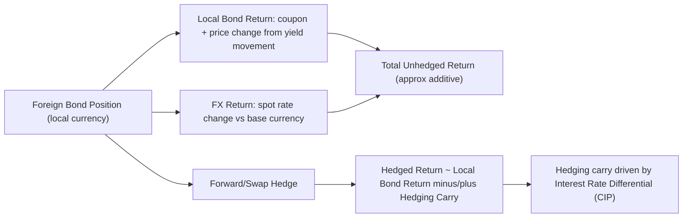

## Currency Risk in Cross Border Bond Investing

### Overview

Currency risk arises whenever a fixed income investor holds a bond denominated in a currency other than their base (reporting) currency. Unlike duration or credit risk, which are intrinsic to the bond itself, currency risk is a function of the investor's own reference frame — the same bond carries zero currency risk to a local-currency investor and full currency risk to a foreign investor. In cross-border bond investing, currency movements frequently dominate total return volatility, often exceeding the volatility contribution of interest rate and credit risk combined, which makes explicit treatment of currency exposure a first-order portfolio decision rather than a secondary adjustment.

### Decomposition of Total Return

The total return to an unhedged foreign-currency bond position can be decomposed as:

$$R_{total}^{unhedged} \approx R_{bond}^{local} + R_{FX}$$

where $R_{bond}^{local}$ is the bond's return in its own currency (coupon income plus price change from yield movements) and $R_{FX}$ is the percentage appreciation or depreciation of the bond's currency against the investor's base currency over the holding period.

**Key Points**

- This decomposition is additive only as an approximation; the exact multiplicative relationship is $(1 + R_{total}) = (1 + R_{bond}^{local})(1 + R_{FX})$, and the cross term becomes material over longer holding periods or high-volatility currency pairs.
- $R_{FX}$ can dwarf $R_{bond}^{local}$ for high-quality sovereign debt: a 10-year German Bund might return 3-4% annually from yield/carry, while EUR/USD can move 10%+ in a single year, meaning currency — not the bond itself — becomes the dominant driver of realized return to a USD-based investor.

### Sources of Currency Risk

**Key Points**

- **Spot rate volatility**: The direct mark-to-market effect of exchange rate fluctuation on the base-currency value of the foreign bond position.
- **Interest rate differential exposure**: Currency movements are partially linked to relative monetary policy paths between the two countries; a central bank tightening cycle in the bond's home country can simultaneously support the bond's local price (via yield curve effects, ambiguous sign) and its currency (via carry/rate differential appeal), while the linkage is imperfect and regime-dependent. [Inference: the strength and sign of this linkage varies by period, capital flow regime, and whether markets are pricing risk-on or risk-off conditions, so it should not be treated as a stable, tradeable relationship.]
- **Correlation with the bond's own local-currency return**: Currency and local bond returns are not independent — in risk-off episodes, safe-haven currencies (JPY, CHF, USD) often appreciate at the same time their sovereign bonds rally, meaning currency exposure can amplify (or in other cases, dampen) the bond's local return depending on the prevailing correlation regime.

### Hedging Mechanisms

**Key Points**

- **Forward contracts**: The most common institutional hedge — the investor sells the bond's currency forward against the base currency for a notional matching the bond position, locking in a forward exchange rate for a specified date. Requires periodic rolling as forwards mature, since bond holding periods typically exceed standard forward tenors (1, 3, 6 months).
- **Currency futures**: Exchange-traded, standardized alternative to forwards; more liquid for major currency pairs but subject to margin requirements and basis risk versus OTC forward rates.
- **Cross-currency swaps**: Used for longer-dated, larger notional hedges, particularly when hedging an entire bond portfolio's currency exposure rather than a single position; involves periodic exchange of interest payments in two currencies plus notional exchange at initiation and maturity.
- **Currency options**: Provide asymmetric protection (e.g., a put option on the foreign currency) at the cost of an upfront premium, useful when the investor wants downside protection while retaining upside currency participation.

### Covered Interest Rate Parity and Hedging Cost

The forward exchange rate is theoretically determined by the interest rate differential between the two currencies, per covered interest rate parity (CIP):

$$F = S \times \frac{(1 + i_{foreign})}{(1 + i_{domestic})}$$

where $F$ is the forward rate, $S$ is the spot rate, $i_{foreign}$ is the foreign currency's interest rate, and $i_{domestic}$ is the domestic currency's interest rate.

**Key Points**

- The practical consequence: hedging the currency exposure of a bond denominated in a **higher-yielding** currency back to a **lower-yielding** base currency costs the hedger the interest rate differential — the hedged position's expected return converges toward the base-currency risk-free rate, largely eliminating the yield pickup that motivated the foreign investment in the first place.
- Conversely, hedging a **lower-yielding** currency bond back to a **higher-yielding** base currency generates positive hedging carry, effectively adding to the return of the hedged position.
- Since 2008, persistent deviations from textbook CIP (the "cross-currency basis") have been observed, particularly in USD funding markets, meaning realized hedging costs can differ from the simple interest-rate-differential approximation, especially during periods of dollar funding stress. [Unverified: the precise magnitude of the cross-currency basis at any given point is a live, time-varying market quantity and not a fixed structural constant; current levels should be checked against live market data rather than assumed static.]

### Hedged vs. Unhedged Portfolio Construction

**Key Points**

- **Fully hedged**: Currency exposure neutralized to near-zero via forwards/swaps; total return closely tracks the local-currency bond return adjusted for hedging cost/carry. Preferred when the investor's mandate targets pure fixed income risk premia without taking a currency view.
- **Fully unhedged**: Currency exposure retained in full; total return reflects both bond and currency movement. Appropriate when currency exposure is itself a desired diversifier or return source.
- **Partially hedged / dynamic hedging**: A hedge ratio between 0% and 100% is maintained, often adjusted based on valuation signals (e.g., purchasing power parity deviations), carry considerations, or risk-parity-style volatility targeting across the bond and currency components separately.
- Home bias in hedging decisions is common: institutional investors with home-currency liabilities frequently hedge close to fully to avoid currency risk contaminating asset-liability matching, even when unhedged returns might be statistically similar or higher over long horizons. [Inference: relative long-run outperformance of hedged versus unhedged strategies is period- and currency-pair-dependent and not a general rule.]

### Currency Risk vs. Duration Interaction

**Key Points**

- Currency-hedged foreign bonds still carry the interest rate/duration risk of the foreign market, transmitted through the hedge — a hedged Japanese government bond position for a USD investor still moves with JGB yields, not US Treasury yields, since the hedge only neutralizes the currency leg, not the local rate leg.
- Rolling short-dated forward hedges on a longer-duration bond introduces **hedge roll risk** — if the interest rate differential embedded in forward points shifts unfavorably between roll dates, realized hedging cost can differ from what was anticipated at the original hedge inception.

### Currency Risk and Correlation Diagram

### Hedge Structure Comparison (svg_diagram)

<svg xmlns="http://www.w3.org/2000/svg" viewBox="0 0 740 260">
<text x="370" y="24" text-anchor="middle" font-size="16" font-weight="bold" fill="#1a1a1a">Hedged vs Unhedged Return Composition (svg_diagram)</text>

<text x="60" y="55" font-size="12" font-weight="bold" fill="`#1a1a1a`">Unhedged Position</text>

<rect x="20" y="65" width="300" height="30" fill="`#eef3fb`" stroke="`#3a5a9c`" />

<text x="170" y="85" text-anchor="middle" font-size="11" fill="`#1a1a1a`">Local Bond Return</text>

<rect x="20" y="100" width="300" height="30" fill="`#fbeeee`" stroke="`#9c3a3a`" />

<text x="170" y="120" text-anchor="middle" font-size="11" fill="`#1a1a1a`">FX Return (spot change)</text>

<line x1="20" y1="140" x2="320" y2="140" stroke="#333" stroke-width="1" />

<text x="170" y="158" text-anchor="middle" font-size="11" font-weight="bold" fill="`#1a1a1a`">= Total Unhedged Return</text>

<text x="420" y="55" font-size="12" font-weight="bold" fill="`#1a1a1a`">Hedged Position</text>

<rect x="380" y="65" width="300" height="30" fill="`#eef3fb`" stroke="`#3a5a9c`" />

<text x="530" y="85" text-anchor="middle" font-size="11" fill="`#1a1a1a`">Local Bond Return</text>

<rect x="380" y="100" width="300" height="30" fill="`#eefbf0`" stroke="`#3a9c5a`" />

<text x="530" y="120" text-anchor="middle" font-size="11" fill="`#1a1a1a`">+/- Hedging Carry (rate diff.)</text>

<line x1="380" y1="140" x2="680" y2="140" stroke="#333" stroke-width="1" />

<text x="530" y="158" text-anchor="middle" font-size="11" font-weight="bold" fill="`#1a1a1a`">= Total Hedged Return</text>

<text x="370" y="200" text-anchor="middle" font-size="11" fill="#555">FX return removed; local duration/credit risk retained in both cases</text>

<text x="370" y="220" text-anchor="middle" font-size="11" fill="#555">Hedging carry sign depends on which currency yields more (CIP)</text>

</svg>

### Practical Example

**Example**

A USD-based investor buys a 10-year UK Gilt yielding 4.2% when GBP/USD = 1.30. Over one year, the Gilt's local-currency total return is +4.5% (coupon plus modest price appreciation). Over the same period, GBP depreciates 6% against USD.

- **Unhedged total return** ≈ $(1.045)(0.94) - 1 \approx -1.7\%$ — the currency move erases the bond's positive local return.
- **Hedged total return**: If GBP short-term rates exceed USD short-term rates by, say, 1%, the investor pays roughly that differential to hedge (negative carry from a USD investor's perspective when hedging a currency with a policy rate below USD's, or receives carry if GBP rates are lower — the direction depends on current relative rate levels), so hedged return ≈ 4.5% minus/plus the hedging cost, isolating the bond's local performance from the currency swing.

### Practitioner Considerations

**Key Points**

- Currency risk should be sized and budgeted separately from duration/credit risk within a portfolio's overall risk framework, since it has distinct drivers (monetary policy differentials, capital flows, risk sentiment) and typically low, unstable correlation with the underlying bond's local return.
- Hedging is not risk-free: it converts spot currency risk into hedging cost/carry variability and counterparty/rollover risk, and does not eliminate the underlying interest rate exposure of the foreign bond.
- For inflation-linked cross-border positions specifically, currency risk interacts with real yield differentials rather than nominal ones, requiring the hedging carry calculation to be assessed against local real rates, not nominal policy rates. [Inference: the practical materiality of this real-vs-nominal distinction for hedging cost varies by breakeven inflation regime and is not uniform across markets.]

### Related Topics

- Covered interest rate parity and the cross-currency basis in practice
- Purchasing power parity as a long-horizon currency valuation anchor
- Dynamic/tactical hedge ratio strategies (carry, value, momentum overlays)
- Emerging market currency risk and capital controls
- Real yield differentials and inflation-linked bond currency interactions
- Value-at-risk decomposition for multi-currency fixed income portfolios