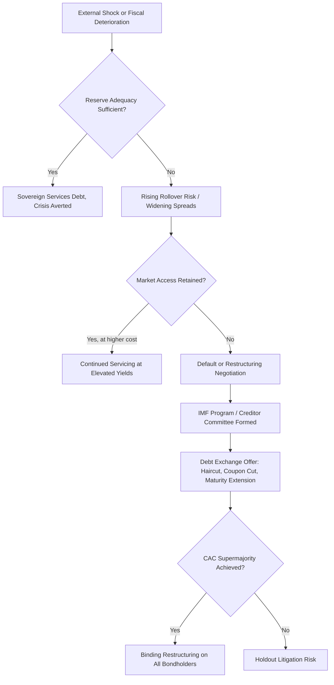

## Sovereign Risk and Emerging Market Debt

### Overview

Sovereign risk is the risk that a government issuer will fail to meet its debt obligations — through outright default, restructuring, forced maturity extension, coupon reduction, or redenomination — or that policy actions (capital controls, currency inconvertibility, expropriation) will impair a bondholder's ability to receive or repatriate promised cash flows. Emerging market (EM) debt is the primary arena in which sovereign risk is priced and traded as a distinct, quantifiable risk factor, since developed-market sovereign default risk has historically been treated as near-negligible (though not zero) by comparison. Unlike corporate credit risk, sovereign risk lacks a bankruptcy court with enforceable seniority and liquidation rights, which fundamentally changes both its analysis and its resolution mechanics.

### Why Sovereign Credit Differs from Corporate Credit

**Key Points**

- **No supranational bankruptcy regime**: There is no equivalent of Chapter 11 for sovereigns; restructuring occurs through negotiation between the sovereign and its creditors, often mediated informally by creditor committees, the IMF, or ad hoc groups, with no binding legal mechanism forcing all creditors to participate absent collective action clauses (CACs) in the bond documentation.
- **Willingness vs. ability to pay**: Corporate default analysis centers heavily on ability to pay (cash flow, balance sheet). Sovereign default analysis must separately weigh willingness to pay, since a government facing a debt/GDP ratio that is technically serviceable may still choose to default or restructure for political reasons (e.g., prioritizing domestic spending over external creditors).
- **Currency of debt matters structurally**: A sovereign borrowing in its own currency can, in principle, always service debt through money creation (subject to inflation/currency depreciation consequences), whereas debt issued in a foreign currency (hard-currency EM debt) cannot be inflated away and requires actual foreign exchange reserves or market access to service.

### Hard-Currency vs. Local-Currency Sovereign Debt

**Key Points**

- **Hard-currency sovereign debt** (typically USD or EUR-denominated, e.g., EMBI Global constituents): Eliminates currency risk for the foreign investor but concentrates default/restructuring risk, since the issuer cannot devalue its way out of the obligation. Historically the more common structure for lower-rated EM sovereigns due to limited local-currency investor bases.
- **Local-currency sovereign debt** (e.g., GBI-EM Global Diversified constituents): Default risk is generally lower in principle since the sovereign controls the currency of obligation, but the foreign investor bears currency risk and, often, higher local inflation/real rate volatility. [Inference: the empirical claim that local-currency default risk is meaningfully lower than hard-currency default risk holds as a general historical pattern but is not a guarantee for any specific issuer or period.]
- The shift of many EM sovereigns toward greater local-currency issuance since the early 2000s ("original sin" reduction) has structurally altered the composition of EM debt risk, shifting emphasis from pure credit/default risk toward a blend of credit, currency, and local rate risk.

### Sovereign Credit Analysis Framework

**Key Points**

- **External solvency metrics**: External debt/GDP, external debt/exports, foreign exchange reserves relative to short-term external debt (reserve adequacy), and current account balance — these assess a sovereign's capacity to generate or hold the foreign currency needed to service hard-currency obligations.
- **Fiscal metrics**: Government debt/GDP, primary fiscal balance (budget balance excluding interest payments), and debt service/government revenue — these assess domestic fiscal sustainability independent of currency of issuance.
- **Institutional and political factors**: Rule of law, central bank independence, track record of policy consistency, and political stability, which bear directly on the "willingness to pay" dimension that has no corporate analogue.
- **Debt structure factors**: Maturity profile (rollover risk concentration), currency composition of debt stock, and the proportion held by foreign versus domestic investors (domestic-held debt is generally considered stickier and less prone to sudden-stop dynamics).

### Credit Rating Agencies and Sovereign Ratings

**Key Points**

- The three major agencies (S&P, Moody's, Fitch) assign sovereign ratings using broadly similar but not identical frameworks, incorporating the factors above plus qualitative overlay judgment.
- Sovereign ratings serve a structural market function beyond pure credit signaling: many institutional mandates and index inclusion rules (e.g., investment-grade vs. high-yield EM bond funds) are directly gated by rating thresholds, meaning a rating action (upgrade/downgrade, particularly a crossing of the investment-grade/high-yield boundary) can trigger mechanical, price-relevant forced buying or selling independent of the information content of the rating change itself.
- Sovereign ratings and corporate ratings within the same country are typically linked via the **sovereign ceiling** convention — corporates domiciled in a country are rarely rated above the sovereign, on the reasoning that sovereign distress (capital controls, currency crisis) would impair even fundamentally strong corporates' ability to service foreign obligations. [Inference: sovereign ceiling application varies by agency methodology and has documented exceptions, so it should be treated as a strong convention rather than an absolute rule.]

### Sovereign Default and Restructuring Mechanics

**Key Points**

- **Collective Action Clauses (CACs)**: Contractual provisions allowing a qualified supermajority of bondholders (commonly 75% under newer-generation aggregated CACs) to approve restructuring terms that then bind all bondholders of that issuance, addressing the holdout creditor problem that plagued earlier restructurings.
- **Holdout litigation risk**: Creditors who refuse to participate in a restructuring can pursue litigation to enforce original bond terms — the Argentina sovereign debt litigation (pari passu clause enforcement in US courts through the 2010s) is a well-documented case illustrating how holdout strategies can materially complicate and delay sovereign debt resolution. [Fact, historically documented; specific ongoing/future litigation outcomes for other sovereigns should not be assumed to follow the same pattern.]
- **Debt exchange structures**: Restructurings typically take the form of an exchange offer — old bonds are swapped for new instruments with some combination of reduced principal (haircut), reduced coupon, extended maturity, or a combination, sometimes with value-recovery instruments (e.g., GDP-linked warrants) attached to compensate creditors if the sovereign's economic recovery exceeds a specified threshold.
- **IMF involvement**: The IMF frequently plays a coordinating role in sovereign debt crises, providing conditional financing alongside program-linked fiscal and structural reform commitments, and its debt sustainability analysis (DSA) framework is often a reference point for negotiating restructuring terms with private creditors.

### Sovereign Spread Decomposition

The yield spread of a hard-currency EM sovereign bond over the equivalent-maturity US Treasury can be conceptually decomposed:

$$\text{Spread} = \text{Expected Loss Component} + \text{Risk Premium} + \text{Liquidity Premium}$$

**Key Points**

- The **expected loss component** reflects the market-implied probability of default multiplied by expected loss-given-default (1 minus expected recovery rate).
- The **risk premium** compensates investors for uncertainty around the timing and magnitude of loss, and for the illiquidity and binary/event-risk nature of sovereign credit events relative to gradual corporate credit deterioration.
- The **liquidity premium** reflects the generally lower trading liquidity of EM sovereign bonds relative to US Treasuries, which widens during periods of market stress independent of any change in underlying credit quality.
- Credit default swap (CDS) markets on sovereign debt provide a market-based, real-time proxy for default probability, and the relationship between cash bond spreads and CDS spreads (the CDS-bond basis) is itself monitored as a relative value and risk-sentiment indicator.

### Sovereign Debt Crisis Flow Diagram

### Hard-Currency vs Local-Currency Risk Profile (svg_diagram)

<svg xmlns="http://www.w3.org/2000/svg" viewBox="0 0 740 260">
<text x="370" y="24" text-anchor="middle" font-size="16" font-weight="bold" fill="#1a1a1a">EM Sovereign Debt Risk Profile Comparison (svg_diagram)</text>
<rect x="30" y="50" width="330" height="190" fill="#fbeeee" stroke="#9c3a3a" stroke-width="1.5" />
<text x="195" y="75" text-anchor="middle" font-size="13" font-weight="bold" fill="#1a1a1a">Hard-Currency Debt</text>
<text x="45" y="100" font-size="11" fill="#333">- Currency risk: none (to base-ccy investor)</text>
<text x="45" y="120" font-size="11" fill="#333">- Default risk: concentrated</text>
<text x="45" y="140" font-size="11" fill="#333">- Cannot inflate away obligation</text>
<text x="45" y="160" font-size="11" fill="#333">- Governing law: NY/English</text>
<text x="45" y="180" font-size="11" fill="#333">- Index: EMBI Global</text>
<text x="45" y="200" font-size="11" fill="#333">- Key metric: FX reserves /</text>
<text x="45" y="216" font-size="11" fill="#333"> short-term external debt</text>
<rect x="380" y="50" width="330" height="190" fill="#eefbf0" stroke="#3a9c5a" stroke-width="1.5" />
<text x="545" y="75" text-anchor="middle" font-size="13" font-weight="bold" fill="#1a1a1a">Local-Currency Debt</text>
<text x="395" y="100" font-size="11" fill="#333">- Currency risk: full (to foreign investor)</text>
<text x="395" y="120" font-size="11" fill="#333">- Default risk: generally lower</text>
<text x="395" y="140" font-size="11" fill="#333">- Can be serviced via money creation</text>
<text x="395" y="160" font-size="11" fill="#333">- Governing law: local</text>
<text x="395" y="180" font-size="11" fill="#333">- Index: GBI-EM Global Diversified</text>
<text x="395" y="200" font-size="11" fill="#333">- Key metric: fiscal balance,</text>
<text x="395" y="216" font-size="11" fill="#333"> domestic inflation trajectory</text>
</svg>

### Practical Example

**Example**

Consider a hypothetical EM sovereign with a debt/GDP ratio of 70% (comparable to some developed markets) but whose debt is 80% denominated in USD and whose FX reserves cover only 3 months of imports and 40% of upcoming 12-month external debt maturities. Despite a debt/GDP ratio that might appear moderate in isolation, the currency composition and reserve inadequacy metrics signal acute external liquidity risk — the sovereign may be unable to roll over maturing hard-currency debt even if it is otherwise fiscally solvent in local-currency terms, illustrating why external solvency metrics, not debt/GDP alone, are central to hard-currency sovereign credit analysis.

### Practitioner Considerations

**Key Points**

- Sovereign risk assessment requires triangulating quantitative metrics (external and fiscal solvency ratios) with qualitative/institutional judgment (willingness to pay, political stability), since purely mechanical scoring models have historically underperformed in anticipating sovereign crises driven by political regime shifts. [Inference: this is a widely cited critique of purely quantitative sovereign risk models in the literature, though model performance varies by methodology and time period.]
- CDS spreads, bond spreads, and rating agency actions frequently diverge in timing — CDS markets tend to move first as a forward-looking, liquid signal, with rating actions often lagging observable spread widening.
- For local-currency EM debt specifically, sovereign risk analysis must be paired with currency risk and real interest rate analysis, since the three risk dimensions (default, currency, real rate) do not move independently and their correlation structure shifts materially between calm and crisis regimes.

### Related Topics

- Covered interest rate parity and the cross-currency basis
- Collective action clauses and holdout creditor litigation case studies
- IMF debt sustainability analysis (DSA) methodology
- Sovereign CDS-bond basis as a relative value signal
- Reserve adequacy metrics (IMF ARA metric, import cover, short-term debt cover)
- Local-currency EM debt and Euroclearability/index-inclusion mechanics