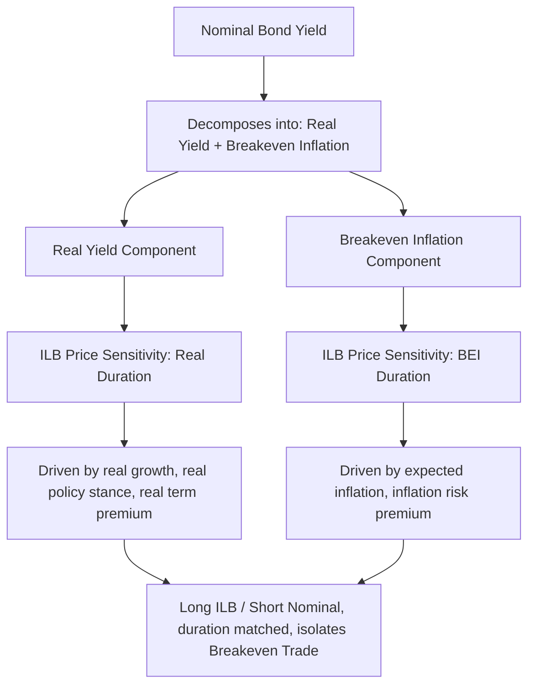

## Inflation Linked Bonds and Real Yield Duration

### Overview

Inflation-linked bonds (ILBs) are debt instruments whose principal, coupon, or both are indexed to a reference inflation measure, designed to preserve the real (inflation-adjusted) purchasing power of the investor's cash flows. Their existence introduces a structural bifurcation of the yield curve into nominal yields and real yields, and correspondingly bifurcates duration into nominal duration and real yield duration — a distinction that is central to hedging, relative value, and portfolio construction in this asset class. Major programs include US TIPS (Treasury Inflation-Protected Securities), UK Index-Linked Gilts, French/eurozone OATi/OAT€i, German Bund index-linked issues, and Japanese JGBi.

### Structural Mechanics of Inflation Indexation

**Key Points**

- **Capital-indexed structure** (dominant global convention, used by TIPS, most OATi, JGBi): The bond's principal is adjusted upward (or downward, subject to a deflation floor in some structures) in line with a reference index ratio derived from a CPI-type measure; the fixed coupon rate is then applied to this adjusted (inflation-accreted) principal, so both coupon cash flows and redemption value grow with inflation.
- **Index ratio calculation**: 

  $$\text{Index Ratio} = \frac{\text{Reference CPI}_{t}}{\text{Reference CPI}_{\text{base}}}$$

  where the reference CPI for a given date is typically interpolated between the CPI values published for two calendar months prior, to accommodate the publication lag of official inflation statistics (commonly a 2-3 month lag convention, e.g., US TIPS use a 3-month lag).
- **Deflation floor**: US TIPS guarantee repayment of at least the original (unindexed) par value at maturity even under cumulative deflation, effectively embedding a free put option on cumulative deflation over the bond's life; this floor typically applies only at final redemption, not to intermediate coupon payments, and is a feature not universally present across all sovereign ILB programs. [Inference: whether a specific non-US program includes an equivalent deflation floor should be verified against that program's current issuance terms rather than assumed.]
- **Interest-indexed structure** (less common globally): Coupon rate itself floats with inflation while principal remains fixed; historically used in some Australian and UK legacy issues but largely superseded by the capital-indexed convention.

### Real Yield vs. Nominal Yield

**Key Points**

- The yield to maturity quoted on an ILB is a **real yield** — the return earned above realized inflation over the bond's life, in contrast to a nominal bond's yield, which embeds both a real return component and compensation for expected inflation.
- The (approximate) Fisher relationship links the two:

  $$(1 + y_{nominal}) \approx (1 + y_{real}) \times (1 + \pi_{expected})$$

  or in additive approximation form commonly used for short-horizon estimation:

  $$y_{nominal} \approx y_{real} + \pi_{expected}$$
- Real yields respond primarily to changes in the expected real economic growth rate, real policy rate stance, and real term premium, whereas nominal yields respond to those factors **plus** changes in inflation expectations — this decomposition is precisely what makes the nominal-minus-real spread (breakeven inflation) informative as a market-implied inflation forecast, covered separately as its own topic.

### Real Yield Duration

Real yield duration measures an ILB's price sensitivity to a change in its own real yield, calculated analogously to nominal modified duration but applied to the real yield curve:

$$D_{real} = -\frac{1}{P} \times \frac{\partial P}{\partial y_{real}}$$

**Key Points**

- Because an ILB's cash flows are indexed to inflation, its price is largely insulated from changes in inflation expectations (to first order) but remains fully exposed to changes in real yields — a rise in real yields lowers ILB prices just as a rise in nominal yields lowers conventional bond prices, with the sensitivity governed by real duration rather than nominal duration.
- For a given maturity, an ILB's real duration is typically numerically similar in magnitude to a nominal bond's modified duration of comparable maturity (both are driven primarily by the discounting of cash flows over time), but the two durations measure sensitivity to **different underlying rate factors** (real yield vs. nominal yield) and should not be netted or combined without decomposing the portfolio's exposure into its real-rate and breakeven-inflation components separately.
- **BEI (breakeven inflation) duration** is the complementary risk measure — an ILB (long inflation-linked, funded via or compared against a nominal bond) has positive sensitivity to rising breakeven inflation, since realized/expected inflation accretion benefits the ILB's principal relative to the fixed nominal bond.

### Portfolio Decomposition: Real Rate Risk vs. Breakeven Risk

A nominal government bond position can be conceptually decomposed, and equivalently an ILB position can be analyzed, along two orthogonal risk axes:

$$\Delta P_{nominal\ bond} \approx -D_{nominal} \times \Delta y_{nominal} = -D_{nominal} \times (\Delta y_{real} + \Delta \pi_{expected})$$

**Key Points**

- This decomposition allows a portfolio manager to isolate a pure **real rate view** (e.g., expressing a view that real yields will fall due to weaker growth, without taking an inflation view) by going long ILBs and simultaneously hedging out the inflation-linked accretion exposure, or to isolate a pure **breakeven/inflation view** (expressing a view that inflation will surprise higher without taking a real-rate view) via a long ILB/short nominal bond (or vice versa) pair trade matched on duration.
- Matching real duration and nominal duration precisely in a breakeven trade requires care, since the two instruments' price sensitivities to their respective yields are not always identical even at matched maturity, due to differences in cash flow timing (inflation-accreted coupons vs. fixed coupons) and convexity characteristics.

### Convexity Considerations

**Key Points**

- ILBs generally exhibit **higher effective convexity** relative to comparable nominal bonds when the embedded deflation floor is in-the-money or near-the-money (i.e., cumulative inflation since issuance is low or negative), since the floor introduces optionality that flattens downside price risk in low/deflationary environments — this is a standard, structural feature of floored capital-indexed ILBs, not merely a benchmark-period observation.
- In high cumulative inflation environments where the deflation floor is deeply out-of-the-money (irrelevant), ILB price behavior converges toward standard fixed income convexity characteristics driven purely by the real yield curve's shape and the bond's cash flow schedule.

### Real Yield Curve and Duration Diagram

### Real vs Nominal Duration Exposure (svg_diagram)

<svg xmlns="http://www.w3.org/2000/svg" viewBox="0 0 740 260">
<text x="370" y="24" text-anchor="middle" font-size="16" font-weight="bold" fill="#1a1a1a">Real vs Nominal Duration Exposure (svg_diagram)</text>
<rect x="30" y="50" width="330" height="190" fill="#eef3fb" stroke="#3a5a9c" stroke-width="1.5" />
<text x="195" y="75" text-anchor="middle" font-size="13" font-weight="bold" fill="#1a1a1a">Nominal Bond</text>
<text x="45" y="100" font-size="11" fill="#333">Yield = Real Yield + Breakeven Inflation</text>
<text x="45" y="125" font-size="11" fill="#333">Duration exposed to BOTH:</text>
<text x="55" y="145" font-size="11" fill="#333">- real yield changes</text>
<text x="55" y="165" font-size="11" fill="#333">- inflation expectation changes</text>
<text x="45" y="195" font-size="11" fill="#333">Cannot isolate one factor alone</text>
<text x="45" y="215" font-size="11" fill="#333">without a paired ILB position</text>
<rect x="380" y="50" width="330" height="190" fill="#eefbf0" stroke="#3a9c5a" stroke-width="1.5" />
<text x="545" y="75" text-anchor="middle" font-size="13" font-weight="bold" fill="#1a1a1a">Inflation-Linked Bond</text>
<text x="395" y="100" font-size="11" fill="#333">Yield = Real Yield only</text>
<text x="395" y="125" font-size="11" fill="#333">Duration primarily exposed to:</text>
<text x="405" y="145" font-size="11" fill="#333">- real yield changes (Real Duration)</text>
<text x="395" y="170" font-size="11" fill="#333">Principal/coupons inflation-indexed,</text>
<text x="395" y="190" font-size="11" fill="#333">insulating vs. inflation surprise</text>
<text x="395" y="215" font-size="11" fill="#333">(subject to indexation lag)</text>
</svg>

### Practical Example

**Example**

A 10-year TIPS is issued with a real coupon of 1.5% and an initial index ratio of 1.000. After two years, cumulative CPI accretion has raised the index ratio to 1.08 (8% cumulative inflation). The next coupon payment is calculated as $1.5\% \times 1.08 \times \text{original face value}$, and if redeemed today, the bond's inflation-adjusted principal would be $1.08 \times$ face value (subject to the deflation floor comparison at actual maturity, not at this intermediate point). If real yields simultaneously rise by 50 basis points due to stronger expected real growth, the bond's price falls by approximately $\text{Real Duration} \times 0.50\%$, independent of the inflation accretion already embedded in the adjusted principal — illustrating the separation between the inflation-indexation mechanic (principal growth) and the real-yield discounting mechanic (price sensitivity).

### Practitioner Considerations

**Key Points**

- Indexation lag (the 2-3 month gap between the reference CPI date and the actual CPI print date) means an ILB's realized short-term return does not perfectly track contemporaneous inflation prints, creating a small but measurable basis, particularly relevant around large, unexpected month-over-month CPI surprises.
- Seasonality in non-seasonally-adjusted CPI indices used for indexation (most ILB programs reference non-seasonally-adjusted CPI) can create a modest, recurring intra-year seasonal pattern in ILB carry, which is a well-documented structural feature of the asset class rather than a market anomaly.
- Real yield duration and BEI duration should be risk-managed as distinct exposures within a portfolio; treating an ILB position as equivalent in risk character to a nominal bond of the same maturity conflates two economically different risk factors and can materially misstate a portfolio's true sensitivity to a growth shock versus an inflation shock.

### Related Topics

- Breakeven inflation curve construction and the inflation risk premium
- Deflation floor option valuation in capital-indexed structures
- Indexation lag and seasonal CPI adjustment effects on ILB carry
- Cross-market real yield comparisons (TIPS vs. Gilts vs. OATi vs. JGBi)
- Inflation swaps as an alternative, cash-flow-unconstrained inflation hedge
- Currency-hedged inflation-linked bond portfolio construction