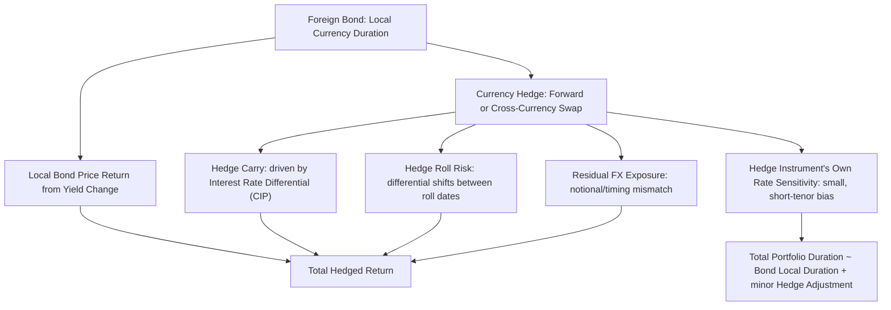

## Cross Currency Duration and Hedged Returns

### Overview

Cross currency duration and hedged returns extend the single-currency duration framework to portfolios holding fixed income assets across multiple currencies, where the hedging instrument itself (forwards, futures, or swaps) introduces its own rate sensitivity that interacts with the underlying bond's duration. Properly measuring "true" portfolio duration in a multi-currency, hedged context requires isolating the bond's local-currency rate exposure from the residual rate exposure embedded in the hedge structure — conflating the two is a common source of hedged-portfolio duration mismeasurement.

### Duration in a Hedged Foreign Bond Position

**Key Points**

- A currency-hedged foreign bond retains the **full local-currency duration** of the underlying bond — hedging the currency does not hedge the interest rate exposure. A USD investor holding a currency-hedged JGB is still exposed to JGB yield movements with the same sensitivity as a local Japanese investor holding the identical bond.
- The forward or swap used to hedge the currency exposure has its own, separate and typically much smaller, interest-rate sensitivity, arising because forward points (and swap fixed legs) are themselves a function of the interest rate differential between the two currencies over the forward's tenor.
- **Total hedged portfolio duration** is therefore approximately the bond's local-currency duration, adjusted by a typically small correction term from the hedge instrument's own rate sensitivity — in most practical portfolio construction, this hedge-instrument duration effect is treated as a second-order adjustment rather than the primary duration driver, though it is not strictly zero. [Inference: the magnitude of this second-order effect is instrument- and tenor-specific and should be measured explicitly for precise risk management rather than assumed negligible in all cases.]

### Forward Hedge Mechanics and Rate Sensitivity

**Key Points**

- A currency forward's price (forward points) is derived from the covered interest rate parity relationship, meaning the forward's mark-to-market value between inception and maturity is sensitive to changes in **both** currencies' short-term interest rates over the forward's remaining tenor.
- Because hedges are typically rolled using short-dated forwards (1, 3, or 6 months) against a long-dated bond, the interest rate sensitivity contributed by the forward is concentrated at the short end of each currency's curve, in contrast to the bond's duration, which reflects the full term structure out to the bond's maturity — this maturity mismatch between hedge instrument and hedged asset is a structural feature of rolling-hedge programs, not a flaw specific to any particular implementation.
- **Hedge roll risk**: At each roll date, the new forward is repriced off then-current interest rate differentials and spot rates; if the differential has moved unfavorably since the prior roll, realized hedging cost changes, and the P&L impact of this roll is separate from, and in addition to, the bond's own price return from local yield movements.

### Decomposing Hedged Total Return

$$R_{hedged} \approx R_{bond}^{local} + R_{hedge\ carry}$$

where $R_{hedge\ carry}$ is the return contribution from the forward/swap hedge, driven predominantly by the interest rate differential locked in at each roll (per covered interest rate parity), rather than by spot currency movement, which the hedge is designed to neutralize.

**Key Points**

- This is the multi-period extension of the single-hedge decomposition: $R_{hedge\ carry}$ over a full period is the compounded result of the carry captured (or paid) at each individual roll date, and can be path-dependent if interest rate differentials shift materially between rolls.
- Residual, imperfect hedging (due to notional mismatch as the bond's market value fluctuates, or timing mismatch between hedge maturity and bond cash flow dates) leaves a small unhedged currency residual, meaning a "hedged" position in practice is rarely a perfect 100% neutralization of spot FX risk at every point in time between rebalancing dates.

### Cross-Currency Basis Swaps for Duration-Matched Hedging

**Key Points**

- For portfolios seeking to hedge currency exposure on longer-duration bond holdings without the operational burden of frequently rolling short-dated forwards, **cross-currency basis swaps** provide a longer-tenor alternative — exchanging a floating (or fixed) rate cash flow stream in one currency for a corresponding stream in another currency, with notional exchanged at both inception and maturity.
- The **cross-currency basis** (the spread added to one leg of the swap beyond what covered interest rate parity alone would imply) reflects supply/demand imbalances in cross-currency funding markets and represents an additional cost or benefit to hedging beyond the simple interest rate differential, particularly pronounced in USD funding markets since 2008. [Unverified: current basis levels for specific currency pairs are time-varying market data and should be checked against live pricing rather than assumed from historical patterns.]
- Duration-matching a basis swap hedge to the underlying bond's duration more closely aligns the hedge instrument's rate sensitivity profile with the bond's, reducing (but not eliminating) the roll-risk and curve-mismatch issues inherent in short-dated rolling forward hedges.

### Multi-Currency Portfolio Duration Aggregation

**Key Points**

- In a multi-currency bond portfolio, duration is not a single scalar but a vector of **currency-bucketed durations** — the portfolio's sensitivity to a parallel shift in, say, USD rates is distinct from its sensitivity to a parallel shift in EUR rates or JPY rates, and these should be reported and risk-managed separately rather than aggregated into one blended "portfolio duration" figure, which would obscure the currency-specific rate exposures.
- **Key rate duration by currency-curve pair** provides the most granular view, decomposing sensitivity not just by currency but by point on each currency's yield curve, which is necessary when the portfolio holds bonds of varying maturities across multiple currencies and the manager wants to assess exposure to non-parallel curve movements (e.g., US curve steepening combined with European curve flattening).
- When positions are hedged, this currency-bucketed duration reporting should further distinguish **local-currency bond duration** from **hedge-instrument residual duration**, since a risk manager evaluating "what happens if US rates rise 50bp" needs to know whether a EUR-denominated, USD-hedged bond position has any residual USD rate sensitivity coming from the hedge leg itself, distinct from its EUR bond duration.

### Cross-Currency Hedged Return Flow

### Hedge Instrument Duration vs Bond Duration (svg_diagram)

<svg xmlns="http://www.w3.org/2000/svg" viewBox="0 0 740 260">
<text x="370" y="24" text-anchor="middle" font-size="16" font-weight="bold" fill="#1a1a1a">Bond Duration vs Hedge Instrument Duration (svg_diagram)</text>
<line x1="60" y1="200" x2="700" y2="200" stroke="#333" stroke-width="1.5" />
<text x="60" y="220" font-size="10" fill="#333">0</text>
<text x="370" y="220" font-size="10" fill="#333" text-anchor="middle">5Y</text>
<text x="690" y="220" font-size="10" fill="#333" text-anchor="middle">10Y</text>
<text x="370" y="240" text-anchor="middle" font-size="11" fill="#555">Maturity / Tenor Axis</text>
<rect x="60" y="150" width="640" height="30" fill="#eef3fb" stroke="#3a5a9c" stroke-width="1.5" />
<text x="380" y="170" text-anchor="middle" font-size="11" fill="#1a1a1a">Bond Local-Currency Duration: spans full maturity (e.g., 10Y)</text>
<rect x="60" y="100" width="70" height="30" fill="#fbeeee" stroke="#9c3a3a" stroke-width="1.5" />
<text x="95" y="120" text-anchor="middle" font-size="10" fill="#1a1a1a">Roll 1</text>
<rect x="130" y="100" width="70" height="30" fill="#fbeeee" stroke="#9c3a3a" stroke-width="1.5" />
<text x="165" y="120" text-anchor="middle" font-size="10" fill="#1a1a1a">Roll 2</text>
<rect x="200" y="100" width="70" height="30" fill="#fbeeee" stroke="#9c3a3a" stroke-width="1.5" />
<text x="235" y="120" text-anchor="middle" font-size="10" fill="#1a1a1a">Roll 3</text>
<text x="300" y="120" font-size="10" fill="#555">... continued short-dated forward rolls across full bond life</text>

<text x="370" y="75" text-anchor="middle" font-size="11" font-weight="bold" fill="`#1a1a1a`">Rolling Forward Hedge: concentrated short-tenor rate sensitivity per roll</text>

</svg>

### Practical Example

**Example**

A USD-based portfolio holds a EUR-denominated 10-year German Bund with a modified duration of 8.5 and hedges the currency exposure using rolling 3-month EUR/USD forwards. The portfolio's duration to EUR rate moves is approximately 8.5 (essentially the full Bund duration, unaffected by hedging). Separately, the rolling forward introduces a small duration-like sensitivity to the EUR-USD short-term interest rate differential (roughly matching the 3-month forward's tenor), which is immaterial in magnitude next to the Bund's 8.5 duration but is not literally zero — a precise risk report would show both figures rather than collapsing them into one undifferentiated "duration" number, avoiding the false impression that hedging currency also somehow reduces interest rate duration.

### Practitioner Considerations

**Key Points**

- Duration reporting for hedged multi-currency fixed income portfolios should always specify whether the figure represents local-currency bond duration, hedge-instrument residual duration, or a combined total, since the three answer materially different risk questions and conflating them can misstate the portfolio's true sensitivity to a given currency's rate curve.
- Rolling short-dated hedges introduce operational complexity (transaction costs at each roll, roll-timing risk around month-end/quarter-end liquidity conditions) that longer-tenor cross-currency swap hedges avoid, at the cost of the swap's own counterparty credit exposure and typically wider bid-ask spreads for less liquid currency pairs.
- Basis risk between the currency pair being hedged and any proxy hedge used (e.g., hedging a smaller EM currency via a more liquid regional proxy currency due to limited forward market depth) adds a further layer of imperfect-hedge residual exposure that should be explicitly measured and disclosed rather than assumed away. [Inference: the appropriateness and cost-effectiveness of proxy hedging is currency-pair- and liquidity-condition-specific and should be assessed case by case.]

### Related Topics

- Covered interest rate parity and the cross-currency basis in depth
- Key rate duration decomposition across multiple currency curves
- Hedge ratio optimization and dynamic hedging overlays
- Proxy currency hedging for illiquid emerging market currencies
- Currency risk in cross border bond investing (single-position framework)
- Real yield duration interaction with currency-hedged inflation-linked portfolios