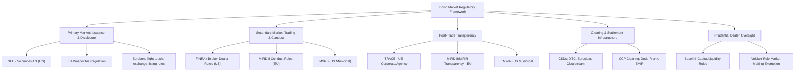

## Bond Market Regulatory Framework

### Overview

The bond market regulatory framework comprises the layered set of statutory laws, regulatory bodies, self-regulatory organizations (SROs), and market infrastructure rules governing the issuance, trading, clearing, and reporting of fixed income securities. Unlike equity markets, which trade predominantly on centralized, lit exchanges, bond markets remain substantially over-the-counter (OTC) in structure, which shapes a regulatory approach centered on dealer conduct, disclosure requirements at issuance, post-trade transparency mandates, and prudential oversight of market-making entities rather than exchange-centric market surveillance.

### Primary Market Regulation: Issuance and Disclosure

**Key Points**

- **Registration and prospectus requirements**: In the US, corporate bond issuance to the public generally requires registration under the Securities Act of 1933 (or reliance on an exemption, e.g., Rule 144A for qualified institutional buyer placements, or Regulation S for offshore offerings), administered by the SEC, requiring disclosure of the issuer's financial condition, use of proceeds, and material risk factors.
- **Sovereign and municipal exemptions**: US Treasury securities and, subject to specific conditions, US municipal bonds are exempt from the full '33 Act registration regime, though municipal issuance is separately regulated (see MSRB below), reflecting a policy judgment that government issuers warrant a distinct disclosure regime from private corporate issuers.
- **Eurobond light-touch regime**: As covered under international market structures, Eurobonds distributed outside the jurisdiction of their reference currency typically fall outside domestic securities registration requirements entirely, relying instead on prospectus disclosure requirements of the listing exchange (e.g., Luxembourg Stock Exchange, Irish Stock Exchange) and general anti-fraud provisions.
- **EU Prospectus Regulation**: Within the EU, public offers of securities (including bonds) above specified thresholds require an approved prospectus under the Prospectus Regulation, with a passporting mechanism allowing a prospectus approved in one EU member state to be used for offerings across the bloc.

### Secondary Market Regulation: Trading and Conduct

**Key Points**

- **Dealer/broker-dealer registration**: Firms making markets in bonds must generally register as broker-dealers (in the US, with the SEC and become FINRA members; analogous authorization regimes apply under MiFID II in the EU and the FCA in the UK), subjecting them to capital adequacy, best execution, and conduct-of-business rules.
- **Best execution obligations**: Regulatory regimes (FINRA rules in the US, MiFID II in the EU) impose obligations on dealers to seek the most favorable terms reasonably available for client orders, though the OTC, quote-driven nature of bond markets makes best-execution demonstration structurally different from the more easily benchmarked equity market context (where a consolidated tape provides a clear reference price).
- **Market abuse regulation**: Insider dealing, market manipulation, and unlawful disclosure provisions (EU Market Abuse Regulation, US securities fraud provisions under the Securities Exchange Act) apply to bond trading, with particular regulatory attention historically paid to sovereign bond auction conduct and benchmark-setting processes following past manipulation cases (e.g., LIBOR-related enforcement actions, which had a fixed income market dimension via LIBOR's role as a floating-rate reference).

### Post-Trade Transparency Infrastructure

**Key Points**

- **TRACE (Trade Reporting and Compliance Engine)**: Operated by FINRA in the US, TRACE mandates that broker-dealers report most corporate bond (and since expansion, agency debt and certain securitized product) transactions within specified time windows, and disseminates aggregated transaction data publicly, a structural shift from the historically opaque, quote-only corporate bond market.
- **MiFID II/MiFIR transparency regime**: In the EU, MiFID II introduced pre- and post-trade transparency requirements for bonds, though calibrated with deferrals and size-based waivers for illiquid instruments and large-in-scale trades, reflecting an explicit regulatory recognition that full, immediate transparency for all bond trades could impair dealer willingness to commit capital to large trades. [Inference: the precise calibration of these waivers and thresholds is subject to periodic regulatory review and adjustment, so current specific thresholds should be verified against the latest ESMA technical standards rather than assumed static.]
- **MSRB (Municipal Securities Rulemaking Board) and EMMA**: In the US municipal bond market, the MSRB writes rules governing dealer conduct and operates EMMA (Electronic Municipal Market Access), the official public repository for municipal bond disclosure documents and trade price transparency.

### Clearing, Settlement, and Central Counterparty Regulation

**Key Points**

- Central securities depositories (DTC in the US, Euroclear/Clearstream internationally) and, for certain repo and derivative-adjacent bond market activity, central counterparties (CCPs) operate under prudential oversight regimes (e.g., the CPMI-IOSCO Principles for Financial Market Infrastructures as an international standard-setting reference) addressing settlement finality, default management, and systemic risk mitigation.
- Post-2008 reforms extended CCP clearing mandates significantly to standardized OTC derivatives (interest rate swaps, CDS) that are closely linked to fixed income risk management, under frameworks such as the Dodd-Frank Act (US) and EMIR (EU), even though cash bond trading itself largely remained bilaterally settled rather than centrally cleared, with some more recent regulatory initiatives (e.g., US Treasury central clearing mandates) extending centralized clearing further into cash and repo markets. [Fact as a general trend; specific current implementation status and compliance deadlines for any given mandate should be verified against current regulatory releases, as these have been subject to phased and revised timelines.]

### Prudential and Systemic Oversight of Dealers

**Key Points**

- Bank-affiliated bond dealers are subject to prudential capital and liquidity regulation (Basel III framework internationally, implemented via jurisdiction-specific rules such as the US banking agencies' capital rules), which indirectly shapes bond market liquidity by affecting the balance sheet capacity dealers allocate to market-making inventory.
- The **Volcker Rule** (US, under Dodd-Frank) restricts proprietary trading by banking entities while preserving an exemption for genuine market-making activity, a distinction that has generated ongoing regulatory and industry debate about its effect on dealer bond market liquidity provision, particularly during stress periods. [Inference: the empirical magnitude of Volcker Rule effects on bond market liquidity has been debated in academic and regulatory literature with mixed findings, and should be treated as a contested empirical question rather than a settled fact.]
- Non-bank market makers (principal trading firms) have grown as a share of certain liquid government bond markets (notably US Treasuries) and are subject to a distinct, generally lighter-touch regulatory regime than bank dealers, a structural divergence that has drawn increasing regulatory attention regarding consistent oversight across dealer types performing similar market functions.

### Regulatory Architecture Diagram

### Regulatory Layers by Market Function (svg_diagram)

<svg viewBox="0 0 760 300" xmlns="http://www.w3.org/2000/svg">
<text x="380" y="24" text-anchor="middle" font-size="16" font-weight="bold" fill="#1a1a1a">Bond Market Regulatory Layers (svg_diagram)</text>
<rect x="20" y="50" width="720" height="50" fill="#eef3fb" stroke="#3a5a9c" stroke-width="1.5"/>
<text x="40" y="70" font-size="12" font-weight="bold" fill="#1a1a1a">Issuance Layer</text>
<text x="40" y="88" font-size="11" fill="#333">SEC Registration / EU Prospectus Regulation / Eurobond exchange listing rules</text>
<rect x="20" y="110" width="720" height="50" fill="#fbf3ee" stroke="#9c5a3a" stroke-width="1.5"/>
<text x="40" y="130" font-size="12" font-weight="bold" fill="#1a1a1a">Trading Conduct Layer</text>
<text x="40" y="148" font-size="11" fill="#333">FINRA / MiFID II Best Execution / MSRB / Market Abuse Regulation</text>
<rect x="20" y="170" width="720" height="50" fill="#eefbf0" stroke="#3a9c5a" stroke-width="1.5"/>
<text x="40" y="190" font-size="12" font-weight="bold" fill="#1a1a1a">Transparency Layer</text>
<text x="40" y="208" font-size="11" fill="#333">TRACE / MiFIR Post-Trade Reporting / EMMA</text>
<rect x="20" y="230" width="720" height="50" fill="#f9f3fb" stroke="#7a3a9c" stroke-width="1.5"/>
<text x="40" y="250" font-size="12" font-weight="bold" fill="#1a1a1a">Infrastructure & Prudential Layer</text>
<text x="40" y="268" font-size="11" fill="#333">CSDs / CCP Clearing (Dodd-Frank, EMIR) / Basel III / Volcker Rule</text>
</svg>

### Practical Example

**Example**

A US corporate issues a $300 million bond via a registered public offering under the Securities Act, requiring an SEC-reviewed prospectus disclosing use of proceeds and risk factors. Once issued, secondary market trades in the bond by FINRA-member broker-dealers must be reported to TRACE within the mandated reporting window, and TRACE subsequently disseminates aggregated price and volume data publicly. If the same issuer instead placed an equivalent bond privately under Rule 144A to qualified institutional buyers, or issued a USD-denominated Eurobond in London, it would face substantially lighter disclosure requirements at issuance, illustrating how the same economic instrument (a corporate USD bond) can sit under materially different regulatory regimes purely as a function of the issuance and distribution channel chosen.

### Practitioner Considerations

**Key Points**

- Regulatory transparency regimes (TRACE, MiFID II) directly affect bond market microstructure and liquidity — dealers' willingness to commit capital to large block trades is sensitive to how quickly and completely that trade's terms become publicly visible, which is precisely why size-based reporting deferrals exist as a deliberate regulatory design choice rather than an oversight.
- Cross-border bond trading and distribution requires navigating multiple overlapping regimes simultaneously (e.g., a US investor buying a MiFID II-regulated EU corporate bond via a EU-authorized dealer), and jurisdictional coordination gaps or divergences remain an active area of regulatory harmonization effort. [Inference: the degree of current harmonization is evolving and specific cross-border compliance requirements should be verified against current rules rather than assumed from general principle.]
- The regulatory perimeter around non-bank liquidity providers in government bond markets is an actively evolving area, with regulatory bodies in multiple jurisdictions examining whether current oversight is proportionate to these firms' growing market-making role. [Inference: specific regulatory proposals and their adoption status change over time and should be checked against current regulatory agendas.]

### Related Topics

- TRACE reporting mechanics and corporate bond market transparency effects
- MiFID II/MiFIR transparency calibration and large-in-scale waivers
- Central clearing mandates for US Treasury cash and repo markets
- Basel III capital rules and dealer bond market-making capacity
- Rule 144A and Regulation S private placement structures
- Municipal bond disclosure regime and continuing disclosure obligations