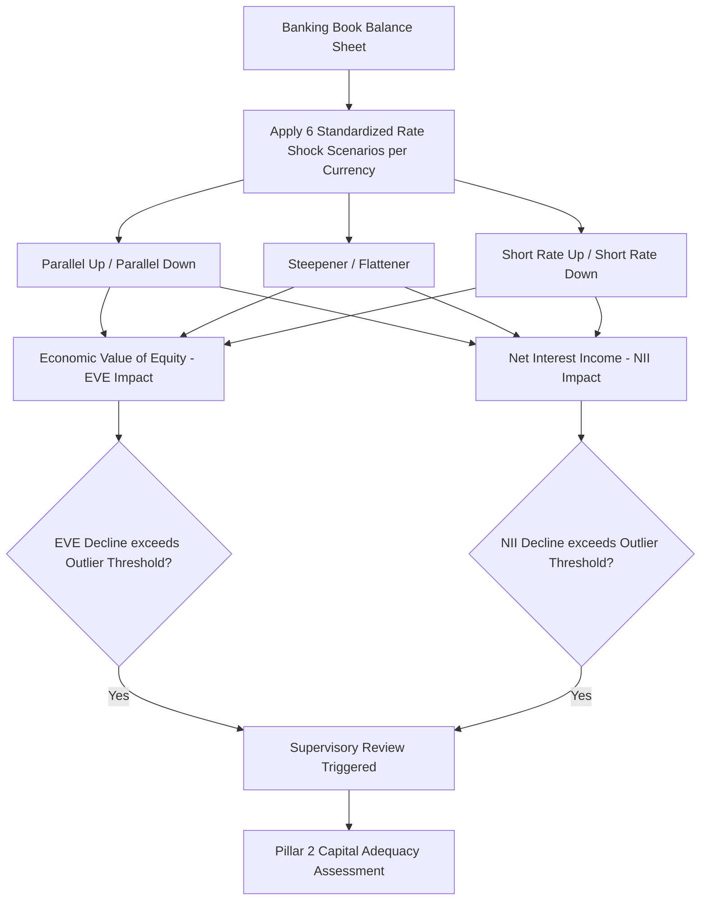

## Interest Rate Risk in the Banking Book under Basel

### Overview

Interest Rate Risk in the Banking Book (IRRBB) is the risk to a bank's capital and earnings arising from adverse movements in interest rates affecting its banking book positions — the loans, deposits, and other non-trading-book instruments held on the balance sheet, as distinct from trading book positions already captured under market risk capital rules. The Basel Committee on Banking Supervision (BCBS) issues global standards governing how banks measure, manage, and disclose IRRBB, implemented as a Pillar 2 (supervisory review) framework rather than a Pillar 1 minimum capital charge, which structurally distinguishes it from credit risk and market risk capital requirements.

### Regulatory Structure: Pillar 2 Treatment

**Key Points**

- Unlike credit risk and trading-book market risk, which carry standardized Pillar 1 minimum capital requirements, IRRBB is addressed under the **Pillar 2 supervisory review process** — banks are expected to hold capital commensurate with their IRRBB exposure, and supervisors assess adequacy through the standardized measurement framework and outlier tests rather than a universal formulaic capital charge.
- This Pillar 2 treatment reflects the Basel Committee's judgment that IRRBB is highly heterogeneous across banks (driven by each institution's specific balance sheet composition, deposit behavior assumptions, and hedging practices), making a one-size-fits-all Pillar 1 charge less appropriate than for more homogeneously modelable risks.
- The current consolidated standard resides in the BIS Basel Framework, chapters SRP31 (Interest rate risk in the banking book) and, following recalibration, SRP98, and it requires banks to calculate outcomes of both economic value and earnings-based measures, arising from a wide and appropriate range of interest rate shock and stress scenarios. [Bank for International Settlements](https://www.bis.org/committees/bcbs/basel-framework/standard/srp/31/inforce/2026-01-01/published/2024-07-16)

### Two Core Measurement Approaches

**Key Points**

- **Economic Value of Equity (EVE)**: Measures the change in the present value of all banking book cash flows (assets minus liabilities, plus off-balance-sheet items) under a specified interest rate shock, capturing the long-run economic sensitivity of the bank's net worth to rate changes — analogous in spirit to portfolio duration/convexity sensitivity applied to the entire balance sheet.
- **Net Interest Income (NII) / earnings-based measures**: Measure the change in expected near-term earnings (typically over a 1-3 year horizon) under a rate shock, capturing the more immediate income-statement impact, which can diverge materially from the EVE signal depending on the balance sheet's repricing mismatch structure and the assumed reinvestment/refinancing behavior over the horizon.
- Both measures are required precisely because they can point in different directions or magnitudes for the same underlying balance sheet — a bank with a large negative EVE sensitivity to rising rates might simultaneously show a near-term NII benefit if its liabilities reprice slower than its assets, illustrating why regulators mandate dual reporting rather than relying on either measure alone.

### Standardized Interest Rate Shock Scenarios

**Key Points**

- The standard prescribes six regulatory shock scenarios applied to each currency in which a bank has material exposure: parallel shock up, parallel shock down, steepener, flattener, short rate shock up, and short rate shock down — designed to capture both parallel and non-parallel yield curve risk, since EVE/NII sensitivity to curve reshaping can differ substantially from sensitivity to a uniform parallel shift.
- Shock magnitudes are currency-specific, calibrated from historical interest rate volatility observed in each currency, with a floor and cap structure to bound the shocks: a floor and a set of caps are applied. The floor is set at 100bp and the caps are set at 400bp for the parallel shock, 500bp for the short-term shock and 300bp for the long-term shock, ensuring the framework remains prudent for currencies with unusually low historical volatility while avoiding implausibly extreme shocks for high-volatility currencies. [Almisinternational](https://www.almisinternational.com/irrbb-update/)
- On 16 July 2024, the Basel Committee finalized a recalibration of the shock parameters, the first such update since the standard's 2016 introduction. Key methodological changes included expansion of the time series used in the calibration from December 2015 to December 2023 and replacement of the global shock factors with local shock factors calculated directly for each currency using the averages of absolute changes in interest rates calculated over a rolling six-month period. Additional refinements included shifting the calibration from relative to absolute interest rate changes and moving from a 99.0% to a 99.9% quantile in deriving the shock parameters, as summarized in industry analysis of the final paper. The parameters are determined on the basis of absolute interest rate changes and no longer on the basis of relative interest rate changes. They are derived from a 99.9% quantile and no longer from a 99.0% quantile. [Basel Committee makes targeted adjustments to its standard on IRRBB | Global Regulation Tomorrow +2](https://www.regulationtomorrow.com/global/basel-committee-makes-targeted-adjustments-to-its-standard-on-irrbb/)
- The revised standard should be implemented by 1 January 2026, per the Basel Committee's own timeline, though actual implementation dates vary by jurisdiction as national/regional regulators transpose the recalibrated shocks into local rules — for example, the Hong Kong Monetary Authority has indicated it will locally implement these recalibrated interest rate shocks by 1 January 2026. [Unverified: implementation status and specific effective dates should be checked against current jurisdiction-specific regulatory releases, as national adoption timelines can diverge from the Basel Committee's own recommended date.] [Global Regulation Tomorrow](https://www.regulationtomorrow.com/global/basel-committee-makes-targeted-adjustments-to-its-standard-on-irrbb/)[kpmg](https://kpmg.com/cn/en/home/insights/2024/07/recalibration-of-shocks-for-irrbb.html)

### Supervisory Outlier Tests (SOT)

**Key Points**

- The framework includes standardized outlier tests intended as early-warning triggers for enhanced supervisory scrutiny, rather than hard capital add-on triggers per se — a bank whose EVE decline under the worst of the six prescribed scenarios exceeds a specified threshold of Tier 1 capital, or whose NII decline exceeds a specified earnings threshold, is flagged for closer supervisory review of its IRRBB management practices and, potentially, capital adequacy.
- Regional implementations vary in specific outlier thresholds and reporting mechanics — for instance, jurisdiction-specific reporting returns and outlier frameworks exist across major regulators, including the EU's RTS/ITS reporting templates, the UK's FSA017 return under its Pillar 2 framework, and analogous returns in other jurisdictions, reflecting how the Basel standard operates as a floor that national supervisors implement and, in some cases, supplement with local reporting requirements. [Inference: specific current threshold percentages and reporting form details vary by jurisdiction and are subject to periodic revision, so precise current figures should be verified against the relevant national supervisor's current rules rather than assumed from the Basel baseline alone.]

### Governance Expectations

**Key Points**

- The standard places explicit governance expectations on banks' boards and senior management, requiring clear ownership of IRRBB policy. As the standard notes, many governing bodies delegate the task for developing IRRBB policies and practices to senior management, expert individuals or an asset and liability management committee (ALCO), and where an ALCO structure is used, it should meet regularly and include representatives from each major department connected to IRRBB. [Bank for International Settlements](https://www.bis.org/committees/bcbs/basel-framework/standard/srp/31/inforce/2026-01-01/published/2024-07-16)[Bank for International Settlements](https://www.bis.org/committees/bcbs/basel-framework/standard/srp/31/inforce/2026-01-01/published/2024-07-16)
- The standard further requires that the governing body should clearly identify its delegates for managing IRRBB and, to avoid potential conflicts of interest, should ensure that there is adequate separation of responsibilities in key elements of the risk management process — an explicit segregation-of-duties requirement distinguishing risk-taking (treasury/ALM function) from independent risk measurement and oversight functions. [Bank for International Settlements](https://www.bis.org/committees/bcbs/basel-framework/standard/srp/31/inforce/2026-01-01/published/2024-07-16)
- Behavioral modeling assumptions (non-maturity deposit stability and repricing behavior, prepayment behavior on mortgages and other optionality-embedded assets) are a critical, bank-specific input to both EVE and NII calculations, and supervisors scrutinize the reasonableness and consistency of these assumptions closely, since small changes in assumed deposit duration or prepayment speed can materially shift measured IRRBB sensitivity. [Inference: the degree of supervisory scrutiny applied to specific modeling assumptions varies by jurisdiction and by the materiality of the bank's IRRBB exposure, and is not uniformly prescriptive across all banks.]

### Credit Spread Risk in the Banking Book (CSRBB)

**Key Points**

- Distinct from, but related to, IRRBB, Credit Spread Risk in the Banking Book (CSRBB) addresses the risk of value or earnings impact from changes in credit spreads independent of both the underlying issuer's idiosyncratic default risk and the risk-free rate component already captured in IRRBB.
- Basel guidance addresses CSRBB at a high level, with the standard providing principles-based expectations rather than the same degree of prescriptive quantitative methodology applied to core IRRBB, and jurisdictions (e.g., the EU via EBA guidelines) have supplemented this with more detailed high-level guidance, per the referenced regulatory heatmap noting high-level guidance on credit spread risk in the banking book (CSRBB) alongside the core EVE outlier test framework. [European Banking Authority](https://www.eba.europa.eu/sites/default/files/2024-01/4eff856e-650f-4080-9dcb-7e03fbb6f1d1/Heatmap%20following%20the%20EBA%20scrutiny%20on%20the%20IRRBB%20Standards%20implementation%20in%20the%20EU.pdf)

### IRRBB Measurement Framework Diagram

### EVE vs NII Measurement Comparison (svg_diagram)

<svg xmlns="http://www.w3.org/2000/svg" viewBox="0 0 740 260">
<text x="370" y="24" text-anchor="middle" font-size="16" font-weight="bold" fill="#1a1a1a">EVE vs NII Measures under IRRBB (svg_diagram)</text>
<rect x="30" y="50" width="330" height="190" fill="#eef3fb" stroke="#3a5a9c" stroke-width="1.5" />
<text x="195" y="75" text-anchor="middle" font-size="13" font-weight="bold" fill="#1a1a1a">Economic Value of Equity</text>
<text x="45" y="100" font-size="11" fill="#333">- Present value of all cash flows</text>
<text x="45" y="120" font-size="11" fill="#333">- Long-run, full balance sheet horizon</text>
<text x="45" y="140" font-size="11" fill="#333">- Analogous to duration-based sensitivity</text>
<text x="45" y="160" font-size="11" fill="#333">- Captures economic net worth impact</text>
<text x="45" y="185" font-size="11" fill="#333">Outlier test: % of Tier 1 capital</text>
<rect x="380" y="50" width="330" height="190" fill="#eefbf0" stroke="#3a9c5a" stroke-width="1.5" />
<text x="545" y="75" text-anchor="middle" font-size="13" font-weight="bold" fill="#1a1a1a">Net Interest Income</text>
<text x="395" y="100" font-size="11" fill="#333">- Near-term earnings impact</text>
<text x="395" y="120" font-size="11" fill="#333">- Typically 1-3 year horizon</text>
<text x="395" y="140" font-size="11" fill="#333">- Reflects repricing mismatch timing</text>
<text x="395" y="160" font-size="11" fill="#333">- Captures income statement impact</text>
<text x="395" y="185" font-size="11" fill="#333">Outlier test: % of projected earnings</text>
</svg>

### Practical Example

**Example**

A bank funds long-fixed-rate mortgages primarily with short-duration, repricing customer deposits. Under the BCBS parallel-up shock scenario, the present value of the long fixed-rate mortgage assets declines more than the present value of the short-duration deposit liabilities (since the assets have longer effective duration), producing a negative EVE impact — an economic net worth decline. Simultaneously, over the near-term NII horizon, rising rates raise the cost of the repricing deposits faster than new mortgage originations reprice upward, producing a negative near-term NII impact as well — in this illustrative case, both measures point in the same direction, though this is not universal; balance sheets with different repricing mismatch structures can show EVE and NII sensitivities of opposite sign under the same shock.

### Practitioner Considerations

**Key Points**

- Because IRRBB is Pillar 2 rather than Pillar 1, capital implications are supervisor-dependent and less mechanically formulaic than credit or market risk capital — banks should expect qualitative supervisory dialogue about model assumptions and governance alongside the quantitative outlier test results, not merely a formula-driven capital add-on.
- The 2024 recalibration's shift to currency-specific local shock factors (replacing the prior global cross-currency approach) means banks with material exposures across multiple currencies should expect shock magnitudes to diverge more significantly by currency going forward than under the original 2016 calibration, potentially altering the relative EVE/NII sensitivity ranking across currency books. [Inference drawn from the described methodological shift; the precise quantitative effect on any specific bank's multi-currency book is bank- and currency-mix-specific.]
- Behavioral assumption governance (deposit stability, prepayment modeling) is frequently the largest single driver of measured IRRBB sensitivity in practice, meaning two banks with structurally similar balance sheets can report materially different EVE/NII outlier results purely due to differing, though each individually defensible, modeling assumptions — a key reason supervisors focus heavily on assumption validation rather than the shock scenario mechanics alone. [Inference: this is a widely noted practitioner observation regarding IRRBB reporting comparability across institutions, not a Basel Committee quantitative finding.]

### Related Topics

- Duration and convexity applied to whole-balance-sheet asset-liability management
- Non-maturity deposit behavioral modeling and its regulatory scrutiny
- Prepayment modeling for mortgage-backed and embedded-optionality assets
- Basel III capital and liquidity framework more broadly (LCR, NSFR interaction with IRRBB)
- Credit Spread Risk in the Banking Book (CSRBB) as a distinct but related risk
- Jurisdictional IRRBB implementation divergence (EBA RTS/ITS, UK FSA017, US interagency guidance)