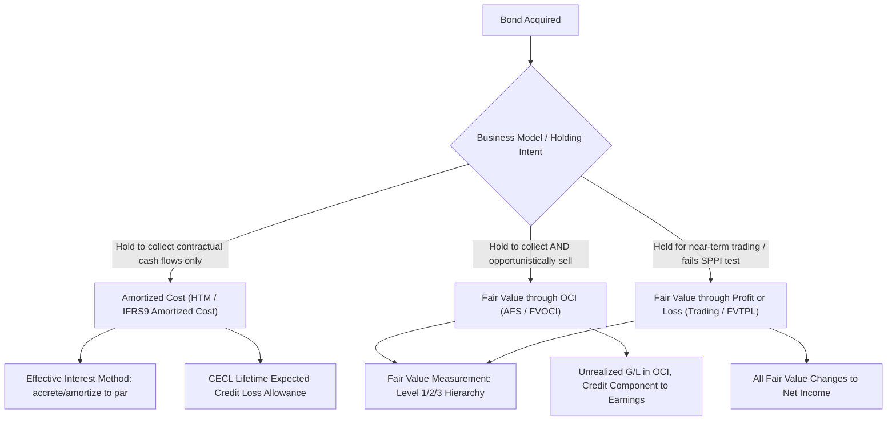

## Fair Value and Amortized Cost Accounting for Bonds

### Overview

Fair value and amortized cost accounting represent the two principal measurement bases under which fixed income instruments are carried on a holder's balance sheet, with the classification decision driven by both the instrument's contractual cash flow characteristics and the entity's business model for holding it. Under US GAAP (primarily ASC 320 and ASC 326) and IFRS (primarily IFRS 9), bond classification determines not only balance sheet carrying value but also where unrealized gains and losses are recognized — directly in earnings, in other comprehensive income (OCI), or not at all until realized — with material consequences for reported earnings volatility, regulatory capital (for banks), and financial statement comparability.

### Classification Categories Under US GAAP (ASC 320)

**Key Points**

- **Held-to-Maturity (HTM)**: Debt securities the holder has the positive intent and ability to hold to maturity. Carried at **amortized cost** on the balance sheet; unrealized gains/losses from market price fluctuation are not recognized in either earnings or OCI, since the classification presumes the holder will not realize interim price changes through sale.
- **Available-for-Sale (AFS)**: Debt securities not classified as HTM or trading. Carried at **fair value** on the balance sheet, with unrealized gains/losses recognized in **other comprehensive income (OCI)** — a component of equity — rather than flowing through the income statement, until the security is sold or an impairment is recognized.
- **Trading**: Debt securities held principally for near-term resale. Carried at **fair value**, with unrealized gains/losses flowing directly through **net income** each period, producing the most earnings-volatility-sensitive treatment of the three categories.
- The HTM classification carries a strict **tainting rule**: significant sales or transfers out of the HTM portfolio prior to maturity (beyond narrowly defined permitted exceptions, such as sales very close to maturity or in response to significant credit deterioration) can call into question the holder's stated intent for the entire remaining HTM portfolio, potentially requiring reclassification of the remaining HTM holdings to AFS — a consequential deterrent against using HTM classification opportunistically.

### Classification Categories Under IFRS 9

**Key Points**

- IFRS 9 classification is driven by two tests applied jointly: the entity's **business model** for managing the financial asset, and whether the asset's contractual cash flows represent **solely payments of principal and interest (SPPI)** on the principal outstanding.
- **Amortized cost**: Applies where the business model objective is to hold assets to collect contractual cash flows, and the SPPI test is met — conceptually analogous to, though not identically defined as, US GAAP's HTM category.
- **Fair Value through Other Comprehensive Income (FVOCI)**: Applies where the business model objective is achieved by both collecting contractual cash flows and selling the assets, and the SPPI test is met — broadly analogous to AFS treatment, with fair value on the balance sheet and most unrealized gains/losses in OCI.
- **Fair Value through Profit or Loss (FVTPL)**: The residual category — applies to assets that fail the SPPI test (e.g., convertible bonds or instruments with cash flows not solely representing principal and interest), or that are held under a business model other than the two above, with all fair value changes recognized directly in profit or loss.
- Unlike US GAAP's HTM tainting rule, IFRS 9's business model assessment is evaluated at the portfolio level based on how the entity actually manages the assets, and reclassification between categories is permitted only when the entity's business model for managing the affected assets changes, which the standard states is expected to be very infrequent.

### Amortized Cost Mechanics

**Key Points**

- Amortized cost carrying value evolves over the holding period via the **effective interest method**, under which any purchase discount or premium relative to par is systematically accreted or amortized into interest income/expense over the remaining life of the bond, such that the carrying value converges to par (or the redemption amount) at maturity.
- The effective interest rate is the rate that exactly discounts estimated future cash receipts through the expected life of the instrument to the net carrying amount at initial recognition — it does not change with subsequent market yield fluctuations, which is precisely what insulates amortized-cost carrying value from mark-to-market volatility.
- $$\text{Interest Income}_t = \text{Effective Interest Rate} \times \text{Carrying Value}_{t-1}$$

  with the difference between this calculated interest income and the bond's stated (coupon) cash payment representing the period's premium amortization or discount accretion adjustment to carrying value.

### Fair Value Measurement Hierarchy

**Key Points**

- Both US GAAP (ASC 820) and IFRS (IFRS 13) require fair value measurements to be categorized within a three-level hierarchy based on the observability of inputs used.
- **Level 1**: Quoted prices in active markets for identical instruments — for bonds, this applies relatively rarely given the predominantly OTC, quote-driven (rather than continuously-traded, exchange-listed) nature of most bond markets, with the notable exception of highly liquid on-the-run government securities.
- **Level 2**: Observable inputs other than quoted prices for identical instruments — includes quoted prices for similar instruments, or valuations derived from observable market data such as yield curves, credit spreads, and matrix pricing; this is the most common classification for the bulk of investment-grade corporate and government bond fair value measurements.
- **Level 3**: Unobservable inputs requiring significant management judgment — applies to illiquid, distressed, or highly structured bonds lacking sufficient observable market data, requiring the greatest degree of valuation model reliance and correspondingly the greatest disclosure and audit scrutiny.

### Credit Loss Impairment: CECL vs. Incurred Loss vs. IFRS 9 Expected Credit Loss

**Key Points**

- US GAAP's **Current Expected Credit Loss (CECL)** model (ASC 326), applicable to HTM debt securities (and certain AFS securities via a related but distinct impairment approach) requires recognition of a lifetime expected credit loss allowance at origination or acquisition, replacing the prior incurred-loss model that had required a triggering loss event before recognizing impairment.
- IFRS 9's **Expected Credit Loss (ECL)** model similarly moved away from an incurred-loss trigger, requiring a 12-month expected credit loss allowance for performing assets (Stage 1), transitioning to a lifetime expected credit loss allowance upon significant increase in credit risk (Stage 2) or credit-impairment (Stage 3) — a broadly similar forward-looking philosophy to CECL but implemented via a distinct staging mechanism rather than CECL's more unified lifetime-loss approach from initial recognition.
- For AFS debt securities under US GAAP, impairment assessment (ASC 326-30) evaluates whether a decline in fair value below amortized cost is credit-related (requiring an allowance recognized through earnings) versus attributable to other factors such as interest rate or liquidity changes (which, absent credit deterioration and absent intent/requirement to sell, remain in OCI as an unrealized loss).

### Comparison Table Summary

| Category (US GAAP) | Balance Sheet Value | Unrealized G/L Location | Impairment Model |
| --- | --- | --- | --- |
| Held-to-Maturity | Amortized Cost | Not recognized | CECL (lifetime ECL allowance) |
| Available-for-Sale | Fair Value | OCI | CECL-based credit-loss allowance (ASC 326-30) |
| Trading | Fair Value | Net Income | N/A (fair value changes capture credit effects) |

### Bank Regulatory Capital Interaction

**Key Points**

- For regulated banks, AFS unrealized gains/losses recognized in OCI can, depending on jurisdiction and the specific regulatory capital framework's AOCI (accumulated other comprehensive income) filter provisions, flow through into regulatory capital calculations — meaning large bond portfolio fair value swings driven purely by interest rate movements (not credit deterioration) can affect a bank's reported regulatory capital ratios even without any realized loss. [Inference: whether and to what extent AOCI flows through to regulatory capital is jurisdiction- and bank-size-specific, subject to specific regulatory capital rule elections and phase-in provisions, and should be verified against the applicable current regulatory capital framework rather than assumed uniform.]
- This AFS/OCI-to-regulatory-capital interaction has been a recurring topic of banking sector attention during periods of rapid interest rate increases, since large AFS bond portfolios (common in bank asset-liability management) can generate substantial unrealized losses purely from rising rates, independent of the underlying bonds' credit quality — a dynamic distinct from, but related to, the IRRBB EVE sensitivity discussed separately.

### Classification and Measurement Flow Diagram

### GAAP Category Comparison (svg_diagram)

<svg xmlns="http://www.w3.org/2000/svg" viewBox="0 0 760 280">
<text x="380" y="24" text-anchor="middle" font-size="16" font-weight="bold" fill="#1a1a1a">Bond Classification: Measurement and G/L Treatment (svg_diagram)</text>
<rect x="20" y="50" width="230" height="200" fill="#eef3fb" stroke="#3a5a9c" stroke-width="1.5" />
<text x="135" y="75" text-anchor="middle" font-size="13" font-weight="bold" fill="#1a1a1a">Held-to-Maturity</text>
<text x="35" y="100" font-size="11" fill="#333">Balance sheet: Amortized Cost</text>
<text x="35" y="120" font-size="11" fill="#333">Unrealized G/L: Not recognized</text>
<text x="35" y="140" font-size="11" fill="#333">Earnings volatility: Lowest</text>
<text x="35" y="160" font-size="11" fill="#333">Constraint: Tainting rule on sales</text>
<text x="35" y="185" font-size="11" fill="#333">Impairment: CECL lifetime ECL</text>
<rect x="265" y="50" width="230" height="200" fill="#fbf3ee" stroke="#9c5a3a" stroke-width="1.5" />
<text x="380" y="75" text-anchor="middle" font-size="13" font-weight="bold" fill="#1a1a1a">Available-for-Sale</text>
<text x="280" y="100" font-size="11" fill="#333">Balance sheet: Fair Value</text>
<text x="280" y="120" font-size="11" fill="#333">Unrealized G/L: OCI (equity)</text>
<text x="280" y="140" font-size="11" fill="#333">Earnings volatility: Moderate</text>
<text x="280" y="160" font-size="11" fill="#333">Credit loss: through earnings</text>
<text x="280" y="185" font-size="11" fill="#333">Bank capital: AOCI filter dependent</text>
<rect x="510" y="50" width="230" height="200" fill="#eefbf0" stroke="#3a9c5a" stroke-width="1.5" />
<text x="625" y="75" text-anchor="middle" font-size="13" font-weight="bold" fill="#1a1a1a">Trading</text>
<text x="525" y="100" font-size="11" fill="#333">Balance sheet: Fair Value</text>
<text x="525" y="120" font-size="11" fill="#333">Unrealized G/L: Net Income</text>
<text x="525" y="140" font-size="11" fill="#333">Earnings volatility: Highest</text>
<text x="525" y="160" font-size="11" fill="#333">Purpose: near-term resale</text>
<text x="525" y="185" font-size="11" fill="#333">Impairment: implicit in FV changes</text>
</svg>

### Practical Example

**Example**

A bank purchases a 10-year corporate bond at a $2,000 discount to its $100,000 par value, intending to hold it to collect contractual cash flows and classifying it as HTM. Using the effective interest method, the $2,000 discount is accreted into interest income over the bond's remaining life such that the carrying value rises smoothly from $98,000 toward $100,000 by maturity, regardless of whether the bond's market price fluctuates due to rate or spread movements in the interim. If instead the bank had classified the identical bond as AFS, the balance sheet carrying value would track the bond's fluctuating market fair value each reporting period, with the difference between fair value and amortized cost flowing to OCI — potentially creating a materially different reported balance sheet and equity figure for the economically identical underlying asset, purely as a function of the classification and stated holding intent.

### Practitioner Considerations

**Key Points**

- Classification decisions have real economic consequences beyond accounting presentation: HTM classification's tainting rule can constrain a bank's future liquidity management flexibility (since anticipated sales, even for legitimate liquidity needs, risk triggering reclassification consequences for the remaining HTM book), a trade-off institutions weigh explicitly when initially classifying large bond portfolios.
- Under CECL, the shift to lifetime expected credit loss recognition at origination/acquisition (rather than waiting for a loss-triggering event) generally results in earlier and, for longer-dated or lower-credit-quality instruments, potentially larger loss allowances recognized up front relative to the prior incurred-loss model, with corresponding earnings and capital timing effects. [Inference: the precise quantitative magnitude of this timing shift is instrument- and portfolio-specific and depends on the specific expected loss modeling approach used, not a fixed universal multiplier.]
- The interaction between AFS OCI volatility and bank regulatory capital has direct portfolio construction implications — some institutions explicitly manage the duration and credit quality mix of AFS bond holdings partly with an eye toward limiting regulatory-capital-relevant OCI volatility, a consideration distinct from, though related to, the underlying economic interest rate risk already captured under the IRRBB framework. [Inference: the degree to which any specific institution manages its portfolio with this consideration in mind is an institution-specific practice, not a universal requirement.]

### Related Topics

- CECL lifetime expected credit loss modeling methodology in depth
- IFRS 9 staging mechanics (Stage 1/2/3) and significant increase in credit risk triggers
- Fair value hierarchy (Level 1/2/3) application to illiquid and structured bonds
- AOCI regulatory capital filters and bank balance sheet management
- Effective interest method mechanics for premium/discount bonds
- Interest rate risk in the banking book (IRRBB) and its interaction with AFS portfolio duration