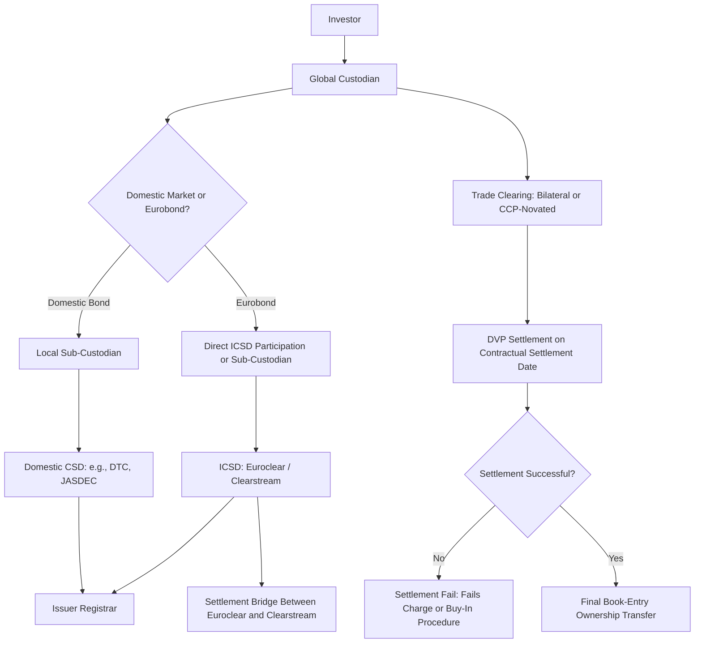

## Clearing Settlement and Custody Processes

### Overview

Clearing, settlement, and custody form the post-trade infrastructure that converts an executed bond trade into a final, legally recognized transfer of ownership and cash, and that subsequently safeguards the security on an ongoing basis. These functions are conceptually distinct — clearing determines and confirms the obligations arising from a trade, settlement is the actual exchange of securities and cash that discharges those obligations, and custody is the ongoing safekeeping and administration of the security thereafter — but are operationally interdependent, and failures or delays at any stage introduce counterparty, liquidity, and operational risk into the fixed income market.

### Clearing: Trade Confirmation and Obligation Determination

**Key Points**

- **Clearing** encompasses the process of confirming trade details between counterparties, calculating the net or gross obligations arising from the trade (securities to be delivered, cash to be paid), and, where a central counterparty (CCP) is interposed, novating the original bilateral trade into two separate trades with the CCP as the legal counterparty to both sides.
- **Bilateral clearing** (the traditional model for most cash bond trading) leaves each counterparty facing the other directly, with settlement risk borne bilaterally; **central clearing** interposes a CCP that guarantees performance to both original counterparties, substituting CCP credit risk for bilateral counterparty credit risk and enabling multilateral netting of obligations across many market participants.
- Central clearing mandates have expanded significantly since the 2008 financial crisis, initially concentrated on standardized OTC derivatives (interest rate swaps, credit default swaps) closely linked to fixed income risk management, with more recent regulatory initiatives extending centralized clearing mandates further into cash Treasury and repo market segments in some jurisdictions. [Inference: specific implementation status, scope, and compliance deadlines for cash market central clearing mandates are subject to phased and revised regulatory timelines and should be verified against current regulatory releases rather than assumed static.]

### Settlement: Delivery Versus Payment and Settlement Cycles

**Key Points**

- **Delivery versus Payment (DVP)** is the foundational settlement risk-mitigation principle under which the transfer of securities and the corresponding transfer of cash occur simultaneously (or with a legally enforceable, essentially simultaneous linkage), eliminating principal risk — the risk that one party delivers its side of the trade while the counterparty fails to deliver the other, a risk historically termed **Herstatt risk** after a notable 1974 bank failure that crystallized this exposure in cross-currency settlement.
- **Settlement cycles** vary by market and instrument type: US Treasury securities typically settle T+1, most corporate and municipal bonds settle T+1 or T+2 depending on the specific market and instrument, and Eurobonds conventionally settle T+2, though specific conventions are subject to periodic market-wide shortening initiatives (such as the broader US securities market's move to T+1 settlement) and should be verified against current market convention for the specific instrument type rather than assumed fixed. [Unverified: settlement cycle conventions have been subject to recent industry-wide changes and specific current cycles by market/instrument should be confirmed against current exchange/CSD rules.]
- **Repo (repurchase agreement) settlement** involves a distinct mechanic — the simultaneous sale of a security with an agreement to repurchase it at a specified future date and price, used extensively in fixed income markets both as a short-term financing tool for bond holders and as a mechanism for obtaining specific securities to cover short positions, with tri-party repo arrangements (where a tri-party agent bank manages collateral allocation, valuation, and substitution) common for larger institutional repo volumes.

### Central Securities Depositories (CSDs)

**Key Points**

- **CSDs** are the institutions that hold securities in dematerialized (electronic book-entry) form, maintain the official register of ownership (or, in a tiered holding structure, the register of the immediate account-holding intermediary), and operate the settlement systems through which book-entry transfers of ownership occur.
- **Domestic CSDs** operate within a single national market — examples include the Depository Trust Company (DTC) in the US, Euroclear Bank's domestic-market-linked national CSDs, and JASDEC in Japan — and are the primary settlement venue for domestic-market bonds (including foreign bonds like Yankee or Samurai issues sold into that domestic market).
- **International Central Securities Depositories (ICSDs)** — principally Euroclear (Brussels) and Clearstream (Luxembourg) — settle Eurobonds and other internationally distributed securities, connected via a direct settlement "bridge" link allowing cross-platform delivery between the two systems without requiring participants to hold accounts at both.
- CSDs typically also administer corporate actions processing (coupon payments, redemptions, tender offers) and, for cross-border holdings, coordinate withholding tax documentation and relief-at-source or reclaim procedures on behalf of underlying beneficial owners, functions that materially reduce the operational burden on individual custodians and investors relative to a purely bilateral settlement model.

### Custody: The Holding Chain

**Key Points**

- **Direct holding**: In some markets and for some investor types, the investor's ownership is registered directly at the CSD or issuer's registrar level — this structure is less common for cross-border institutional fixed income investing due to the operational complexity of establishing direct CSD access in every relevant jurisdiction.
- **Indirect (tiered) holding**: The more common institutional structure, in which the investor's global custodian holds securities through a chain of sub-custodians and CSD participant accounts — the investor's beneficial ownership is recorded at the custodian level, while the custodian (or a sub-custodian further up the chain) holds the omnibus or segregated position at the relevant CSD.
- **Nominee/omnibus accounts**: Custodians frequently hold client assets in pooled omnibus accounts at the CSD level (commingling multiple underlying clients' identical securities under the custodian's name), which improves operational efficiency but requires the custodian to maintain accurate sub-books-and-records allocating the pooled holding to individual beneficial owners — a structure that introduces custodian operational risk distinct from, and in addition to, the underlying security's own credit and market risk.
- **Segregated accounts**, by contrast, hold a specific client's securities in an account identifiable to that client at the CSD or sub-custodian level, generally offering stronger asset protection in a custodian insolvency scenario at the cost of typically higher operational cost and complexity relative to omnibus structures. [Inference: the precise degree of legal asset protection afforded by segregation varies by jurisdiction's insolvency law framework and the specific account structure used, and should not be assumed uniform across all markets.]

### Settlement Fails and Their Management

**Key Points**

- A **settlement fail** occurs when one party to a trade does not deliver the security (or cash) as scheduled on the contractual settlement date, which can arise from operational error, a short position the seller cannot yet cover, or broader market-wide settlement stress.
- Markets employ various mechanisms to discourage and manage fails, including **fails charges** (a financial penalty accruing to the failing party, calibrated in some markets, such as the US Treasury market's fails charge trading practice, to a formula tied to the prevailing interest rate environment) and **buy-in procedures** (allowing the non-defaulting party to purchase the security in the market and charge the cost difference to the failing counterparty).
- Persistent, elevated settlement fails in a specific security or sector can itself be a market signal — for example, sustained fails-to-deliver in a specific bond can indicate acute collateral scarcity or "specialness" in the repo market for that security, an important input to repo market analysis and collateral management practice.

### Custody and Clearing Chain Diagram

### Holding Structure Comparison (svg_diagram)

<svg xmlns="http://www.w3.org/2000/svg" viewBox="0 0 740 260">
<text x="370" y="24" text-anchor="middle" font-size="16" font-weight="bold" fill="#1a1a1a">Omnibus vs Segregated Custody Structures (svg_diagram)</text>
<rect x="30" y="50" width="330" height="190" fill="#eef3fb" stroke="#3a5a9c" stroke-width="1.5" />
<text x="195" y="75" text-anchor="middle" font-size="13" font-weight="bold" fill="#1a1a1a">Omnibus Account</text>
<text x="45" y="100" font-size="11" fill="#333">Multiple clients' identical securities</text>
<text x="45" y="118" font-size="11" fill="#333">pooled under custodian's name at CSD</text>
<text x="45" y="145" font-size="11" fill="#333">+ Operationally efficient</text>
<text x="45" y="165" font-size="11" fill="#333">+ Lower cost</text>
<text x="45" y="190" font-size="11" fill="#333">- Relies on custodian's internal</text>
<text x="45" y="208" font-size="11" fill="#333"> sub-ledger accuracy</text>
<rect x="380" y="50" width="330" height="190" fill="#eefbf0" stroke="#3a9c5a" stroke-width="1.5" />
<text x="545" y="75" text-anchor="middle" font-size="13" font-weight="bold" fill="#1a1a1a">Segregated Account</text>
<text x="395" y="100" font-size="11" fill="#333">Single client's securities held</text>
<text x="395" y="118" font-size="11" fill="#333">in an identifiable account</text>
<text x="395" y="145" font-size="11" fill="#333">+ Clearer asset protection profile</text>
<text x="395" y="165" font-size="11" fill="#333"> in custodian insolvency</text>
<text x="395" y="190" font-size="11" fill="#333">- Higher operational cost</text>
<text x="395" y="208" font-size="11" fill="#333"> and complexity</text>
</svg>

### Practical Example

**Example**

An asset manager based in the US purchases a Eurobond issued by a European corporate, denominated in EUR. The trade is cleared bilaterally with the executing dealer, confirmed, and settles DVP through Euroclear, where the asset manager's global custodian holds an omnibus position on behalf of multiple underlying clients. If the same asset manager instead purchased a local-currency government bond in a smaller emerging market without a Euroclear settlement link, the holding chain would instead route through a local sub-custodian bank appointed in that market, settling at the domestic CSD under domestic settlement rules and cycle conventions — illustrating how the length and complexity of the custody chain, and the settlement infrastructure involved, differ materially by instrument type and market even for the same institutional investor.

### Practitioner Considerations

**Key Points**

- Settlement cycle and DVP mechanics differ meaningfully across markets, and cross-border portfolios holding bonds settling under different cycles and in different currencies must manage funding and FX timing carefully to avoid unintentional settlement fails driven purely by operational mismatch rather than counterparty default risk.
- The choice between omnibus and segregated custody structures involves a genuine cost-versus-protection trade-off that institutional investors should evaluate explicitly, particularly for holdings in jurisdictions with less well-tested custodian insolvency law frameworks.
- Settlement fails data and repo specialness can serve as a useful, market-based signal of collateral scarcity or market stress in a specific security, a consideration relevant to both trading desks and risk managers monitoring for early signs of liquidity dislocation in specific parts of the fixed income market. [Inference: the reliability of fails/specialness data as an early-warning signal is an empirical, market-condition-dependent observation rather than a guaranteed leading indicator.]

### Related Topics

- Tri-party repo mechanics and collateral management
- Central clearing mandates for repo and cash Treasury markets
- Withholding tax relief-at-source and reclaim procedures for cross-border bondholders
- International fixed income market structures (Eurobond vs. foreign bond settlement)
- Settlement fails charges and buy-in procedures across major bond markets
- CCP default management and loss allocation waterfalls