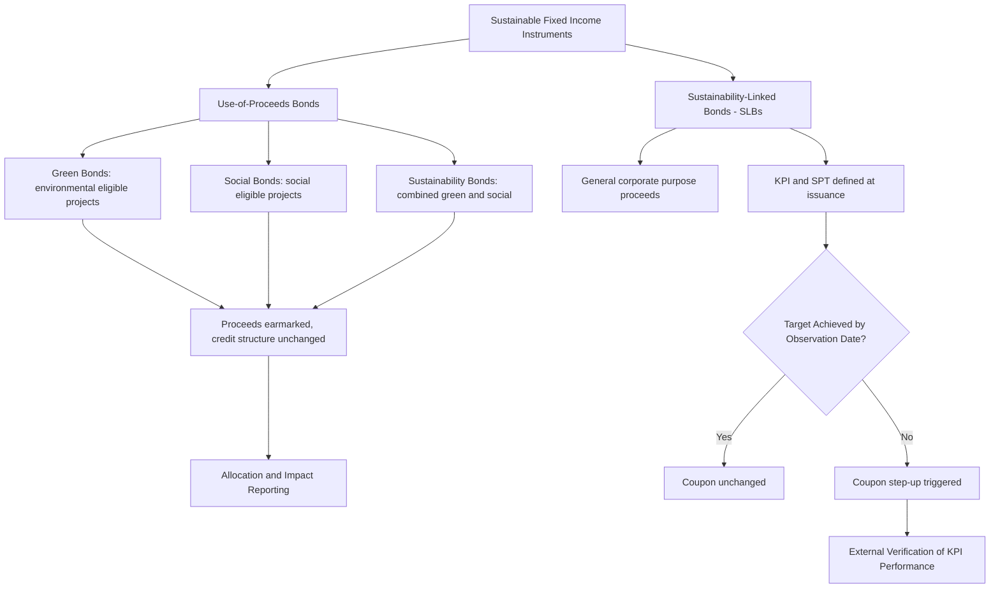

## ESG and Sustainable Fixed Income Instruments

### Overview

ESG and sustainable fixed income instruments are debt securities structured to incorporate environmental, social, and governance objectives either through the earmarking of proceeds toward specific sustainability-related projects, or through financial terms contractually linked to the issuer's achievement of sustainability performance targets. This segment has grown from a niche market into a substantial component of global primary bond issuance and has developed its own distinct set of labeling conventions, market standards, and regulatory disclosure frameworks, alongside genuine analytical debate about the pricing, integrity, and impact measurement of these instruments.

### Core Instrument Taxonomy

**Key Points**

- **Use-of-proceeds bonds**: The proceeds are contractually earmarked for specific eligible projects, with the bond's credit quality and general recourse otherwise identical to a conventional bond from the same issuer — the sustainability feature relates to fund allocation, not to bondholder recourse or credit structure. This category includes green bonds, social bonds, and sustainability bonds (a hybrid combining both green and social eligible project categories).
- **Green bonds**: Proceeds earmarked for projects with environmental benefits — renewable energy, energy efficiency, clean transportation, sustainable water management, and pollution prevention are among the commonly recognized eligible categories under widely referenced market frameworks such as the International Capital Market Association's (ICMA) Green Bond Principles.
- **Social bonds**: Proceeds earmarked for projects with positive social outcomes — affordable housing, access to essential services (healthcare, education), and socioeconomic advancement for target populations are commonly cited eligible categories under the analogous ICMA Social Bond Principles.
- **Sustainability-Linked Bonds (SLBs)**: Structurally distinct from use-of-proceeds bonds — proceeds are for general corporate purposes (not earmarked), but the bond's financial or structural terms (typically the coupon rate) are contractually linked to the issuer achieving one or more predefined Sustainability Performance Targets (SPTs) by specified target observation dates, with a step-up (or, less commonly, step-down) in coupon if the target is missed.

### Market Standards and Frameworks

**Key Points**

- The **ICMA Principles** (Green Bond Principles, Social Bond Principles, Sustainability Bond Guidelines, and Sustainability-Linked Bond Principles) are voluntary process guidelines, not binding regulation, providing recommended transparency and disclosure practices around use of proceeds, project evaluation and selection, management of proceeds, and reporting — their voluntary nature means adherence and rigor vary by issuer, which is a frequently cited market integrity concern.
- **Second-Party Opinions (SPOs)**: Independent external reviewers assess a bond framework's alignment with the relevant ICMA principles (or other referenced standards) prior to issuance, providing a form of third-party credibility signal, though the market for such opinions is itself not uniformly standardized across providers in methodology or rigor. [Inference: the degree of methodological consistency across different SPO providers is a matter of ongoing market and academic scrutiny rather than settled uniform practice.]
- **EU Green Bond Standard (EuGBS)**: A more prescriptive, regulation-backed voluntary standard within the EU, requiring alignment of underlying eligible projects with the EU Taxonomy for sustainable activities and mandating specific external review and reporting requirements — representing a more codified, regulation-anchored alternative to the purely voluntary ICMA framework approach. [Inference: specific EuGBS implementation timelines, adoption rates, and any further regulatory developments should be verified against current EU regulatory sources, as this is an evolving area.]
- **Climate Bonds Initiative (CBI) Certification**: A separate, science-based certification scheme with sector-specific technical criteria for what qualifies as a credible green investment, used by some issuers as an additional or alternative credibility marker to ICMA-aligned frameworks and SPOs.

### Sustainability-Linked Bond Structural Mechanics

**Key Points**

- SLB structures center on the definition and observation of **Key Performance Indicators (KPIs)** — measurable sustainability metrics relevant to the issuer's core business (e.g., greenhouse gas emissions intensity, renewable energy capacity, diversity metrics) — and corresponding **Sustainability Performance Targets (SPTs)**, which are the specific, time-bound numerical thresholds the issuer commits to achieving.
- The financial or structural characteristic impact — most commonly a coupon step-up (typically in the range of 25 basis points, though this varies by issuance and is not a fixed convention) — is triggered if the issuer fails to meet the SPT by the specified target observation date, verified via an external, independent verification process against the pre-defined KPI calculation methodology.
- Because SLB proceeds are not use-of-proceeds restricted, the credit and structural analysis of an SLB more closely resembles conventional corporate bond analysis, with the sustainability-linked coupon adjustment functioning as an additional, contingent cash flow feature analogous in valuation mechanics (though not in underlying purpose) to a step-up bond or a credit-linked coupon adjustment feature.
- A frequently raised critique of SLB structures concerns whether coupon step-up magnitudes are financially material enough to meaningfully incentivize target achievement relative to the issuer's overall cost of capital and reputational considerations — this is a genuinely contested and actively debated question in both academic and practitioner sustainable finance literature rather than a resolved matter. [Inference/Speculation: the effectiveness of any specific SLB's incentive structure is issuer- and issuance-specific and not resolvable as a general market-wide claim.]

### Pricing: The "Greenium" Question

**Key Points**

- A **"greenium"** refers to the empirically observed phenomenon, in some but not all market conditions and segments, of green bonds pricing at a modestly lower yield (equivalently, tighter spread) than a comparable conventional bond from the same issuer with similar maturity and structure — attributed to greater demand from investors with explicit ESG mandates relative to the still more limited supply of green-labeled paper in some markets and periods.
- The existence, magnitude, and persistence of the greenium is an actively studied and debated empirical question in the fixed income literature, with findings varying by market, issuer sector, time period, and methodology used to construct the conventional-bond comparison ("twin" or matched-pair analysis); reported magnitudes in various academic and market studies have varied and in some periods/markets have been found to be negligible or statistically insignificant. [Unverified/Inference: given the actively evolving and methodology-sensitive nature of greenium research, any specific quantitative magnitude should be treated as time- and study-specific rather than a stable market constant, and current estimates should be checked against recent research if precision is required.]
- Even where a greenium is observed, its interpretation is debated — whether it reflects a genuine risk-adjusted return sacrifice by ESG-motivated investors (a "true" pricing premium for sustainability) or simply reflects other correlated factors (issuer sector composition, liquidity differences, investor base composition) is not fully settled in the literature.

### Reporting and Impact Measurement

**Key Points**

- Use-of-proceeds bond issuers are generally expected, under the relevant voluntary principles, to provide **allocation reporting** (confirming proceeds have been allocated to eligible projects as committed) and, where feasible, **impact reporting** (quantifying the environmental or social outcomes achieved, e.g., tons of CO2 emissions avoided, number of individuals served by a social project) — though the granularity, consistency, and third-party verification of such impact reporting varies considerably across issuers.
- The lack of a single universally mandated impact measurement methodology (in contrast to, for example, standardized financial accounting frameworks) has been a persistent focus of both market participant and regulatory attention, motivating initiatives such as the EU Taxonomy and various national/regional green bond standards aimed at greater comparability. [Inference: the pace and ultimate convergence of these standardization efforts is an evolving regulatory and market development that should be tracked against current sources rather than assumed resolved.]
- "Greenwashing" — the mislabeling or overstatement of an instrument's genuine environmental or social benefit — is a recognized market integrity risk that has prompted both voluntary market standard tightening (e.g., more rigorous SPO and certification requirements) and regulatory scrutiny in several jurisdictions, though the prevalence and materiality of greenwashing across the broader labeled-bond market is itself a matter of ongoing empirical assessment rather than a precisely quantified, settled figure. [Inference: characterizing the overall scale of greenwashing risk across the market requires current, study-specific data rather than a general assertion.]

### ESG Instrument Taxonomy Diagram

### Use-of-Proceeds vs SLB Structural Comparison (svg_diagram)

<svg xmlns="http://www.w3.org/2000/svg" viewBox="0 0 740 260">
<text x="370" y="24" text-anchor="middle" font-size="16" font-weight="bold" fill="#1a1a1a">Use-of-Proceeds Bonds vs Sustainability-Linked Bonds (svg_diagram)</text>
<rect x="30" y="50" width="330" height="190" fill="#eefbf0" stroke="#3a9c5a" stroke-width="1.5" />
<text x="195" y="75" text-anchor="middle" font-size="13" font-weight="bold" fill="#1a1a1a">Use-of-Proceeds (Green/Social)</text>
<text x="45" y="100" font-size="11" fill="#333">Proceeds: earmarked to eligible projects</text>
<text x="45" y="120" font-size="11" fill="#333">Coupon: fixed, unaffected by outcomes</text>
<text x="45" y="140" font-size="11" fill="#333">Reporting: allocation + impact reporting</text>
<text x="45" y="160" font-size="11" fill="#333">Credit structure: identical to conventional</text>
<text x="45" y="180" font-size="11" fill="#333">Key risk: project eligibility integrity</text>
<rect x="380" y="50" width="330" height="190" fill="#eef3fb" stroke="#3a5a9c" stroke-width="1.5" />
<text x="545" y="75" text-anchor="middle" font-size="13" font-weight="bold" fill="#1a1a1a">Sustainability-Linked</text>
<text x="395" y="100" font-size="11" fill="#333">Proceeds: general corporate purpose</text>
<text x="395" y="120" font-size="11" fill="#333">Coupon: contingent on KPI/SPT achievement</text>
<text x="395" y="140" font-size="11" fill="#333">Reporting: KPI performance verification</text>
<text x="395" y="160" font-size="11" fill="#333">Credit structure: conventional + coupon feature</text>
<text x="395" y="180" font-size="11" fill="#333">Key risk: target ambition/materiality</text>
</svg>

### Practical Example

**Example**

A utility company issues a 10-year green bond with proceeds earmarked exclusively for the construction of a new wind farm, alongside a second-party opinion confirming alignment with the ICMA Green Bond Principles. Separately, the same company could instead issue a 10-year sustainability-linked bond with proceeds for general corporate purposes, where the coupon steps up by 25 basis points if the company's Scope 1 and 2 greenhouse gas emissions intensity does not fall by a specified percentage by year five, verified by an independent auditor. The green bond's sustainability feature is entirely about fund allocation (traceable to the wind farm project), while the SLB's sustainability feature is entirely about a contingent financial term tied to company-wide performance — the two instruments address sustainability through structurally different mechanisms despite both falling under the broader ESG fixed income label.

### Practitioner Considerations

**Key Points**

- Credit analysis of a labeled sustainable bond should not assume any inherent credit quality difference from the issuer's conventional debt purely by virtue of the ESG label — for use-of-proceeds bonds in particular, the bond typically ranks pari passu with the issuer's other senior unsecured debt, and creditworthiness is driven by the same issuer fundamentals as any other bond from that issuer.
- Investors relying on ESG-labeled instruments to meet specific mandate or regulatory sustainability criteria (e.g., under frameworks like the EU Sustainable Finance Disclosure Regulation, SFDR) should verify the specific framework, external review, and reporting rigor of each instrument individually rather than relying on the general "green," "social," or "sustainability-linked" label alone, given the documented variability in market practice rigor across issuers and frameworks. [Inference: specific regulatory mandate compliance requirements are jurisdiction- and fund-type-specific and should be verified against current applicable regulation.]
- For SLBs specifically, evaluating whether the SPT represents genuine, ambitious performance improvement (versus a target the issuer was likely to achieve regardless, sometimes termed "business as usual" target-setting) is a material and non-trivial part of credible sustainability-linked credit analysis, requiring issuer-specific baseline and trajectory assessment rather than reliance on the coupon step-up feature's mere existence as a proxy for target rigor.

### Related Topics

- ICMA Green, Social, and Sustainability-Linked Bond Principles in detail
- EU Taxonomy for sustainable activities and the EU Green Bond Standard
- Greenium empirical research methodology and matched-pair bond analysis
- Second-party opinion and external verification provider landscape
- SFDR and other regional sustainable finance disclosure regulatory regimes
- Greenwashing risk assessment frameworks for labeled bond due diligence