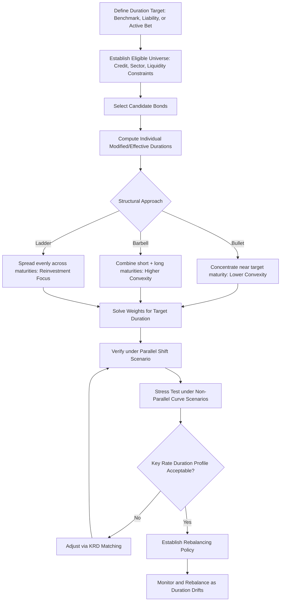

## Building a Duration Matched Portfolio

### Overview

Building a duration-matched portfolio is the practical exercise of constructing a bond portfolio whose aggregate interest rate sensitivity meets a specified target — most commonly to match a benchmark's duration, to match a liability's duration in an asset-liability management (immunization) context, or to achieve a specific active duration bet relative to a benchmark. This synthesizes the core duration and convexity concepts from earlier chapters into an applied portfolio construction workflow, requiring attention not only to portfolio-level duration arithmetic but also to convexity, key rate exposure, and the practical constraints (liquidity, credit quality, issue availability) that distinguish a real portfolio construction exercise from a textbook single-bond duration calculation.

### Portfolio Duration Aggregation

**Key Points**

- Portfolio modified duration is the **market-value-weighted average** of the modified durations of its constituent bonds:

  $$D_{portfolio} = \sum_{i=1}^{n} w_i \times D_i$$

  where $w_i$ is the market value weight of bond $i$ in the portfolio and $D_i$ is that bond's modified duration.
- This weighted-average relationship holds as a **first-order (linear) approximation** for parallel yield curve shifts; it does not account for convexity effects or for the possibility that different bonds in the portfolio have different yields and therefore experience non-identical curve shifts even under a nominally "parallel" market-wide rate change — a limitation that becomes more material for larger rate moves or portfolios spanning heterogeneous credit qualities and maturities.
- Because duration weighting is by market value, portfolio duration recalculates dynamically as bond prices change with yield movements and as cash flows (coupons, maturities) alter the portfolio's composition, meaning a duration-matched portfolio requires periodic rebalancing to maintain the target duration over time — an initially matched portfolio will drift from its target as time passes and yields move, even absent any deliberate trading.

### Step-by-Step Construction Workflow

**Key Points**

- **Step 1 — Define the target**: Establish the specific duration target, which may be a benchmark index duration (for an index-tracking or duration-neutral active mandate), a liability duration (for a liability-driven investing or immunization mandate), or a specific active duration deviation from a benchmark (for an active duration bet).
- **Step 2 — Establish the eligible universe**: Define the constraint set — credit quality floor, sector/issuer concentration limits, currency, liquidity minimums, and any ESG or regulatory eligibility screens — since duration matching must occur within these binding constraints rather than through unconstrained optimization across the entire bond universe.
- **Step 3 — Select candidate bonds and compute individual durations**: Calculate modified duration (and, for more precise work, effective duration for bonds with embedded optionality) for each candidate bond under consideration.
- **Step 4 — Solve for portfolio weights**: Determine the weight allocation across selected bonds such that the weighted-average duration equals the target, subject to the constraint that weights sum to 100% (or to the intended total notional/market value) and satisfy any additional constraints from Step 2.
- **Step 5 — Verify and stress-test**: Confirm the resulting portfolio's duration under the base case, and examine its behavior under non-parallel curve scenarios (steepening, flattening, twists) and under the specific stress scenarios relevant to the mandate, since a portfolio can be duration-matched under a parallel-shift assumption while still carrying materially different risk than the benchmark under a non-parallel curve move if its key rate duration profile differs.
- **Step 6 — Establish a rebalancing policy**: Define the frequency and trigger conditions (calendar-based, or threshold-based on duration drift magnitude) under which the portfolio will be rebalanced back toward the target duration as market conditions and portfolio composition evolve.

### Barbell, Bullet, and Ladder Structures

A given target portfolio duration can be achieved through structurally different maturity distributions, each with distinct convexity and risk characteristics.

**Key Points**

- **Bullet structure**: Concentrates holdings around a single maturity point close to the target duration — for example, achieving a 7-year duration target primarily through bonds maturing near 7-8 years. Generally exhibits the **lowest convexity** among the three structures for a given duration target, since cash flows are concentrated rather than dispersed.
- **Barbell structure**: Combines short-maturity and long-maturity bonds (avoiding intermediate maturities) weighted so their combined duration matches the target — for example, combining 2-year and 20-year bonds to achieve the same 7-year duration target. Generally exhibits **higher convexity** than a duration-matched bullet, because dispersed cash flows produce greater curvature in the price-yield relationship for the same duration.
- **Ladder structure**: Distributes holdings roughly evenly across a range of maturities (e.g., equal amounts maturing each year from 1 to 15 years), which does not target a single specific duration point as its primary structural feature but rather provides a smooth, diversified maturity/reinvestment profile — laddered portfolios are often used more for cash flow/reinvestment management purposes than for precise duration targeting, though they can be constructed to hit a specific overall portfolio duration as well.
- The convexity difference between barbell and bullet structures of equal duration has a direct valuation consequence: for a given parallel-shift duration exposure, the higher-convexity barbell structure benefits more from a large rate move in either direction (up or down) than the bullet structure, all else equal — this is the standard convexity-value tradeoff, and barbell structures are frequently favored by managers with a directional view favoring higher volatility or larger rate moves, while bullet structures are sometimes preferred when the manager wants to minimize cost/premium paid for convexity that may not be needed.

### Key Rate Duration Matching

**Key Points**

- A portfolio can match a benchmark's total (parallel-shift) duration while still carrying materially different risk under non-parallel curve movements, if its distribution of cash flows across the curve differs from the benchmark's — this is precisely the scenario a barbell-versus-bullet mismatch illustrates.
- **Key rate duration (KRD) matching** extends beyond single-number duration matching to match sensitivity at multiple specific points along the curve (e.g., 2-year, 5-year, 10-year, 30-year key rate points), providing a more robust hedge against curve reshaping risk (steepeners, flatteners, butterflies) than parallel-duration matching alone.
- For mandates where curve risk (not just level risk) is a material concern — common in liability-driven investing where the liability cash flow profile itself has a specific, non-point-mass timing structure — KRD matching is generally the more appropriate and precise construction technique relative to single-point modified/effective duration matching.

### Convexity Considerations in Matching

**Key Points**

- Two portfolios can have identical duration but different convexity, and the portfolio with higher convexity will outperform under large rate moves in either direction (assuming otherwise similar credit and structural characteristics), while the portfolios' performance will be nearly identical under small rate moves, where the linear duration approximation dominates and the convexity term's contribution is negligible.
- This creates a genuine construction trade-off: achieving higher convexity for a given duration target (e.g., via a barbell structure) often requires holding longer-dated bonds than a bullet structure would, which can introduce other risk dimensions (greater curve risk exposure at the long end, potentially wider credit spreads or lower liquidity for very long-dated issues) that must be weighed against the convexity benefit.
- Embedded optionality (callable bonds, mortgage-backed securities with prepayment risk) introduces **negative convexity** in specific yield environments, which can materially undermine a portfolio's intended convexity profile if such securities are included without explicit recognition — effective duration and effective convexity (rather than the simpler modified duration/convexity formulas that assume fixed cash flows) are required for accurate matching when such securities are present in the eligible universe.

### Portfolio Duration Matching Workflow Diagram

### Bullet vs Barbell Convexity Comparison (svg_diagram)

<svg xmlns="http://www.w3.org/2000/svg" viewBox="0 0 740 280">
<text x="370" y="24" text-anchor="middle" font-size="16" font-weight="bold" fill="#1a1a1a">Bullet vs Barbell: Same Duration, Different Convexity (svg_diagram)</text>
<line x1="60" y1="230" x2="700" y2="230" stroke="#333" stroke-width="1.5" />
<line x1="60" y1="230" x2="60" y2="50" stroke="#333" stroke-width="1.5" />
<text x="380" y="255" text-anchor="middle" font-size="11" fill="#555">Yield Change</text>
<text x="30" y="140" text-anchor="middle" font-size="11" fill="#555" transform="rotate(-90 30 140)">Price</text>
<path d="M 100 200 Q 380 60 660 200" fill="none" stroke="#3a9c5a" stroke-width="2.5" />
<text x="660" y="195" font-size="11" fill="#3a9c5a" font-weight="bold">Barbell (higher convexity)</text>
<path d="M 100 190 Q 380 100 660 190" fill="none" stroke="#3a5a9c" stroke-width="2.5" />
<text x="500" y="150" font-size="11" fill="#3a5a9c" font-weight="bold">Bullet (lower convexity)</text>
<line x1="380" y1="50" x2="380" y2="230" stroke="#999" stroke-width="1" stroke-dasharray="4,4" />
<text x="380" y="45" text-anchor="middle" font-size="10" fill="#555">Same starting point (matched duration)</text>
</svg>

### Practical Example

**Example**

A portfolio manager must match a benchmark index duration of 7.0 years using a $100 million allocation. Two candidate constructions: (1) a **bullet** approach allocating the full amount to bonds with 7-8 year maturities and an average duration of exactly 7.0; or (2) a **barbell** approach allocating 55% to 2-year bonds (duration approximately 1.9) and 45% to 20-year bonds (duration approximately 14.0), which combine to a weighted average duration of $(0.55 \times 1.9) + (0.45 \times 14.0) \approx 1.05 + 6.30 = 7.35$ — requiring further weight adjustment to hit precisely 7.0 (for instance, shifting to roughly 58%/42%). Both final portfolios show approximately the same price sensitivity to a small, parallel 10 basis point rate move, but under a large 200 basis point parallel shock, the barbell portfolio is expected to outperform the bullet portfolio due to its higher convexity — while under a curve-flattening scenario (long rates fall relative to short rates), the barbell's larger long-end weighting would benefit disproportionately relative to the bullet, illustrating the non-parallel-shift risk difference between the two duration-matched structures.

### Practitioner Considerations

**Key Points**

- Duration matching should always be paired with an explicit convexity and key rate duration review before finalizing a portfolio construction — a single duration number matching the benchmark is necessary but not sufficient to confirm the portfolio will track the benchmark closely under realistic, non-parallel market conditions.
- Rebalancing policy design involves a genuine cost-versus-precision trade-off: more frequent rebalancing keeps duration closer to target but incurs higher transaction costs and potential tax or accounting consequences from realized gains/losses, while less frequent rebalancing allows greater duration drift between rebalancing dates. [Inference: the optimal rebalancing frequency is mandate-, cost-structure-, and market-condition-specific, and no single universally optimal frequency applies across all portfolios.]
- For mandates involving securities with embedded optionality, relying on modified duration/convexity (which assume fixed cash flows) rather than effective duration/convexity (which account for how cash flows change with yield levels) can produce a portfolio that appears duration-matched on paper but behaves quite differently in practice, particularly in stressed or rapidly moving rate environments where option exercise behavior shifts materially.

### Related Topics

- Key rate duration and curve risk hedging in depth
- Immunization theory and liability-driven investing construction techniques
- Effective duration and effective convexity for callable and mortgage-backed securities
- Convexity value and the barbell-bullet trade-off in relative value trading
- Rebalancing policy design and transaction cost analysis
- Cross-currency duration matching for multi-currency benchmark-relative mandates