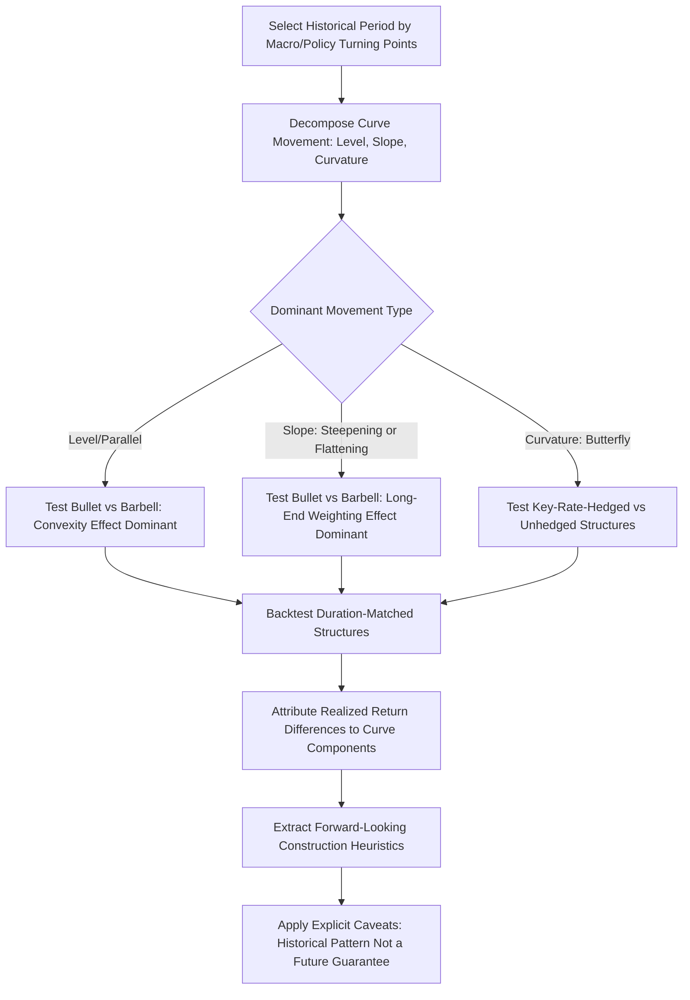

## Analyzing Historical Yield Curve Regime Shifts

### Overview

Analyzing historical yield curve regime shifts is the applied practice of studying how the shape and level of yield curves have transitioned across distinct macroeconomic and monetary policy environments, and extracting duration and portfolio construction lessons from those transitions. Unlike a single point-in-time yield curve snapshot, regime analysis treats the curve as a time-varying object whose behavior — level, slope, curvature, and volatility — clusters into identifiable periods driven by distinct combinations of monetary policy stance, inflation expectations, growth expectations, and term premium dynamics. This capstone-level synthesis draws directly on the duration, convexity, key rate duration, and portfolio construction concepts developed earlier in the curriculum, applying them retrospectively to historical episodes as a discipline for building forward-looking intuition.

### Framework: Level, Slope, and Curvature Decomposition

**Key Points**

- Yield curve movements are commonly decomposed into three principal components, an approach with roots in the statistical finding that a small number of factors explain the large majority of yield curve variation historically: **level** (a roughly parallel shift affecting all maturities similarly), **slope** (the spread between long and short rates, capturing steepening or flattening), and **curvature** (the degree to which intermediate maturities deviate from a straight line between the short and long end, sometimes described as a "butterfly" movement).
- This three-factor framework (closely related to, though not identical in every implementation to, the Nelson-Siegel and related term structure models used in fixed income analytics) provides the analytical vocabulary for classifying historical regime shifts — a given historical episode can typically be characterized predominantly as a level shift, a slope shift, a curvature shift, or some combination, which in turn has direct implications for which portfolio structures (bullet, barbell, key-rate-hedged) would have performed well or poorly during that episode.
- Regime shift analysis should distinguish between changes in **expected future short rates** (reflecting the market's revised monetary policy path expectations) and changes in the **term premium** (the additional compensation investors demand for holding longer-duration exposure, capturing duration risk and supply/demand factors independent of the expected rate path) — both contribute to observed long-end yield changes, but they carry different implications for forward-looking curve analysis and are not directly observable in isolation, requiring model-based decomposition to separate.

### Historical Regime Case Studies

**Key Points**

- **The Great Moderation and secular decline (roughly early 1980s through 2020)**: Following the Volcker-era disinflation of the early 1980s, developed market yield curves exhibited a multi-decade secular decline in both level and volatility, with intermittent steepening and flattening cycles tied to individual monetary policy tightening and easing cycles, but a persistent downward trend in the overall level of yields across this extended period. [Fact: the broad secular decline in developed market yields from the early 1980s peak through the 2020 lows is a well-documented, widely referenced historical pattern.]
- **The 2004-2006 "conundrum" flattening**: A widely studied episode in which the US Federal Reserve raised short-term policy rates substantially while long-term Treasury yields remained comparatively stable or even declined, producing significant curve flattening and eventual inversion — famously described by then-Fed Chairman Alan Greenspan as a "conundrum," and subsequently analyzed extensively in the term premium literature as reflecting, at least in significant part, a compressed term premium (attributed variously to strong foreign demand for US Treasuries, a global "savings glut," and other structural factors debated in the literature). [Fact regarding the observed flattening; the specific causal attribution among competing explanations remains a subject of ongoing academic debate rather than settled consensus, so any single causal explanation should be treated as one hypothesis among several discussed in the literature.]
- **The 2008 Global Financial Crisis and subsequent zero/near-zero rate era**: A sharp curve steepening as short rates were cut aggressively toward the zero lower bound while central banks subsequently engaged in large-scale asset purchase programs (quantitative easing) targeting the long end of the curve directly, introducing central bank balance sheet policy as an additional, non-traditional yield curve driver beyond conventional short-rate policy.
- **2022-2023 rapid tightening and curve inversion**: A historically rapid pace of policy rate increases by major central banks in response to elevated inflation produced pronounced curve inversion (short rates exceeding long rates) across several developed markets, an episode frequently referenced in discussions of the yield curve as a recession-prediction signal, though the reliability and lead-time consistency of curve inversion as a recession predictor has itself been a subject of ongoing empirical debate, particularly regarding this specific episode's eventual macroeconomic outcome. [Inference: the ultimate predictive validity of this specific 2022-2023 inversion episode relative to subsequent macroeconomic outcomes is a matter that should be assessed against current, up-to-date economic data and research rather than assumed to follow prior historical inversion-to-recession patterns mechanically.]

### Duration and Convexity Implications of Regime Shifts

**Key Points**

- A portfolio's realized performance during a historical parallel-shift-dominated regime versus a slope/curvature-dominated regime depends materially on whether the portfolio's structure (bullet, barbell, key-rate-hedged) was matched to the type of shift that actually occurred — a duration-matched bullet portfolio and a duration-matched barbell portfolio, identical in parallel-shift sensitivity, would have shown materially different realized returns during a flattening-dominated episode like 2004-2006, since the barbell's larger long-end weighting benefits disproportionately from a decline in long rates relative to short rates.
- Regimes characterized by unconventional central bank interventions directly targeting specific points on the curve (e.g., quantitative easing programs with specified maturity-bucket purchase targets) can distort the "normal" relationship between key rate durations and realized volatility at each curve point, since central bank purchases can suppress volatility and yield levels at targeted maturities in ways not fully explained by conventional macroeconomic term structure models — a consideration relevant when using historical volatility and correlation estimates from such periods as inputs to duration and convexity-based risk models for other periods. [Inference: the specific quantitative distortion effect of any given QE program on curve-point volatility and correlation is program- and period-specific, and generalizing from one QE episode to another is not automatically valid.]
- Convexity's realized value (the benefit of holding a higher-convexity structure) is regime-dependent — periods of large, rapid rate moves (level shifts) tend to realize greater convexity benefit for barbell-type structures than periods of gradual, range-bound rate movement, where the convexity premium paid (typically via a lower initial yield for the higher-convexity structure, reflecting the market pricing in the optionality-like benefit) may not be recouped.

### Analytical Workflow for Regime Shift Study

**Key Points**

- **Step 1 — Select and segment the historical period**: Identify candidate regime boundaries based on recognized macroeconomic or policy turning points (e.g., a monetary policy tightening/easing cycle inflection, a major central bank program announcement) rather than arbitrary calendar boundaries, since regime shifts are economically, not calendrically, defined.
- **Step 2 — Decompose observed curve movements**: Apply level/slope/curvature decomposition (or an equivalent term structure model) to the historical yield data for the selected period to characterize the dominant type of movement observed.
- **Step 3 — Simulate or backtest candidate portfolio structures**: Apply the historical curve movements to hypothetical duration-matched bullet, barbell, and key-rate-hedged portfolio structures to observe realized relative performance differences attributable purely to structural differences, holding starting duration constant.
- **Step 4 — Attribute performance to level, slope, curvature, and convexity effects**: Decompose the realized return differences across structures into contributions from each component, isolating how much of any outperformance was attributable to the type of curve movement that occurred versus other factors (credit spread changes, liquidity effects) that may have coincided with the same period.
- **Step 5 — Extract forward-looking construction principles, with explicit caveats**: Translate the historical findings into general portfolio construction heuristics (e.g., "barbell structures tend to outperform duration-matched bullets during large parallel rate declines, but underperform during flattening-dominated episodes"), while explicitly acknowledging that historical regime patterns are not a reliable guarantee of how any future regime will unfold. [Inference/Speculation: any forward-looking extrapolation from historical regime analysis to future market behavior is inherently speculative and should be presented with appropriate epistemic humility rather than as a predictive claim.]

### Regime Shift Analysis Workflow Diagram

### Historical Regime Comparison Matrix (svg_diagram)

<svg xmlns="http://www.w3.org/2000/svg" viewBox="0 0 760 300">
<text x="380" y="24" text-anchor="middle" font-size="16" font-weight="bold" fill="#1a1a1a">Historical Yield Curve Regime Characteristics (svg_diagram)</text>
<rect x="20" y="50" width="230" height="220" fill="#eef3fb" stroke="#3a5a9c" stroke-width="1.5" />
<text x="135" y="75" text-anchor="middle" font-size="12" font-weight="bold" fill="#1a1a1a">2004-2006 Conundrum</text>
<text x="30" y="100" font-size="10" fill="#333">Dominant: Flattening</text>
<text x="30" y="118" font-size="10" fill="#333">Driver: Compressed term premium</text>
<text x="30" y="136" font-size="10" fill="#333">(debated causal attribution)</text>
<text x="30" y="160" font-size="10" fill="#333">Structure favored:</text>
<text x="30" y="178" font-size="10" fill="#333">Long-end weighted (barbell)</text>
<text x="30" y="200" font-size="10" fill="#333">Key lesson: parallel-duration</text>
<text x="30" y="218" font-size="10" fill="#333">matching insufficient alone</text>
<rect x="265" y="50" width="230" height="220" fill="#fbf3ee" stroke="#9c5a3a" stroke-width="1.5" />
<text x="380" y="75" text-anchor="middle" font-size="12" font-weight="bold" fill="#1a1a1a">2008 GFC / ZIRP era</text>
<text x="275" y="100" font-size="10" fill="#333">Dominant: Steepening then</text>
<text x="275" y="116" font-size="10" fill="#333">sustained low level</text>
<text x="275" y="140" font-size="10" fill="#333">Driver: Policy rate cuts to ZLB</text>
<text x="275" y="156" font-size="10" fill="#333">+ QE targeting long end</text>
<text x="275" y="180" font-size="10" fill="#333">Structure favored:</text>
<text x="275" y="198" font-size="10" fill="#333">Long duration overall</text>
<text x="275" y="220" font-size="10" fill="#333">Key lesson: unconventional</text>
<text x="275" y="236" font-size="10" fill="#333">policy distorts curve-point risk</text>
<rect x="510" y="50" width="230" height="220" fill="#eefbf0" stroke="#3a9c5a" stroke-width="1.5" />
<text x="625" y="75" text-anchor="middle" font-size="12" font-weight="bold" fill="#1a1a1a">2022-2023 Tightening</text>
<text x="520" y="100" font-size="10" fill="#333">Dominant: Rapid level rise +</text>
<text x="520" y="116" font-size="10" fill="#333">inversion</text>
<text x="520" y="140" font-size="10" fill="#333">Driver: Aggressive rate hikes</text>
<text x="520" y="156" font-size="10" fill="#333">vs. inflation</text>
<text x="520" y="180" font-size="10" fill="#333">Structure favored:</text>
<text x="520" y="198" font-size="10" fill="#333">Short duration overall</text>
<text x="520" y="220" font-size="10" fill="#333">Key lesson: inversion signal</text>
<text x="520" y="236" font-size="10" fill="#333">reliability actively debated</text>
</svg>

### Practical Example

**Example**

A capstone backtest constructs two hypothetical 7-year duration-matched portfolios — a bullet and a barbell — and applies actual historical Treasury yield curve data from the 2004-2006 conundrum period. The analysis finds the barbell structure outperformed the duration-matched bullet over this period, attributable primarily to the barbell's larger long-end weighting benefiting from the observed flattening (long rates rising less than short rates, and in parts of the period, declining), rather than to any convexity effect from large parallel rate moves, since the period was not characterized by large parallel shifts. Running the identical two structures through the 2022-2023 rapid tightening period instead shows the bullet structure outperforming, since the episode was dominated by a level shift concentrated in magnitude across the curve without the same degree of long-end-specific relative outperformance that characterized 2004-2006 — illustrating how the same pair of duration-matched structures can rank oppositely in realized performance depending on which type of historical regime is being analyzed.

### Practitioner Considerations

**Key Points**

- Historical regime analysis is a valuable discipline for stress-testing portfolio construction assumptions, but the transition from historical pattern-finding to forward-looking positioning requires explicit acknowledgment that no two regimes are identical in their combination of monetary policy, fiscal, and structural market drivers — treating historical regime outcomes as directly predictive of a specific future period's curve behavior is a well-recognized analytical pitfall.
- The level/slope/curvature decomposition, while a standard and widely used analytical lens, is itself a statistical simplification, and regime episodes involving unconventional policy tools (QE, yield curve control in some jurisdictions) may not be fully captured by a framework originally developed primarily from conventional-policy-era yield curve data. [Inference: the degree to which standard term structure decomposition frameworks fully capture unconventional-policy-era dynamics is a subject of ongoing methodological development in the term structure modeling literature.]
- When using historical regime backtests to inform current portfolio construction, practitioners should explicitly document which specific historical episodes were used, why they were selected as relevant analogues (or deliberately included as a diverse range of counter-examples), and the specific caveats around non-repeatability, to avoid presenting backtested historical outperformance as a forward-looking guarantee.

### Related Topics

- Nelson-Siegel and related term structure/yield curve modeling approaches
- Term premium estimation methodology and its separation from rate expectations
- Central bank balance sheet policy (QE, yield curve control) effects on curve dynamics
- Yield curve inversion as a recession indicator: historical reliability literature
- Key rate duration hedging strategy design from regime-specific lessons
- Building a duration-matched portfolio: structural construction techniques