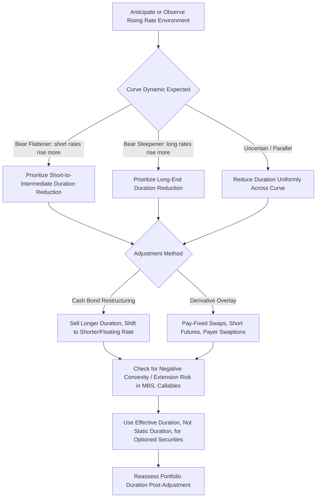

## Managing Duration Exposure in Rising Rate Environments

### Overview

Managing duration exposure in rising rate environments is the applied discipline of adjusting a fixed income portfolio's interest rate sensitivity in anticipation of, or in response to, an environment where yields are expected to rise or are actively rising, thereby producing negative price returns on existing fixed-rate holdings proportional to their duration. This capstone topic synthesizes duration mechanics, convexity, curve positioning, and hedging instrument selection into a practical toolkit, while requiring explicit acknowledgment that rate direction calls are inherently forecasts subject to being wrong, and that duration reduction itself carries opportunity costs and trade-offs rather than being a costless risk-reduction action.

### The Core Mechanic: Why Duration Reduction Helps in a Rising Rate Scenario

**Key Points**

- The first-order price impact of a rate change is approximated by:

  $$\frac{\Delta P}{P} \approx -D_{mod} \times \Delta y$$

  meaning that for a given rise in yield $\Delta y$, a lower modified duration $D_{mod}$ produces a smaller negative price impact — this is the direct mathematical basis for duration reduction as a defensive positioning tool ahead of or during a rising rate environment.
- Reducing duration is not the only lever available: a manager can also reduce rate exposure through direct hedging instruments (interest rate swaps, Treasury futures) without necessarily altering the underlying bond holdings, or through a combination of cash bond duration reduction and overlay hedging — the choice between these approaches involves distinct trade-offs in transaction cost, tax/accounting treatment, and flexibility to reverse the position.
- Duration reduction, whether via cash bond sales or hedging overlays, is a form of **opportunity cost trade**: it reduces downside price risk if rates rise as anticipated, but it also caps the upside price benefit if rates instead fall or remain flat — a manager reducing duration ahead of an anticipated hiking cycle that does not materialize (or reverses) forgoes the return that would have accrued to the longer-duration position, which is why duration positioning is properly understood as an active bet, not a risk-free defensive action.

### Cash Bond Portfolio Adjustment Approaches

**Key Points**

- **Shortening the maturity/duration profile directly**: Selling longer-duration holdings and reallocating to shorter-maturity instruments reduces portfolio modified duration mechanically, following the same weighted-average duration arithmetic covered in portfolio construction — this is the most direct approach but incurs transaction costs and, for taxable accounts, potential realized capital gains/losses from the sales.
- **Laddering into shorter maturities**: Rather than an abrupt duration reduction, some managers implement a gradual shortening by directing new cash flows (coupon receipts, maturing principal) into shorter-duration reinvestment rather than actively selling existing longer-dated holdings, reducing transaction costs and realized gain/loss recognition at the expense of a slower transition to the target duration.
- **Floating-rate and short-duration substitutes**: Reallocating a portion of the portfolio into floating-rate notes (whose coupon resets periodically with reference rates, giving them minimal price duration despite potentially longer stated maturity) or very short-dated instruments (T-bills, commercial paper) directly reduces aggregate portfolio duration while retaining fixed income asset class exposure, as opposed to moving to cash or other asset classes entirely.
- **Barbell-to-bullet or barbell-to-short-bullet restructuring**: As covered in portfolio construction, shifting a barbell structure's long-end weighting toward the short end (or toward a pure short-bullet structure) reduces both duration and, typically, convexity — a consideration relevant if the manager's rising-rate view is a large, rapid move (where convexity retention might still be valued) versus a gradual, moderate move (where convexity's marginal value is lower).

### Derivative Overlay Hedging Approaches

**Key Points**

- **Interest rate swaps**: Entering a **pay-fixed, receive-floating** swap reduces the net duration of a portfolio holding fixed-rate bonds, since the swap's fixed leg has positive duration exposure that is offset (from the hedger's perspective as the fixed-rate payer) against the underlying bond portfolio's duration — swaps are widely used for their customizable notional, tenor, and typically lower transaction cost relative to restructuring the entire cash bond portfolio.
- **Treasury futures**: Shorting Treasury futures contracts (or the equivalent government bond futures in non-US markets) provides a liquid, exchange-traded, and typically lower-cost mechanism to reduce net portfolio duration without disturbing the underlying cash bond holdings, though futures introduce basis risk (the futures contract's price behavior may not track the specific cash bonds held with perfect precision) and require attention to the cheapest-to-deliver bond dynamics underlying the futures contract's pricing.
- **Interest rate options (swaptions, bond options)**: Provide asymmetric protection — for example, a payer swaption (the right, not obligation, to enter a pay-fixed swap) protects against rising rates while preserving upside participation if rates instead fall, at the cost of an upfront option premium, offering a different risk/cost profile than the linear hedges (swaps, futures) described above.
- Overlay hedging allows duration adjustment without disturbing the underlying cash bond portfolio's credit exposure, sector allocation, or tax lot structure, which is often the primary reason a manager chooses derivative overlay over direct cash bond restructuring — particularly relevant for portfolios where the underlying credit selection is intended to be held independent of the tactical duration view.

### Key Rate and Curve Positioning Considerations

**Key Points**

- A rising rate environment is not necessarily a uniform, parallel-shift event — the specific curve dynamic (bear flattener, where short rates rise more than long rates, typically associated with central bank tightening cycles; or bear steepener, where long rates rise more than short rates, sometimes associated with rising term premium, inflation expectations, or fiscal supply concerns) has direct implications for which points on the curve to underweight most aggressively.
- In a bear-flattener scenario specifically, reducing exposure concentrated at the short-to-intermediate part of the curve provides more effective risk reduction than a uniform, duration-only reduction across all maturities, since that is where the majority of the adverse price impact is concentrated — this is precisely where key rate duration analysis, rather than single-point modified duration alone, adds practical value to rising-rate positioning.
- Historically, different rising rate episodes have exhibited different dominant curve dynamics (as covered in regime shift analysis), reinforcing that a manager's duration reduction strategy should be informed by a view on the specific expected curve dynamic, not solely the expected direction of the overall rate level. [Inference: any specific current or forward-looking view on which curve dynamic will dominate a given future rising-rate episode is a forecast subject to the same uncertainty as the rate-direction call itself, and should be presented as such.]

### Convexity and Negative Convexity Risk in Rising Rate Scenarios

**Key Points**

- Holdings with embedded prepayment optionality (mortgage-backed securities) exhibit **negative convexity** in falling-rate environments (extension of expected duration as rates rise reduces the negative convexity concern somewhat, but the asymmetry works differently across the rate cycle) — specifically, in a rising rate environment, MBS durations tend to **extend** (increase) as prepayment speeds slow, meaning the effective duration of such holdings can increase precisely when the manager least wants additional rate sensitivity, a phenomenon sometimes referred to as "extension risk."
- This extension risk is a critical, easily overlooked consideration in rising-rate portfolio management: a portfolio manager targeting a specific duration reduction using standard (non-extension-adjusted) duration estimates for MBS holdings may find the realized portfolio duration is higher than intended once rates actually rise and prepayment speeds slow, understating the true remaining rate sensitivity if effective (rather than static) duration estimates were not used.
- Callable corporate and municipal bonds exhibit an analogous, though generally less pronounced, dynamic — call optionality becomes less likely to be exercised as rates rise (since refinancing at lower rates is the primary economic driver of call exercise), causing the bond's effective duration to extend toward its stated maturity, again requiring effective duration measures rather than yield-to-call-based duration approximations for accurate rising-rate risk assessment.

### Rising Rate Environment Duration Management Diagram

### Duration Reduction Methods Comparison (svg_diagram)

<svg xmlns="http://www.w3.org/2000/svg" viewBox="0 0 740 280">
<text x="370" y="24" text-anchor="middle" font-size="16" font-weight="bold" fill="#1a1a1a">Cash Restructuring vs Derivative Overlay (svg_diagram)</text>
<rect x="30" y="50" width="330" height="210" fill="#eef3fb" stroke="#3a5a9c" stroke-width="1.5" />
<text x="195" y="75" text-anchor="middle" font-size="13" font-weight="bold" fill="#1a1a1a">Cash Bond Restructuring</text>
<text x="45" y="100" font-size="11" fill="#333">+ No derivative counterparty risk</text>
<text x="45" y="120" font-size="11" fill="#333">+ Simple, direct exposure change</text>
<text x="45" y="145" font-size="11" fill="#333">- Transaction costs on sales</text>
<text x="45" y="165" font-size="11" fill="#333">- Realized gain/loss recognition</text>
<text x="45" y="185" font-size="11" fill="#333">- Disturbs credit/sector allocation</text>
<text x="45" y="210" font-size="11" fill="#333">- Slower to reverse if view changes</text>
<text x="45" y="235" font-size="11" fill="#333">- Slower to reverse if view changes</text>
<rect x="380" y="50" width="330" height="210" fill="#eefbf0" stroke="#3a9c5a" stroke-width="1.5" />
<text x="545" y="75" text-anchor="middle" font-size="13" font-weight="bold" fill="#1a1a1a">Derivative Overlay</text>
<text x="395" y="100" font-size="11" fill="#333">+ Preserves underlying credit/sector mix</text>
<text x="395" y="120" font-size="11" fill="#333">+ Typically lower transaction cost</text>
<text x="395" y="140" font-size="11" fill="#333">+ Faster to adjust or reverse</text>
<text x="395" y="165" font-size="11" fill="#333">- Counterparty risk (swaps)</text>
<text x="395" y="185" font-size="11" fill="#333">- Basis risk (futures)</text>
<text x="395" y="205" font-size="11" fill="#333">- Requires derivatives operational</text>
<text x="395" y="225" font-size="11" fill="#333"> capability and margining</text>
</svg>

### Practical Example

**Example**

A fixed income manager holding a portfolio with duration of 6.5, benchmarked against an index with duration 6.0, forms a view that a central bank tightening cycle will produce a bear-flattening move over the next two quarters. Rather than selling long-dated holdings (which would disturb the portfolio's carefully selected credit exposure), the manager enters a pay-fixed interest rate swap overlay sized to reduce net portfolio duration to 5.0 — a 100 basis point underweight relative to benchmark — concentrated in the 2-5 year swap tenor to align the hedge with the anticipated short-to-intermediate curve dynamic. If short-to-intermediate rates subsequently rise 75 basis points while long rates rise only 25 basis points as anticipated, the swap overlay's duration reduction concentrated at the shorter tenor provides more effective protection than an equivalent-duration reduction spread uniformly across the curve would have, while the underlying bond holdings and their credit characteristics remain unchanged throughout.

### Practitioner Considerations

**Key Points**

- Duration reduction ahead of an anticipated rate rise is an active view, not a default risk-free action — a manager should size the duration underweight relative to their conviction level and the mandate's tracking error or active risk budget, and should have an explicit plan for reversing the position if the anticipated rate move does not materialize or reverses.
- Extension risk in MBS and callable bond holdings is a commonly underestimated factor in rising-rate portfolio management — portfolios with meaningful allocations to such securities should be evaluated using effective duration under a range of rate-shock scenarios, not a single static duration estimate, given how materially effective duration can shift as rates rise.
- The choice between cash bond restructuring and derivative overlay hedging should account for the manager's mandate constraints (some mandates restrict or prohibit derivative use), the tax and accounting treatment applicable to the specific vehicle, and the operational infrastructure required for derivatives (margining, ISDA documentation, collateral management) — these are practical implementation considerations distinct from, but necessary alongside, the pure duration mathematics. [Inference: the specific mandate, tax, and operational constraints applicable to any given portfolio are institution- and vehicle-specific and should be confirmed against the actual governing documents rather than assumed generically.]

### Related Topics

- Interest rate swap mechanics and pay-fixed/receive-floating hedge construction
- Treasury futures, cheapest-to-deliver dynamics, and basis risk
- Effective duration and extension risk in mortgage-backed securities
- Key rate duration hedging for non-parallel curve scenarios
- Building a duration-matched portfolio: structural construction techniques
- Analyzing historical yield curve regime shifts for forward-looking positioning context